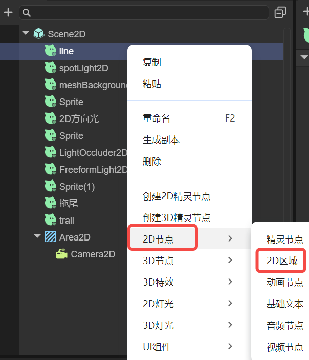
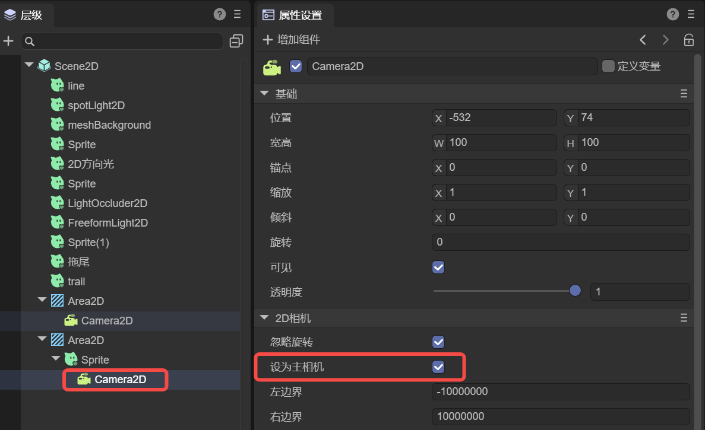

# 2D Area

The LayaAir 3.3 version has added a new node type called 2D Area (Area2D), which is specifically designed for the visual and camera management of 2D games. This feature enhances the rendering control and management of the visible area in the game scene, facilitating developers to achieve more efficient and dynamic game visual presentations.

## 1. 2D Area Basics

### 1.1 How to Create a 2D Area

In the hierarchy panel, right-click to bring up the "right-click menu", and click "2D Node" -> "2D Area" in sequence to create a 2D area node, as shown in Figure 1-1.

  

(Figure 1-1)

### 1.2 The Relationship Between 2D Area and Camera

The main function of the 2D area is to define and manage the area covered by the 2D camera. By precisely controlling the camera, rich and dynamic visual effects can be presented to the players.

Each 2D area is only allowed to have one 2D main camera, as shown in Figure 1-2. The configuration of this camera directly affects the visual output of the area. To ensure the correct implementation of the camera function, the camera node must be placed in the child node of the corresponding 2D area; otherwise, an error will be reported.

 

(Figure 1-2)

### 1.3 The Difference Between 2D Area and Static UI
Nodes outside the 2D area are all static UIs, that is, UIs not affected by the 2D camera. The images of the static UI and the 3D camera outside the 2D area, as well as the image of the 2D area, will be superimposed and displayed together during runtime.

The display level is that 2D is on the upper layer and 3D is on the lower layer. For the static UI and 2D area that also belong to 2D, they are drawn in the order of the node tree. The node order at the top is drawn first, and the one at the bottom is drawn later. That is to say, the ones lower in the node tree are displayed more on top during runtime and are not blocked by the lower layer.

No matter it is a sprite or a UI component or other display object nodes, as long as they are placed within the 2D area, they will be visible to the 2D camera and affected by the movement of the 2D camera. And those independent outside the 2D area are always located on the screen and not affected by the camera.

For example, gesture virtual joysticks, skill buttons, and function navigation should not be placed under the 2D area node; otherwise, due to the movement of the camera, they will be displaced from the screen or even disappear.

## 2. Application Scenarios

The introduction of the 2D area greatly enhances the flexibility of game design, allowing developers to achieve diverse game layouts such as single-area control or multi-area split-screen according to specific needs.

### 2.1 Single 2D Area
For most 2D games, a single 2D area is sufficient to manage the entire game's visual presentation. In this case, the 2D camera can be automatically or manually adjusted according to the game logic to focus on the player's operation or specific events in the game, enhancing the player's immersion.

### 2.2 Multi 2D Area Split-Screen
By setting multiple 2D areas, developers can easily create independent visual and operation interfaces for multi-player games, such as the split-screen mode in a two-player competitive game. One side is the player's own game screen, and the other side is the real-time screen of the competitor. Each player observes and interacts with the game world through their own 2D area and camera, increasing the competitiveness and interactivity of the game.