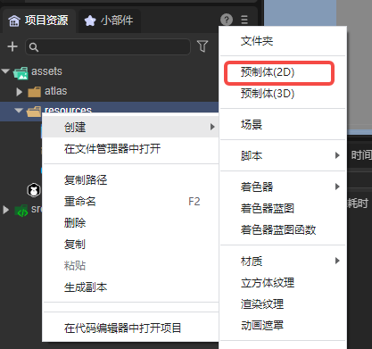

# Pop-up view component (Dialog)

Dialog is a pop-up view component, mainly used for pop-up panels.

## 1. Create Dialog through LayaAir IDE

### 1.1 Create Dialog

As shown in Figure 1-1, click to select the Dialog component in the widget panel, drag and drop it into the page editing area, or create it by right-clicking in the hierarchy window to add the Dialog component to the page.


(Picture 1-1)


### 1.2 Introduction to Dialog attributes

The unique attributes of Dialog are as follows:


(Figure 1-2)

| Properties	| Function	|
| ------------------- | ------------------------------------------------------------ |
| autoDestoryAtClosed | Whether the scene is automatically destroyed (destroying nodes and used resources) after the scene is closed. The default is false |
| dearArea	| Drag area (format: x,y,width,height), the default value is "0,0,0,0"	|
| isModal         	| Whether it is a modal window, the default is false. When it is a modal window, click on the blank space of the pop-up window to automatically close the pop-up window |
| isShowEffect    	| Whether to display the pop-up effect, the default is on. When false, there is no pop-up effect and the pop-up window is displayed directly |
| isPopupCenter   	| Specifies whether the dialog box pops up in the center, the default is true. When it is false, the coordinate origin of the upper left corner will pop up |
| group           	| Set the group ID of resources. After setting, resources can be loaded or cleaned by group.	|

After setting the dragArea attribute, the Dialog can be dragged within the set value range. Set it to "0,0,100,100", the effect is as shown in the animation 1-3, the red area is the draggable area. After setting, you can only drag within the set value. Dragging in the area beyond the value is invalid.


(Animation 1-3)


### 1.3 Script control Dialog

#### 1.3.1 Create pop-up window

Dialog's pop-up effect requires it to be used as the root node. You can create a 2D prefab Prefab2D in the project resource panel, as shown in Figure 1-4.



(Figure 1-4)

Double-click Prefab2D to enter the editing interface. Right-click the root node, select "Convert Node Type", and select `UI->Dialog`, as shown in the animation 1-5.


(Animation 1-5)

Then, you can create a pop-up page in the editing interface of the prefab. The result is shown in Figure 1-6.


(Figure 1-6)

> The UI image resources in the picture are from "2D Getting Started Example".


#### 1.3.2 Set the close button

In the pop-up page, there is a close button (closeBtn), and a script needs to be added to implement the logic of closing the page. As shown in the animated picture 1-7, check the define variable option of closeBtn, and then double-click "UI Runtime" of Prefab2D to create a UI component script.


(Animation 1-7)

After saving the scene, add the following code in RuntimeScript.ts:

```typescript
const { regClass } = Laya;
import { RuntimeScriptBase } from "./RuntimeScript.generated";

@regClass()
export class RuntimeScript extends RuntimeScriptBase {

	onAwake(): void {
    	this.closeBtn.on(Laya.Event.CLICK, this, () => {
        	this.close();
    	});
	}
    
}
```


#### 1.3.3 Related scenarios

After setting up the pop-up window, you need to use code to associate the Dialog with the scene tube that needs to use the Dialog. Return to the initial scene Scene and add a custom component script in the property settings panel of Scene2D. Add the following code to pop up the Dialog page after a mouse click:

```typescript
const { regClass, property } = Laya;

@regClass()
export class NewScript extends Laya.Script {

	//Execute after mouse click
	onMouseClick(): void {
    	//Using Prefab, you need to convert the root node to Dialog
    	Laya.loader.load("resources/Prefab2D.lh").then(res => {
        	let dlg: Laya.Dialog = res.create();
        	dlg.show();
    	});
	}
}
```

The running effect is as follows:


(GIF)


## 2. Create Dialog through code

When writing code, it is inevitable to control the UI through code, create the `UI_Dialog` class, and set Dialog-related properties through code. The sample code is as follows:

```typescript
const { regClass, property } = Laya;

@regClass()
export class UI_Dialog extends Laya.Script {

	private DIALOG_WIDTH: number = 220;
    private DIALOG_HEIGHT: number = 275;
    private CLOSE_BTN_WIDTH: number = 43;
    private CLOSE_BTN_PADDING: number = 5;

    private assets: any[];
	private dialog: Laya.Dialog;

	constructor() {
    	super();
	}

	// Executed after the component is activated. At this time, all nodes and components have been created. This method is only executed once.
	onAwake(): void {
    	//Image resources come from "Engine API Usage Example"
   	 this.assets = ["resources/res/ui/dialog (1).png", "resources/res/ui/close.png"];
   	 Laya.loader.load(this.assets).then( ()=>{
        	this.onSkinLoadComplete();
    	} );
    }

    private onSkinLoadComplete(e: any = null): void {
   	 this.dialog = new Laya.Dialog();

   	 let bg: Laya.Image = new Laya.Image(this.assets[0]);
   	 this.dialog.addChild(bg);

   	 let button: Laya.Button = new Laya.Button(this.assets[1]);
   	 button.name = Laya.Dialog.CLOSE;
   	 button.pos(this.DIALOG_WIDTH - this.CLOSE_BTN_WIDTH - this.CLOSE_BTN_PADDING, this.CLOSE_BTN_PADDING);
   	 this.dialog.addChild(button);

   	 this.dialog.dragArea = "0,0," + this.DIALOG_WIDTH + "," + this.DIALOG_HEIGHT;
   	 this.dialog.show();
    }

    onDestroy(): void {
   	 if (this.dialog) {
   		 this.dialog.close();
   	 }
    }
}
```

The effect is shown in the following animation:


(Animation 2-1)


