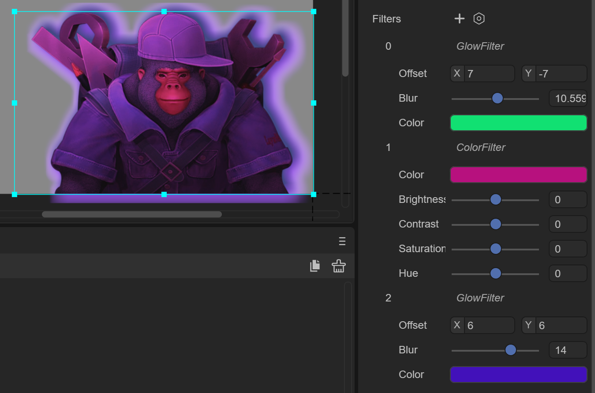

# UI filter effect

## 1. Overview

Filters are mainly used to achieve various special effects on images to achieve the best artistic effect. There are many types of filters, but creating different effects requires different filter functions.

LayaAir provides three effects: color filter, blur filter, and glow (or shadow) filter. The blur filter and glow filter consume a lot of performance.


### 1.1 Create filters in IDE

In LayaAir 3.0, in addition to Sprite objects, filters can be applied to any display object, and developers usually use the Image component the most. Select the Image component, and in the miscellaneous items of the property settings panel, add the Filters attribute of the filter, as shown in the animation 1-1, which demonstrates how to use filters on the Image component.


(Animation 1-1)


As shown in Figure 1-2, you can create a color filter (ColorFilter), a blur filter (BlurFilter), and a glow filter (GlowFilter).


(Figure 1-2)


### 1.2 Effective at the same time

As shown in Figure 1-3, different filter effects can be superimposed and take effect at the same time, and developers can set them as needed.



(Figure 1-3)


## 2. Color filter

ColorFilter is a color filter. Color filter is a very important part of image post-processing. It can change various parameters in the original image, so that it can present different styles without changing the general image. In actual operation, the main parameters changed by the color filter are brightness, contrast, saturation, hue, etc. Generally speaking, it only changes the color and does not perform any deformation on the image. Correct use of color filters can correct abnormal image exposure and alleviate image distortion, thereby highlighting main details and weakening some not-so-good parts. In the field of art, color filters are also used to present different aesthetic styles.


### 2.1 Basic attributes

As shown in Figure 2-1, color filters have 5 attributes:


(Figure 2-1)

`Color`: Set filter color.

`Brightness`: Adjust brightness.

`Contrast`: Adjust contrast.

`Saturation`: Adjust saturation.

`Hue`: Adjust the hue.


### 2.2 Code implementation

There are two types of code control filters:

1. Use the ColorFilter class to create a filter directly. The sample code is as follows:

```typescript
const { regClass, property } = Laya;

@regClass()
export class NewScript extends Laya.Script {

	// Get the Image component
	@property({ type: Laya.Image })
	public img: Laya.Image;

	//Execute after the component is activated. At this time, all nodes and components have been created. This method is only executed once.
	onAwake(): void {
    	//Create a color filter object
    	let colorFilter: Laya.ColorFilter = new Laya.ColorFilter();
    	//Add color filter to Image component
    	this.img.filters = [colorFilter];
    	//Set filter color
    	colorFilter.color(0.5, 0.5, 0.5, 1);
    	//Set filter brightness
    	colorFilter.adjustBrightness(-50);
    	//Set filter contrast
    	colorFilter.adjustContrast(8);
    	//Set filter saturation
    	colorFilter.adjustSaturation(30);
    	//Set filter contrast
    	colorFilter.adjustHue(-15);
	}
}
```

2. Use code to adjust the Image component that has added filter effects. The sample code is as follows:

```typescript
const { regClass, property } = Laya;

@regClass()
export class NewScript extends Laya.Script {

	// Get the Image component
	@property({ type: Laya.Image })
	public img: Laya.Image;

	//Execute after the component is activated. At this time, all nodes and components have been created. This method is only executed once.
	onAwake(): void {
    	//Get the color filter object of the Image (the color filter has been added to the Image component in the IDE)
   	 let colorFilter: Laya.ColorFilter = this.img.filters[0];
    	//Set filter color
    	colorFilter.color( 0.5, 0.5, 0.5, 1 );
    	//Set filter brightness
    	colorFilter.adjustBrightness(-50);
    	//Set filter contrast
    	colorFilter.adjustContrast(8);   	 
    	//Set filter saturation
    	colorFilter.adjustSaturation(30);
    	//Set filter contrast
    	colorFilter.adjustHue(-15);
	}
}
```

> The usage of other filters is similar to this. Only the first method, that is, an example of directly creating a filter will be given below.


## 3. Blur filter

BlurFilter is a blur filter that produces a blurry effect.


### 3.1 Basic attributes

As shown in Figure 3-1, the blur filter has only one attribute:


(Figure 3-1)

`Strength`: The blur strength value of the blur filter. The larger the value, the blurrier it is.


### 3.2 Code implementation

Use the BlurFilter class to create filters directly. The sample code is as follows:

```typescript
const { regClass, property } = Laya;

@regClass()
export class NewScript extends Laya.Script {

	// Get the Image component
	@property({ type: Laya.Image })
	public img: Laya.Image;

	//Execute after the component is activated. At this time, all nodes and components have been created. This method is only executed once.
	onAwake(): void {
    	let blurFilter: Laya.BlurFilter = new Laya.BlurFilter();
    	//Set blur intensity
    	blurFilter.strength = 5;
    	//Add a blur filter to the Image component
    	this.img.filters = [blurFilter];
	}
}
```


## 4. Glow filter

GlowFilter is a glow filter, which creates a glow or shadow effect, such as outer glow.


### 4.1 Basic attributes

As shown in Figure 4-1, the glow filter has three attributes:


(Pic 4-1)

`Offset`: The offset of the luminous filter relative to the component, in the X-axis direction and Y-axis direction.

`Blur`: The edge blur size of the glow filter. The larger the value, the blurrier the edge.

`Color`: The color of the glow filter.


### 4.2 Code implementation

Use the GlowFilter class to create filters directly. The sample code is as follows:

```typescript
const { regClass, property } = Laya;

@regClass()
export class NewScript extends Laya.Script {

	// Get the Image component
	@property({ type: Laya.Image })
	public img: Laya.Image;

	//Execute after the component is activated. At this time, all nodes and components have been created. This method is only executed once.
	onAwake(): void {
    	//Create a glow filter and initialize the filter when creating it
    	let glowFilter: Laya.GlowFilter = new Laya.GlowFilter("#ffff00", 10, 0, 0);
    	// Add a glow filter to the Image component
    	this.img.filters = [glowFilter];
	}
}
```


