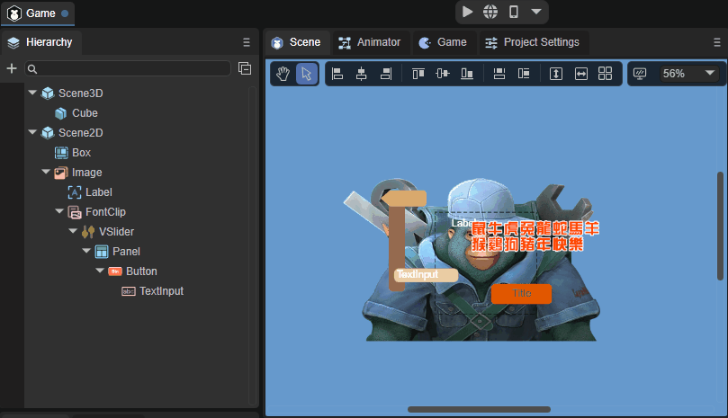
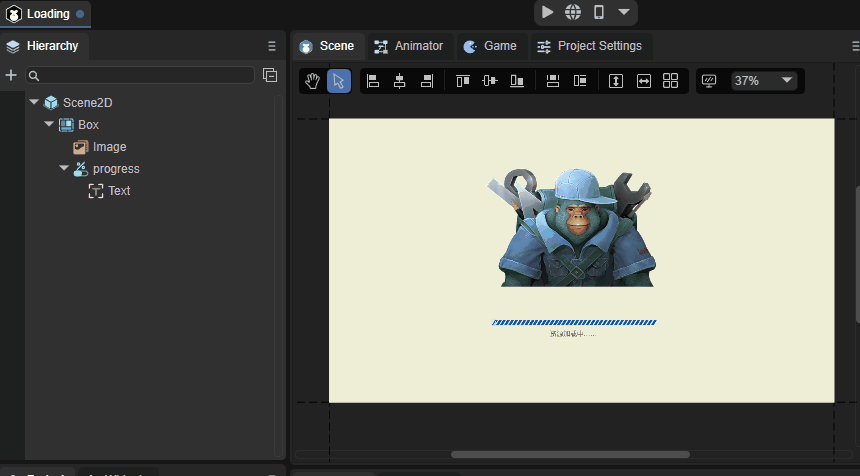
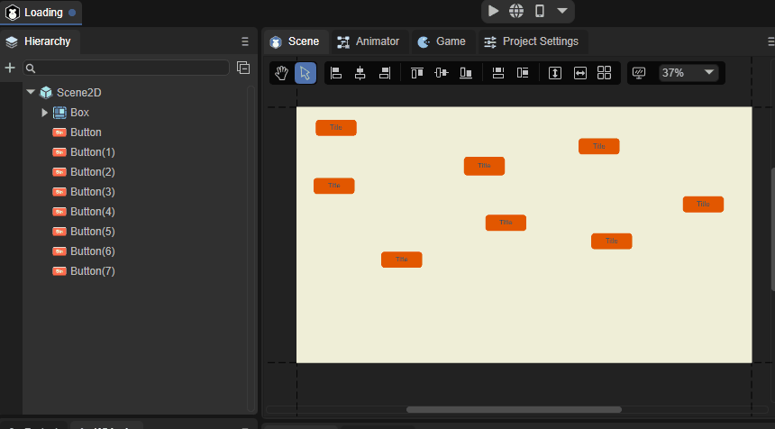

# Basic interaction of UI editor

## 1. Basic interactive icon description of UI editor

First, let’s take a look at the basic interaction icons of the UI editor, as shown in Figure 1-1.

(Picture 1-1)

​    	From left to right, they are window camera mode, panning mode, left alignment, left and right center alignment, right alignment, top alignment, top and bottom center alignment, bottom alignment, same width, same height, uniform line spacing, uniform column spacing, table arrangement, and display. settings, zoom settings.

## 2. Window camera mode

​    	Click the little hand icon in the 2D scene to enter the window camera mode. You can also press and hold the right mouse button to enter this mode directly. In this mode, keep pressing the left or right mouse button to drag the entire scene in any direction. The effect is as follows As shown in animation 2-1.

(Animation 2-1)

## 3. Panning mode

Click the arrow icon in the 2D scene to enter the panning mode. In this mode, keep pressing the left mouse button to drag the selected control in any direction.

If the scene has many levels, it will be difficult to drag the component you want to move. At this time, you can click to select the component from the hierarchy panel and drag it. The effect is as shown in animation 3-1.

(Animation 3-1)

If you want to move multiple controls at one time, just press and hold the left mouse button outside the canvas and slide across the canvas, as shown in animation 3-2.

(Animation 3-2)

## 4. Alignment settings

Move the control on the parent node of the control. You can move only one, or you can move multiple at one time. The method is to long-press the left mouse button outside the canvas and then slide across the canvas, and click on the alignment setting you need.

| Name	| Function	| Shortcut keys	|
| ------------ | ------------------------------------------------------ | ---------- |
| left aligned	| Translate the selected control horizontally to the leftmost side of the control's parent node. | Ctrl+Alt+1 |
| Left and right center alignment | Translate the selected control horizontally to the horizontal center of the control's parent node. | Ctrl+Alt+2 |
| Align right	| Translate the selected control horizontally to the rightmost side of the control's parent node. | Ctrl+Alt+3 |
| align top	| Move the selected control vertically to the top of the control's parent node. | Ctrl+Alt+4 |
| Center alignment up and down | Translate the selected control vertically to the vertical center of the control's parent node. | Ctrl+Alt+5 |
| align bottom	| Move the selected control vertically to the bottom of the control's parent node. | Ctrl+Alt+6 |

## 5. Width and height settings

Same width (shortcut Ctrl+Alt+7): Use the canvas as an analog object to modify the width of the selected control, as shown in animation 5-1.

(Animation 5-1)

Same height (shortcut Ctrl+Alt+8): Use the canvas as an analog object to modify the height of the selected control, as shown in animation 5-2.

(Animation 5-2)

## 6. Row, column spacing, and column number settings

Uniform line spacing: Arrange the selected controls with even line spacing in pixels. The effect is as shown in animation 6-1.

(Animation 6-1)

Uniform column spacing: Arrange the selected controls with uniform column spacing in pixels, as shown in the animation in Figure 6-2.

(Animation 6-2)

Table arrangement: Arrange the selected controls in a neat table format. You can complete it by directly inputting the values. It is very convenient. The effect is shown in the animation 6-3.

(Animation 6-3)

## 7. Display settings

The display setting function can be used to modify the background color of the editor scene window. Developers can choose it themselves. The effect is shown in Figure 7-1.

(Figure 7-1)

You can also set the reference image when editing the UI in Design Image (when designing the UI according to art requirements, the bitmap placed in the scene will not be displayed at runtime). The parameter settings are as follows:

Source: Select the bitmap as the reference image.

Offset: The position of the reference image.

Alpha: the transparency of the reference image.

In Front: Whether it is located on the upper level. When checked, the reference image will be on top.

## 8. Zoom settings

Developers can choose to zoom in on the current scene.

As shown in Figure 8-1.

(Figure 8-1)

Shortcut keys for zoom settings.

| Button	| Function	|
| ----------------- | ---------- |
| ctrl  +  +    	| Zoom in	|
| ctrl  +  -    	| Zoom out	|
| ctrl  +  1    	| Restore to 100% |
| ctrl + mouse wheel | Free zoom |

