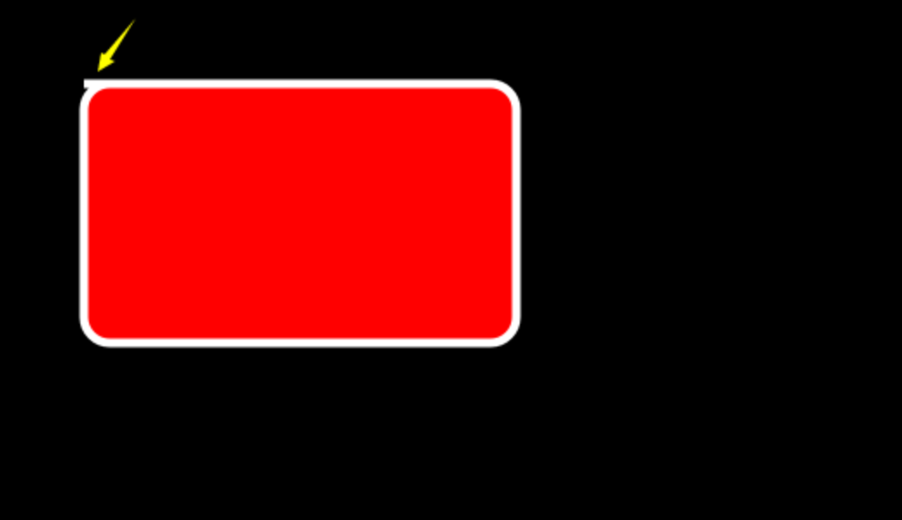
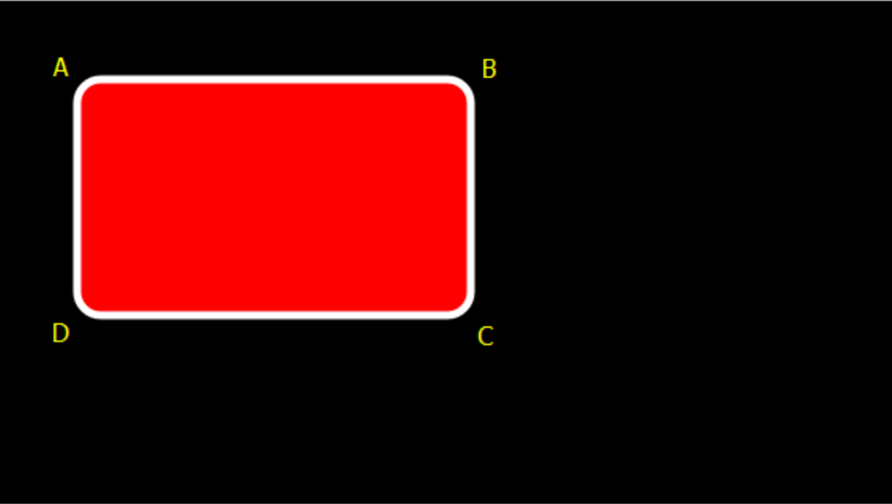
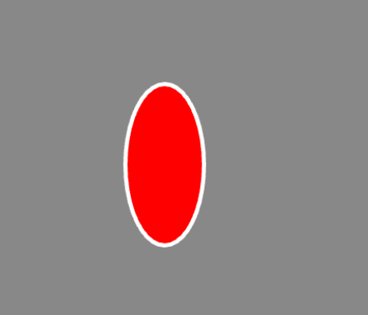
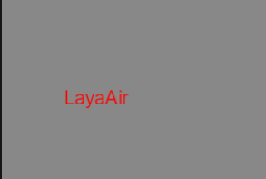

# Draw graphics

## 1. Draw graphics in IDE

In LayaAir, you can draw various graphics by using graphics components in the Sprite object, as shown in the animation 1-1.


(Animation 1-1)

Graphics can be drawn through these options in the IDE, as shown in Figure 1-2.


(Figure 1-2)

The `laya.display.Graphics` class in the LayaAir engine can view various vector drawing methods of the API.

- `drawRect`
- `fillText`
- `drawPath`
- `drawCircle`
- `drawPie`
- `drawLine`
- `drawLines`
- `drawPoly`
- `drawCurves`
- ......

These Graphics will be explained below.


## 2. Draw rectangles and rounded rectangles

### 2.1 IDE draws rectangle

In the Sprite object's Graphics component, you can create a drawing graphics command by clicking `+`. Select the first option `Create Rectangle (DrawRectCmd)`, as shown in Figure 2-1 after creation.


(Figure 2-1)

`Offset`: The offset of the rectangle relative to the Sprite object, X axis, and Y axis.

`Size`: The size of the rectangle. Percentage is used by default. You can also uncheck the percentage and use pixel value settings.

`Percent`: When checked, the size of the rectangle is the percentage of the Sprite object size. When not checked, the size of the rectangle is the pixel size.

`Line Width`: The border width value of the drawn rectangle.

`Line Color`: The border color of the drawn rectangle.

`Fill Color`: The color of the rectangle fill.

Animation 2-2 demonstrates the operation process of these properties:


(Animation 2-2)


### 2.2 Code to draw a rectangle

The `drawRect()` method in the LayaAir engine is used to draw vector rectangles. The method is detailed below:

```typescript
	/**
 	* Draw a rectangle.
 	* @param x		 The X-axis position to start drawing.
 	* @for me		 Y-axis position to start drawing.
 	* @param width   	 The width of the rectangle.
 	* @param height rectangle height.
 	* @param fillColor The fill color, or the gradient object that fills the drawing.
 	* @param lineColor (optional) Border color, or gradient object that fills the drawing.
 	* @param lineWidth (optional) border width.
 	* @param percent Whether the position and size are percentage values.
 	*/
	drawRect(x: number, y: number, width: number, height: number, fillColor: any, lineColor: any = null, lineWidth: number = 1, percent?: boolean): DrawRectCmd {
    	return this.addCmd(DrawRectCmd.create(x, y, width, height, fillColor, lineColor, lineWidth, percent));
	}
```

Code example:

```typescript
let sp = new Laya.Sprite();
//Draw a rectangle
sp.graphics.drawRect(20, 20, 100, 50, "#ffff00", "#00ff00", 5, false);
this.owner.addChild(sp);
```

20 in the example, 20 is the starting point coordinates of the rectangle, 100 is the width to the right, if it is a negative number, it is the width to the left. 50 is the downward height, if it is a negative number it is the upward height.

running result:


(Figure 2-3)


### 2.3 Draw a rectangle using drawPath

The path drawing method `drawPath()` of the `laya.display.Graphics` class of the LayaAir engine can draw vector graphics based on the path:

```typescript
/**
* Draw a path.
* @param x	 The X-axis position to start drawing.
* @for me	 Y-axis position to start drawing.
* @param paths path collection, paths support the following formats: [["moveTo",x,y],["lineTo",x,y],["arcTo",x1,y1,x2,y2,r],[ "closePath"]].
* @param brush (optional) brush definition, supports the following settings {fillStyle:"#FF0000"}.
* @param pen (optional) pen definition, supports the following settings {strokeStyle, lineWidth, lineJoin: "bevel|round|miter", lineCap: "butt|round|square", miterLimit}.
*/
drawPath(x: number, y: number, paths: any[], brush: any = null, pen: any = null): DrawPathCmd {
    return this.addCmd(DrawPathCmd.create(x, y, paths, brush, pen));
}
```

Code example:

```typescript
let sp = new Laya.Sprite();
//custom path
let path:Array<any> =  [
["moveTo", 0, 0], //Move the brush to point A
["lineTo", 100, 0],//Draw to point B
["lineTo", 100, 50],//Draw to point C
["lineTo", 0, 50], //Continue drawing to point D
["closePath"] //Close path
];
//Draw a rectangle
sp.graphics.drawPath(20, 20, path, {fillStyle: "#ff0000"});
this.owner.addChild(sp);
```

The coordinate points "20,20" in the first and second digits of drawPath are the starting positions that control the overall position, and the third digit is the path parameter.

Description: MoveTo moves the brush to the initial position, but does not start drawing at this time. "0,0" is relative to the starting position of "20,20", so point A is still at the origin of the starting position. The description information lineto is the coordinate of the path point drawn, and "100, 0" is the coordinate of the point B drawn. Points C and D are deduced in the same way, and finally they are closed through the description information closePath and the starting position of MoveTo, otherwise they will not be closed.

From the perspective of drawing a rectangle, the drawPath method is definitely not more convenient than the drawRect method. But developers can understand the related parameter usage through this example.

Running effect (the four points A, B, C, and D are not displayed during operation. They are added after the screenshot for the convenience of description):

  

(Figure 2-4)


### 2.4 IDE draws rounded rectangle

In the Graphics component of the Sprite object, you can create a drawing graphics command by clicking `+`, as shown in Figure 2-5, select `Create Rounded Rectangle (DrawRoundRectCmd)` to draw a rounded rectangle.


(Figure 2-5)

`Offset`: The offset of the rounded rectangle relative to the Sprite object, X axis, and Y axis.

`Size`: The size of the rounded rectangle. Percentage is used by default. You can also uncheck the percentage and use pixel value settings.

`Border Radius`: The radius of each fillet. X: Upper left corner, Y: Upper right corner, Z: Lower left corner, W: Lower right corner.

`Percent`: When checked, the size of the rounded rectangle is the percentage of the Sprite object size. When not checked, the size of the rounded rectangle is the pixel size.

`Line Width`: The border width value for drawing rounded rectangles.

`Line Color`: The border color of the rounded rectangle.

`Fill Color`: The fill color of the rounded rectangle.


### 2.5 Code to draw rounded rectangle

The `drawRoundRect()` method in the LayaAir engine is used to draw rounded rectangles. The method is detailed below:

```typescript
	/**
 	* Draw a rounded rectangle
 	* @param x	The X-axis position to start drawing.
 	* @for me	Y-axis position to start drawing.
 	* @param width     	The width of the rounded rectangle.
 	* @param height    	The height of the rounded rectangle.
 	* @param lt        	Upper left corner
 	* @param rt	Upper right rounded corner
 	* @param lb	Lower left corner
 	* @param rb        	Lower right corner
 	* @param fillColor 	Fill color, or gradient object that fills the drawing.
 	* @param lineColor 	(Optional) The border color, or gradient object that fills the drawing.
 	* @param lineWidth 	(Optional) Border width.
 	* @param percent   	(Optional) Whether the position and size are percentage values.
 	* @returns
 	*/
	drawRoundRect(x: number, y: number, width: number, height: number, lt: number, rt: number, lb: number, rb: number, fillColor: any, lineColor: any = null, lineWidth: number = 1, percent?: boolean) {
    	return this.addCmd(DrawRoundRectCmd.create(x, y, width, height, lt, rt, lb, rb, fillColor, lineColor, lineWidth, percent));
	}
```

Code example:

```typescript
let sp = new Laya.Sprite();
sp.graphics.drawRoundRect(200, 200, 300, 300, 20, 20, 20, 20, "#ffff00", "#00ff00", 5, false);
this.owner.addChild(sp);
```

200 in the example, 200 is the starting point coordinate of the rectangle, the first 300 is the width to the right, if it is a negative number, it is the width to the left. The second 300 is the downward height, if it is a negative number it is the upward height. The four 20's are the radius of each fillet. "#ffff00" is the fill color, and "#00ff00" is the border color. 5 is the border width, false means that the position and size do not use percentage values, but use pixels.

running result:


(Figure 2-6)

In addition to using LayaAir's own method to draw a rounded rectangle, you can also use straight lines and arcs to splice a rounded rectangle.


### 2.6 Use drawPath to draw a rounded rectangle

In the LayaAir engine, you can use the `drawPath` method of graphics to draw fillets or arcs. The specific operation requires three steps: specify the starting point of the drawing path ["moveTo", x, y], and draw a horizontal straight line ["lineTo", x, y], draw arc ["arcTo", p1.x, p1.y, p2.x, p2.y, r].

#### 2.6.1 Parameter Example

```
["moveTo", 50, 50],["lineTo", 150, 50],["arcTo", 200, 50, 200, 100, 50],
```

The operating effect of the above parameters is shown in Figure 2-7:


(Figure 2-7)

We can see from Figure 2-7 that `["moveTo", 50, 50]` locates the starting point of the brush at the position `"50,50"`. `["lineTo", 150, 50]` draws a straight line from the starting point to the current endpoint ("150, 50"). `["arcTo", 200, 50, 200, 100, 50]` draws an arc with r (radius) 50.

#### 2.6.2 Arc drawing principle

When making this arc, this arc is actually formed by using the current endpoint `"150, 50"`, endpoint 1`"200, 50"`, and endpoint 2`"200, 100"`. For the included angle, create an arc on the circle with a radius of 50px and tangent to both sides.

If you have understood the principle of arc drawing, you will also find that the core elements of an arc are two sides and the vertex forming an angle with the two sides (endpoint 1 in the above example). Endpoint 2 in Figure 2-7 and The x-axis edge formed by endpoint 1 is easier to understand. Then the current endpoint and endpoint 1 have formed a y-axis edge. Can the starting point on the same y-axis as the current endpoint be removed? In fact, it is not possible. The starting point of the brush must exist, but the lineTo for drawing a straight line can be removed. If `["lineTo", 150, 50],` is commented out, then when arcTo draws an arc, the starting point will be regarded as the current endpoint, and arcTo will find When there is no straight line drawn by lineTo, a straight line from the starting point to the starting point of the arc will be automatically added. Therefore, lineTo can be omitted when drawing a rounded rectangle.

#### 2.6.3 Example of drawing a rounded rectangle

Next draw a rounded rectangle with a rounded arc radius of 30. The sample code is as follows:

```typescript
let sp = new Laya.Sprite();
//custom path
var path:any[] = [
	["moveTo", 0, 0], //The starting point of the brush
	["lineTo",400,0],
	["arcTo", 500, 0, 500, 30, 30], //p1 (500,0) is the angle B, (500,30) is the endpoint p2
	["lineTo",500,200],
	["arcTo", 500, 300, 470, 300, 30],//p1 (500,300) is the angle C, (470,300) is the endpoint p2
	["lineTo",30,300],
	["arcTo", 0, 300, 0, 270, 30], //p1(0,300) is the angle D, (0,270) is the endpoint p2
	["lineTo",0,100],
	["arcTo", 0, 0, 30, 0, 30],//p1(0,0) is the angle A, (30,0) is the endpoint p2
];
//Draw a rounded rectangle
sp.graphics.drawPath(100, 100, path, {fillStyle: "#ff0000"});
this.owner.addChild(sp);
```

Code running effect:


(Figure 2-8)

In the above code, there seems to be no problem. In fact, the starting point of moveTo needs to be on the straight line between the arcs. Next, we only need to add a border line when drawing the drawPath to clearly see the error. The drawing method graphics.drawPath is modified to:

```typescript
//Draw a rounded rectangle
sp.graphics.drawPath(100, 100, path, {fillStyle: "#ff0000"},{"strokeStyle":"#ffffff","lineWidth":"10"});
```

The running effect after modification is shown in Figure 2-9. Since the line is drawn from the starting point of the brush `0,0`, it is not the result we want.



(Figure 2-9)

Modify the example to the correct code below:

```typescript
let sp = new Laya.Sprite();
//custom path
var path:any[] = [
	["moveTo", 30, 0], //The starting point of the brush
	["lineTo",400,0],
	["arcTo", 500, 0, 500, 30, 30], //p1 (500,0) is the angle B, (500,30) is the endpoint p2
	["lineTo",500,200],
	["arcTo", 500, 300, 470, 300, 30],//p1 (500,300) is the angle C, (470,300) is the endpoint p2
	["lineTo",30,300],
	["arcTo", 0, 300, 0, 270, 30], //p1(0,300) is the angle D, (0,270) is the endpoint p2
	["lineTo",0,100],
	["arcTo", 0, 0, 30, 0, 30],//p1(0,0) is the angle A, (30,0) is the endpoint p2
];
//Draw a rounded rectangle
sp.graphics.drawPath(100, 100, path, {fillStyle: "#ff0000"},{"strokeStyle":"#ffffff","lineWidth":"10"});
this.owner.addChild(sp);
```

The running effect is shown in Figure 2-10:



(Figure 2-10)


## 3. Draw circles, ellipses and sectors

### 3.1 IDE draws a circle

In the Sprite object's Graphics component, you can create a drawing graphics command by clicking `+`. Select `Create Circle (DrawCircleCmd)` to draw a circle, as shown in Figure 3-1 after creation.


(Figure 3-1)

`Offset`: The offset of the circle relative to the Sprite object, X axis, and Y axis.

`Radius`: The size of the circle relative to the Sprite object.

`Percent`: When checked, the Offset and Radius of the circle are percentages of the size of the Sprite object. When unchecked, the size of the circle is the pixel size.

`Line Width`: The width of the circular line.

`Line Color`: The color of the circular line.

`Fill Color`: The color of the circle fill.


### 3.2 Code to draw a circle

The `drawCircle()` method in the LayaAir engine is used to draw vector circles. The method is detailed below:

```typescript
	/**
 	* Draw a circle.
 	* @param x		 X-axis position of the dot.
 	* @for me		 The Y-axis position of the dot.
 	* @param radius radius.
 	* @param fillColor The fill color, or the gradient object that fills the drawing.
 	* @param lineColor (optional) Border color, or gradient object that fills the drawing.
 	* @param lineWidth (optional) border width.
 	*/
	drawCircle(x: number, y: number, radius: number, fillColor: any, lineColor: any = null, lineWidth: number = 1): DrawCircleCmd {
    	return this.addCmd(DrawCircleCmd.create(x, y, radius, fillColor, lineColor, lineWidth));
	}
```

Code example:

```typescript
let sp = new Laya.Sprite();
//Draw a circle
sp.graphics.drawCircle(80,80,50,"#ff0000");
this.owner.addChild(sp);
```

Drawing a circle is relatively simple, "80, 80" is the coordinates of the center point of the circle. 50 is the radius, and "#ff0000" is the circle fill color value.

running result:


(Figure 3-2)


### 3.3 IDE draws ellipse

In the Sprite object's Graphics component, you can create a drawing graphics command by clicking `+`. Select `Create Ellipse (DrawEllipseCmd)` to draw an ellipse, as shown in Figure 3-3 after creation.


(Figure 3-3)

`Offset`: The offset of the ellipse relative to the Sprite object, X axis, and Y axis.

`Width`: The lateral radius of the ellipse relative to the Sprite.

`Height`: The longitudinal radius of the ellipse relative to the Sprite.

`Percent`: When checked, the Offset, Width, and Height of the ellipse are percentages of the Sprite object size. When not checked, the size of the circle is the pixel size.

`Line Width`: The width of the elliptical line.

`Line Color`: The color of the ellipse line.

`Fill Color`: The color of the ellipse fill.


### 3.4 Code to draw ellipse

The `drawEllipse` method in the LayaAir engine is used to draw vector ellipses. The method is detailed below:

```typescript
	/**
 	* Draw an ellipse
 	* @param x	X-axis position of the dot.
 	* @for me	The Y-axis position of the dot.
 	* @param width 	Lateral radius.
 	* @param height	Longitudinal radius.
 	* @param fillColor The fill color, or the gradient object that fills the drawing.
 	* @param lineColor (optional) Border color, or gradient object that fills the drawing.
 	* @param lineWidth (optional) border width.
 	* @param percent (optional) whether the position and size are percentage values.
 	*/
	drawEllipse(x: number, y: number, width: number, height: number, fillColor: any, lineColor: any, lineWidth: number, percent?: boolean): DrawEllipseCmd {
    	return this.addCmd(DrawEllipseCmd.create(x, y, width, height, fillColor, lineColor, lineWidth, percent));
	}
```

Code example:

```typescript
let sp = new Laya.Sprite();
//Draw an ellipse
sp.graphics.drawEllipse(200, 200, 50, 100, "#ff0000", "#ffffff", 5);
this.owner.addChild(sp);
```

Among them, "200, 200" is the coordinates of the center point of the ellipse. 50, 100 are the horizontal and vertical radii of the ellipse. "#ff0000" is the fill color value, "#ffffff" is the ellipse border color, and 5 is the border width.

running result:



(Figure 3-4)


### 3.5 Code to draw a sector

Let's continue and introduce the fan-shaped drawing method `drawPie()`. The detailed description of this method is as follows:

```typescript
	/**
 	* Draw a fan shape.
 	* @param x			 The X-axis position to start drawing.
 	* @for me			 Y-axis position to start drawing.
 	* @param radius   	 Sector radius.
 	* @param startAngle The starting angle.
 	* @param endAngle   	 End angle.
 	* @param fillColor   	 Fill color, or gradient object that fills the drawing.
 	* @param lineColor   	 (Optional) The border color, or gradient object that fills the drawing.
 	* @param lineWidth   	 (Optional) Border width.
 	*/
	drawPie(x: number, y: number, radius: number, startAngle: number, endAngle: number, fillColor: any, lineColor: any = null, lineWidth: number = 1): DrawPieCmd {
    	return this.addCmd(DrawPieCmd.create(x, y, radius, Utils.toRadian(startAngle), Utils.toRadian(endAngle), fillColor, lineColor, lineWidth));
	}
```

Code example:

```typescript
let sp = new Laya.Sprite();
//art fan shape
sp.graphics.drawPie(80, 80, 50, 90, 180, "#ff0000");
this.owner.addChild(sp);
```

The effect of the code running is shown in the figure below:


(Figure 3-5)

Drawing a sector is similar to a circle, and the first three parameters are used in the same way, except that the starting and ending angles of drawing are increased. In order to give everyone a better understanding, the fan-shaped drawing code and parameters follow the circular code example. Except for the change of the method name, only two angle parameters of 90 and 180 are added. You can adjust the parameters during the coding process to gain a deeper understanding.


## 4. Draw triangles, polygons and patterns based on data

### 4.1 IDE draws triangles and polygons

In the Sprite object's Graphics component, you can create a drawing graphics command by clicking `+`. Select `Create Polygon (DrawPolyCmd)` to draw triangles and polygons, as shown in Figure 4-1 after creation.


(Pic 4-1)

`Offset`: The offset of the polygon relative to the Sprite object, X-axis, and Y-axis, in pixels.

`Points`: A collection of points of a polygon. A triangle is also a polygon, but it has only 3 points.

`Line Width`: The width of the polygon wireframe.

`Line Color`: The color of the polygon wireframe.

`Fill Color`: The color of the polygon fill.

Animation 4-2 demonstrates how to create a polygon:


(Animation 4-2)


### 4.2 Code to draw triangles

Drawing triangles, polygons, and drawing patterns based on specified path data can be implemented using the `drawpoly()` method of the laya.display.Graphics class in the LayaAir engine. The method is detailed below:

```typescript
	/**
 	* Draw polygons.
 	* @param x		 The X-axis position to start drawing.
 	* @for me		 Y-axis position to start drawing.
 	* @param points The point collection of the polygon.
 	* @param fillColor The fill color, or the gradient object that fills the drawing.
 	* @param lineColor (optional) Border color, or gradient object that fills the drawing.
 	* @param lineWidth (optional) border width.
 	*/
	drawPoly(x: number, y: number, points: any[], fillColor: any, lineColor: any = null, lineWidth: number = 1): DrawPolyCmd {
    	return this.addCmd(DrawPolyCmd.create(x, y, points, fillColor, lineColor, lineWidth));
	}
```

Code example:

```typescript
let sp = new Laya.Sprite();
//Draw a triangle
sp.graphics.drawPoly(30, 28, [0, 100, 50, 0, 100, 100], "#ffff00");
this.owner.addChild(sp);
```

running result:

  

(Figure 4-3)

It can be seen from the code that "0, 100" in the third parameter of `drawPoly` is the coordinate of point A. "50,0" is the coordinate of point B. "100, 100" is the coordinate of point C. After connecting the three coordinate points, fill in the color value of the fourth parameter, that is, the yellow triangle in the picture above is drawn. But what everyone needs to understand and pay attention to here is that all coordinates in the third parameter are relative coordinates and will be affected by the first and second coordinate parameters "30, 28". Once "30, 28" changes, the overall shape and position will be affected.


### 4.3 Code to draw polygons

Continue to use the above code example to draw polygons by adding the coordinates of the third parameter of `drawPoly`. The modified code is as follows:

```typescript
let sp = new Laya.Sprite();
//Draw polygon
sp.graphics.drawPoly(30, 28, [0, 100, 50, 0, 100, 100, 75, 150, 25, 150], "#ffff00");
this.owner.addChild(sp);
```

The effect of the code running is shown in the figure below:


(Figure 4-4)

In the modified code, the coordinates of point D "75, 150" and point E coordinates "25, 150" are added. By connecting each coordinate point and filling it with color, the polygon we want is drawn. To draw a polygon with more sides, just add coordinate points as described above.


### 4.4 Draw a pattern based on the specified path data

Let's use an example to introduce in depth how to specify a path to draw a five-pointed star. The sample code is as follows:

```typescript
let sp = new Laya.Sprite();
//Draw a five-pointed star
var path: Array<number> = [];
path.push(0, -130);//Coordinates of point A of the five-pointed star
path.push(33, -33);//Coordinates of point B of the five-pointed star
path.push(137, -30);//Coordinates of point C of the five-pointed star
path.push(55, 32);//Coordinates of point D of the five-pointed star
path.push(85, 130);//Coordinates of point E of the pentagram
path.push(0, 73);//Coordinates of point F of the five-pointed star
path.push(-85, 130);//Coordinates of the five-pointed star G point
path.push(-55, 32);//H point coordinates of the pentagram
path.push(-137, -30);//Coordinates of point I of the five-pointed star
path.push(-33, -33);//Coordinates of point J of the five-pointed star
sp.graphics.drawPoly(Laya.stage.width / 2, Laya.stage.height / 2, path, "#FF7F50");
this.owner.addChild(sp);
```

The effect of the code running is shown in the figure below:


 (Figure 4-5)

Through the way of writing the above example code, do you feel that the readability of the code has been enhanced? You can also change the previous triangle or polygon to this way to experience it. Mastering these basics can derive many flexible usages. .


## 5. Draw line segments and polylines

### 5.1 IDE draws line segments

In the Sprite object's Graphics component, you can create a drawing graphics command by clicking `+`. Select `Create Line Segment (DrawLineCmd)` to draw the line segment, as shown in Figure 5-1 after creation.


(Figure 5-1)

`From`: The starting point of the line, the offset relative to the Sprite object, X axis, and Y axis.

`To`: The end point of the line, the offset relative to the Sprite object, X axis, and Y axis.

`Percent`: When checked, the starting point and end point of the line are percentages of the Sprite object size. When not checked, the starting point and end point of the line are pixels.

`Line Width`: The width of the line.

`Line Color`: The color of the line.


### 5.2 Code to draw line segments

The `drawLine()` method in the `laya.display.Graphics` class in the Laya engine is used to draw line segments. The method is detailed below:

```typescript
	/**
 	* Draw a line.
 	* @param fromX	 X-axis starting position.
 	* @param fromY	 Y-axis starting position.
 	* @param toX   	 X-axis end position.
 	* @param toY   	 Y-axis end position.
 	* @param lineColor color.
 	* @param lineWidth (optional) Line width.
 	*/
	drawLine(fromX: number, fromY: number, toX: number, toY: number, lineColor: string, lineWidth: number = 1): DrawLineCmd {
    	return this.addCmd(DrawLineCmd.create(fromX, fromY, toX, toY, lineColor, lineWidth));
	}

```

Code example:

```typescript
let sp = new Laya.Sprite();
//Draw a straight line
sp.graphics.drawLine(10, 58, 146, 58, "#ff0000", 3);
this.owner.addChild(sp);
```

running result:


(Figure 5-2)


### 5.3 IDE draws polyline

In the Sprite object's Graphics component, you can create a drawing graphics command by clicking `+`. Select `Create Polyline (DrawLinesCmd)` to draw a polyline, as shown in Figure 5-3 after creation.


(Figure 5-3)

`Offset`: The offset of the line segment relative to the Sprite object, X axis, and Y axis, the unit is pixels.

`Points`: A collection of points of a line segment.

`Line Width`: The width of the line.

`Line Color`: The color of the line.


### 5.4 Code to draw polyline

The `drawLines()` method in the `laya.display.Graphics` class in the Laya engine is used to draw polylines. This method is similar to `drawLine`. Be sure not to miss the "s" at the end when coding. The parameters of `drawLines` are detailed as follows:

```typescript
	/**
 	* Draw a series of line segments.
 	* @param x		 The X-axis position to start drawing.
 	* @for me		 The Y-axis position to start drawing.
 	* @param points The point collection of the line segment. Format: [x1,y1,x2,y2,x3,y3...].
 	* @param lineColor The color of the line segment, or the gradient object that fills the drawing.
 	* @param lineWidth (optional) line segment width.
 	*/
	drawLines(x: number, y: number, points: any[], lineColor: any, lineWidth: number = 1): DrawLinesCmd | null {
    	if (!points || points.length < 4) return null;
    	return this.addCmd(DrawLinesCmd.create(x, y, points, lineColor, lineWidth));
	}
```

Code example:

```typescript
let sp = new Laya.Sprite();
//Draw a polyline
sp.graphics.drawLines(20, 88, [0, 0, 39, -50, 78, 0, 120, -50], "#ff0000", 3);
this.owner.addChild(sp);
```

running result:  


(Figure 5-4)

Through the code, we can see that the difference in parameters between drawing polylines and drawing straight lines starts from the third digit. The third parameter is a collection of polyline points of Array type, where "0, 0" is the starting coordinate of vertex A. . "39,-50" is the starting coordinate of vertex B. "78, 0" is the starting coordinate of vertex C, and "120, -50" is the coordinate of end point D. But what everyone needs to understand and pay attention to here is that all coordinates in the third parameter are relative coordinates, and will be affected by "20, 88" in the first and second parameters. Once "20,88" changes, the entire polyline will be affected.


## 6. Draw curve

Compared with straight lines, the drawing and coordinate relationships of curves are more difficult to understand. Since the LayaAir engine draws Bezier curves, this article first explains the basics of Bezier curves, and then explains it in conjunction with the engine's API.

### 6.1 Basics of Bezier Curve

The Bezier curve is called the Bezier curve in Hong Kong, Macao, Taiwan and other places, and it is called the Bezier curve in Singapore, Malaysia and other places. General vector graphics software uses it to accurately draw curves. Bezier curves are composed of line segments and nodes. The nodes are draggable fulcrums, and the line segments are like stretchable rubber bands. The pen tool we see on the drawing tool is Make this kind of vector curve.

Bezier curves are mathematical curves used in two-dimensional graphics applications. A curve is defined by four points: the starting point, the ending point (also called the anchor point), and two mutually separated intermediate points. Slide the two intermediate points and the shape of the Bezier curve changes.

Based on different formulas such as linear, quadratic, and cubic, Bezier curves are also called linear, quadratic, and quintic Bezier curves. Some articles also call them first-order, second-order, and so on. One thing. Let everyone understand it intuitively through the animation below:

#### **6.1.1 First degree Bezier curve**

 

(Animation 6-1)

Note: The above figure is a continuous point from P0 to P1, describing a linear Bezier curve. t in a linear Bezier function passes through the curve described by B(t) from P0 to P1. For example, when t=0.25, B(t) is one-quarter of the path from point P0 to P1. Just like the continuous t from 0 to 1, B(t) describes a straight line from P0 to P1.

#### 6.1.2 Quadratic Bezier Curve

 

 (Animation 6-2)

 

 (Animation 6-3)

Note: In order to construct a quadratic Bezier curve, the continuous point Q0 from P0 to P1 in the above figure describes a linear Bezier curve. The continuous point Q1 from P1 to P2 describes a linear Bezier curve. The continuous point B(t) from Q0 to Q1 describes a quadratic Bezier curve.

#### 6.1.3 Cubic Bezier Curve

 

 (Animation 6-4)

 

 (Animation 6-5)

Note: For a cubic curve, it can be constructed by the intermediate points Q0, Q1, Q2 described by the linear Bezier curve, and the points R0, R1 described by the quadratic curve.

#### 6.1.4 Higher-order Bezier curve

Since high-order Bezier curves are not common, this article will not explain them in detail. If you want to know more about the principles of Bezier curves, you can check other related articles.

 

 (Animation 6-6) Cubic Bezier Curve

 

 (Animation 6-7) Quintic Bezier Curve


### 6.2 Code to draw quadratic Bezier curve

The curve drawing of the LayaAir engine uses quadratic Bezier curves. Developers can use the `drawCurves()` method of the laya.display.Graphics class to draw curves. The method is detailed below:

```typescript
	/**
 	* Draw a series of curves.
 	* @param x		 The X-axis position to start drawing.
 	* @for me		 Y-axis position to start drawing.
 	* @param points Point collection of line segment, format [controlX, controlY, anchorX, anchorY...].
 	* @param lineColor The color of the line segment, or the gradient object that fills the drawing.
 	* @param lineWidth (optional) line segment width.
 	*/
	drawCurves(x: number, y: number, points: any[], lineColor: any, lineWidth: number = 1): DrawCurvesCmd {
    	return this.addCmd(DrawCurvesCmd.create(x, y, points, lineColor, lineWidth));
	}
```

Below we use the LayaAir engine to draw vector curves. The sample code is as follows:

```typescript
let sp = new Laya.Sprite();
//Draw a polyline
sp.graphics.drawCurves(10, 58, [0, 0, 19, -100, 39, 0], "#ff0000", 3);
this.owner.addChild(sp);
```

The running effect is as follows:


(Figure 6-8)

By adding the third point point collection parameter of `drawCurves`, we can make the curve more complex. The modified example code is as follows:

```typescript
//Add 58, 100 and 78, 0 coordinates to make the curve more complex
sp.graphics.drawCurves(10, 58, [0, 0, 19, -100, 39, 0, 58, 100, 78, 0], "#ff0000", 3) ;
```

The running effect is as follows:


(Figure 6-9)

If you want to draw more complex curves, you can adjust the parameters in `drawCurves` yourself and understand it combined with the principle of quadratic Bezier curve.

Finally, a reminder, just like drawing a polyline, all the coordinates in the third parameter are relative coordinates, and will be affected by the "10, 58" of the first and second parameters. Once "10,58" changes, the overall curve will be affected.


## 7. Draw text

### 7.1 IDE drawing text

In the Sprite object's Graphics component, you can create a drawing graphics command by clicking `+`. Select `Create Text (FillTextCmd)` to draw text, as shown in Figure 7-1 after creation.


(Figure 7-1)

`Text`: The text content displayed.

`Offset`: The offset value of the text from the Sprite origin (0, 0) coordinate position.

`font`: font setting for text.

`Font Size`: The font size of the text.

`Bold`: Whether the text is bold.

`Italic`: Whether the text is italicized.

`fillColor`: text color.

`Stork`: The stroke width of the text, 0 means no stroke.

`Stork Color`: The stroke color of the text.


### 7.2 Code to draw text

The `fillText()` method in the `laya.display.Graphics` class in the Laya engine is used to draw text. The method is detailed below:

```typescript
	/**
 	* Draw text on the canvas.
 	* @param text The text output on the canvas.
 	* @param x The x coordinate position (relative to the canvas) at which to start drawing text.
 	* @param y The y coordinate position (relative to the canvas) at which to start drawing text.
 	* @param font defines the font size and font, such as "20px Arial".
 	* @param color defines the text color, such as "#ff0000".
 	* @param textAlign text alignment, optional values: "left", "center", "right".
 	*/
	fillText(text: string | WordText, x: number, y: number, font: string, color: string, textAlign: string): FillTextCmd {
    	return this.addCmd(FillTextCmd.create(text, x, y, font, color, textAlign, 0, ""));
	}
```

Code example:

```typescript
let sp = new Laya.Sprite();
// draw text
sp.graphics.fillText("LayaAir", 100, 100, "20px Arial", "#ff0000", "center");
this.owner.addChild(sp);
```

running result:



(Figure 7-2)


## 8. Draw fill texture

### 8.1 IDE draws fill texture

In the Sprite object's Graphics component, you can create a drawing graphics command by clicking `+`. Select `Create Fill Texture (FillTextureCmd)` to draw the fill texture, as shown in Figure 8-1 after creation.


(Figure 8-1)

`Texture`: Set texture image.

`Position`: The position of the texture relative to the Sprite object.

`Size`: The size of the texture. The default is percentage. You can also uncheck the percentage and use the pixel value setting.

`Percent`: When checked, the texture size is the percentage of the Sprite object size. When not checked, the texture size is the pixel size.

`Type`: The type of texture filling: repeating, x-axis repeating only, y-axis repeating only, no repeating.

`Offset`: The offset of the texture relative to the Sprite object, X-axis, and Y-axis, in pixels.

`Color`: The color of the texture.


### 8.2 Code to draw fill texture

The `fillTexture()` method in the `laya.display.Graphics` class in the Laya engine is used to draw fill textures. The method is detailed below:

```typescript
	/**
 	* Fill with texture.
 	* @param texture   	 texture.
 	* @param x		 X-axis offset.
 	* @for me		 Y-axis offset.
 	* @param width   	 (Optional) Width.
 	* @param height (optional) height.
 	* @param type   	 (Optional) Fill type repeat|repeat-x|repeat-y|no-repeat
 	* @param offset (optional) texture offset
 	* @param color (optional) color
 	*
 	*/
	fillTexture(texture: Texture, x: number, y: number, width: number = 0, height: number = 0, type: string = "repeat", offset: Point | null = null, color: string = null): FillTextureCmd | null {
    	if (texture && texture.bitmap)
        	return this.addCmd(FillTextureCmd.create(texture, x, y, width, height, type, offset || Point.EMPTY, color));
    	else
        	return null;
	}
```

Code example:

```typescript
Laya.loader.load("resources/layaAir.png").then((res: Laya.Texture) => {
	let sp = new Laya.Sprite();
	// Draw fill texture
	sp.graphics.fillTexture(res, 0, 0, 500, 500, "repeat");
	this.owner.addChild(sp);
});
```

running result:


(Figure 8-2)


## 9. Draw the nine-square grid texture

### 9.1 IDE draws nine-square grid texture

In the Sprite object's Graphics component, you can create a drawing graphics command by clicking `+`. Select `Create Nine-Grid Texture (Draw9GridTextureCmd)` to draw the Nine-Grid Texture, as shown in Figure 9-1 after creation.


(Figure 9-1)

`Texture`: Set texture image.

`Position`: The position of the texture relative to the Sprite object.

`Size`: The size of the texture. The default is percentage. You can also uncheck the percentage and use the pixel value setting.

`Percent`: When checked, the texture size is the percentage of the Sprite object size. When not checked, the texture size is the pixel size.

`Size Grid`: The effective scaling grid data of the bitmap (nine-square grid information): top margin, right margin, bottom margin, left margin, whether to repeat filling.

`Color`: The color of the texture.


### 9.2 Code to draw the nine-square grid texture

The `draw9Grid()` method in the `laya.display.Graphics` class in the Laya engine is used to draw the nine-square grid texture. The method is detailed below:

```typescript
	/**
 	* @private
 	* Draw pictures with nine-square grid
 	* @param    texture
 	* @param x
 	* @for me
 	* @param    width
 	* @param    height
 	* @param    sizeGrid
 	* @param    color
 	*/
	draw9Grid(texture: Texture, x: number = 0, y: number = 0, width: number = 0, height: number = 0, sizeGrid: any[], color?: string): void {
    	this.addCmd(Draw9GridTextureCmd.create(texture, x, y, width, height, sizeGrid, false, color));
	}
```

Code example:

```typescript
Laya.loader.load("atlas/comp/image.png").then((res: Laya.Texture) => {
	let sp = new Laya.Sprite();
	//Draw the nine-square grid texture
	sp.graphics.draw9Grid(res, 0, 0, 1024, 626, [0, 0, 0, 0, 1]);
	this.owner.addChild(sp);
});
```

running result:


(Figure 9-2)


## 10. Eliminate vector drawing

On PC browsers, we often find that the vector graphics drawn by the LayaAir engine will have some aliasing. This is due to the optimization processing done by the LayaAir engine based on performance considerations. Since the pixel density of mobile phones is relatively large, so on PC The seemingly obvious aliasing problem is actually basically invisible on mobile devices.

If there are developers who pursue perfection, they can turn on Laya.Config.isAntialias=true or turn it on in the project settings, as shown in Figure 10-1.


 (Figure 10-1)


