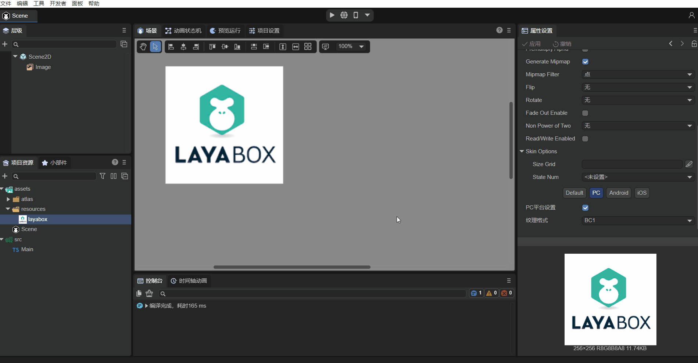
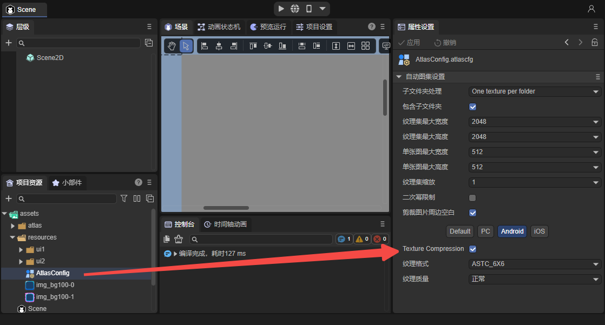

# Texture compression


## 1. Overview

Texture refers to the appearance effects such as the pattern and fineness of the surface of an object. In computer graphics, two-dimensional graphics are often used to describe surface patterns of three-dimensional models.

The image formats we see and use daily are mainly PNG and JPG. Although in some cases of three-dimensional and two-dimensional images, these images are also called textures, they are not texture formats and cannot be directly read by the GPU. and display. Therefore, these image files must first be decoded by the CPU into texture format and then transferred to the GPU for use.

The texture format is naturally a format that can be directly read and displayed by the GPU. Therefore, on the one hand, avoiding CPU decoding can reduce the performance pressure caused by calculations. On the other hand, reading and rendering directly can also avoid the overhead of decompressing the image into memory.

### 1.1 The purpose of texture compression

1. Reduce memory, especially for mobile applications. The memory usage should not be too large, otherwise low-end machines will easily crash.
2. Reduce bandwidth. For mobile game applications, a large number of textures will be transferred to the GPU during rendering. If there is no limit, it will not only seriously affect the rendering performance, but also cause serious heat generation.

### 1.2 Texture format types

#### 1.2.1 ASTC

ASTC (Adaptive Scalable Texture Compression) is a world-leading new texture compression format. ASTC was jointly developed by ARM and AMD and released in 2012. It is a block-based lossy compression algorithm. Its compression blocks from 4x4 to 12x12 can ultimately compress each pixel to occupy less than 1 bit, and the ASTC format supports RGBA. Taking ASTC 4x4 Block Size as an example, you can see that each pixel occupies 8 bits or 1 byte. Therefore, a 1024x1024 RGBA image will occupy 1MB of memory after being compressed in this format. If your texture chooses to generate mipmap, then the final resource size needs to be multiplied by 1.333, which is approximately 1.333MB. Correspondingly, if ASTC 8x8 format is used for compression, the final texture resource size should be 1024 × 1024 × 2 × 1.333333 ÷ 8 ≈ 341K. So if you want to use smaller compression formats such as 10x10 or 12x12, choosing these two formats basically means giving up the basic requirements for image quality. Therefore we recommend using the 6x6 compression format.

**Applicable models:**

iOS: Apple has supported ASTC starting from the A8 processor, which is supported by iPhone 6 and iPad mini 4 and above. The display effect of ASTC format on iOS devices is much better than that of PVRTC (PVRTC format has two big problems: firstly Transparent maps are blurry and distorted when displayed on iOS. Another point is that for pictures with rich colors, especially UI, color scale problems will occur in areas with large color transitions. The current solution is generally to split the Alpha channel. Therefore, in the current situation ASTC can be used as the texture format entirely on iOS.

Android: All devices in Android that support OpenGL ES 3.1 and above, and most devices that support OpenGL ES 3.0, support ASTC. Therefore, the texture compression format needs to be set according to the specific situation on Android. Generally speaking, if the project still needs to consider low-end models, it is necessary to use the ETC2 format for compression.

#### 1.2.2 ETC

ETC (Ericsson Texture Compression) was originally developed for mobile devices. Today it is the standard compression scheme for Android. ETC1 is supported in OpenGL and OpenGL ES.
RGB ETC1 4 bit: 4 bits/pixel, RGB compression ratio 6:1, does not support Alpha, most Android devices support it.
RGB ETC2 4 bit: 4 bits/pixel, RGB compression ratio 6:1. Alpha is not supported. ETC2 is compatible with ETC1. The compression quality may be higher, but the error will also be greater for blocks with large chroma changes. OpenGL ES 3.0 and OpenGL 4.3 or above are required.
RGBA ETC2 8bit: 8 bits/pixel, RGBA compression ratio 4:1. Supports complete transparent channels, the version requirements are the same as above.

#### 1.2.3 PVR

PVRTC (PowerVR Texture Compression) is designed by Imagination specifically for the PowerVR graphics card core. Due to patent reasons, it is generally only used in Apple devices and is only supported by iPhone, iPad and some PowerVR Android machines.

#### 1.2.4 BC1

DXTC (or BC) is a block-based texture compression format launched by Microsoft for DX. It mainly uses the principle of palette for compression. BC1 (Block Compression) is the smallest variant and the one with the highest conversion ratio. It can be used when high precision and a value are not required. It stores 64-bit data as a block of 4x4 pixels, without alpha channel. Each block records two 16-bit colors as the base color, and then uses the two base colors to modulate the other two during decompression. The colors are used as 4 compressed colors within the block.

#### 1.2.5 BC3

BC3 supports alpha channel based on BC1. First of all, the color is stored in the same way as BC1, requiring 64bits; for the alpha part, it is processed using the same strategy as the color part. Store two baseline alpha values ​​in the block, and then interpolate based on them to obtain other 6 alpha values ​​in total, which are used as the alpha palette; then store a 3-bits index for each texel to point to One of these 8 alphas.

### 1.3 Summary

ASTC is quite good in terms of compression rate, image quality, and variety, and is gradually replacing ETC and PVR. The biggest disadvantage may be that the compatibility is not perfect enough and the decoding time is long, but judging from the current development trend of mobile terminals, GPU It is becoming increasingly difficult for computing power to become a bottleneck, so it is very promising that it will become a unified compression format in the future.

Collate some information on the Internet:

- Desktop: Use BC1 if a transparent channel is not required, and BC3 if a transparent channel is required.
- Android: There is no problem with using ETC2; ASTC is supported after Android 5.0/OpenGL ES 3.1, and is supported by most models in the market. You can consider choosing it.
- iOS: ASTC is supported on iPhone6 ​​and above (included), and PVRTC2 can be selected on iPhone6 ​​and below.

The LayaAir 3.0 engine and tools have also updated this situation, fully supporting the ASTC standard, and still supporting ETC1, ETC2_RGB, ETC2_RGBA, and no longer supporting PVR.

Therefore, we recommend using ASTC 6x6 as the unified compressed texture format for Android and iOS, and the two platforms only require one compressed texture file, which also saves project space.


## 2. Using texture compression in IDE

### 2.1 Image texture compression

As shown in Figure 2-1, LayaAir 3.0 can directly operate images in the IDE and perform texture compression conversion.


(Figure 2-1)

Click on the "layabox.png" picture, you can see in the properties panel on the right that the Default option is used by default, and the texture format selected is "Bitmap with transparent channel (32-bit)". Before texture compression, images used this format on all platforms.

Texture compression is different on PC and mobile phones. As shown in the animation 2-2, if you select "Texture Compression (BC1 and ASTC_6×6)" in the Default option, then PC will use `BC1` by default, and Android and IOS uses `ASTC_6×6` by default.


(Animation 2-2)

The Default option here only provides a general setting. If developers have needs, they can also set it separately. The following will introduce the PC and mobile versions respectively.

> After setting the texture compression format, the corresponding compressed file will not actually be generated in the assets directory. In other words, it cannot be used in preview mode. Compressed textures can only be used after publishing. For publishing methods, please refer to the document ["Web Publishing"](../../../released/web/readme.md).

#### 2.1.1 Desktop

Take BC1 as an example on the PC side (BC3 is also possible, but the PC side does not support the ASTC format). Set it as shown in Figure 2-3. After checking `PC Platform Settings`, you can set the texture format independently. The same applies to setting up other platforms separately. You only need to check the corresponding options, which will be introduced later.


(Figure 2-3)

As shown in the animation 2-4, after setting up, you can use the image as the skin of the Image component, and then build and publish it.



(Animation 2-4)

As shown in Figure 2-5, there is a `layabox@0.dds` file in the released directory, which is an image in the BC1 texture compression format. There is also a .png image generated at the same time, because when setting the texture compression format, although the PC platform is set to BC1, the Android and iOS settings are still "bitmap with transparent channel (32-bit)", so it is generated. layabox.png" is a texture format that runs on Android and iOS.


(Figure 2-5)

You can find a "fileconfig.json" file in the release directory. This file records some image attribute setting information, including texture compression information. Open the .json file as follows:

```json
{
	"files": {
    	"resources": [
        	"layabox.png"
    	]
	},
	"config": [
    	{
        	"sRGB": true,
        	"filterMode": 1,
        	"mipmap": true,
        	"pma": false,
        	"files": [
            	{
                	"file": "0",
                	"ext": "dds",
                	"format": 3
            	},
            	{
                	"file": "",
                	"ext": "png",
                	"format": 1
            	}
        	],
        	"platforms": {
            	"0": 0,
            	"1": 1,
            	"2": 1
        	},
        	"t": 0,
        	"i": 0
    	}
	]
}
```

> platforms indicates the platform used by the image, 0 indicates the PC platform, 1 and 2 point to the Android and iOS platforms respectively.

Run the published Web project (you can use anywhere to start the local server, refer to the document ["Web Publishing"](../../../released/web/readme.md)), and open it in the Chrome browser after startup DevTools tools. As shown in Figure 2-6, click the "Network" option, you can see that the BC1 texture format is used, `@0` means running on the PC platform.


(Figure 2-6)

#### 2.1.2 Mobile version

If we want to use ASTC_6x6 for Android and iOS platforms, the setting method is as shown in animation 2-7:


(Animation 2-7)

>ASTC format can set the texture quality, sometimes, lower quality will be more blurry than higher quality.

Select the ASTC_6x6 texture compression format for Android and iOS respectively, and click Apply. Then use the set image as the skin of the Image component, and then build and publish it. By publishing the web platform, as shown in Figure 2-8, look at the published files:


(Figure 2-8)

Publish two files "layabox.png" and "layabox@1.ktx". Among them, "layabox@1.ktx" is the texture compression file generated by the above operation. Because ASTC_6x6 is used, only one compressed texture file is generated. If the Android and iOS platforms are configured for different formats, two different files will be generated. There is also a .png image generated at the same time, because when setting the texture compression format, the default setting of the PC platform is "Bitmap with transparent channel (32-bit)", which has not changed.

The "fileconfig.json" file in the release directory records some image attribute setting information, including texture compression information. Open the .json file as follows:

```json
{
	"files": {
    	"resources": [
        	"layabox.png"
    	]
	},
	"config": [
    	{
        	"sRGB": true,
        	"filterMode": 1,
        	"mipmap": true,
        	"pma": false,
        	"files": [
            	{
                	"file": "",
                	"ext": "png",
                	"format": 1
            	},
            	{
                	"file": "1",
                	"ext": "ktx",
                	"format": 19
            	}
        	],
        	"platforms": {
            	"0": 0,
            	"1": 1,
            	"2": 1
        	},
        	"t": 0,
        	"i": 0
    	}
	]
}
```

> platforms indicates the platform used by the image. 1 and 2 point to the Android and iOS platforms respectively. Both platforms use texture compression files with the ktx suffix in the files information.

Run the published Web project. After starting, take an Android phone as an example to see the actual running effect. Enter the URL of the launched Web project in the Chrome browser of the phone, then connect the USB data cable, turn on the developer mode of the phone, then enter `chrome://inspect/#devices` in the Chrome browser of the PC, and then click` inspect`.

> The operation after entering `chrome://inspect/#devices` is similar to the debugging method of [Xiaomi Quick Game](../../../released/miniGame/xiaomi/readme.md).

After clicking, it will appear as shown below:


(Figure 2-9)

You can see that "layabox@1.ktx" is being used, where `@1` means running on the Android platform.

> Note: **Mobile terminal debugging must use a real device**. If you do not use a real machine, but just use the mobile phone mode under Chrome on the PC platform (as shown in Figure 2-10), the texture compression format cannot be used. Because although the mobile phone mode is used, the LayaAir engine will determine that the current running platform is still win32.


(Figure 2-10)


### 2.2 Atlas texture compression

Not only can images be texture compressed, but the atlases we usually use in 2D development can also use texture compression formats, as shown in Figure 2-11:



(Figure 2-11)

> For how to use the automatically generated atlas, please refer to ["Web Publishing"](../../../released/web/readme.md).

Taking the Android platform as an example, in LayaAir IDE, configure the texture compression for the automatic atlas settings, and then use the image as the skin of the Image component in the scene. After publishing, you can see that the atlas can also use texture compression format, as shown in Figure 2-12. `@1.ktx` is the texture compression format of the Android platform, .atlas is the atlas file, and .png is the default for other platforms. texture format.


(Figure 2-12)

Then use the Android phone to see the running situation. The atlas texture compressed file "@1.ktx" is successfully used, as shown in Figure 2-13:


(Figure 2-13)

At this point, the introduction to configuring image texture compression and atlas texture compression in the IDE is complete. Developers can give it a try themselves!


## 3. Code loading texture compression

After configuring texture compression through the IDE, the LayaAir engine itself can automatically identify the running platform and use the corresponding compressed texture. This improvement is very convenient for developers. The same is true if the developer wants to use code to load dynamically.

### 3.1 Loading of image texture compression

Just like normal image loading, just use the path of the image directly in the code. Take adding a skin to the Image component as an example. The sample code is as follows:

```typescript
const { regClass, property } = Laya;

@regClass()
export class Main extends Laya.Script {

	onAwake(): void {
    	let img = new Laya.Image;
    	Laya.stage.addChild(img);
    	img.pos(500,100);
    	img.skin = "resources/layabox.png"; //The path of the texture compressed image
	}

	onStart() {
    	Laya.Stat.show(0, 0); //Performance panel
	}
}
```

> After publishing, the image used is the compressed image.


### 3.2 Loading of Atlas Texture Compression

For the 2D atlas, just preload the atlas file. When the engine loads the atlas, it will detect whether the texture compression conversion information is included. If it is included, it will automatically identify the platform and load the corresponding texture compression format file. No. Developers need to determine the platform in the code.

Sample code looks like this:

```typescript
const { regClass, property } = Laya;

@regClass()
export class Main extends Laya.Script {

	onAwake(): void {
    	Laya.loader.load(["resource/AtlasConfig.atlas"], Laya.Handler.create(this, () => {
        	let img = new Laya.Image;
        	Laya.stage.addChild(img);
        	img.pos(500, 100);
        	img.skin = "resources/img_bg.png"; //Pictures in the atlas
    	}));
	}

	onStart() {
    	Laya.Stat.show(0, 0);
	}
}
```

Through the sample code, we can see that the texture compression code of the atlas is insensitive and exactly the same as the ordinary atlas.


## 4. What is the optimization effect?

Since the texture compression format does not require CPU decoding, the instantaneous performance pressure caused by decoding is gone. However, if there is not a lot of processing, this process is not continuous, so it is not obvious.

The more significant optimization is still in the video memory. Let us still give an example to illustrate.

Using the picture that comes with the Image component in the IDE, we change the width and height to `512*512`,

When there is nothing displayed on the stage, the initial video memory occupation is 2.31M. Using the texture compression format, only 170K is added, and the final size is 2.48M after adding the initial size. The original image increased by 1024K to 3.31M. As shown in Figure 4-1. Therefore, the effect of video memory optimization is still very obvious, with a reduction of about 83%.


(Pic 4-1)

> Performance display panel introduction reference document ["Performance Statistics and Optimization"](../../../basics/common/Stat/readme.md).

Some developers still don't quite understand the relationship between video memory usage and files. Let me tell you a simple calculation basis here. If it is a non-texture compressed image, such as PNG and JPG, directly use the `width*height*4` of the image pixels to determine the video memory usage.

Therefore, some games, in order to reduce the usage of video memory, make the width and height pixels of the picture smaller, and then use scaling to enlarge the display. However, in this way, although the memory usage is small, the quality loss is also large. Although texture compression is also lossy compression, it occupies less video memory for the same quality. Even when the quality is similar to the original image, it occupies less memory than stretching. Therefore, texture compression is a commonly used solution by developers to save video memory.

How to calculate the video memory usage of texture compression? In addition to the information on the statistics panel, there is also a relatively simple statistical solution. Just check the size of the texture compressed file directly. For example, if the texture compressed file is 170k, then the video memory occupied is also 170k.


