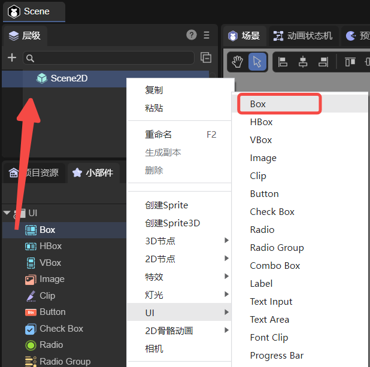
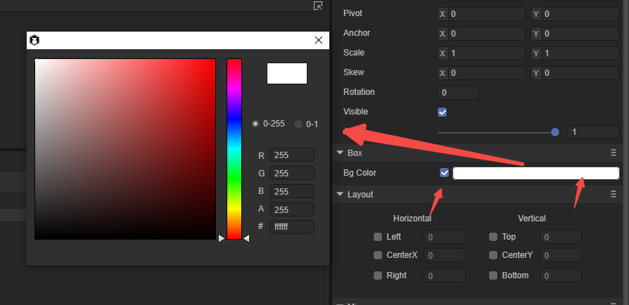

# Container component (Box)

> Author : Charley

## 1. What is a container?

The so-called container is a storage device that can contain or load items.

In the LayaAir engine, it refers to a component that is not used independently and is used to load other display objects.

> It is a common situation not to be used independently. In some cases, the container can also be used only to fill the background color, but this situation is not the real role of the container.

For example, the List container component has no meaning without its loaded rendering unit subcomponent.

Another example is the radio button group. Without the subcomponents of the radio button, the group itself will lose its meaning.

Therefore, the main function of each container is to contain or load other sub-components in order to play its unique role.

## 2. What are the containers?

The base class of container components is Box. Box itself and components inherited from Box all belong to the container.

There are a total of 9 container objects used directly by developers. As shown in the yellow highlighted part of Figure 2-1.

(Figure 2-1)

## 3. Box attributes

To create a Box, you can right-click in the `Hierarchy' window to create it, or you can drag and drop it from the `Widgets' window. As shown below:

(Figure 3-1)

Since Box inherits from the base class `UIComponent` of UI components, the properties of the parent class will not be introduced again here.

Since Box is a relatively pure container object, it has no function itself. Its function is mainly used to load other child nodes.

If the only function that can be used independently is to fill the background color.

The operation in the IDE is as shown in Figure 3-2. First check the Set background color status check box, then click the color picker input field, then pick or enter a color in the color picker window, and then close the color picker window. That’s it.

(Figure 3-2)

## 4. Differences in the use of Box and Sprite containers

Sprite and Box are both commonly used basic containers.

Since Sprite is lower level, the performance consumption of Sprite is lower than that of Box.

Without massive use, there isn't much of a difference. But in principle, performance comes first. When Sprite can be used, Sprite should of course be used first.

So when to use Box?

Since Box is a UI component, all UI components have a common feature, which is relative layout and setting data sources.

For containers, we consider whether to use Box, depending on whether there is a need for relative layout.

If there is a need for relative layout, use Box as the container, otherwise use Sprite.

