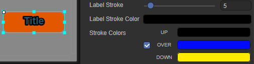

# Button component (Button)

## 1. Use Button component in LayaAir IDE

The Button component is one of the most commonly used components and can display text labels, icons, or both at the same time. The button image (skin) [resource naming](../readme.md) in LayaAir IDE is usually prefixed with btn. For an introduction to the attribute interface of the Button component, please refer to [Button API](https://layaair.com/3.x/api/Chinese/index.html?version=3.0.0&type=2D&category=UI&class=laya.ui.Button).


### 1.1 Create Button component

It is very simple to create Button using LayaAir IDE. Through the visual operation of IDE, you can realize the creation and layout of components without any programming knowledge. This is also the recommended way to create components. As shown in Figure 1-1, you can right-click in the `Hierarchy' window to create it, or you can drag and drop from the `Widgets' window to add it.


(Picture 1-1)

This process does not require any programming and can be completely left to the artist or planner to implement. This reduces communication costs with programmers and speeds up game development efficiency.


### 1.2 Button properties

The unique properties of the Button component are as follows:


(Figure 1-2)

| Properties	| Function description	|
| ---------------- | ------------------------------------------------------------ |
| toggle       	| Whether to switch the display state of the button. The default is false, and the button will return to its initial state directly after clicking it. When checked, it is true and you can click to switch the button display status. When the button component is clicked, the button will remain selected (continuously pressed) and can be restored by clicking again. |
| state number	| The number of states of the button skin, supporting single-state (1), two-state (2) and three-state (3) buttons. |
| selected     	| Whether the button is selected, the default is false. After setting to true, the button will remain selected (continuously pressed) and will not change other states (unless the state is changed in code). |
| skin         	| Button skin texture resource. After setting, you need to set the stateNum skin state number according to the skin resource. |
| sizeGrid     	| Valid scaling grid data of the bitmap (nine-square grid information): top margin, right margin, bottom margin, left margin, whether to repeat filling. |
| label        	| The text label of the button.	|
| labelFont    	| The font of the text label.	|
| labelSize    	| The font size of the text label.	|
| labelBold    	| Whether the text label is bold, the default is false.	|
| labelColors  	| The color of the text label in each state when the mouse is released (up), when the mouse moves to the element (over), and when the mouse is pressed (down). |
| labelAlign   	| Horizontal alignment mode of text label: left, center, right, the default is center alignment. |
| labelVAlign  	| Vertical alignment mode of text label: top, middle, bottom, the default is center alignment. |
| labelPadding 	| Margins for text labels. Format: top margin, right margin, bottom margin, left margin.	|
| labelStroke  	| The stroke width of the text label, in pixels. The default value is 0, which means no stroke.	|
| labelStrokeColor | The color of the text label stroke, expressed as a string. The default value is #000000 (black). |
| strokeColors 	| After checking, you can set the stroke color of the text according to the status. It can be set in three states: when the mouse is released on the element (up), when the mouse moves to the element (over), and when the mouse is pressed (down). Different stroke colors can be set in the three states. |

The following will focus on the properties of the Button component that are difficult to understand through text.

#### 1.2.1 Button skin (skin)

The skin of the button is divided into single state (1), two states (2) and three states (3) due to different cutting methods. The state here refers to the state of the button skin.

Three-state is often used in PC browsers, which divides skin pictures into three parts in equal proportions in the vertical direction. Figure 1-3 shows the button skin (button.png) that comes with LayaAir. From top to bottom: the status skin when the mouse bounces up or leaves, the status skin when the mouse passes by, and the status skin when the mouse is pressed and selected. status skin.


(Figure 1-3)

On mobile devices, only two states are usually used. The picture is cut into two parts in the vertical direction in equal proportions. The upper part is the state skin when the button is popped up or unselected, and the lower part is the skin when the button is selected and pressed. Status skin.

Single-state buttons do not cut images. No matter what the state is, the button has only one skin and remains unchanged.

#### 1.2.2 Specify the cutting state of the button skin (stateNum)

The attribute value of stateNum determines the cutting method of the skin resource image. The default value is 3, which means that by default, you press the 3-state button to cut and divide it into 3 equal parts. If it is a two-state button, you need to set the attribute value of stateNum to 2 and cut it into two parts proportionally. The singleton button is set to 1 and no cutting is performed.

What needs to be noted here is that the specified button state needs to correspond to the button skin. If it is a three-state button skin, stateNum is set to 2. After cutting, as shown in Figure 1-4, it is wrong.


(Figure 1-4)

#### 1.2.3 Set the text stroke color of the button according to the state (strokeColors)

labelStrokeColor can set a uniform color for the text stroke of the button (the color is consistent in different states). The strokeColors property can set the stroke text color of the button according to different states.

As shown in Figure 1-5, the sequence format for setting strokeColors colors is: upColor (the color of the pop-up or leaving state), overColor (the color of the passing state), downColor (the color of the pressed and selected states).



(Figure 1-5)

If you want to feel the change of stroke color more clearly, you can set the attribute values ​​such as button size, text label font size and stroke width to be larger. The effect is as shown in the animation 1-6.


(Animation 1-6)


### 1.3 Script Control Button

Sometimes, to set Button-related properties through code, you need to use scripts. In the Scene2D property settings panel, add a custom component script. Then, drag the Button component into its exposed property entry. Add the following sample code to the script file:

```typescript
const { regClass, property } = Laya;

@regClass()
export class NewScript extends Laya.Script {

	@property({ type: Laya.Button })
	public btn: Laya.Button;

	//Execute after the component is activated. At this time, all nodes and components have been created. This method is only executed once.
	onAwake(): void {
    	this.btn.scale(5, 5); //Enlarge five times
    	this.btn.skin = "atlas/comp/button.png"; //Skin
    	this.btn.stateNum = 3; //Skin status

    	this.btn.label = "OK"; //Text label
    	this.btn.labelFont = "宋体"; //Text label font
    	this.btn.labelSize = 20; //Text label font size
    	this.btn.labelBold = true; //Text label bold
    	this.btn.labelAlign = "center"; //The text label is horizontally aligned in the center

    	this.btn.labelStroke = 3; //Text label font stroke width
    	this.btn.labelStrokeColor = "#ffffff"; //Stroke color
    	this.btn.strokeColors = "#000000, #c6ff00, #001aff"; //Stroke colors in each state
    	this.btn.labelColors = "#0100ff, #16fa0e, #ff0000"; //Text color in each state

    	// this.btn.toggle = true; //Whether to keep the click state
    	// this.btn.selected = true; //Whether it is selected
	}
}
```


## 2. Button code creation

Creating a Button component using the LayaAir engine is relatively simple. It usually only requires a few steps, loading resources, creating a Button instance, adding the Button to the current scene, and finally setting the properties of the Button component. For specific implementation, please refer to the following code and comments:

```typescript
const { regClass, property } = Laya;

@regClass()
export class UI_Button extends Laya.Script {

	private COLUMNS: number = 2;
	private BUTTON_WIDTH: number = 147;
	private BUTTON_HEIGHT: number = 165 / 3;
	private HORIZONTAL_SPACING: number = 200;
	private VERTICAL_SPACING: number = 100;

	private xOffset: number;
	private yOffset: number;

	private skins: any[];

	//Execute after the component is activated. At this time, all nodes and components have been created. This method is only executed once.
	onAwake(): void {
    	//The following image resources are from the "Engine API Usage Example" project
    	this.skins = ["resources/res/ui/button-1.png", "resources/res/ui/button-2.png", "resources/res/ui/button-3.png",
        	"resources/res/ui/button-4.png", "resources/res/ui/button-5.png", "resources/res/ui/button-6.png"];

    	// Calculate the offset of Button to the center of the stage
    	this.xOffset = (Laya.stage.width - this.HORIZONTAL_SPACING * (this.COLUMNS - 1) - this.BUTTON_WIDTH) / 2;
    	this.yOffset = (Laya.stage.height - this.VERTICAL_SPACING * (this.skins.length / this.COLUMNS - 1) - this.BUTTON_HEIGHT) / 2;

    	Laya.loader.load(this.skins).then(() => {
        	this.onUIAssetsLoaded();
    	});
	}

	private onUIAssetsLoaded(e: any = null): void {
    	for (var i: number = 0, len: number = this.skins.length; i < len; ++i) {
        	var btn: Laya.Button = this.createButton(this.skins[i]);
        	var x: number = i % this.COLUMNS * this.HORIZONTAL_SPACING + this.xOffset;
        	var y: number = (i / this.COLUMNS | 0) * this.VERTICAL_SPACING + this.yOffset;
        	btn.pos(x, y);
        	console.log(x, y);
    	}
	}

	private createButton(skin: string): Laya.Button {
    	var btn: Laya.Button = new Laya.Button(skin);
    	this.owner.addChild(btn);
    	return btn;
	}
}
```

The running effect of the above code is shown in Figure 2-1:


 (Animation 2-1)


