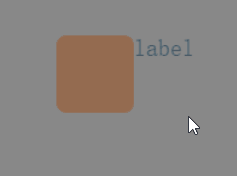

# Multiple selection box component (CheckBox)

CheckBox is a multi-select box component, inherited from Button. It consists of two parts, the selection status box and the content description label. The selection status box is an image resource, and the content description label is text. For an introduction to the property interface of the CheckBox component, please refer to [CheckBox API](https://layaair.com/3.x/api/Chinese/index.html?version=3.0.0&type=2D&category=UI&class=laya.ui.CheckBox).

## 1. Create the CheckBox component through LayaAir IDE

### 1.1 Create CheckBox

As shown in Figure 1-1, click to select the CheckBox component in the widget panel, drag it to the page editing area, or create it by right-clicking in the hierarchy window to add the CheckBox component to the page.


(Picture 1-1)

The selection state box of the CheckBox component is an image resource, usually a three-state or two-state image resource. The default skin resources are as shown below:


(Figure 1-2)


### 1.2 CheckBox attribute

The unique properties of CheckBox are as follows:


(Figure 1-3)

| **Attribute name**	| **Function description**	|
| ---------------- | ------------------------------------------------------------ |
| toggle       	| Whether to switch the display state of the component when pressed. When true, the display state can be switched by clicking. When it is false, the initial state will be restored directly after clicking. Generally do not change this attribute to false, otherwise it will never be selected |
| state number	| The number of skin states of the selection box. It supports two states and three states. The multi-select box defaults to three states. If the art resource of the multi-select box is changed to two states, the state value needs to be set to 2. Under normal circumstances, the multi-select box should have at least 2 states. In special cases, you can also use monomorphic |
| selected     	| Whether the multi-select box is selected, the default is false. After setting to true, the initial state of the multi-select box will change to remain selected |
| skin         	| The image resource of the selection box. After setting, the stateNum skin state number needs to be set according to the skin resource |
| sizeGrid     	| The nine-square grid is invalid in the CheckBox component. The actual size of the multi-select box needs to be set when creating art resources |
| label        	| Text label for checkbox	|
| labelFont    	| Font for text labels	|
| labelSize    	| Font size of text labels	|
| labelBold    	| Whether the text label is bold, the default is false	|
| labelColors  	| When the mouse moves out (up), the mouse hovers (over), and the mouse is pressed down (down), the color of the text label in each state |
| labelAlign   	| Horizontal alignment mode of text label: left, center, right, default is left aligned |
| labelVAlign  	| Vertical alignment mode of text label: top, middle, bottom, the default is top alignment |
| labelPadding 	| Margins for text labels. Format: top margin, right margin, bottom margin, left margin	|
| labelStroke  	| The stroke width of the text label, in pixels. The default value is 0, which means no stroke	|
| labelStrokeColor | The color of the text label stroke, expressed as a string, the default value is #000000 (black)	|
| strokeColors 	| After checking, you can set the stroke color of the text according to the status. It can be set in three states: mouse out (up), mouse hover (over), mouse down (down). Different stroke colors can be set in the three states |

Compared with the radio button component, the feature of the multi-select box component is that the state can be restored after selection, as shown in the animation 1-4.



(Animation 1-4)

> The remaining properties are the same as Button. Developers can understand according to the documentation of [Button Component](../Button/readme.md).


### 1.3 Script control CheckBox

In the Scene2D property settings panel, add a custom component script. Then, drag the CheckBox component into its exposed property entry. You need to add the following sample code to implement script control CheckBox:

```typescript
const { regClass, property } = Laya;

@regClass()
export class NewScript extends Laya.Script {

	@property({ type: Laya.CheckBox })
	public checkbox: Laya.CheckBox;

	//Execute after the component is activated. At this time, all nodes and components have been created. This method is only executed once.
	onAwake(): void {
    	this.checkbox.pos(300, 300);
    	// this.checkbox.selected = true;
    	this.checkbox.label = "Multiple checkbox";
    	this.checkbox.labelBold = true;
    	this.checkbox.labelSize = 30;
    	this.checkbox.labelColors = "#0100ff, #16fa0e, #ff0000"; //Text color in each state
    	this.checkbox.labelStroke = 3;
    	this.checkbox.strokeColors = "#000000, #c6ff00, #001aff"; //Stroke colors in each state
	}
}
```


## 2. Code to create CheckBox

When writing code, it is inevitable to control the UI through code, create the `UI_CheckBox` class, and set CheckBox related properties through code. The following example demonstrates how to create a CheckBox component and set its properties through code.

The sample code is as follows:

```typescript
const { regClass, property } = Laya;

@regClass()
export class UI_CheckBox extends Laya.Script {

	private COL_AMOUNT: number = 2;
	private ROW_AMOUNT: number = 3;
	private HORIZONTAL_SPACING: number = 200;
	private VERTICAL_SPACING: number = 100;
	private X_OFFSET: number = 100;
	private Y_OFFSET: number = 50;

	//Image resources come from "Engine API Usage Example"
	private skins: any[] = [
    	"resources/res/ui/checkbox (1).png",
    	"resources/res/ui/checkbox (2).png",
    	"resources/res/ui/checkbox (3).png",
    	"resources/res/ui/checkbox (4).png",
    	"resources/res/ui/checkbox (5).png",
    	"resources/res/ui/checkbox (6).png"
	];
	constructor() {
    	super();
	}

	/**
 	* Executed after the component is activated. At this time, all nodes and components have been created. This method is only executed once.
 	*/
	onAwake(): void {
    	Laya.loader.load(this.skins).then(() => {
        	this.onCheckBoxSkinLoaded();
    	});
	}

	private onCheckBoxSkinLoaded(e: any = null): void {
    	let cb: Laya.CheckBox;
    	for (let i: number = 0; i < this.COL_AMOUNT; ++i) {
        	for (let j: number = 0; j < this.ROW_AMOUNT; ++j) {
            	cb = this.createCheckBox(this.skins[i * this.ROW_AMOUNT + j]);
            	cb.selected = true;

            	cb.x = this.HORIZONTAL_SPACING * i + this.X_OFFSET;
            	cb.y += this.VERTICAL_SPACING * j + this.Y_OFFSET;

            	//Add events to the three CheckBoxes on the left so that they can switch labels
            	if (i == 0) {
                	cb.y += 20;
                	cb.on("change", this, this.updateLabel, [cb]);
                	this.updateLabel(cb);
            	}
        	}
    	}
	}

	private createCheckBox(skin: string): Laya.CheckBox {
    	let cb: Laya.CheckBox = new Laya.CheckBox(skin);
    	this.owner.addChild(cb);

    	cb.labelColors = "white";
    	cb.labelSize = 20;
    	cb.labelFont = "Microsoft YaHei";
    	cb.labelPadding = "3,0,0,5";

    	return cb;
	}

	private updateLabel(checkBox: Laya.CheckBox): void {
    	checkBox.label = checkBox.selected ? "selected" : "unselected";
	}
}
```

The running effect is shown in the following animation:


(Animation 2-1)


