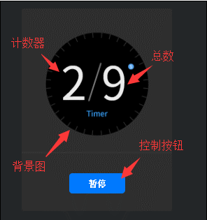

# Bitmap slice component (Clip)

The Clip component can be used to play slice animation and display a certain frame of the slice animation. Clip can divide a picture according to the number of horizontal divisions ClipX, the number of vertical divisions ClipY, or the width of each slice ClipWidth and the height of each slice ClipHeight, from left to right, top to bottom. Combined into a slice animation. For the script interface of Clip, please refer to [Clip API](https://layaair.com/3.x/api/Chinese/index.html?version=3.0.0&type=2D&category=UI&class=laya.ui.Clip).

## 1. Create Clip component through LayaAir IDE

### 1.1 Create Clip

As shown in Figure 1-1, you can right-click in the `Hierarchy' window to create it, or you can drag and drop from the `Widgets' window to add it.


(Picture 1-1)

In the created project, LayaAir will come with a resource example of the Clip component (clip_num.png), as shown in Figure 1-2.


(Figure 1-2)


### 1.2 Common properties of Clip component

The unique properties of the Clip component are as follows:


(Figure 1-3)

| **Properties** | **Function Description**	|
| ---------- | ------------------------------------------------------- |
| autoPlay | Boolean value, indicating whether to automatically play the current slice animation.	|
| clipWidth | The width of each slice when splitting image resources horizontally. (Priority higher than clipX) |
| clipHeight | The height of each slice when splitting image resources vertically. (Priority higher than clipY) |
| clipX  	| When splitting image resources horizontally, the number of equal-width cuts.	|
| clipY  	| When splitting image resources vertically, the number of equal-height cuts.	|
| index  	| The slice animation currently displays the animation frame index.	|
| interval | Playback time interval of slice animation.	|
| skin   	| Texture for slice animation.	|
| sizeGrid | Valid grid data of image resources (nine-square grid data).	|
| group  	| Load groups. After setting, resources can be managed by groups.	|

Here we use the resources that come with LayaAir to demonstrate the effects of clipWidth and clipX. As shown in the animation 1-4, the width of each number is 26, so set clipWidth to 26. At this time, adjusting the value of clipX will be invalid.


(Animation 1-4)

If clipWidth is not set and clipX is set to 10, ten numbers will be equally divided. The effect is as follows:


(Figure 1-5)


### 1.3 Script Control Clip

Sometimes, to set Clip-related properties through code, you need to use a script. In the Scene2D property settings panel, add a custom component script. Then, drag the Clip component into its exposed property entry. Here is a sample code to implement script control Clip:

```typescript
const { regClass, property } = Laya;

@regClass()
export class NewScript extends Laya.Script {

	@property({ type: Laya.Clip })
	public clip: Laya.Clip;

	//Execute after the component is activated. At this time, all nodes and components have been created. This method is only executed once.
	onAwake(): void {
    	this.clip.pos(Laya.stage.width >> 1, Laya.stage.height >> 1); // Position
    	this.clip.skin = "atlas/comp/clip_num.png"; // Skin
    	this.clip.interval = 1000; // The playback time interval of the slice animation is 1000 milliseconds
    	this.clip.clipX = 10; // Number of slices on the x-axis
    	this.clip.autoPlay = true; //Animation plays automatically
	}
}
```


## 2. Create Clip component through code

When writing code, it is inevitable to control the UI through code, create the `UI_Clip` class, and set Clip-related properties through code.

Create a counter through code and run the sample effect:


(Animation 2-1)

Example description:



(Figure 2-2)

Other properties of Clip can also be set through code. The above example demonstrates how to obtain the updated clip.clipX slice every second through a timer, and realize the function of the timer by updating the number every second. Interested readers can set the Clip by themselves through code. , create a Clip that meets the needs of your project.

> Note: The texture type of the image resource needs to be set to "Sprite Texture".

**Sample code:**

```typescript
const { regClass, property } = Laya;

@regClass()
export class UI_Clip extends Laya.Script {

	//The following resources are from "Engine API Usage Example"
	private buttonSkin: string = "resources/res/ui/button-7.png";
	private clipSkin: string = "resources/res/ui/num0-9.png";
	private bgSkin: string = "resources/res/ui/coutDown.png";

	counter: any;
	controller: any;
	currFrame: any;


	//Execute after the component is activated. At this time, all nodes and components have been created. This method is only executed once.
	onAwake(): void {
    	Laya.loader.load([this.buttonSkin, this.clipSkin, this.bgSkin]).then( ()=>{
        	this.onSkinLoaded();
    	} );
	}

	private onSkinLoaded(e: any = null): void {
    	this.showBg();
    	this.createTimerAnimation();
    	this.showTotalSeconds();
    	this.createController();
	}

	private showBg(): void {
    	var bg: Laya.Image = new Laya.Image(this.bgSkin);
    	bg.size(224, 302);
    	bg.pos(Laya.stage.width - bg.width >> 1, Laya.stage.height - bg.height >> 1);
    	this.owner.addChild(bg);
	}

	private createTimerAnimation(): void {
    	this.counter = new Laya.Clip(this.clipSkin, 10, 1);
    	this.counter.autoPlay = true;
    	this.counter.interval = 1000;
    	this.counter.x = (Laya.stage.width - this.counter.width) / 2 - 35;
    	this.counter.y = (Laya.stage.height - this.counter.height) / 2 - 40;
    	this.owner.addChild(this.counter);
	}

	private showTotalSeconds(): void {
    	var clip: Laya.Clip = new Laya.Clip(this.clipSkin, 10, 1);
    	clip.index = clip.clipX - 1;
    	clip.pos(this.counter.x + 60, this.counter.y);
    	this.owner.addChild(clip);
	}

	private createController(): void {
    	this.controller = new Laya.Button(this.buttonSkin, "Pause");
    	this.controller.labelBold = true;
    	this.controller.labelColors = "#FFFFFF,#FFFFFF,#FFFFFF,#FFFFFF";
    	this.controller.size(84, 30);

    	this.controller.on('click', this, this.onClipSwitchState);

    	this.controller.x = (Laya.stage.width - this.controller.width) / 2;
    	this.controller.y = (Laya.stage.height - this.controller.height) / 2 + 110;
    	this.owner.addChild(this.controller);
	}

	private onClipSwitchState(e: any = null): void {
    	if (this.counter.isPlaying) {
        	this.counter.stop();
        	this.currFrame = this.counter.index;
        	this.controller.label = "Play";
    	}
    	else {
        	this.counter.play();
        	this.counter.index = this.currFrame;
        	this.controller.label = "Pause";
    	}
	}
}
```


 

