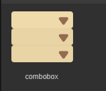
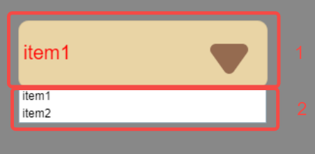
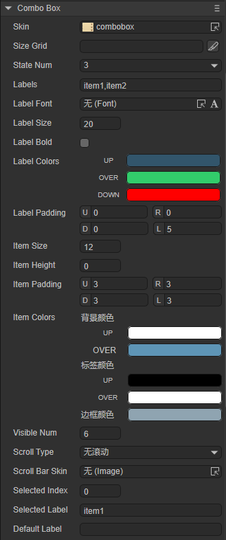
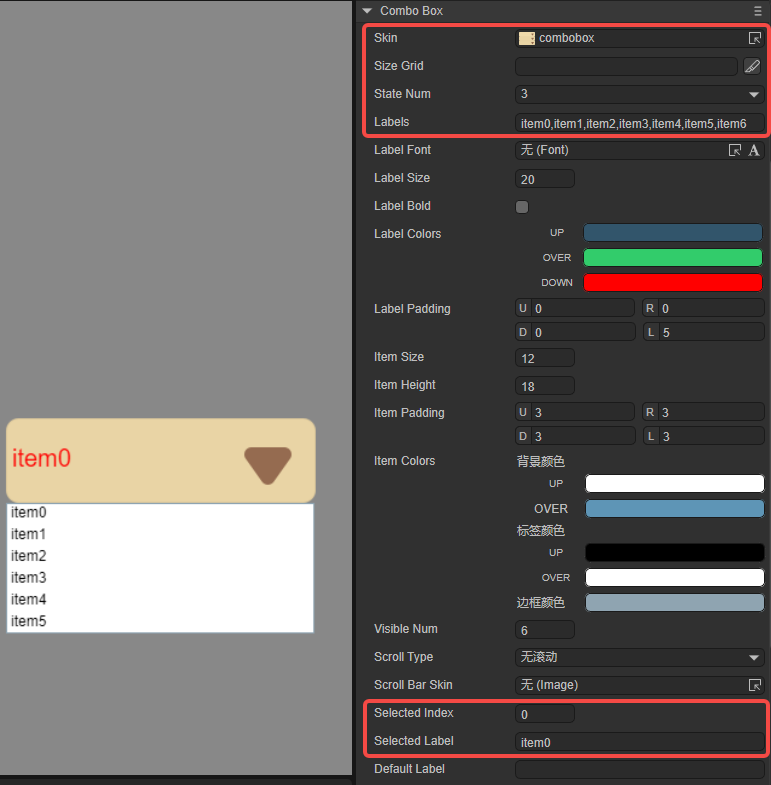
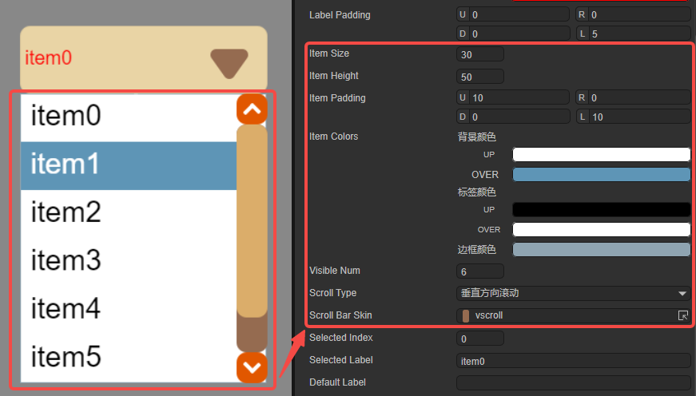
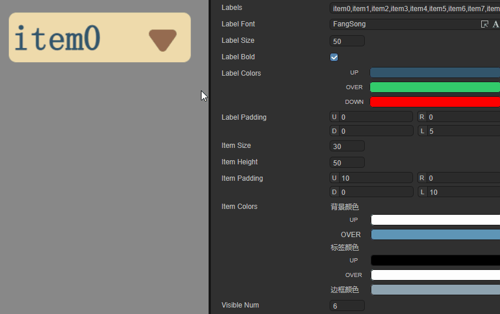
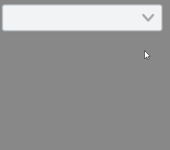

# Drop-down option box component (ComboBox)

## 1. Create ComboBox component through LayaAir IDE

ComboBox is a drop-down option box component. For the script of ComboBox, please refer to [ComboBox API](https://layaair.com/3.x/api/Chinese/index.html?version=3.0.0&type=2D&category=UI&class=laya.ui.ComboBox).

### 1.1 Create ComboBox

As shown in Figure 1-1, click to select the ComboBox component in the widget panel, drag it to the page editing area, or create it by right-clicking in the hierarchy window to add the ComboBox component to the page.


(Picture 1-1)

An example of the image resource of the ComboBox component is shown below:



(Figure 1-2)

The ComboBox component consists of **drop-down button** (upper part 1 of Figure 1-3) and **drop-down option** (lower part 2 of Figure 1-3). Clicking the drop-down button during runtime will pop up the drop-down option. In the property settings These two items are set separately.



(Figure 1-3)


### 1.2 ComboBox properties

The unique properties of ComboBox are as follows:



(Figure 1-4)

| **Properties**	| **Function description**	|
| -------------- | ------------------------------------------------------------ |
| skin       	| Component's image resource	|
| sizeGrid   	| Valid scaling grid data for component image resources (nine-square grid data)	|
| state number	| The state value of the drop-down button	|
| labels     	| The component's label text content collection string, separated by commas (English input method)	|
| labelFont  	| The font of the text in the drop-down button	|
| labelSize  	| The size of the font in the drop-down button	|
| labelBold  	| In the drop-down button, whether the text is displayed in bold	|
| labelColors	| A collection of text color values ​​in each state in the drop-down button. UP: when the mouse is released on the element (raise and move away); OVER: when the mouse moves over the element; DOWN: when the mouse is pressed |
| labelPadding | The margin of the text in the drop-down button. U: Top margin; R: Right margin; D: Bottom margin; L: Left margin |
| itemSize   	| In the drop-down options, the font size	|
| itemHeight 	| The height of the option box within the drop-down option	|
| itemPadding	| The margin of the text within the drop-down option. U: Top margin; R: Right margin; D: Bottom margin; L: Left margin |
| itemColors 	| In the drop-down options, you can set the colors of the three parts. `Background color`, UP: when the mouse is released on the element (lift and move away); OVER: when the mouse moves over the element. `Label color`, UP: when the mouse is released on the element (lift and move away); OVER: when the mouse moves over the element. `border color`, only one status color |
| visibleNum 	| The maximum number of rows that can be displayed in the list of drop-down options (maximum number of options)	|
| scrollType 	| The scrolling type of the drop-down option list can only be set: no scrolling, vertical scrolling	|
| scrollBarSkin | The scroll bar image resource of the drop-down option list, only the vertical scroll bar skin can be set	|
| selectedIndex | Represents the index of the currently selected item	|
| selectedLabell | According to the label text labels, set the default option value of the drop-down list, that is, the option displayed by the drop-down button |
| defaultLabell | When the drop-down list option value is not set (selectedIndex is -1), the text used for prompts in the drop-down button display box |

> Among them, the labelFont, labelSize, labelBold, labelColors, and labelPadding attributes are the attributes of the drop-down button, and the itemSize, itemHeight, itemPadding, itemColors, visibleNum, scrollType, and scrollBarSkin attributes are the attributes related to the drop-down option.

Use the default skin attribute, set stateNum to 3, and set the labels attribute to "item0,item1,item2,item3,item4,item5,item6,item7,item8". After setting selectedIndex to 0, selectedLablel will change to item0, and the effect is shown in Figure 1-5.



(Figure 1-5)

Since visibleNum is set to 6, up to 6 options are displayed.

Next, set the **Drop-down option** related properties, as shown in Figure 1-6. Set the font size of the drop-down option to 30, the height of the option box to 50, and set the text margin of the drop-down option to an appropriate size. The itemColors attribute remains default, and developers can observe accordingly. The item1 option is in the OVER state. Add another vertical scroll bar to display item6, item7, and item8.



(Figure 1-6)

Then set the relevant attributes of the **drop-down button**, as shown in the animation 1-7. Set the font size in the drop-down button to 50, imitate Song font and display it in bold. labelColors remain default and labelPadding is set to an appropriate size.



(Animation 1-7)


### 1.3 Script control ComboBox

In the Scene2D property settings panel, add a custom component script. Then, drag the ComboBox into its exposed property entry. You need to add the following sample code to implement script control ComboBox:

```typescript
const { regClass, property } = Laya;

@regClass()
export class NewScript extends Laya.Script {

	@property({ type: Laya.ComboBox })
	public combobox: Laya.ComboBox;

	//Execute after the component is activated. At this time, all nodes and components have been created. This method is only executed once.
	onAwake(): void {
    	this.combobox.pos(100, 100);
    	this.combobox.labels = "item0,item1,item2,item3,item4,item5,item6,item7";
    	this.combobox.labelColors = "#32556b,#32cc6b,#ff0000";
    	this.combobox.itemHeight = 60;
    	// itemColors format: "Background color when hovering or selected, label color when hovering or selected, label color, border color, background color"
    	this.combobox.itemColors = "#5e95b6,#ffffff,#000000,#ff0000,#ffffff";
    	this.combobox.selectedIndex = 1;
    	this.combobox.scrollBarSkin = "atlas/comp/vscroll.png";
	}
}
```


## 2. Create ComboBox component through code

When writing code, it is inevitable to control the UI through code, create the `UI_ComboBox` class, and set the properties related to ComboBox through code. The following example demonstrates how to set drop-down options through code and obtain the options by clicking.

**Example running effect:**



(Animation 2-1)

**Sample code:**

```typescript
const { regClass, property } = Laya;

@regClass()
export class UI_ComboBox extends Laya.Script {

	private skin: string = "resources/res/ui/combobox.png"; //Resources come from "Engine API Usage Example"
	pageWidth: number;

	constructor() {
    	super();
	}

	// Executed after the component is activated. At this time, all nodes and components have been created. This method is only executed once.
	onAwake(): void {
    	Laya.loader.load(this.skin).then(() => {
        	let ComboBox: Laya.ComboBox = new Laya.ComboBox(this.skin, "item0,item1,item2,item3,item4,item5");
        	ComboBox.labelSize = 30;
        	ComboBox.itemSize = 25
        	this.owner.addChild(ComboBox);
        	ComboBox.autoSize = true;
        	ComboBox.pos(200, 200);
    	});
	}
}
```


