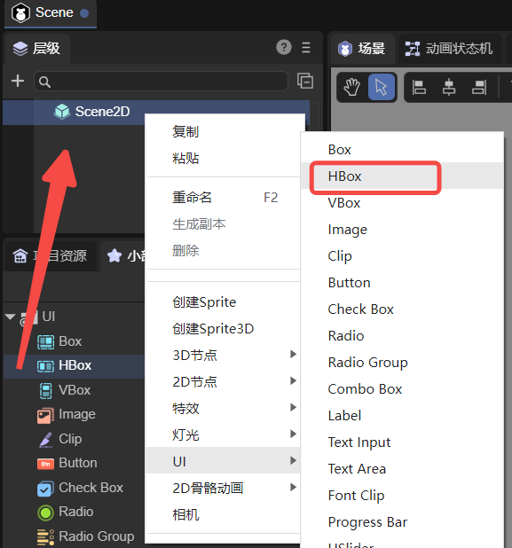
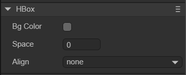
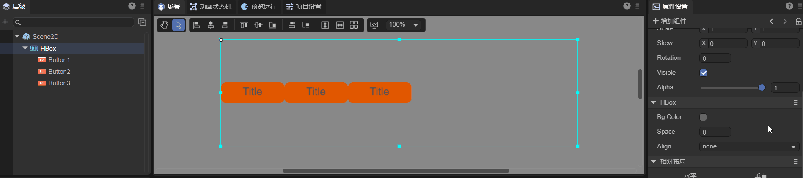
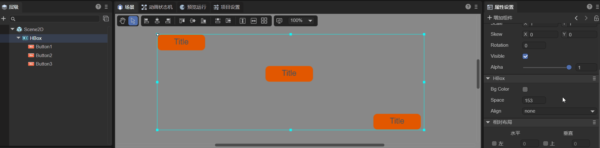

# Horizontal layout container component (HBox)

HBox is essentially a container component. All container components inherit from Box, and HBox is no exception. HBox is a container component commonly used for horizontal layout. Compared with Box, it adds more detailed functions. The detailed properties of HBox can be viewed in [API](https://layaair.com/3.x/api/Chinese/index.html?version=3.0.0&type=2D&category=UI&class=laya.ui.HBox).


## 1. Create HBox components through LayaAir IDE

### 1.1 Create HBox

HBox can be created directly in the hierarchy panel through the visual operation of the IDE, as shown in Figure 1-1. You can right-click in the 'Hierarchy' window to create it, or you can drag and drop it from the 'Widgets' window.



(Picture 1-1)


### 1.2 HBox properties

The unique properties of HBox are as follows:



(Figure 1-2)

| Properties	| Function	|
| ------- | ------------------------------------------------------------ |
| bgColor | Background color. After checking, you can directly enter the color value, for example: `#ffffff`, or you can click the color picker on the right side of the input bar to select a color |
| space | Horizontal spacing between sub-objects, in pixels.	|
| align | Vertical alignment mode of layout elements. There are four options. none: no vertical alignment, top: vertical alignment at the top, middle: vertical alignment at the center, bottom: vertical alignment at the bottom, the default is none. |

The space attribute is to set the horizontal interval between sub-objects in pixels. You can enter the number yourself, or you can enter the value by pressing and holding the left mouse button and sliding. Assume that HBox has three Button component sub-objects. The effect of adjusting the space attribute is as shown in the animation 1-3.



(Animation 1-3)

No matter how the child nodes of HBox are arranged in the IDE, they will become the corresponding vertical sorting after setting the align attribute, as shown in the animation 1-4.



(Animation 1-4)


### 1.3 Script control HBox

In the Scene2D property settings panel, add a custom component script. Then, drag the HBox into its exposed attribute entrance. Since there is only one HBox and the effect cannot be viewed, the developer can add some child nodes under the HBox. The sample code is as follows:

```typescript
const { regClass, property } = Laya;

@regClass()
export class NewScript extends Laya.Script {

	@property({ type: Laya.HBox })
	public hbox: Laya.HBox;

	//Execute after the component is activated. At this time, all nodes and components have been created. This method is only executed once.
	onAwake(): void {
    	this.hbox.pos(100, 100);
    	this.hbox.bgColor = "#ffffff";
    	this.hbox.space = 100;
    	this.hbox.align = "middle";
	}
}
```


## 2. Create HBox component through code

Sometimes, you need to manage the UI with code, and create the UI_HBox class to create HBox components. Since it doesn't make much sense to create an HBox component alone, three more Button components are created to demonstrate the effect. The sample code is as follows:

```typescript
const { regClass, property } = Laya;

@regClass()
export class UI_HBox extends Laya.Script {

	private hbox: Laya.HBox;
	private btn1: Laya.Button;
	private btn2: Laya.Button;
	private btn3: Laya.Button;

	// Button skin resources
	private skins: string = "atlas/comp/button.png";

	//Execute after the component is activated. At this time, all nodes and components have been created. This method is only executed once.
	onAwake(): void {
    	Laya.loader.load(this.skins).then(() => {
        	this.createBtn();
        	this.createHbox();
        	//Add HBox component
        	this.owner.addChild(this.hbox);
    	});
	}

	//Create Button component
	private createBtn(): void {
    	this.btn1 = new Laya.Button(this.skins);
    	this.btn2 = new Laya.Button(this.skins);
    	this.btn3 = new Laya.Button(this.skins);
	}

	//Create HBox component
	private createHbox(): void {
    	this.hbox = new Laya.HBox;
    	this.hbox.pos(100, 100);
    	this.hbox.size(600, 300);
    	this.hbox.bgColor = "#ffffff";
    	this.hbox.addChild(this.btn1);
    	this.hbox.addChild(this.btn2);
    	this.hbox.addChild(this.btn3);
    	this.hbox.space = 100;
    	this.hbox.align = "middle";
	}
}
```


