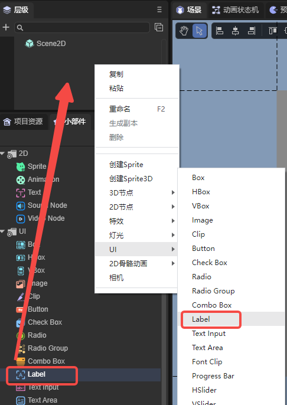
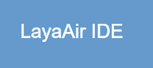
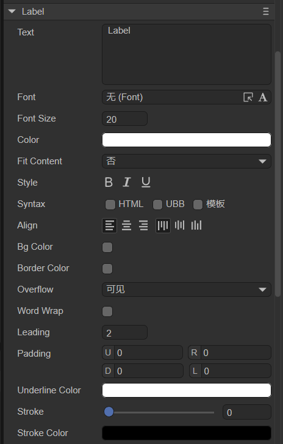

# Display text component (Label)


## 1. Create Label component through LayaAir IDE

The Label component is used to display a piece of text. For the script interface of Label component, please refer to [Label API](https://layaair.com/3.x/api/Chinese/index.html?version=3.0.0&type=2D&category=UI&class=laya.ui.Label).

### 	1.1 Create Label

As shown in Figure 1-1, you can right-click in the `Hierarchy' window to create it, or you can drag and drop from the `Widgets' window to add it.



(Picture 1-1)

After dragging the Label component into the editing area and setting the value of the text attribute to LayaAir IDE, the display effect is as follows:



(Figure 1-2)

### 1.2 Label attribute



(Figure 1-3)

| **Properties**	| Function description	|
| -------------- | ------------------------------------------------------------ |
| text       	| The actual content of the text	|
| font       	| The font name of the text, for example: `Microsoft YaHei`, here you can manually enter commonly used fonts, or it can be [bitmap font](../../advanced/useText/readme.md) |
| fontSize	| Text font size, for example: `50`, directly fill in the positive integer	|
| color      	| For the color of the text, you can directly enter the color value, for example: `#ffffff`, or you can click the color picker on the right side of the input bar to select a color |
| fit content	| No ("no"): No operation; Height and width ("yes"): The Label border can automatically adjust the height and width to the appropriate size according to the text size and quantity; Height ("height"): The Label border can only be automatically adjusted height |
| style      	| Whether "**B**" (bold) is bold, whether "***I***" (italic) is italic, whether "<u>**U**</u>" is underlined |
| syntax     	| [Multi-style mixed arrangement](../../../../2D/displayObject/Text/readme.md), supports some HTML syntax and UBB syntax. You can also check the template to be able to use variables in strings |
| align      	| Alignment, horizontal alignment (align) is left (aligned to the left), center (aligned to the center), right (aligned to the right); vertical alignment (valign) is top (aligned to the top), middle (aligned to the center), bottom (bottom alignment) |
| bgColor    	| Background color, after checking, you can directly enter the color value, for example: `#ffffff`, or you can click the color picker on the right side of the input bar to select a color |
| bordercolor	| Text border color. After checking, you can directly enter the color value, for example: `#ffffff`, or you can click the color picker on the right side of the input bar to select a color |
| overflow   	| Text overflow processing, there are five modes. visible: Default mode, no cropping is performed. hidden: Do not display characters beyond the text field. scroll: does not display character pixels outside the text area, and supports the scroll interface. shrink: When the text exceeds the text area, the text shrinks as a whole to fit in the text box. ellipsis (display ellipsis): When the text field is exceeded, the text is truncated and an ellipsis is displayed at the end of the text |
| becomeWrap	| Whether to automatically wrap lines, a Boolean option, the default is `false`, select `true` to enable automatic line wrapping |
| leading    	| Vertical line spacing, when automatic word wrapping is turned on, it is effective when the text content has multiple lines. The spacing is in pixels, just enter a positive integer |
| padding    	| Text margin, in pixels, consisting of 4 integer values. "U" represents the distance from the top border, "R" represents the distance from the right border, "D" represents the distance from the bottom border, and "L" represents the distance from the left border |
| underlinecolor | Underline color, you can enter the color value directly, for example: `#ffffff`, or you can click the color picker on the right side of the input bar to select the color |
| stroke     	| Stroke width, range is 0~100	|
| strokeColor	| For the stroke color of text, you can enter the color value directly, for example: `#ffffff`, or you can click the color picker on the right side of the input bar to select a color |

 

### 1.3 Script control Label

In the Scene2D property settings panel, add a custom component script. Then, drag the Label into its exposed property entry. Here is a sample code to implement script control of Label:

```typescript
const { regClass, property } = Laya;

@regClass()
export class LabelControl extends Laya.Script {
	//declare owner : Laya.Sprite3D;

	@property( { type : Laya.Label } )
	public lab: Laya.Label;

	constructor() {
    	super();
	}

	/**
 	* Executed after the component is activated. At this time, all nodes and components have been created. This method is only executed once.
 	*/
	onAwake(): void {
    	this.lab.pos(Laya.stage.width >> 1, Laya.stage.height >> 1); //Position
    	this.lab.size(500, 30); //Size
    	this.lab.pivot(this.lab.width/2, this.lab.height/2); //Pivot Point
    	this.lab.text = "Hello everyone, welcome to LayaAir IDE"; //Text content
    	this.lab.font = "宋体"; //Font
    	this.lab.fontSize = 50; //Font size
    	this.lab.color = "#ff0000"; //Font color
    	this.lab.bold = true; //bold
    	this.lab.italic = true; //italic
    	this.lab.underline = true; //underline
    	this.lab.underlineColor = "#ff0000"; //Underline color
    	this.lab.stroke = 5; //Stroke width
    	this.lab.strokeColor = "#000000" ; //Stroke color
    	this.lab.wordWrap = true; //Automatically wrap lines
    	this.lab.leading = 10; //vertical line spacing
    	this.lab.align = "left"; //Horizontal alignment
    	this.lab.valign = "top"; //Vertical alignment
    	this.lab.overflow = "visible"; //Text overflow
    	// this.lab.fitContent = "yes"; //Adaptive size

    	this.lab.bgColor = "#19a4f1"; //Background color
    	this.lab.borderColor = "#f6ff03" //Border color
	}

}
```


## 2. Create Label component through code

When developing a project, sometimes I don't want the Label to be on the stage at the beginning, but add it when it is needed. This needs to be created through code. In the property setting panel of Scene2D, add a custom component script, create the `UI_Label` class, and create the Label through code. Its other properties can also be set through code. The following sample code demonstrates how to create Labels of different skins (styles) through code. Developers can set Labels through code to create text effects that meet their own needs.

**Sample code:**

```typescript
const { regClass, property } = Laya;
const Label = Laya.Label;
@regClass()
export class UI_Label extends Laya.Script {

	constructor() {
    	super();
	}

	/**
 	* Executed after the component is activated. At this time, all nodes and components have been created. This method is only executed once.
 	*/
	onAwake(): void {
    	this.setup();   	 
    }

    private setup(): void {
   	 this.createLabel("#FFFFFF", null).pos(30, 50);
   	 this.createLabel("#00FFFF", null).pos(290, 50);
   	 this.createLabel("#FFFF00", "#FFFFFF").pos(30, 100);
   	 this.createLabel("#000000", "#FFFFFF").pos(290, 100);
   	 this.createLabel("#FFFFFF", "#00FFFF").pos(30, 150);
   	 this.createLabel("#0080FF", "#00FFFF").pos(290, 150);
    }

    private createLabel(color: string, strokeColor: string): Laya.Label {
   	 const STROKE_WIDTH: number = 4;

   	 var label: Laya.Label = new Label();
   	 label.font = "Microsoft YaHei";
   	 label.text = "SAMPLE DEMO";
   	 label.fontSize = 30;
   	 label.color = color;

   	 if (strokeColor) {
   		 label.stroke = STROKE_WIDTH;
   		 label.strokeColor = strokeColor;
   	 }

   	 this.owner.addChild(label);

   	 return label;
    }
}
```

**Effect preview:**


(Figure 2-1)

 	


