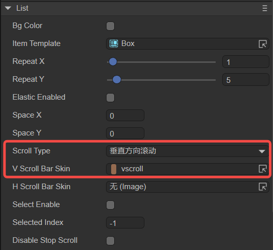
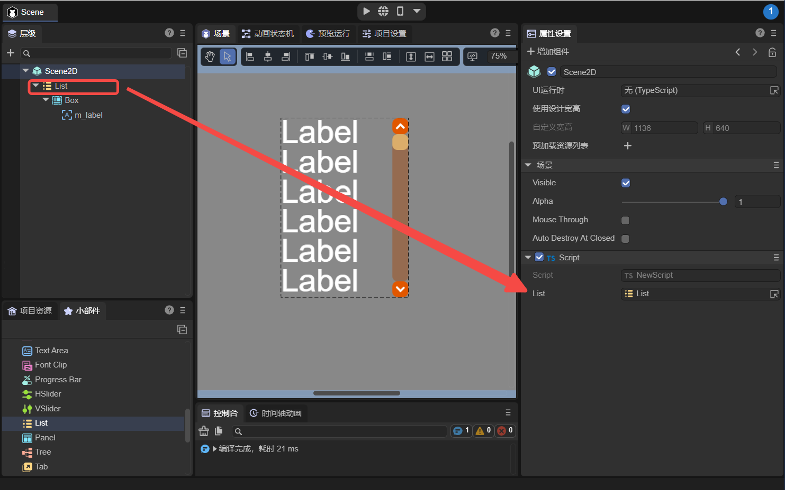

# List component (List)

The List component can display a list of items, which defaults to a vertical list. Each list of List is usually the same, and you can also use the editor to customize list content items in different styles. For the script interface of the List component, please refer to [List API](https://layaair.com/3.x/api/Chinese/index.html?version=3.0.0&type=2D&category=UI&class=laya.ui.List).

## 1. Create List component through LayaAir IDE

### 1.1 Composition of List

List usually consists of two parts: list rendering items (cells) and scroll bars.

List rendering items can be Box objects or other custom page objects, also known as sub-item templates (Item Template). Label, Image and other components can be placed in sub-item templates.

The scroll bar can be set to a vertical scroll bar, a horizontal scroll bar, or both at the same time.


### 1.2 Create List

#### 1.2.1 Add List component

As shown in Figure 1-1, you can right-click in the `Hierarchy' window to create it, or you can drag and drop from the `Widgets' window to add it.


(Picture 1-1)


#### 1.2.2 Add and specify list items of List

Here we take the Box object as an example. As shown in Figure 1-2, add a Box component under the List component and adjust the size of the Box. Then add a Label component under the Box, name it m_label, and set the display effect of the Label to make it look better.


(Figure 1-2)

Then drag the created Box node into the Item Template property of the List, as shown in Figure 1-3, so that the list item of the List is designated as the child node Box.


(Figure 1-3)


#### 1.2.3 Add scroll bar skin

Select the Scroll Type of the List property to scroll vertically. The V Scroll Bar Skin property is used to set the skin of the vertical scroll bar. Select vscroll.png from the resource panel to this property, and the scroll bar skin will be generated immediately.



(Figure 1-4)

> Note: When the Scroll Type is no scrolling, even if the scroll bar skin is set, there will be no scrolling effect at runtime.

Set Repeat Y to 6, which means that when the list item exceeds 6, it will start scrolling.


(Figure 1-5)


#### 1.2.4 Set data source

The data source must be set for the List component in code.

```typescript
const { regClass, property } = Laya;

@regClass()
export class Script extends Laya.Script {

	@property({ type: Laya.List })
	list: Laya.List

	constructor() {
    	super();
	}

	// Executed after the component is enabled, such as after the node is added to the stage
	onEnable(): void {
    	//Assign value to List object
    	var data: Array<any> = [];
    	for (var m: number = 0; m < 20; m++) {
        	data.push({ m_label: "No." + m });
    	}
    	this.list.array = data;
	}
}
```

> In the code, the name of m_label must be the same as the name of the Label component under the List item.


#### 1.2.5 Run to see the effect

Mount the script to the Scene2D scene, and then drag the List component into the properties exposed by the script, as shown in Figure 1-6.



(Figure 1-6)

The running effect is as follows:


(Animation 1-7)


#### 1.2.6 Set List effect

You can also add code to the code in 1.2.4 to set the effect of the List component. For example, hide the scroll bar, set the dragging rubber band effect, etc. Please refer to Section 1.3 for specific attributes.

```typescript
const { regClass, property } = Laya;

@regClass()
export class Script extends Laya.Script {

	@property({ type: Laya.List })
	list: Laya.List

	constructor() {
    	super();
	}

	// Executed after the component is enabled, such as after the node is added to the stage
	onEnable(): void {
    	//Assign value to List object
    	var data: Array<any> = [];
    	for (var m: number = 0; m < 20; m++) {
        	data.push({ m_label: "No." + m });
    	}
    	this.list.array = data;

    	//Set the List property effect
    	this.list.scrollType = Laya.ScrollType.Vertical;//Set the list to use vertical scrolling
    	this.list.vScrollBarSkin = "";//Hide the scroll bar skin of the list
    	this.list.elasticEnabled = true;//Set the elastic band to true
    	this.list.scrollBar.elasticBackTime = 200;//Set the rubber band rebound time. Unit is milliseconds
    	this.list.scrollBar.elasticDistance = 50;//Set the rubber band limit distance
    	// this.list.scrollBar.autoHide = true; ///Hide the scroll bar skin of the list when not scrolling (set when there is a scroll bar skin)
	}
}
```

The effect is as follows:


(Figure 1-8)


### 1.3 Common properties of List component

The unique properties of List are as follows:


(Figure 1-9)

| **Properties**	| **Function description**	|
| ----------------- | ------------------------------------------------------------ |
| bgColor       	| Background color, after checking, you can directly enter the color value, for example: `#ffffff`, or you can click the color picker on the right side of the input bar to select a color |
| itemTemplate  	| Child template, which is the rendered child of the list. This attribute specifies any child node under List as a child template, usually Box |
| repeatX       	| The maximum number of horizontal list rendering units. When the list data exceeds this value, if a horizontal scroll bar is set, the horizontal scrolling effect will be displayed |
| repeatY	| The maximum number of vertical list rendering units. When the list data exceeds this value, if a vertical scroll bar is set, the vertical scrolling effect will be displayed |
| elasticEnabled	| Whether to enable the rubber band rebound effect, the default is false	|
| spaceX        	| Spacing between cells displayed horizontally (in pixels)	|
| spaceY        	| Spacing between vertically displayed cells (in pixels)	|
| scrollType    	| Scroll type, needs to be used with the corresponding scroll bar skin. There are four types: none: no scrolling (default), horizontal: horizontal scrolling, vertical: vertical scrolling, both: both horizontal and vertical scrolling |
| vScrollBarSkin	| Vertical scroll bar skin	|
| hScrollBarSkin	| Horizontal scroll bar skin	|
| selectEnable  	| Whether it can be selected. After enabling, selecting the list rendering unit will display the selected custom option box effect |
| selectedIndex 	| The index of the selected rendering unit in the current list	|
| disableStopScroll | Disable scroll bar stopping. Used to control whether to stop the scroll bar when the array is updated. By default, the scroll bar will be stopped when updating data. When dynamically updating the cells of the List by sliding the scroll bar, setting it to true will make the list scroll smoothly |


## 2. Create List component through code

When writing code, it is inevitable to control the UI through code, create the UI_List class, and set List-related properties through code.

**Sample code:**

```typescript
const { regClass, property } = Laya;

@regClass()
export class UI_List extends Laya.Script {

	public _list: Laya.List;

	constructor() { super(); }

	onAwake(): void {
    	var list: Laya.List = new Laya.List();

    	list.itemRender = Item;
    	list.repeatX = 1;
    	list.repeatY = 4;

    	list.x = (Laya.stage.width - Item.WID) / 2;
    	list.y = (Laya.stage.height - Item.HEI * list.repeatY) / 2;

    	//Set vertical scrolling of List
    	list.scrollType = Laya.ScrollType.Vertical;
    	// Set the vertical scrolling skin of the List. If you don't set it or "", there will be no scroll bar skin.
    	list.vScrollBarSkin = "";
    	// Turn on the rubber band effect
    	list.elasticEnabled = true;
    	//Set the rubber band rebound time in milliseconds
    	list.scrollBar.elasticBackTime = 300;
    	//Set the rubber band limit distance
    	list.scrollBar.elasticDistance = 50;
    	//Set whether it can be selected
    	list.selectEnable = true;
    	list.selectHandler = new Laya.Handler(this, this.onSelect);
    	//Cell rendering processing
    	list.renderHandler = new Laya.Handler(this, this.updateItem);
    	this.owner.addChild(list);

    	//Set the data source to the path of the corresponding image
    	var data: any[] = [];
    	for (var i: number = 0; i < 10; ++i) {
        	data.push("resources/res/ui/listskins/1.jpg");
        	data.push("resources/res/ui/listskins/2.jpg");
        	data.push("resources/res/ui/listskins/3.jpg");
        	data.push("resources/res/ui/listskins/4.jpg");
        	data.push("resources/res/ui/listskins/5.jpg");
    	}
    	list.array = data;
    	this._list = list;
	}

	private updateItem(cell: Item, index: number): void {
    	cell.setImg(cell.dataSource);
	}

	private onSelect(index: number): void {
    	console.log("Currently selected index: " + index);
	}

}

class Item extends Laya.Box {
	static WID: number = 373;
	static HEI: number = 85;

	private img: Laya.Image;
	constructor() {
    	super();
    	this.size(Item.WID, Item.HEI);
    	this.img = new Laya.Image();
    	this.addChild(this.img);
	}

	setImg(src: string): void {
    	this.img.skin = src;
	}
}
```

**running result:**


(Figure 2-1)


Other properties of List can also be set through code. Interested readers can set List through code themselves to create a list that meets their own needs.


