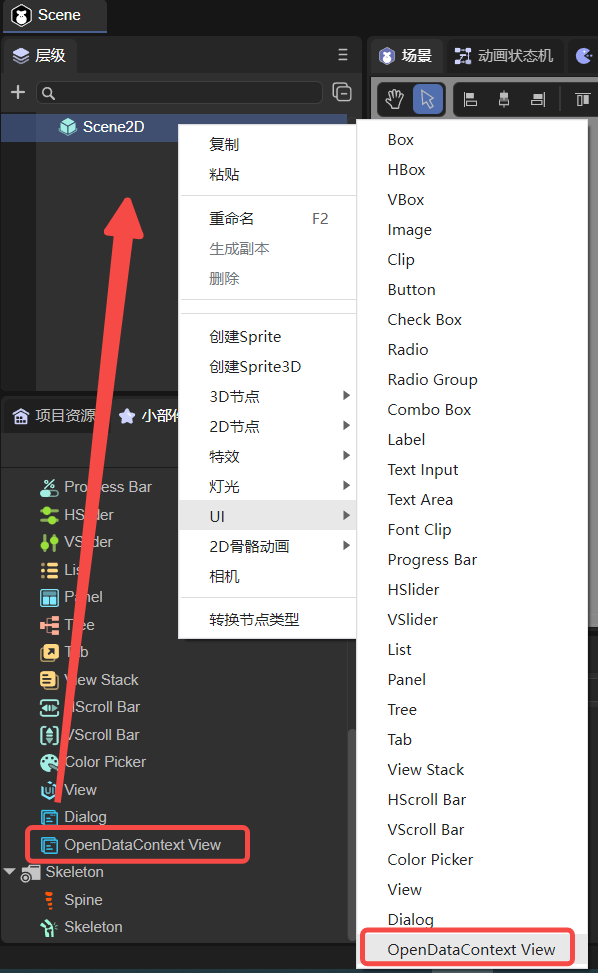
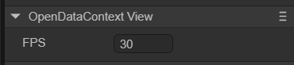

# Open data domain (OpenDataContextView)

## 1. Create OpenDataContextView in LayaAir IDE

As shown in Figure 1-1, you can right-click in the `'Hierarchy'` window to create it, or you can drag and drop from the `'Widgets'` window to add it.



(Picture 1-1)

After adding the OpenDataContextView component to the view area of ​​the scene editor, the exclusive properties of the OpenDataContextView component in the properties panel are as shown below:



(Figure 1-2)

It has only one attribute, FPS, which represents sharedCanvas (an off-screen canvas that can be accessed by both the main domain and the open data domain, see [here](https://developers.weixin.qq.com/minigame/dev/guide/open- ability/opendata/basic.html#%E5%B1%95%E7%A4%BA%E5%85%B3%E7%B3%BB%E9%93%BE%E6%95%B0%E6%8D%AE )) updated to the frame rate of the main domain.

In addition to the IDE, you can also use script code to adjust its properties. In the property settings panel of Scene2D, add a custom component script. Then, drag the OpenDataContextView into its exposed property entry. Here is a sample code to implement script control of OpenDataContextView:

```typescript
const { regClass, property } = Laya;

@regClass()
export class NewScript extends Laya.Script {
	//declare owner : Laya.Sprite3D;

	@property({ type: Laya.OpenDataContextView })
	public opendata: Laya.OpenDataContextView;

	constructor() {
    	super();
	}

	/**
 	* Executed after the component is activated. At this time, all nodes and components have been created. This method is only executed once.
 	*/
	onAwake(): void {
    	this.opendata.pos(100,100);
    	this.opendata.size(500,500);
	}
}
```


## 2. Code to create OpenDataContextView

Sometimes, you don't want the OpenDataContextView to be on the stage from the beginning, so you have to create it through code. In the property settings panel of Scene2D, add a custom component script. The sample code is as follows:

```typescript
const { regClass, property } = Laya;

@regClass()
export class NewScript extends Laya.Script {
	//declare owner : Laya.Sprite3D;

	constructor() {
    	super();
	}

	/**
 	* Executed after the component is activated. At this time, all nodes and components have been created. This method is only executed once.
 	*/
	onAwake(): void {
    	let opendata = new Laya.OpenDataContextView();
    	Laya.stage.addChild(opendata);
    	opendata.pos(100,100);
    	opendata.size(500,500);
	}
}
```


## 3. Function and effect

The open data domain is generally used to display friend rankings. It needs to be published as a WeChat mini-game, and then the WeChat developer tools can be used to see the effect. For detailed procedures, please refer to ["WeChat Mini Game"](../../../../released/miniGame/wechat/readme.md).


