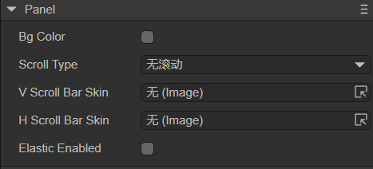
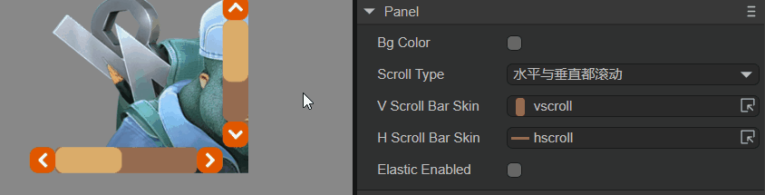

# Panel container component (Panel)

Panel is a panel container class with cropping function, which is often used to set the display area of ​​elements. You can directly add the elements to be displayed to the Panel container. The width and height of the Panel are the width and height of the elements to be displayed. The detailed properties of Panel can be viewed in [API](https://layaair.com/3.x/api/Chinese/index.html?version=3.0.0&type=2D&category=UI&class=laya.ui.Panel).


## 1. Create Panel component through LayaAir IDE

### 1.1 Create Panel

Panels can be created directly in the hierarchy panel through the visual operation of the IDE, as shown in Figure 1-1. You can right-click in the 'Hierarchy' window to create it, or you can drag and drop from the 'Widgets' window to add it.


(Picture 1-1)

Set the width and height of the Panel (for example: `200*200`). Then add child nodes to the Panel component and put a picture (`512*313`). The display effect and hierarchical structure are shown in Figure 1-2.


(Figure 1-2)

As can be seen from Figure 1-2, the inserted image is cropped, and the width and height of the final displayed image are the width and height of the Panel container (200*200). Developers can directly adjust the coordinates of the image to change its displayed content.


### 1.2 Panel properties

The unique properties of the Panel component are as follows:



(Figure 1-3)

| Properties	| Description	|
| -------------- | ------------------------------------------------------------ |
| bgColor    	| Background color, after checking, you can directly enter the color value, for example: `#ffffff`, or you can click the color picker on the right side of the input bar to select a color |
| scrollType 	| Scroll type, options are: no scrolling, horizontal scrolling, vertical scrolling, both horizontal and vertical scrolling. Different scroll types require corresponding scroll bar skins |
| vScrollBarSkin | Vertical scroll bar skin, not set by default. Scroll bar skin resources must comply with [resource naming rules](../readme.md) |
| hScrollBarSkin | Horizontal scroll bar skin, not set by default. Scroll bar skin resources must comply with [resource naming rules](../readme.md) |
| elasticEnabled | Whether to use the rubber band rebound effect, the default is false	|

To set scroll bars for the Panel component, you can set only the vertical scroll bar VScrollBarSkin, only the horizontal scroll bar HScrollBarSkin, or both.

If you only set the vertical scroll bar, you need to set the ScrollType to vertical scrolling; if you set only the horizontal scroll bar, you need to set the ScrollType to horizontal scrolling; if you set both, you need to set the ScrollType to both horizontal and vertical scrolling. scroll.

**Except the List component, Panel is the only container component that can set scroll bars**. The effect of setting both horizontal and vertical scrolling on the Panel is as follows:



(Animation 1-4)

After the rubber band rebound effect ElasticEnabled is turned on, when the slider scrolls to the boundary, the slider will continue to scroll for a certain distance and then rebound. The rubber band effect is shown in the animation 1-5, which can increase the smoothness of scrolling and user experience.


(Animation 1-5)


### 1.3 Script Control Panel

In the Scene2D property settings panel, add a custom component script. Then, drag the Panel component into its exposed property entrance. Since there is only one Panel component and the effect cannot be viewed, the developer can add some child nodes under the Panel. You need to add the following sample code to implement script control Panel:

```typescript
const { regClass, property } = Laya;

@regClass()
export class NewScript extends Laya.Script {

	@property({ type: Laya.Panel })
	public panel: Laya.Panel;

	//Execute after the component is activated. At this time, all nodes and components have been created. This method is only executed once.
	onAwake(): void {
    	this.panel.pos(100, 100);
    	this.panel.size(200, 200);
    	this.panel.scrollType = Laya.ScrollType.Both; //Scroll type: both horizontal and vertical scrolling
    	this.panel.vScrollBarSkin = "atlas/comp/vscroll.png";
    	this.panel.hScrollBarSkin = "atlas/comp/hscroll.png";
    	this.panel.elasticEnabled = true; //Rubber band effect
	}
}
```


## 2. Create Panel component through code

In addition to the direct visual operations in the UI interface, Panel components are also very simple to create in code. Create the UI_Panel class and implement the code to create the Panel component. The sample code is as follows:

```typescript
const { regClass, property } = Laya;

@regClass()
export class UI_Panel extends Laya.Script {

	constructor() {
    	super();
	}

	// Executed after the component is activated. At this time, all nodes and components have been created. This method is only executed once.
	onAwake(): void {
    	//Create Panel component
    	let panel: Laya.Panel = new Laya.Panel();
    	panel.hScrollBarSkin = "atlas/comp/hscroll.png";
    	panel.size(600, 275);
    	panel.pos(150, 150);
    	this.owner.addChild(panel);

    	//Create an Image component as a child node of Panel
    	let img: Laya.Image;
    	for (var i: number = 0; i < 4; i++) {
        	//Create 4 Images and arrange them horizontally
        	img = new Laya.Image("atlas/comp/image.png");
        	img.x = i * 512;
        	panel.addChild(img);
    	}
	}
}
```

The effect is shown in the following animation:


(Animation 2-1)


