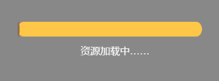

# Progress bar component (ProgressBar)

## 1. Create the ProgressBar component through LayaAir IDE

ProgressBar is often used to display the progress of an operation in the game, such as the progress of loading resources, character experience or blood volume. The script interface of ProgressBar refers to [API](https://layaair.com/3.x/api/Chinese/index.html?version=3.0.0&type=2D&category=UI&class=laya.ui.ProgressBar).

### 1.1 Create ProgressBar

As shown in Figure 1-1, you can right-click in the `Hierarchy' window to create it, or you can drag and drop from the `Widgets' window to add it.


(Picture 1-1)

The ProgressBar component consists of two parts: the base image `progress.png` and the progress `progress$bar.png`. The resource example is shown in Figure 1-2.


(Figure 1-2)

The effect of the ProgressBar component created by LayaAir by default is as shown below:


(Figure 1-3)


### 1.2 ProgressBar property

The unique properties of ProgressBar are as follows:


(Figure 1-4)

| **Properties** | **Function Description**	|
| -------- | ---------------------------------------------- |
| skin 	| Basemap resource for progress bar	|
| sizeGrid | Valid scaling grid data of the progress bar basemap resource (nine-square grid data) |
| value	| The progress value of the progress bar, ranging from 0 to 1	|

After setting the attribute value of the ProgressBar component to 0.3, the display effect is as follows:


(Figure 1-5)


### 1.3 Script control ProgressBar

Sometimes, the progress of the loading process needs to be displayed in the form of a progress bar, which needs to be controlled by script code.

In the Scene2D property settings panel, add a custom component script. Then, drag the ProgressBar into its exposed property entry. Add another Text component to describe the loading progress. The following sample code needs to be added:

```typescript
const { regClass, property } = Laya;

@regClass()
export class NewScript extends Laya.Script {

	@property({ type: Laya.ProgressBar })
	public progressBar: Laya.ProgressBar;

	@property({ type: Laya.Text })
	public loadText: Laya.Text;

	//Execute after the component is activated. At this time, all nodes and components have been created. This method is only executed once.
	onAwake(): void {
    	this.progressBar.value = 0.01; //Initial progress value
    	this.loadText.text = "Resource loading...";
    	//Test loading effect
    	Laya.timer.loop(100, this, this.changeProgress);
	}

	//This only simulates the loading demonstration effect
	changeProgress(): void {
    	this.progressBar.value += 0.05; //The amount of change of the progress bar each time
    	if (this.progressBar.value == 1) {
        	this.loadText.text = "Resource loading completed";
        	Laya.timer.clear(this, this.changeProgress);
    	}
	}
}
```

The effect is as follows:



(Animation 1-6)


## 2. Create ProgressBar through code

When developing a project, it is inevitable to create the UI through code, create the UI_ProgressBar class, and set the ProgressBar-related properties through code. The sample code is as follows:

```typescript
const { regClass, property } = Laya;

@regClass()
export class UI_ProgressBar extends Laya.Script {

	private progressBar: Laya.ProgressBar;

	constructor() {
    	super();
	}

	onAwake(): void {
    	// Load progress bar resources, image resources come from "Engine API Usage Example"
    	Laya.loader.load(["resources/res/ui/progressBar.png", "resources/res/ui/progressBar$bar.png"]).then(() => {
        	//Create progress bar
        	this.progressBar = new Laya.ProgressBar("resources/res/ui/progressBar.png");
        	this.progressBar.pos(100, 500);
        	this.progressBar.width = 400;
        	this.progressBar.sizeGrid = "5,5,5,5";
        	this.progressBar.changeHandler = new Laya.Handler(this, this.onChange);
        	this.owner.addChild(this.progressBar);
        	Laya.timer.loop(100, this, this.changeValue);
    	});
	}

	// Simulate progress bar loading
	private changeValue(): void {
    	if (this.progressBar.value >= 1)
        	this.progressBar.value = 0;
    	this.progressBar.value += 0.05;
	}

	private onChange(value: number): void {
    	//Console printout progress
    	console.log("Progress: " + Math.floor(value * 100) + "%");
	}
}
```

The sample effect is as follows:


(Animation 2-1)

Other properties of ProgressBar can also be set through code. The above example demonstrates how to create a ProgressBar through code. Interested developers can set the ProgressBar through code and create a progress bar that meets their own needs.

