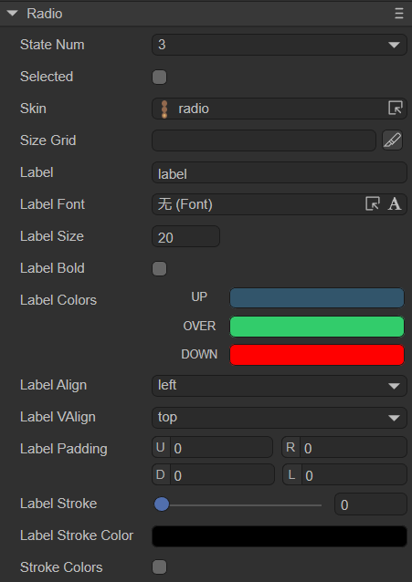

# Radio button component (Radio)

Radio inherits from Button, and many of its properties are also inherited from Button, so I won’t go into detail here about what was introduced in Button earlier. For detailed usage of Radio, please refer to [Radio API](https://layaair.com/3.x/api/Chinese/index.html?version=3.0.0&type=2D&category=UI&class=laya.ui.Radio).


## 1. Create Radio components through LayaAir IDE

### 1.1 Create Radio

It is very simple to create Radio using LayaAir IDE. Through the visual operation of IDE, you can realize the creation and layout of components, which is also the recommended way to create components. You can create it by right-clicking on the hierarchy panel, or you can select the Radio component in the widget panel and drag and drop to add it, as shown in Figure 1-1.


(Picture 1-1)


### 1.2 Radio attribute

The unique properties of the Radio component are as follows:



(Figure 1-2)

| Properties	| Function description	|
| ---------------- | ------------------------------------------------------------ |
| state number	| The number of states of the radio button skin, supporting single state (1), two states (2) and three states (3)	|
| selected     	| Whether the radio button is selected, the default is false. After setting to true, the radio button will remain selected (continuously selected) and will not change other states (unless the state is changed in the code) |
| skin         	| The skin texture resource of the radio button. After setting, you need to set the stateNum skin state number according to the skin resource |
| sizeGrid     	| Valid scaling grid data of bitmap (nine-square grid information): top margin, right margin, bottom margin, left margin, whether to repeat filling |
| label        	| Text label for radio button	|
| labelFont    	| Font for text labels	|
| labelSize    	| Font size of text labels	|
| labelBold    	| Whether the text label is bold, the default is false	|
| labelColors  	| The color of the text label in each state when the mouse is released (up), when the mouse moves to the element (over), and when the mouse is pressed (down) |
| labelAlign   	| Horizontal alignment mode of text label: left, center, right, default is left aligned |
| labelVAlign  	| Vertical alignment model of text label: top, middle, bottom, the default is top alignment |
| labelPadding 	| Margins for text labels. Format: top margin, right margin, bottom margin, left margin	|
| labelStroke  	| The stroke width of the text label, in pixels. The default value is 0, which means no stroke	|
| labelStrokeColor | The color of the text label stroke, expressed as a string, the default value is #000000 (black)	|
| strokecolors 	| After checking, you can set the stroke color of the text according to the status. It can be set in three states: when the mouse is released on the element (up), when the mouse moves to the element (over), and when the mouse is pressed (down). Different stroke colors can be set in the three states |

Radio inherits from Button and is a radio button component. Compared with the button component, the characteristic of the radio button component is that the state will not be restored after clicking, as shown in the animation 1-3.


(Animation 1-3)

> The remaining properties are the same as Button. Developers can understand according to the documentation of [Button Component](../Button/readme.md).


### 1.3 Script control Radio

In the Scene2D property settings panel, add a custom component script. Then, drag the Radio component into its exposed property entry. You need to add the following sample code to implement script control of Radio:

```typescript
const { regClass, property } = Laya;

@regClass()
export class NewScript extends Laya.Script {

	@property({ type: Laya.Radio })
	public radio: Laya.Radio;

	//Execute after the component is activated. At this time, all nodes and components have been created. This method is only executed once.
	onAwake(): void {
    	this.radio.skin = "atlas/comp/radio.png"; //Skin
    	this.radio.stateNum = 3; //skin status

    	this.radio.label = "OK"; //Text label
    	this.radio.labelFont = "宋体"; //Text label font
    	this.radio.labelSize = 20; //Text label font size
    	this.radio.labelBold = true; //Text label bold
    	this.radio.labelVAlign = "middle"; //Text label vertically aligned in the center

    	this.radio.labelStroke = 3; //Text label font stroke width
    	this.radio.labelStrokeColor = "#ffffff"; //Stroke color
    	this.radio.strokeColors = "#000000, #c6ff00, #001aff"; //Stroke colors in each state
    	this.radio.labelColors = "#0100ff, #16fa0e, #ff0000"; //Text color in each state

    	// this.radio.selected = true; //Whether it is selected
	}
}
```


## 2. Create Radio component through code

When writing code, it is inevitable to control the UI through code, create the `UI_Radio` class, and set Radio-related properties through code. The following example demonstrates how to create a Radio component and set its properties through code.

The sample code is as follows:

```typescript
const { regClass, property } = Laya;

@regClass()
export class UI_Radio extends Laya.Script {

	constructor() {
    	super();
	}

	// Executed after the component is activated. At this time, all nodes and components have been created. This method is only executed once.
	onAwake(): void {
    	let radio: Laya.Radio = new Laya.Radio();
    	radio.pos(200, 200);
    	radio.size(160, 64);
    	radio.stateNum = 3;
    	radio.selected = false;
    	radio.skin = "atlas/comp/radio.png";
    	radio.label = "LayaAir";
    	radio.labelSize = 20;
    	radio.labelBold = true;
    	radio.labelVAlign = "top";
    	this.owner.addChild(radio);
	}
}
```

The effect is shown in the animation 2-1:


(Animation 2-1)


