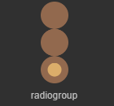

# Radio group component (RadioGroup)

RadioGroup is a radio button button group. The component options within the button group are mutually exclusive. The user can only select one radio button (Radio) component at a time, as shown in animation 1.


(Animation 1)

The difference between Radio and RadioGroup is that Radio is a radio button, and RadioGroup can add radio buttons by modifying the labels attribute. For detailed usage of the RadioGroup component, please refer to [RadioGroup API](https://layaair.com/3.x/api/Chinese/index.html?version=3.0.0&type=2D&category=UI&class=laya.ui.RadioGroup).


## 1. Create RadioGroup component through LayaAir IDE

### 1.1 Create RadioGroup

As shown in Figure 1-1, click to select the RadioGroup component in the widget panel, drag and drop it into the page editing area, or create it by right-clicking in the hierarchy window to add the RadioGroup component to the page.


(Picture 1-1)

The default skin resources of the RadioGroup component are as shown below:



(Figure 1-2)

> The skin of the RadioGroup component cannot use the nine-square grid attribute, so the actual application size must be determined during resource design.


### 1.2 RadioGroup properties

The unique properties of RadioGroup are as follows:


(Figure 1-3)

| Properties	| Function description	|
| ---------------- | ------------------------------------------------------------ |
| bgColor      	| The background color of the radio button group. After checking, you can directly enter the color value, for example: `#ffffff`, or you can click the color picker on the right side of the input bar to select a color |
| skin         	| The skin texture resource of the radio button. After setting, you need to set the stateNum skin state number according to the skin resource |
| state number	| The number of states of the radio button skin, supporting single state (1), two states (2) and three states (3)	|
| labels       	| A collection of text labels for the radio button group. The number of radio button boxes in the radio button group can be determined based on the number of text labels |
| space        	| Spacing between radio button boxes, in pixels	|
| direction    	| The arrangement direction of radio button boxes. There are two types: vertical (vertical arrangement) and horizontal (horizontal arrangement) |
| selectedIndex	| Select index, default is -1. Once set, the radio button will remain selected. The number of indexes will dynamically change based on the number of labels (number of radio button boxes) |
| labelFont    	| Font for text labels	|
| labelSize    	| Font size of text labels	|
| labelBold    	| Whether the text label is bold, the default is false	|
| labelColors  	| The color of the text label in each state when the mouse is released (up), when the mouse moves to the element (over), and when the mouse is pressed (down) |
| labelStroke  	| The stroke width of the text label, in pixels. The default value is 0, which means no stroke	|
| labelStrokeColor | The color of the text label stroke, expressed as a string, the default value is #000000 (black)	|
| labelAlign   	| Horizontal alignment mode of text label: left, center, right, default is left aligned |
| labelPadding 	| Margins for text labels. Format: top margin, right margin, bottom margin, left margin	|
| strokecolors 	| After checking, you can set the stroke color of the text according to the status. It can be set in three states: when the mouse is released on the element (up), when the mouse moves to the element (over), and when the mouse is pressed (down). Different stroke colors can be set in the three states |

You can increase the number of radio button boxes by setting the labels attribute. As shown in the animation 1-4, there are only two radio button boxes in the default radio button group. If you want to add a radio button, just add a new label in the labels attribute, and modify the content of the text label also set in this attribute.


(Animation 1-4)

You can also change the layout direction and spacing of the radio group RadioGroup. The default layout of RadioGroup is horizontal (horizontal). By changing the direction attribute, vertical layout (vertical) is achieved. Setting the spacing can be achieved through the space attribute, as shown in Figure 1-5.


(Figure 1-5)

To set the default selected options of the radio group RadioGroup, you need to set it through the selectedIndex attribute. This property changes the index value of the radio button group. When the default setting is -1, no option box is selected. Set to 0 for the 1st radio button, 1 for the 2nd...and so on. Assume that when the attribute value is set to 1, the effect is as shown in Figure 1-6.


(Figure 1-6)


### 1.3 Script control RadioGroup

In the Scene2D property settings panel, add a custom component script. Then, drag the RadioGroup into its exposed property entry. You need to add the following sample code to implement script control of RadioGroup:

```typescript
const { regClass, property } = Laya;

@regClass()
export class NewScript extends Laya.Script {

	@property({ type: Laya.RadioGroup })
	public radiogroup: Laya.RadioGroup;

	//Execute after the component is activated. At this time, all nodes and components have been created. This method is only executed once.
	onAwake(): void {
    	this.radiogroup.pos(100, 100);
    	this.radiogroup.labels = "label0,label1,label2";
    	this.radiogroup.space = 20;
    	this.radiogroup.selectedIndex = 0;
    	this.radiogroup.direction = "vertical";
	}
}
```


## 2. Create a custom RadioGroup component

In the previous section, the same radio button resource was used, and three radio button boxes were generated by setting labels in RadioGroup. However, in actual games, there are different requirements for radio button styles in the same RadioGroup component, so this requirement cannot be fulfilled by setting labels. At this time, you need to use a custom RadioGroup component. Here are the specific steps:


### 2.1 Prepare art resources

Use three different Raido radio button art resources to form a custom RadioGroup component. The resources are shown in Figure 2-1.


(Figure 2-1)

**Tips**：

Pay special attention to the naming rules of skin pictures here. In the custom RadioGroup component, you cannot use `RadioGroup` or `RadioGroup_` as the prefix. Because the Radio radio button component is used as its child component, the image resource in this example is named with the `radio_` prefix.


### 2.2 Create Radio component in IDE

Copy the resources to the resource folder of the project, and then in the IDE, drag the Radio components to the scene editor one by one, from left to right (or from top to bottom). Then modify the name attribute of each Radio component to "item0, item1, item2..." in order (if the name attribute is not added according to this rule, the generated RadioGroup component will be an invalid component and cannot run normally) .

After setting the skin, text, size, position and other properties of each Radio component, the effect is as shown in Figure 2-2.


(Figure 2-2)


### 2.3 Convert to RadioGroup container

After modifying the sub-item properties, select all sub-components, right-click to bring up the settings panel, click `Convert to Container->RadioGroup`, and finally convert to the RadioGroup container type, the steps are shown in the animation 2-3.


(Animation 2-3)

After the conversion is successful, as shown in Figure 2-4, you need to ensure that the value of the skin attribute of RadioGroup is empty. In this way, the three radio button styles in the same RadioGroup component are all different.


(Figure 2-4)

Developers can also adjust the properties of the RadioGroup component, and the final effect is as shown in the following animation:


(Animation 2-5)


## 3. Create RadioGroup through code

When writing code, it is inevitable to control the UI through code, create the `UI_RadioGroup` class, and set RadioGroup-related properties through code. The sample code is as follows:

```typescript
const { regClass, property } = Laya;

@regClass()
export class UI_RadioGroup extends Laya.Script {

	private SPACING: number = 150;
	private X_OFFSET: number = 200;
	private Y_OFFSET: number = 80;

	private skins: any[];

	constructor() {
    	super();
	}

	// Executed after the component is activated. At this time, all nodes and components have been created. This method is only executed once.
	onAwake(): void {
    	this.skins = ["resources/res/ui/radioButton (1).png", "resources/res/ui/radioButton (2).png", "resources/res/ui/radioButton (3).png"];
    	Laya.loader.load(this.skins).then(() => {
        	this.onLoadComplete();
    	});
	}

	private onLoadComplete(e: any = null): void {
    	for (let i: number = 0; i < this.skins.length; ++i) {
        	let rg: Laya.RadioGroup = this.createRadioGroup(this.skins[i]);
        	rg.selectedIndex = i;
        	rg.x = i * this.SPACING + this.X_OFFSET;
        	rg.y = this.Y_OFFSET;
    	}
	}

	private createRadioGroup(skin: string): Laya.RadioGroup {
    	let rg: Laya.RadioGroup = new Laya.RadioGroup();
    	rg.skin = skin;
    	rg.space = 70;
    	rg.direction = "vertical";
    	rg.labels = "Item1, Item2, Item3";
    	rg.labelColors = "#787878,#d3d3d3,#FFFFFF";
    	rg.labelSize = 20;
    	rg.labelBold = true;
    	rg.selectHandler = new Laya.Handler(this, this.onSelectChange);
    	this.owner.addChild(rg);
    	return rg;
	}

	private onSelectChange(index: number): void {
    	console.log("You selected the " + (index + 1) + " item");
	}

}
```

The effect is as shown in the figure:


(Figure 3-1)


