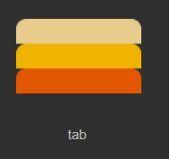

# Navigation label group component (Tab)

Tab is a navigation label group component, which is used to define a tab button group, such as multi-page switching display. The effect is shown in animation 1. For detailed attributes of Tab, please refer to [Tab API](https://layaair.com/3.x/api/Chinese/index.html?version=3.0.0&type=2D&category=UI&class=laya.ui.Tab).


(Animation 1)


## 1. Create Tab component through LayaAir IDE

### 1.1 Create Tab

It is very simple to create Tab using LayaAir IDE. Through the visual operation of IDE, you can realize the creation and layout of components, which is also the recommended way to create components. You can create it by right-clicking on the hierarchy panel, or you can select the Tab component in the widget panel and drag and drop to add it, as shown in Figure 1-1.


(Picture 1-1)

The skin of the Tab component is generally a vertically divided two-state diagram or a three-state diagram. The default skin resource is three-state, as shown in Figure 1-2.



(Figure 1-2)

> Note: The skin of the Tab component cannot use the nine-square grid attribute, so the actual application size must be determined during resource design.


### 1.2 Tab attribute

The unique properties of the Tab component are as follows:


(Figure 1-3)

| Properties	| Description	|
| ---------------- | ------------------------------------------------------------ |
| bgColor      	| Background color, after checking, you can directly enter the color value, for example: `#ffffff`, or you can click the color picker on the right side of the input bar to select a color |
| skin         	| The component's skin texture resource. After setting, you need to set the stateNum skin state number according to the skin resource |
| state number	| The number of states of the component skin, supporting single state (1), two states (2) and three states (3)	|
| labels       	| Collection of text tags, separated by commas (English input method). The number of labels in the navigation label group can be determined based on the number of text labels |
| space        	| The space between labels, in pixels	|
| direction    	| The arrangement direction of navigation labels. There are two types: vertical (vertical arrangement) and horizontal (horizontal arrangement) |
| selectedIndex	| Select index, default is 0. Once set, the navigation label remains selected. The number of indexes will dynamically change based on the number of labels (number of labels) |
| labelFont    	| Font for text labels	|
| labelSize    	| Font size of text labels	|
| labelBold    	| Whether the text label is bold, the default is false	|
| labelColors  	| When the mouse moves out (up), the mouse hovers (over), and the mouse is pressed down (down), the color of the text label in each state |
| labelStroke  	| The stroke width of the text label, in pixels. The default value is 0, which means no stroke	|
| labelStrokeColor | The color of the text label stroke, expressed as a string, the default value is #ffffff (white)	|
| labelAlign   	| Horizontal alignment mode of text label: left, center, right	|
| labelPadding 	| Margins for text labels. Format: top margin, right margin, bottom margin, left margin	|
| strokeColors 	| After checking, you can set the stroke color of the text according to the status. It can be set in three states: mouse out (up), mouse hover (over), mouse down (down). Different stroke colors can be set in the three states |

The Tab component can add labels through labels, as shown in the animation 1-4. There are only two labels in the default Tab component. If you want to add labels, just add them in the labels attribute, and modify the text content in the labels also set in this attribute.


(Animation 1-4)

To change the layout direction and spacing of the Tab component, you can set it by changing the direction attribute. The default is horizontal layout (horizontal), and the vertical layout is vertical. Setting the spacing between labels can be achieved through the space attribute. The operation is shown in the animation 1-5.


(Animation 1-5)

Setting the default options of Tab can be achieved through the selectedIndex attribute. The selectedIndex attribute is used to change the index value of the Tab component. When it is not set by default, no option is selected. 0 is the first tab, 1 is the second tab...and so on. The effect is shown in the animation 1-6.


(Animation 1-6)


### 1.3 Script control Tab

In the Scene2D property settings panel, add a custom component script. Then, drag the Tab component into its exposed property entry. You need to add the following sample code to implement script control Tab:

```typescript
const { regClass, property } = Laya;

@regClass()
export class NewScript extends Laya.Script {

	@property({ type: Laya.Tab })
	public tab: Laya.Tab;

	//Execute after the component is activated. At this time, all nodes and components have been created. This method is only executed once.
	onAwake(): void {
    	this.tab.pos(200, 200);
    	this.tab.labelBold = true;
    	this.tab.labelSize = 20;
    	this.tab.labelStrokeColor = "#000000";
    	this.tab.labels = "Tab 1,Tab 2,Tab 3";
    	this.tab.labelColors = "#32556b,#8FB299,#ff0000";
    	this.tab.selectedIndex = -1;
	}
}
```


## 2. Create Tab component through code

When writing code, it is inevitable to control the UI through code, create the `UI_Tab` class, and set Tab-related attributes through code. The following example demonstrates how to create a Tab component and set its properties through code.

The sample code is as follows:

```typescript
const { regClass, property } = Laya;

@regClass()
export class UI_Tab extends Laya.Script {

    //Image resources come from "Engine API Usage Example"
	private skins: any[] = ["resources/res/ui/tab1.png", "resources/res/ui/tab2.png"];

	constructor() {
    	super();
	}

	// Executed after the component is activated. At this time, all nodes and components have been created. This method is only executed once.
	onAwake(): void {
   	 Laya.loader.load(this.skins).then( ()=>{
        	this.onLoadComplete();
    	} );
    }

    private onLoadComplete(e: any = null): void {
   	 let tabA: Laya.Tab = this.createTab(this.skins[0]);
   	 tabA.pos(40, 120);
   	 tabA.labelColors = "#000000,#d3d3d3,#333333";

   	 let tabB: Laya.Tab = this.createTab(this.skins[1]);
   	 tabB.pos(40, 220);
   	 tabB.labelColors = "#FFFFFF,#8FB299,#FFFFFF";
    }

    private createTab(skin: string): Laya.Tab {
   	 let tab: Laya.Tab = new Laya.Tab();
   	 tab.skin = skin;
   	 tab.labelBold = true;
   	 tab.labelSize = 20;
   	 tab.labelStrokeColor = "#000000";
   	 tab.labels = "Tab Control 1,Tab Control 2,Tab Control 3";
   	 tab.selectedIndex = 1;
   	 this.onSelect(tab.selectedIndex);
   	 tab.selectHandler = new Laya.Handler(this, this.onSelect);
   	 this.owner.addChild(tab);
   	 return tab;
    }

    private onSelect(index: number): void {
   	 console.log("The currently selected tab index is " + index);
    }
}
```

The running effect is shown in the following animation:


(Animation 2-1)


