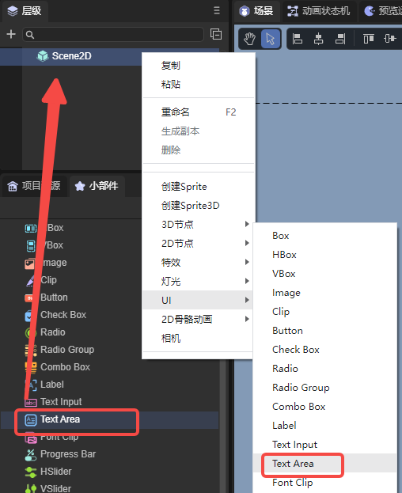
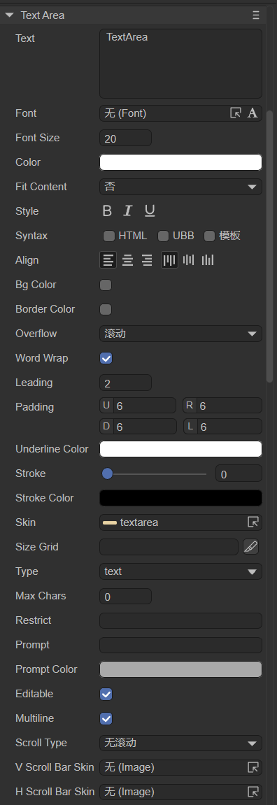
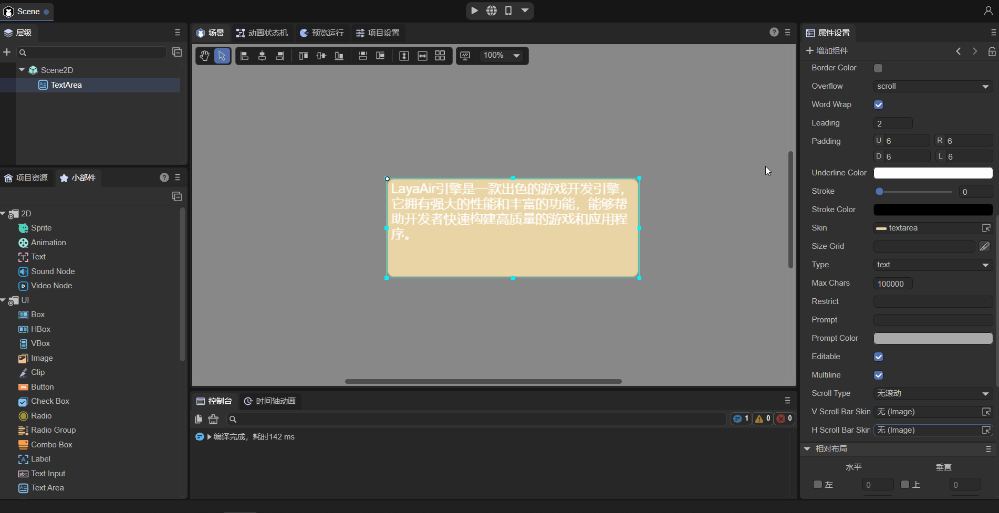
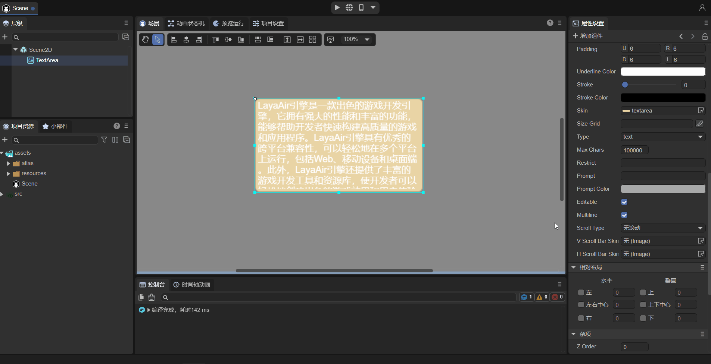
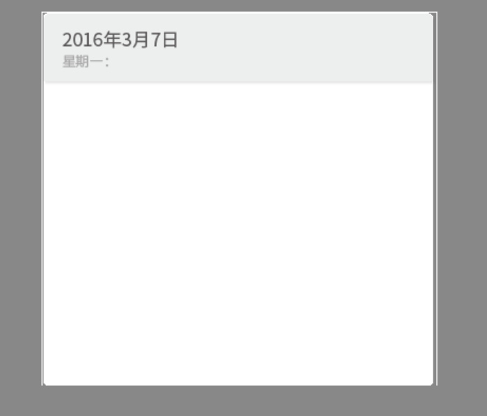

# Multi-line input text component (TextArea)

Since TextArea inherits from TextInput, the two have too many similarities. This article only introduces the differences between the two. The points introduced by TextInput will not be explained in detail here. For details, please refer to [TextArea API](https://layaair.com/3.x/api/Chinese/index.html?version=3.0.0&type=2D&category=UI&class=laya.ui.TextArea).

 

## 1. Using TextArea in LayaAir IDE

### 1.1 Create TextArea

As shown in Figure 1-1, you can right-click in the `Hierarchy' window to create it, or you can drag and drop from the `Widgets' window to add it.



(Picture 1-1)


### 1.2 Introduction to TextArea properties



(Figure 1-2)

> Properties: text, font, fontSize, color, style, syntax, align, bgColor, bordercolor, overflow, wordWrap (default is true), leading, padding, underlinecolor, stroke, strokeColor, skin, sizeGrid, type, maxchars, restrict, prompt, promptcolor, editable, multiline (default is true);
>
> The above properties have been listed in [Input Text Component](../TextInput/readme.md) and will not be described in detail here. The differences are marked in parentheses.

TextArea has more properties than TextInput as follows:

| Properties	| Function description	|
| -------------- | ------------------------------------------------------------ |
| vscrollbarskin | Add vertical scrollbar skin	|
| hscrollbarskin | Add horizontal scroll bar skin	|
| scrolltype 	| The scrolling type of the text field needs to be used with the corresponding scroll bar skin. There are four types: none: no scrolling (default), horizontal: horizontal scrolling, vertical: vertical scrolling, both: both horizontal and vertical scrolling |

TextArea is a text field for multiple lines. The difference compared to TextInput is that it can add vertical scroll bar skin and horizontal scroll bar skin. The horizontal scrolling effect is shown in the animation 1-3, and the vertical scrolling effect is shown in the animation 1-4.



(Animation 1-3)



(Animation 1-4)


### 1.3 Script control TextArea

```typescript
const { regClass, property } = Laya;

@regClass()
export class TextAreaControl extends Laya.Script {
	//declare owner : Laya.Sprite3D;

	@property( { type : Laya.TextArea } )
	public txtarea: Laya.TextArea;

	constructor() {
    	super();
	}

	/**
 	* Executed after the component is activated. At this time, all nodes and components have been created. This method is only executed once.
 	*/
	onAwake(): void {
    	this.txtarea.pos(Laya.stage.width >> 1, Laya.stage.height >> 1); //Position
    	this.txtarea.size(500, 200); //Size
    	this.txtarea.pivot(this.txtarea.width/2, this.txtarea.height/2); //Pivot Point
    	this.txtarea.text = "Hello everyone, developers are welcome to use LayaAir IDE. Here is the text content of TextArea. You can debug based on this text";
    	this.txtarea.font = "宋体"; //Font
    	this.txtarea.fontSize = 50; //Font size
    	this.txtarea.color = "#ff0000"; //Font color
    	this.txtarea.bold = true; //bold
    	this.txtarea.italic = true; //italic
    	this.txtarea.underline = true; //underline
    	this.txtarea.underlineColor = "#ff0000"; //Underline color
    	this.txtarea.stroke = 5; //stroke width
    	this.txtarea.strokeColor = "#000000" ; //Stroke color
    	this.txtarea.wordWrap = true; //Automatically wrap lines
    	this.txtarea.overflow = "scroll"; //Text overflow
    	this.txtarea.skin = "atlas/comp/textarea.png"; //Skin
    	this.txtarea.borderColor = "#f6ff03" //Border color

    	this.txtarea.scrollType = Laya.ScrollType.Vertical; //Scrolling method
    	this.txtarea.vScrollBarSkin = "atlas/comp/vscroll.png"; //Scroll bar skin
	}

}
```

> Developers should pay attention to the scrolling mode setting code: `Laya.ScrollType.Vertical`, which is vertical scrolling; `Laya.ScrollType.Horizontal`, which is horizontal scrolling. Different scrolling methods require setting corresponding scroll bar skins.

## 2. Create TextArea through code

```typescript
const { regClass, property } = Laya;

@regClass()
export class UI_TextArea extends Laya.Script {
    
    private skin: string = "resources/res/ui/textarea.png";

	constructor() {
    	super();
	}

	/**
 	* Executed after the component is activated. At this time, all nodes and components have been created. This method is only executed once.
 	*/
	onAwake(): void {

   	 Laya.loader.load(this.skin).then( ()=>{
        	this.onLoadComplete();
    	} );
    }

    private onLoadComplete(e: any = null): void {

   	 let ta: Laya.TextArea = new Laya.TextArea("");
   	 ta.skin = this.skin;

   	 ta.font = "Arial";
   	 ta.fontSize = 18;
   	 ta.bold = true;

   	 ta.color = "#3d3d3d";

   	 ta.pos(100, 15);
   	 ta.size(375, 355);

   	 ta.padding = "70,8,8,8";

   	 this.owner.addChild(ta);
    }
}
```

(The image resources in the code are from the "Engine API Usage Example" project, developers can create and download them by themselves)

operation result:



(Figure 2-1)


