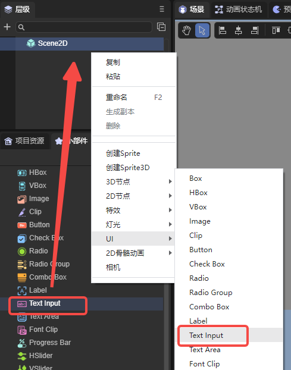

# Input text component (TextInput)

## 1. Using TextInput in LayaAir IDE

The text input box is a UI component often used in games. TextInput can be used whenever input is required. For the API of TextInput class, please refer to [here](https://layaair.com/3.x/api/Chinese/index.html?version=3.0.0&type=2D&category=UI&class=laya.ui.TextInput).

### 1.1 Create TextInput

As shown in Figure 1-1, you can right-click in the `Hierarchy' window to create it, or you can drag and drop from the `Widgets' window to add it.



(Picture 1-1)

### 1.2 TextInput property


(Figure 1-2)

| **Properties**	| Function description	|
| -------------- | ------------------------------------------------------------ |
| text       	| Initial displayed text content	|
| font       	| The font name of the text, for example: `Microsoft YaHei`, here you can manually enter commonly used fonts, or it can be [bitmap font](../../advanced/useText/readme.md) |
| fontSize	| Text font size, for example: `50`, directly fill in the positive integer	|
| color      	| For the color of the text, you can directly enter the color value, for example: `#ffffff`, or you can click the color picker on the right side of the input bar to select a color |
| style      	| Whether "**B**" (bold) is bold, whether "***I***" (italic) is italic, whether "<u>**U**</u>" is underlined |
| syntax     	| [Multi-style mixed arrangement](../../../../2D/displayObject/Text/readme.md), supports some HTML syntax and UBB syntax. You can also check the template to be able to use variables in strings |
| align      	| Alignment, horizontal alignment (align) is left (aligned to the left), center (aligned to the center), right (aligned to the right); vertical alignment (valign) is top (aligned to the top), middle (aligned to the center), bottom (bottom alignment) |
| bgColor    	| Background color, after checking, you can directly enter the color value, for example: `#ffffff`, or you can click the color picker on the right side of the input bar to select a color |
| bordercolor	| Text border color. After checking, you can directly enter the color value, for example: `#ffffff`, or you can click the color picker on the right side of the input bar to select a color |
| overflow   	| Text overflow processing, there are five modes. visible: No cropping is done. hidden: Do not display characters beyond the text field. scroll: Default mode, does not display character pixels outside the text area, and supports the scroll interface. shrink: When the text exceeds the text area, the text shrinks as a whole to fit in the text box. ellipsis (display ellipsis): When the text field is exceeded, the text is truncated and an ellipsis is displayed at the end of the text |
| becomeWrap	| Whether to automatically wrap lines, a Boolean option, the default is `false`, select `true` to enable automatic line wrapping |
| leading    	| Vertical line spacing, when automatic word wrapping is turned on, it is effective when the text content has multiple lines. The spacing is in pixels, just enter a positive integer |
| padding    	| Text margin, in pixels, consisting of 4 integer values. "U" represents the distance from the upper border, "R" represents the distance from the right border, "D" represents the distance from the bottom border, and "L" represents the distance from the left border |
| underlinecolor | Underline color, you can enter the color value directly, for example: `#ffffff`, or you can click the color picker on the right side of the input bar to select the color |
| stroke     	| Stroke width, range is 0~100	|
| strokeColor	| For the stroke color of text, you can enter the color value directly, for example: `#ffffff`, or you can click the color picker on the right side of the input bar to select a color |
| skin       	| Set the skin and select the corresponding image resource. The address representing the skin in the code, expressed as a string |
| sizeGrid   	| Valid scaling grid data for the background image. Data format: "Top margin, right margin, bottom margin, left margin, whether to repeat filling (value is 0: no repeated filling, 1: repeated filling)", separated by commas. For example: "4,4,4,4,1" |
| type       	| Input box types, there are thirteen types: text, password, email, url, number, range, date, month, week, time, dateime, dateime-local, search. The effect is equivalent to HTML's [input](https://www.w3school.com.cn/html/html_form_input_types.asp) |
| maxchars   	| Maximum number of characters, default is 100000. When setting the character limit, a value less than or equal to 0 will limit the number of characters to 100000 |
| restrict   	| limits the characters that can be entered. Only these characters can be entered in TextInput. Not recommended to be turned on, suitable for simple text, backslash is not supported |
| prompt     	| Prompt text before input	|
| promptcolor	| Prompt text color	|
| editable   	| Set editable status, default is true	|
| multiline  	| Whether it is a text field. A value of true indicates that it is a text field and can be entered in multiple lines. Otherwise, it is not a text field. Defaults to false |


### 1.3 Script control TextInput

In the Scene2D property settings panel, add a custom component script. Then, drag the TextInput into its exposed property entry. Here is a sample code to implement script control of TextInput:

```typescript
const { regClass, property } = Laya;

@regClass()
export class TextInputControl extends Laya.Script {
	//declare owner : Laya.Sprite3D;

	@property( { type : Laya.TextInput } )
	public txtin: Laya.TextInput;

	constructor() {
    	super();
	}

	/**
 	* Executed after the component is activated. At this time, all nodes and components have been created. This method is only executed once.
 	*/
	onAwake(): void {
    	this.txtin.pos(Laya.stage.width >> 1, Laya.stage.height >> 1); //Position
    	this.txtin.size(500, 60); //Size
    	this.txtin.pivot(this.txtin.width/2, this.txtin.height/2); //Pivot Point
    	this.txtin.font = "宋体"; //Font
    	this.txtin.fontSize = 50; //Font size
    	this.txtin.color = "#ff0000"; //Font color
    	this.txtin.bold = true; //bold
    	this.txtin.italic = true; //italic
    	this.txtin.underline = true; //underline
    	this.txtin.underlineColor = "#ff0000"; //Underline color
    	this.txtin.stroke = 5; //stroke width
    	this.txtin.strokeColor = "#000000" ; //Stroke color
    	this.txtin.wordWrap = true; //Automatically wrap lines
    	this.txtin.overflow = "scroll"; //Text overflow
    	// this.txtin.skin = "atlas/comp/textinput.png"; //Skin
    	this.txtin.bgColor = "#19a4f1"; //Background color
    	this.txtin.borderColor = "#f6ff03" //Border color

    	this.txtin.editable = true; //Editable state
    	// this.txtin.type = "password"; //Input box type
    	// this.txtin.maxChars = 5; //Maximum number of characters
    	// this.txtin.restrict = "12345"; //Input restrictions
    	// this.txtin.prompt = "Please enter"; //Input prompt
    	// this.txtin.promptColor = "#a9a9a9"; //Prompt word color
    	// this.txtin.multiline = true; //Text field
	}

}
```

(In order to prevent cluttered effects, part of the code in the sample code is commented out first. Developers can uncomment themselves to observe the effect)


## 2. Textinput code creation

Sometimes, you don't want the Textinput component to be on the stage from the beginning, but to add it when you need it. This needs to be created through code. In the property settings panel of Scene2D, add a custom component script. The sample code is as follows:

```typescript
const { regClass, property } = Laya;

@regClass()
export class UI_Input extends Laya.Script {

	private SPACING: number = 100;
    private Y_OFFSET: number = 50;

    private skins: any[];

	constructor() {
    	super();
	}

	/**
 	* Executed after the component is activated. At this time, all nodes and components have been created. This method is only executed once.
 	*/
	onAwake(): void {


   	 this.skins = ["resources/res/ui/input (1).png", "resources/res/ui/input (2).png", "resources/res/ui/input (3).png", "resources/res/ui/input (4).png"];
   	 Laya.loader.load(this.skins).then( ()=>{
        	this.onLoadComplete();
    	} );
    }

    private onLoadComplete(): void {
   	 for (var i: number = 0; i < this.skins.length; ++i) {
   		 var input: Laya.TextInput = this.createInput(this.skins[i]);
   		 input.prompt = 'Type:';
   		 input.x = (Laya.stage.width - input.width) / 2;
   		 input.y = i * this.SPACING + this.Y_OFFSET;
   	 }
    }

    private createInput(skin: string): Laya.TextInput {
   	 var ti: Laya.TextInput = new Laya.TextInput();

   	 ti.skin = skin;
   	 if.size(300, 50);
   	 ti.sizeGrid = "0,40,0,40";
   	 ti.font = "Arial";
   	 ti.fontSize = 30;
   	 ti.bold = true;
   	 ti.color = "#606368";

   	 this.owner.addChild(ti);

   	 return ti ;
    }
}
```

(The image resources in the code are from the "Engine API Usage Example" project, developers can create and download them by themselves)

operation result:

 

(Figure 2-1)

