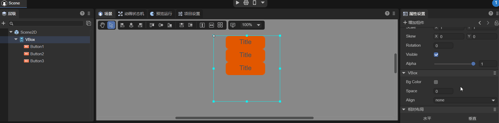

# Vertical layout container component (VBox)

VBox is a container class component, inherited from Box. VBox is a container component used for vertical layout. Compared with Box, it adds more detailed functions. The detailed properties of VBox can be viewed in [API](https://layaair.com/3.x/api/Chinese/index.html?version=3.0.0&type=2D&category=UI&class=laya.ui.VBox).

## 1. Create VBox components through LayaAir IDE

### 1.1 Create VBox

VBox can be created directly in the hierarchy panel through the visual operation of the IDE, as shown in Figure 1-1. You can right-click in the 'Hierarchy' window to create it, or you can drag and drop from the 'Widgets' window to add it.


(Picture 1-1)


### 1.2 VBox properties

The unique properties of VBox are as follows:


(Figure 1-2)

| Properties	| Function	|
| ------- | ------------------------------------------------------------ |
| bgColor | Background color. After checking, you can directly enter the color value, for example: `#ffffff`, or you can click the color picker on the right side of the input bar to select a color |
| space | The vertical spacing between sub-objects, in pixels.	|
| align | Horizontal alignment of layout elements. There are four options. none: No horizontal alignment, left: Horizontal alignment on the left, center: Horizontal alignment on the center, right: Horizontal alignment on the right, the default is none. |

The space attribute is to set the vertical spacing between sub-objects in pixels. You can enter the number yourself, or you can enter the value by pressing and holding the left mouse button and sliding. Assume that VBox has three Button component sub-objects. The effect of adjusting the space attribute is as shown in the animation 1-3.



(Animation 1-3)

No matter how the child nodes of VBox are arranged in the IDE, they will become the corresponding horizontal sorting after setting the align attribute, as shown in the animation 1-4.


(Animation 1-4)


### 1.3 Script control VBox

In the Scene2D property settings panel, add a custom component script. Then, drag the VBox into its exposed property entrance. Since there is only one VBox and the effect cannot be viewed, the developer can add some child nodes under the VBox. The sample code is as follows:

```typescript
const { regClass, property } = Laya;

@regClass()
export class NewScript extends Laya.Script {

	@property({ type: Laya.VBox })
	public vbox: Laya.VBox;

	//Execute after the component is activated. At this time, all nodes and components have been created. This method is only executed once.
	onAwake(): void {
    	this.vbox.pos(100, 100);
    	this.vbox.bgColor = "#ffffff";
    	this.vbox.space = 30;
    	this.vbox.align = "center";
	}
}
```


## 2. Create VBox through code

Sometimes, you need to manage the UI with code, and create the UI_VBox class to create VBox components. Since it doesn't make much sense to create a VBox component alone, three more Button components are created to demonstrate the effect. The sample code is as follows:

```typescript
const { regClass, property } = Laya;

@regClass()
export class UI_VBox extends Laya.Script {

	private vbox: Laya.VBox;
	private btn1: Laya.Button;
	private btn2: Laya.Button;
	private btn3: Laya.Button;

	// Button skin resources
	private skins: string = "atlas/comp/button.png";

	//Execute after the component is activated. At this time, all nodes and components have been created. This method is only executed once.
	onAwake(): void {
    	Laya.loader.load(this.skins).then(() => {
        	this.createBtn();
        	this.createvbox();
        	//Add VBox component
        	this.owner.addChild(this.vbox);
    	});
	}

	//Create Button component
	private createBtn(): void {
    	this.btn1 = new Laya.Button(this.skins);
    	this.btn2 = new Laya.Button(this.skins);
    	this.btn3 = new Laya.Button(this.skins);
	}

	//Create VBox component
	private createvbox(): void {
    	this.vbox = new Laya.VBox;
    	this.vbox.pos(100, 100);
    	this.vbox.size(600, 300);
    	this.vbox.bgColor = "#ffffff";
    	this.vbox.addChild(this.btn1);
    	this.vbox.addChild(this.btn2);
    	this.vbox.addChild(this.btn3);
    	this.vbox.space = 80;
    	this.vbox.align = "center";
	}
}
```


