# Vertical scroll bar component (VScrollBar)

## 1. Create VScrollBar component through LayaAir IDE

The VScrollBar component is a vertical scroll bar component. When there is too much data to fit in the display area, the end user can use the VScrollBar component to control the portion of the data that is displayed. For the script interface of the VScrollBar component, please refer to [VScrollBar API](https://layaair.com/3.x/api/Chinese/index.html?version=3.0.0&type=2D&category=UI&class=laya.ui.VScrollBar).

### 1.1 Create VScrollBar

As shown in Figure 1-1, you can right-click in the `'Hierarchy'` window to create it, or you can drag and drop from the `'Widgets'` window to add it.

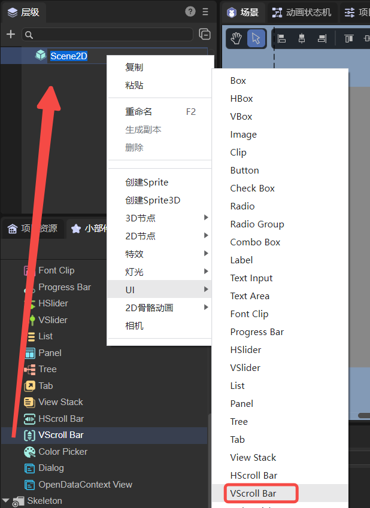

(Picture 1-1)

The scroll bar consists of four parts: a track graph, a slider button, and two arrow buttons. The naming of the image resources of the VScrollBar component must comply with [Resource Naming Rules](../readme.md). The resource examples provided by LayaAir are as follows:

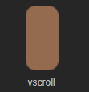

(Figure 1-2) Orbital diagram

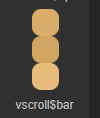

(Figure 1-3) Slider button

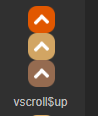

(Figure 1-4) Arrow Button 1

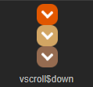

(Figure 1-5) Arrow Button 2

The display effect after creating VScrollBar is as follows:

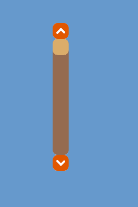

(Figure 1-6)


### 1.2 VScrollBar properties

The unique properties of VScrollBar are as follows:

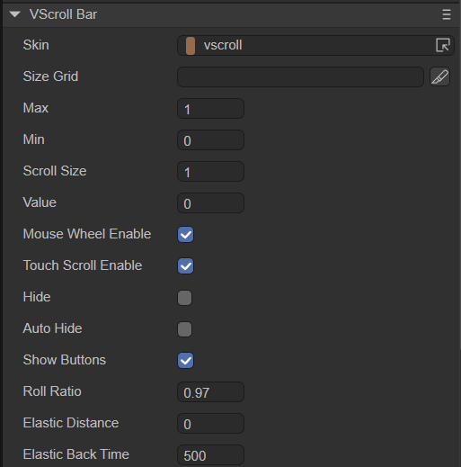

(Figure 1-7)

| **Properties**	| **Function description**	|
| ----------------- | ------------------------------------------------------------ |
| skin          	| The image resource address of the scroll bar track diagram.	|
| sizeGrid      	| Valid scaling grid data (nine-square grid data) of the scroll bar track map resource.	|
| max           	| represents the maximum scroll position of the slider (the value when the slider is at the highest position).	|
| min           	| represents the minimum scroll position of the slider (the value when the slider is at the lowest position).	|
| scrollSize    	| Scroll amount on button click. The amount by which the scroll bar's value changes (the amount the slider moves) each time the scroll bar arrow button is clicked. |
| value         	| The current progress value of the scroll bar (current position of the slider).	|
| mouseWheelEnable | Whether to enable mouse wheel scrolling, the default value is true. This property sets the scroll object target to be valid later. |
| touchScrollEnable | Whether to enable touch scrolling, the default value is true. This property sets the scroll object target to be valid later. |
| hide          	| Whether to hide the scroll bar, the default is false. When set to true, the scroll bar will not be displayed, but normal scrolling will be possible. |
| autoHide	| Whether to automatically hide the scroll bar, the default value is false. After setting to true, the scroll bar will be hidden when scrolling is not required, and the scroll bar will be displayed when the content needs to be scrolled. |
| showButtons   	| Whether to display arrow buttons, the default value is true. When set to false, the arrow buttons will not be displayed. |
| rollRatio	| Rolling attenuation coefficient, default is 0.97.	|
| elasticDistance | The limit distance of the rubber band effect. 0 means there is no rubber band effect.	|
| elasticBackTime | Rubber band rebound time, in milliseconds.	|

The following shows the effects of some scroll bar property settings:

After setting the value of attribute max of VScrollBar to 10, the value of attribute min to 0, and the value of attribute value to 3, the display effect is as follows:

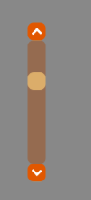

(Figure 1-8)

At runtime, you can control the scroll bar's value by dragging the slider or clicking the arrow buttons. Set the property scrollSize to 1, then every time you click the scroll bar arrow button, the value of the scroll bar changes by 1. The effect is as follows:

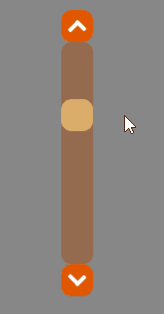

(Animation 1-9)

After setting the mouseWheelEnable attribute to true, you can enable mouse wheel scrolling. However, this property must be set to a scrolling object to be effective. The scrolling object here is Panel as an example. The effect is as shown in the animation 1-10. The vertical scroll bar is controlled through the mouse wheel.

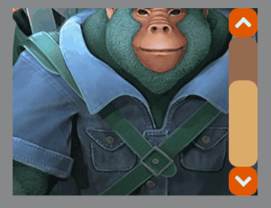

(Animation 1-10)

After setting the touchScrollEnable property to true, touch scrolling can be enabled. This property must also be set to a scroll object before it is valid. As shown in the animation 1-11, you can drag the Panel component and the vertical scroll bar will scroll accordingly.

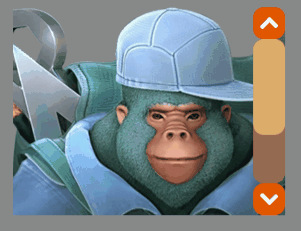

(Animation 1-11)

After setting the hide attribute to true, the scroll bar will not be displayed, but you can scroll normally. The effect is shown in the following animation:

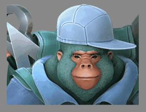

(Animation 1-12)

After setting the autoHide attribute to true, the scroll bar will be automatically hidden. When the operation content is scrolled, the scroll bar will be displayed, and when the scrolling is stopped, the scroll bar will be automatically hidden. The effect is as follows:

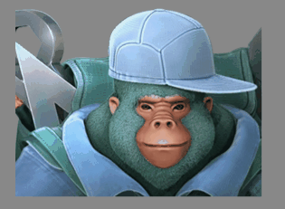

(Animation 1-13)

Set the rollRatio attribute. The smaller the value, the smaller the change in scrolling speed. Animation 1-14 The left picture shows the effect of setting rollRatio to 1, and the right picture shows the effect of setting rollRatio to 0.1. Obviously, the larger the value of rollRatio, the faster the scrolling speed.

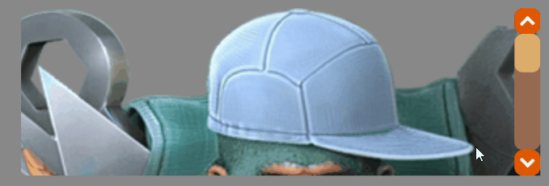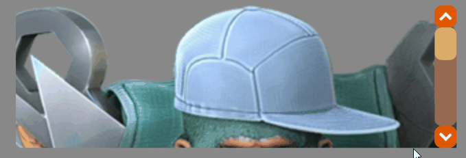

(Animation 1-14)

Vertical scrollbar supports rubber band technology. Animation 1-15 demonstrates the effect of setting the limit distance of the rubber band effect to elasticDistance to 200 and the rubber band rebound time to 500 milliseconds.

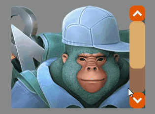

(Animation 1-15)


### 1.3 Script control VScrollBar

In the Scene2D property settings panel, add a custom component script. Then, drag the VScrollBar into its exposed property entry. You need to add the following sample code to implement script control of VScrollBar:

```typescript
const { regClass, property } = Laya;

@regClass()
export class NewScript extends Laya.Script {

	@property({ type: Laya.VScrollBar })
	public vscroll: Laya.VScrollBar;

	//Execute after the component is activated. At this time, all nodes and components have been created. This method is only executed once.
	onAwake(): void {
    	this.vscroll.skin = "atlas/comp/vscroll.png";//Scroll bar skin
    	this.vscroll.width = 300;//The width of the scroll bar
    	this.vscroll.pos(300, 300);//The position of the scroll bar
    	this.vscroll.min = 0;//The minimum scroll position of the slider
    	this.vscroll.max = 10;//Maximum scrolling position of the slider
    	this.vscroll.scrollSize = 1; //Scroll amount of click button
	}

}
```


## 2. Create VScrollBar component through code

When writing code, it is inevitable to control the UI through code, create the `UI_VScrollBar` class, and set VScrollBar related properties through code. The following example demonstrates how to create a VScrollBar through code and display the value of the scroll bar through a Text component. Developers can set the VScrollBar through code and create a VScrollBar that meets their own needs.

**Sample code:**

```typescript
const { regClass, property } = Laya;

@regClass()
export class UI_VScrollBar extends Laya.Script {

	constructor() {
    	super();
	}
	// Text component, used to display the value of the scroll bar
	public text: Laya.Text;

	// Executed after the component is activated. At this time, all nodes and components have been created. This method is only executed once.
	onAwake(): void {
    	//Create text component
    	this.text = new Laya.Text();
    	this.text.pos(300, 260);
    	this.owner.addChild(this.text);

    	//Scroll bar skin resources
    	var skins: any[] = [];
    	skins.push("atlas/comp/vscroll.png", "atlas/comp/vscroll$bar.png", "atlas/comp/vscroll$down.png", "atlas/comp/vscroll$up.png");

    	Laya.loader.load(skins).then(() => {
        	//Create scroll bar
        	var vs: Laya.VScrollBar = new Laya.VScrollBar();
        	vs.skin = "atlas/comp/vscroll.png";
        	vs.height = 300;
        	vs.pos(300, 300);
        	vs.min = 0;
        	vs.max = 100;
        	vs.changeHandler = new Laya.Handler(this, this.onChange);
        	this.owner.addChild(vs);
    	});
	}

	private onChange(value: number): void {
    	this.text.text = "Scroll bar position: value=" + value;
	}

}
```

**running result:**

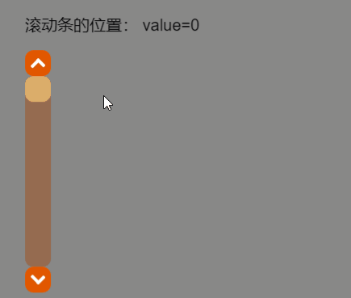

(Animation 2-1)


