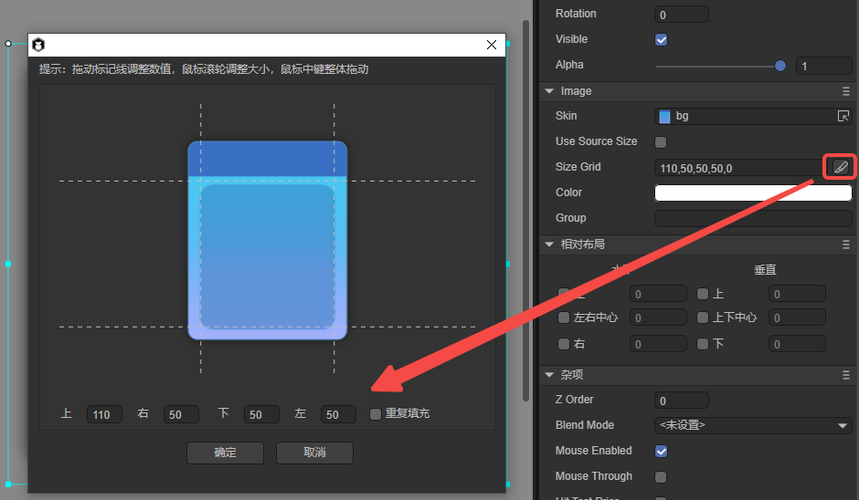

# Navigation container component (ViewStack)

> This article will involve some knowledge of the Tab component. Please read the documentation of [Tab component](../Tab/readme.md) first.

The ViewStack component is a navigation container component, mainly used for multi-page view switching. It contains multiple subpages, but only one is displayed by default. The display can be switched through the subpage index. Under normal circumstances, it is used in combination with the Tab tag to create a tab switching page, and the effect is as shown in animation 1. For detailed usage of the ViewStack component, please see [ViewStack API](https://layaair.com/3.x/api/Chinese/index.html?version=3.0.0&type=2D&category=UI&class=laya.ui.ViewStack).


(Animation 1)


## 1. Create ViewStack

### 1.1 Prepare art resources

Prepare the page background image and the page art resources that need to be switched, as shown in Figure 1-1, and place them in the project directory of LayaAir IDE.


(Picture 1-1)

> The resources in the picture are from "2D Getting Started Example".

Then set the background’s Jiugongge attribute, as shown in Figure 1-2.



(Figure 1-2)


### 1.2 Create page

As shown in Figure 1-3, drag the background image with the nine-square grid just set into the scene, then create the sub-node ViewStack page, and then drag the basic UI components involved in the page to the ViewStack component as its sub-page. And adjust the UI layout of the page.


(Figure 1-3)

The ViewStack component is a container component and does not have independent component resource specifications. In this example, the Image component resource is used directly. In actual game development, various UI components can be used according to actual development needs.


### 1.3 Set the name attribute of the ViewStack component subpage

The naming rules for the name attribute of ViewStack subpages are item0, item1, item2...." If there are more pages, the same applies, as shown in Figure 1-4.


(Figure 1-4)

> If you do not add the name attribute according to this rule, the generated ViewStack component will be an invalid component and cannot run normally.


### 1.4 Set ViewStack’s page index selectedIndex

The ViewStack component displays item0 by default. You can change the default display page of the ViewStack component by adjusting the selectedIndex attribute value. The effect is as shown in animation 1-5.


(Animation 1-5)


### 1.5 Create control Tab tags

Usually, the ViewStack component requires a corresponding control label, and a Tab label is created to control the switching display of ViewStack's subpages.

Click to select the Tab resource in the resource panel and drag it to the scene to generate the Tab component. Then, adjust the position to align with the background image. Set labels to "Page 0, Page 1, Page 2", and set the selected button index selectedIndex to 0. Finally, set the font size, boldness, font status color and other properties. The display effect after setting is shown in Figure 1-6:


(Figure 1-6)


### 1.6 Control ViewStack component switching display through code

After creating a Tab, you need to associate the Tab label with the ViewStack's subpage switching display through program code.

In the Scene2D property settings panel, add a custom component script. Then, drag the ViewStack and Tab components into their exposed property entries. The following sample code needs to be added:

```typescript
const { regClass, property } = Laya;

@regClass()
export class NewScript extends Laya.Script {

	@property({ type: Laya.ViewStack })
	public viewstack: Laya.ViewStack;

	@property({ type: Laya.Tab })
	public tab: Laya.Tab;

	//Execute after the component is activated. At this time, all nodes and components have been created. This method is only executed once.
	onAwake(): void {
    	//Click the Tab selection button processing
    	this.tab.selectHandler = new Laya.Handler(this, this.onSelecte);
	}

	//Switch pages based on the index of the selected tab
	private onSelecte(index: number): void {
    	//Switch ViewStack subpage
    	this.viewstack.selectedIndex = index;
	}
}
```

The final effect is shown in the animation 1-7:


(Animation 1-7)


## 2. ViewStack property

The unique properties of ViewStack are as follows:


(Figure 2-1)

| Properties	| Description	|
| ------------- | ------------------------------------------------------------ |
| bgColor   	| Background color, after checking, you can directly enter the color value, for example: `#ffffff`, or you can click the color picker on the right side of the input bar to select a color |
| selectedIndex | Select index, default is 0, indicating the first item. -1 means there are no selected items. The number of indexes will dynamically change based on the number of sub-items (number of items) |


