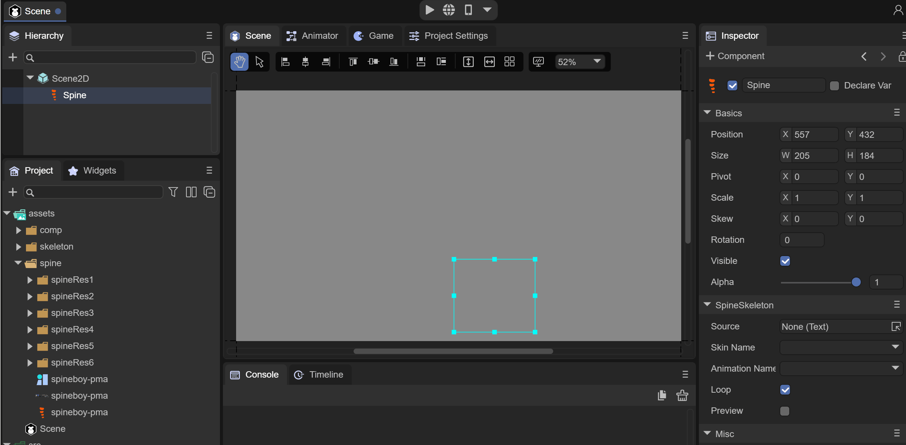

# Spine skeleton animation


## 1. Overview

Spine skeletal animation is one of the skeletal animations often used in games. Spine tools are used to bind pictures to bones and then control the bones to achieve animation.

How to make Spine skeleton animations will not be introduced here. Interested developers can check it out on the Spine official website. http://zh.esotericsoftware.com/

LayaAir IDE supports adding, previewing and running Spine animation. Before use, you need to check the class library in the IDE and select the Spine version


(Picture 1-1)

1. Check the laya.ani class library

2. Check the laya.spine class library

3. Select the Spine version used by this project

LayaAir currently supports versions 3.7, 3.8 and 4.0. Next, we will explain the use in the IDE by using the Spine animation of version 3.8.


## 2. Using Spine animation in IDE

### 2.1 Copy spine resources to the project

As shown in Figure 2-1, we put the completed Spine animation resources into the assets directory. Here we use the example downloaded from the Spine official website.


(Figure 2-1)


### 2.2 Add spine animation component to the scene

There are two ways to add Spine animation components to the scene in the IDE.

1. Drag directly into the Spine animation component, as shown in animation 2-2


(Animation 2-2)

2. Create a Spine animation component through Scene2D or any node, as shown in animation 2-3


(Animation 2-3)

At this point, the Spine animation component is ready. The next step is to drag in the animation resources.


### 2.3 Set animation resources

Let’s first take a look at the Spine animation component and what properties it has, as shown in Figure 2-4.


 (Figure 2-4)

`Source`: configuration file of spine animation, that is, .skel file

`Skin Name`: skeleton animation name

`Animation Name`: Play animation name

`Loop`: Whether to loop playback

`Preview`: Preview in IDE

First, we drag the .skel file into the `Source` property, and we will see the animation in the IDE, as shown in animation 2-5



 (Animation 2-5)


### 2.4 Preview animation in IDE

By checking the Preview option, we can preview the Spine animation effect directly in the IDE, as shown in animation 2-6


 (Animation 2-6)

At the same time, you can check Loop to set whether to loop the animation, or you can select the animation name to switch the animation.


### 2.5 Basic animation operations

In the IDE, you can perform basic operations on the position, size, and scaling of the animation, as shown in animation 2-7.


 (Animation 2-7)


## 3. Spine animation in code

When used in code, we need to reference the specified classes when using Spine: `Laya.SpineSkeleton` and `Laya.SpineTemplet`

Among them, `Laya.SpineSkeleton` is a class that must be referenced for spine skeletal animation. The runtime library of spine is encapsulated here. `Laya.SpineTemplet` is used for resource processing.

Code example:

```typescript
const { regClass, property } = Laya;

@regClass()
export class Main extends Laya.Script {

	private skeleton: Laya.SpineSkeleton;
	private index: number = -1;

	onStart() {
    	console.log("Game start");
   	 //Load Spine animation resources
    	Laya.loader.load("spine/spineboy-pma.skel", Laya.Loader.SPINE).then((templet: Laya.SpineTemplet) => {
   		 //Create SpineSkeleton object
        	this.skeleton = new Laya.SpineSkeleton();
        	this.skeleton.temple = temple;
        	this.owner.addChild(this.skeleton);
        	this.skeleton.pos( Laya.stage.width / 2, Laya.stage.height / 2 + 100);
        	this.skeleton.scale(0.4, 0.4);
        	this.skeleton.on(Laya.Event.STOPPED, this, this.play);
        	this.play();
    	});
	}

    //Play Spine animation
	private play(): void {
    	if (++this.index >= this.skeleton.getAnimNum()) {
        	this.index = 0
    	}
    	this.skeleton.play(this.index, false, true)
	}
}
```

You can view the specific effects in the LayaAir 2D Getting Started Example.

