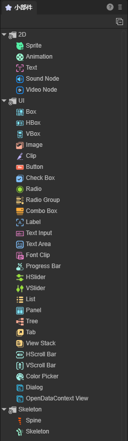

# UI widgets

The UI widgets of the LayaAir engine are divided into three categories. They are:

1.	Basic display objects: 2D sprites, 2D node animations, basic text, audio nodes, and video nodes.

2. UI components: images, buttons, display text, text input, text fields, drop-down boxes, multi-select boxes, radio buttons, radio button groups, navigation label groups, navigation containers, bitmap slices, bitmap font slices, Vertical scroll bar, horizontal scroll bar, progress bar, vertical swipe bar, horizontal swipe bar, color picker, basic container, list, tree list, open data field.

3. Skeleton: Spine skeleton, built-in skeleton.

As shown in Figure 1:

(figure 1)

When using it, just drag the widget directly into the scene window.

