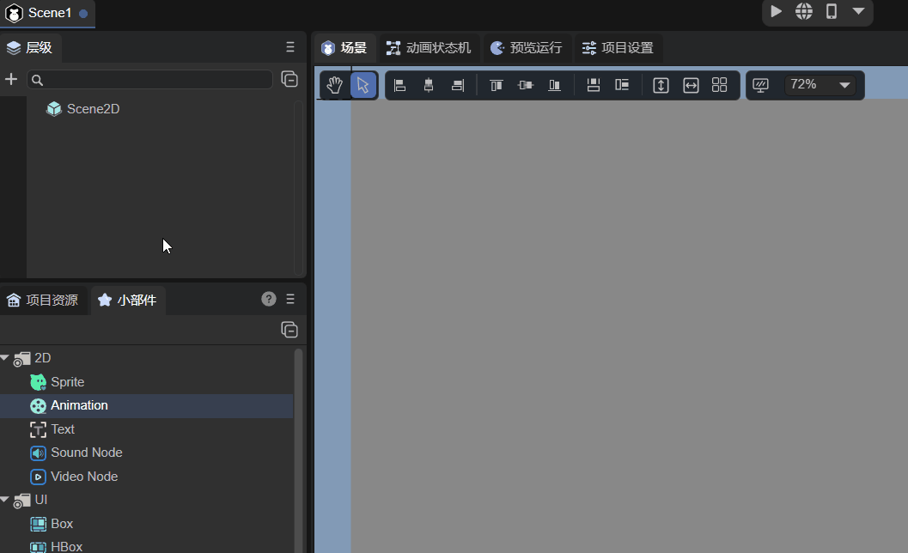
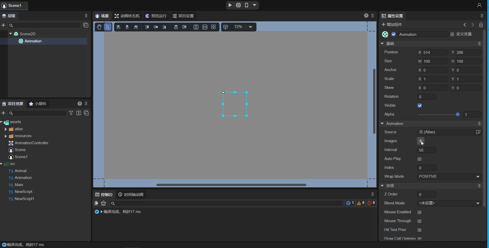
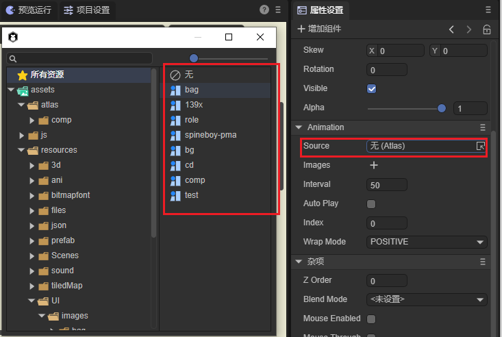
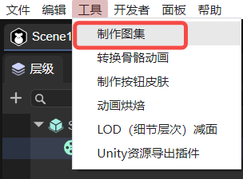
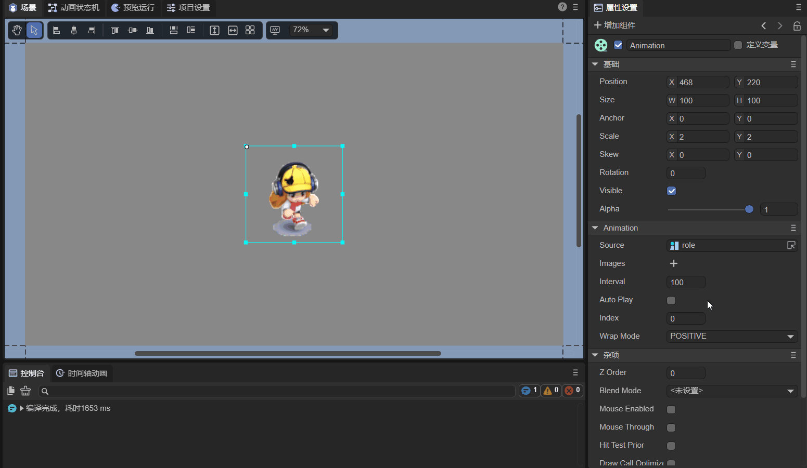
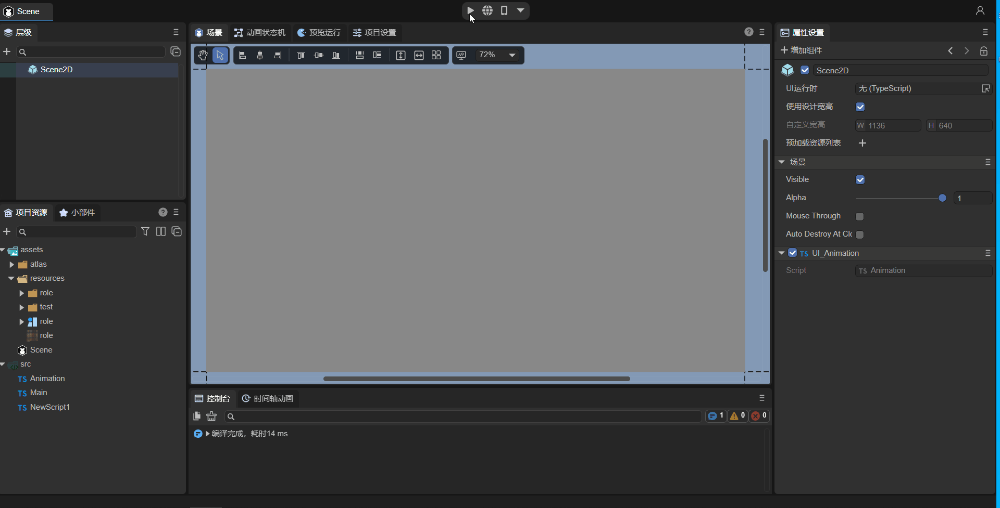

# Animation node (Animation)


## 1. Preliminary understanding of Animation nodes

Animation is node animation, which can easily create atlas animation and multi-frame animation. As shown in the animation 1-1, it is the animation effect created by Animation. For the API of the Animation node, please refer to [Animation API](https://layaair.com/3.x/api/Chinese/index.html?version=3.0.0&type=Core&category=display&class=laya.display.Animation).

 

(Animation 1-1)

**Common properties of Animation nodes**

| Properties	| Function description	|
| -------- | ------------------------------------------------------------ |
| images | Add animated images.	|
| source | Add animation gallery.	|
| autoplay | Whether the animated atlas automatically plays, the default is false. If set to true, the animation will play automatically after it is created and added to the stage. |
| wrapmode | Playback type: The default is 0 for positive sequence playback (POSITIVE), 1 for reverse sequence playback (REVERSE), and 2 for pingpong playback (PINGPONG). |
| interval | animation playback interval, unit is milliseconds, the default value is 50 milliseconds.	|
| index	| Playback position.	|


## 2. Create Animation nodes through LayaAir IDE

### 2.1 Create Animation

As shown in animation 2-1, you can create an Animation node in the `Hierarchy` panel, click `+` or create it by right-clicking.


(Animation 2-1)

You can also drag Animation directly from `Widgets' into the IDE's `Scene Editor` or `Hierarchy` panel, as shown in animation 2-2.



(Animation 2-2)


### 2.2 Receive animation data source

There are two ways to receive animation data sources: Images and Source.

#### 2.2.1 Images

The first method is `Images`. You can hold down the **↓** arrow keys on the keyboard to quickly select a picture, or you can click on the picture to add it, as shown in the animation 2-3.



(Animation 2-3)

#### 2.2.2 Source

The second method is simpler and faster, just put the packaged atlas into the `Source` property, as shown in Figure 2-4.



(Figure 2-4)

#### 2.2.3 Making an atlas

Although the method of adding an atlas is relatively quick, the above-mentioned "atlas" resources need to be produced by the developer themselves. LayaAir IDE provides tools for creating atlases, as shown in Figure 2-5. Select `Create atlas` in the `Tools` menu bar of the navigation bar.



(Figure 2-5)

The atlas creation tool that opens after clicking is shown in Figure 2-6.


(Figure 2-6)

When making an atlas, you need to store a series of pictures that need to be included in the atlas in a folder (here they are stored in the folder "role"). Then set the parameter `the folder where the picture is located` to the folder "role" where the picture is stored, as shown in Figure 2-7.


(Figure 2-7)

If **Power of Two Limit** is checked, the width and height of the generated atlas image will be a full power of 2.

Check **Crop the white space around the picture**, and the pictures in the generated atlas will be denser.

Click the `Make` button, as shown in Figure 2-8, select the path where the atlas file is stored, name the atlas file, and then click Save.


(Figure 2-8)

After the atlas is created, a prompt with the words "**Success!**" will be displayed (Figure 2-9).


(Figure 2-9)

The final generated atlas files are `.atlas` files and `.png` files (role.atlas and role.png) with the same names. Among them, `.atlas` is the unique atlas format of LayaAir IDE and is only used for atlases.


### 2.3 Set automatic play (autoPlay)

The `autoPlay` attribute can set whether to play automatically. The default is false, which means no automatic playback. If set to true, that is, when checked, the animation will automatically play after it is created and added to the stage.


### 2.4 Control the animation playback mode (wrapMode)

The animation playback mode attribute `wrapMode` has three optional values. The default value is 0, positive sequence play (POSITIVE). When 1 is selected, play in reverse order (REVERSE). When selecting 2, pingpong mode (PINGPONG), which is more straightforward, means playing back and forth. The following demonstrates the three playback modes by loading the gallery.

> Note: When playing, you must check the `AutoPlay` parameter, that is, set it to true.

#### 2.4.1 Play in forward sequence mode

By default, the wrapMode attribute is not set or the wrapMode attribute value is set to 0, which is the positive sequence playback mode (POSITIVE). That is, the sequence diagram is played from front to back, as shown in animation 2-10.


(Animation 2-10)


#### 2.4.2 Play in reverse order mode

When the wrapMode attribute value is set to 1, it is reverse playback mode (REVERSE). That is, the sequence diagram is played from back to front, which is completely opposite to the forward sequence playback mode, as shown in animation 2-11.


(Animation 2-11)


#### 2.4.3 Pingpong mode playback

When the wrapMode attribute value is set to 2, it is pingpong playback mode (PINGPONG). In this mode, after the same set of actions has been played in the forward sequence, it will not directly return to the first frame set in the album and play again, but will play from the penultimate frame in reverse order, thus making the actions smoother and more complete. Therefore, the pingpong mode is also one of the modes frequently used in games. It can also significantly reduce the amount of art resources while ensuring the effect. The effect is shown in the animation 2-12.


(Animation 2-12)


### 2.5 Frame interval time of animation playback (interval)

The `interval` attribute can set the frame interval time (unit: milliseconds) for animation playback. The default value is 50 milliseconds. For example, we slow down the animation we just played by one time and set it to 100 milliseconds. The effect is shown in the animation 2-13.


(Animation 2-13)

> **Tips**: If the animation is playing, the starting time of the frame loop timer will be reset to the current time after setting. In other words, if interval is set frequently, the time interval between animation frame updates will be longer than expected. Be slow or even not update at all.


### 2.6 Set the starting position of playback (index)

The `index` attribute can specify the frame index of the animation. The default index is 0, which can be set to any frame in the animation. After setting, it will jump to the set animation frame, and the effect is as shown in animation 2-14.



(Animation 2-14)

> **Tips**: This property is only used for static specification, such as manually switching animation frames through code or click events. If set to autoplay, it will still start playing from frame 0, regardless of the index setting.


### 2.7 Script Control Animation

In the property settings panel of Scene2D, add a custom component script named "Animation.ts". Then, according to the animation in Figure 2-15, drag the Animation node into the attribute entrance exposed by "Animation.ts".


(Animation 2-15)

Then, you can use code to control Animation in the script file "Animation.ts". The sample code is as follows:

```typescript
const { regClass, property } = Laya;

@regClass()
export class Animation extends Laya.Script {
	//declare owner : Laya.Sprite3D;

	@property({ type: Laya.Animation }) //Display properties in the IDE panel
	ani: Laya.Animation;

	constructor() {
    	super();
	}

	//Execute after the component is activated. At this time, all nodes and components have been created. This method is only executed once.
	onAwake(): void {
    	this.ani.source = "resources/role.atlas"; //Receive animation data source as atlas
    	this.ani.autoPlay = true; //Turn on automatic play
    	this.ani.wrapMode = 0; //The playback mode is positive sequence playback mode (POSITIVE)
    	this.ani.interval = 50; //The frame interval time of animation playback is 50 milliseconds
	}
}
```

The running effect is shown in the animation 2-16:


(Animation 2-16)


## 3. Code to create Animation

Sometimes, you don't want the animation node to be on the stage from the beginning, but add it when you need it. This needs to be created through code. In the Scene2D property settings panel, add a custom component script and create Animation in the code. The sample code is as follows:

```typescript
const { regClass, property } = Laya;

@regClass()
export class UI_Animation extends Laya.Script {
	//declare owner : Laya.Sprite3D;

	constructor() {
    	super();
	}

	//Execute after the component is activated. At this time, all nodes and components have been created. This method is only executed once.
	onAwake(): void {
    	this.setup();
	}

	private setup(): void {

    	var Animation: Laya.Animation = new Laya.Animation();
    	Animation.pos(200, 200); //Set node position
    	Animation.source = "resources/role.atlas"; //Receive animation data source as atlas
    	Animation.size(600, 275); //Set the node size
    	Animation.interval = 100; //The frame interval time of animation playback is 100 milliseconds
    	Animation.autoPlay = true; //Turn on automatic play
    	Animation.wrapMode = 2; //The playback mode is pingpong playback mode (PINGPONG)
    	this.owner.addChild(Animation) //Add node
	}

}
```

The effect is shown in animation 3-1:



(Animation 3-1)

