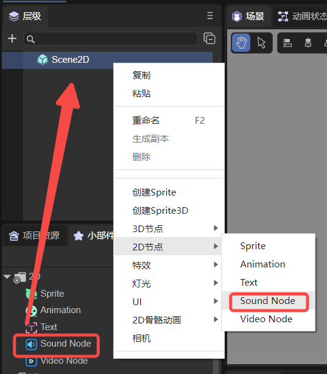
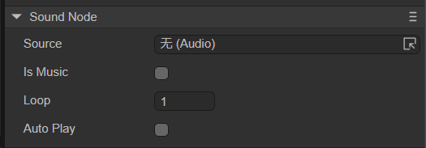

# Audio node (SoundNode)

## 1. Using audio nodes in LayaAir IDE

### 1.1 Create SoundNode

As shown in Figure 1-1, you can right-click in the `'Hierarchy'` window to create it, or you can drag and drop from the `'Widgets'` window to add it.



(Picture 1-1)

### 1.2 Attribute introduction

In the IDE, after adding the SoundNode node to the view area of ​​the scene editor, the exclusive properties of the SoundNode in the property panel are as shown below:



(Figure 1-2)

These properties are introduced below:

| Attribute name | Attribute description	|
| -------- | ------------------------------------------------------------ |
| Source | Add audio file source	|
| IsMusic | Whether it is background music. After checking, the current audio is background music. If there are two audios with IsMusic checked, they cannot be played at the same time, only one can be played. If unchecked, the current audio file can be played simultaneously with background music and other audio |
| Loop 	| The number of times to loop. Set to 0, it is an endless loop; set to 1, it only plays once	|
| AutoPlay | Whether to automatically play when running	|


### 1.3 Script control SoundNode

In the Scene2D property settings panel, add a custom component script. Then, drag the SoundNode into its exposed property entry. Here is a sample code to implement script control of SoundNode:

```typescript
const { regClass, property } = Laya;

@regClass()
export class NewScript extends Laya.Script {
	//declare owner : Laya.Sprite3D;

	@property({ type: Laya.SoundNode })
	public sound: Laya.SoundNode;

	constructor() {
    	super();
	}

	/**
 	* Executed after the component is activated. At this time, all nodes and components have been created. This method is only executed once.
 	*/
	onAwake(): void {
    	this.sound.source = "resources/sound.wav"; //Audio path
    	this.sound.loop = 0; //Loop times setting should be placed before autoPlay parameter setting
    	this.sound.autoPlay = true; //Auto play
    	this.sound.isMusic = false; //Whether it is background music

	}
}
```


## 2. Code to create SoundNode

The SoundNode node only has sound effects at runtime. If you don't want to add and drag it to the property entrance exposed by the decorator in the IDE and do such a cumbersome operation, you can create it through code. In the property settings panel of Scene2D, add a custom component script. The sample code is as follows:

```typescript
const { regClass, property } = Laya;

@regClass()
export class NewScript extends Laya.Script {
	//declare owner : Laya.Sprite3D;

	constructor() {
    	super();
	}

	/**
 	* Executed after the component is activated. At this time, all nodes and components have been created. This method is only executed once.
 	*/
	onAwake(): void {
    	let sound = new Laya.SoundNode();
    	//Add to stage
    	Laya.stage.addChild(sound);
    	sound.source = "resources/sound.wav"; //Audio path
    	sound.loop = 0; //Loop times setting should be placed before autoPlay parameter setting
    	sound.autoPlay = true; //Auto play
    	sound.isMusic = false; //Whether it is background music
	}
}
```


