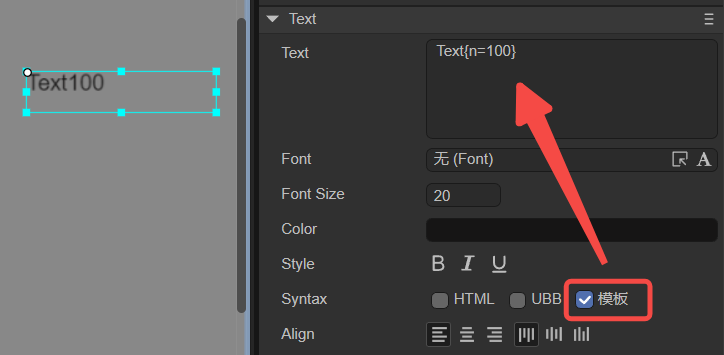
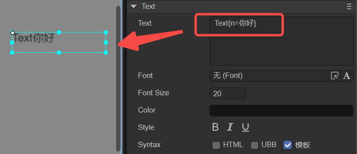

# Basic text (Text)

Text inherits from Sprite and is the basic component of static text. Here we introduce the component properties specific to Text.

## 1. Using Text in LayaAir IDE

### 1.1 Create Text

As shown in Figure 1-1, you can right-click in the `Hierarchy' window to create it, or you can drag and drop from the `Widgets' window to add it.


(Picture 1-1)

### 1.2 Attribute introduction

In the IDE, after we add the Text component to the scene editing view area, the exclusive properties of the Text component in the properties panel are as shown below:


(Figure 1-2)

Below we introduce these properties respectively:

| attribute name	| Property description	|
| -------------- | ------------------------------------------------------------ |
| text       	| The actual content of the text	|
| font       	| Text font, for example: `Microsoft YaHei`, here you can manually enter commonly used fonts, or [bitmap font](../../advanced/useText/readme.md) |
| fontSize	| Text font size, for example: `50`, directly fill in the positive integer	|
| color      	| For the color of the text, you can directly enter the color value, for example: `#ffffff`, or you can click the color picker on the right side of the input bar to select a color |
| style      	| Whether "**B**" (bold) is bold, whether "***I***" (italic) is italic, whether "<u>**U**</u>" is underlined |
| syntax     	| Multi-style mixing, supporting part of HTML syntax and UBB syntax. You can also check the template to be able to use variables in strings |
| align      	| Alignment, horizontal alignment (align) is left (aligned to the left), center (aligned to the center), right (aligned to the right); vertical alignment (valign) is top (aligned to the top), middle (aligned to the center), bottom (bottom alignment) |
| bgColor    	| Background color, after checking, you can directly enter the color value, for example: `#ffffff`, or you can click the color picker on the right side of the input bar to select a color |
| borderColor	| Text border color. After checking, you can directly enter the color value, for example: `#ffffff`, or you can click the color picker on the right side of the input bar to select a color |
| overflow   	| Text overflow processing, there are five modes. visible: Default mode, no cropping is performed. hidden: Do not display characters beyond the text field. scroll: does not display character pixels outside the text area, and supports the scroll interface. See Section 1.4 for details. shrink: When the text exceeds the text area, the text shrinks as a whole to fit in the text box. ellipsis (display ellipsis): When the text field is exceeded, the text is truncated and an ellipsis is displayed at the end of the text |
| becomeWrap	| Whether to automatically wrap lines, a Boolean option, the default is `false`, select `true` to enable automatic line wrapping |
| leading    	| Vertical line spacing, when automatic word wrapping is turned on, it is effective when the text content has multiple lines. The spacing is in pixels, just enter a positive integer |
| padding    	| Text margin, in pixels, consisting of 4 integer values. "U" represents the distance from the upper border, "R" represents the distance from the right border, "D" represents the distance from the bottom border, and "L" represents the distance from the left border |
| underlineColor | Underline color, you can enter the color value directly, for example: `#ffffff`, or you can click the color picker on the right side of the input bar to select the color |
| stroke     	| Stroke width, range is 0~100	|
| strokecolor	| Stroke color, you can directly enter the color value, for example: `#ffffff`, or you can click the color picker on the right side of the input bar to select a color |

The above attributes are relatively easy to understand. Developers only need to adjust the parameters to see the corresponding effects in the IDE. The following only introduces the **"syntax" attribute** in detail.

### 1.3 Syntax attribute

#### 1.3.1 HTML and UBB

If HTML is checked, some HTML syntax is supported; if UBB is checked, UBB syntax is supported, and UBB syntax is more concise than HTML; if both are checked, both syntaxes are supported.

The supported UBB syntax is shown in the following table:

| Grammatical structure	| Sample code	| Statement description	|
| --------------------------- | ------------------------------------- | ------------------ |
| [img]image_url[/img]    	| [img]atlas/comp/image.png[/img]   	| Show a picture	|
| [url=link_href]text[/url] | [url='www.layabox.com']Layabox[/url] | Display a hyperlink |
| [b]text[/b]             	| [b]These words are in bold[/b]	| Set text to bold	|
| [i]text[/i]             	| [i]These words are in italics[/i]	| Set the file to italic	|
| [u]text[/u]             	| [u]These words are underlined[/u]	| Set text underline	|
| [color=#FFFFFF]text[/color] | [color=#FF0000]This is red text[/color] | Set text color	|
| [size=10]text[/size]    	| [size=60]This is a word with a font size of 60[/size] | Set the font size of the text |

> UBB supports nesting between tags. Multiple tags in the above table can be nested. For example, `[color=#FF0000][size=60] red words with size 60[/size] [/color ]`.

The supported HTML syntax is shown in the following table:

| Grammatical structure	| Sample code	| Statement description	|
| ----------------------------------------------- | ------------------------------------------------------------ | -------------------------------------------- |
| `<b>Text</b>`                               	| `<b>This is bold</b>`	| Define bold text	|
| `<i>Text</i>`                               	| `<i>This is italics</i>`	| Define italics	|
| `<u>Text</u>`                               	| `<u>This is underlined text</u>`	| Define underline	|
| `<li>Text1</li> <li>Text2</li> <li>Text3</li>` | `<li>Apple</li> <li>Banana</li> <li>Orange< /li>`	| definition list	|
| `` | `` | Displaying a picture is okay Specify image size using percentages |
| `<a href='xxx'>link text</a>`               	| `<a href='www.layabox.com'>Laya Box</a>`	| Show a hyperlink	|
| `<div> Text </div>`	| `<div>Outermost layer of text</div>`	| div container tag	|
| `<span> Text </span>`                       	| `<span> Multiple spans will not wrap automatically unless the width limit is reached</span>` | Inline elements	|
| `<p>Text</p>`                               	| `<p>Lines will be automatically wrapped between multiple p tags, and each complete p tag is a separate paragraph</p>` | Paragraph	|
| `Text1<br />Text2`                          	| `Line break<br />The following line breaks`	| line feed	|
| `&nbsp;`                                    	| `Leave a blank space here`	| space	|

Let’s look at a specific example, as shown in Figure 1-3. After checking HTML and UBB, you can enter grammatical statements in the Text attribute:


(Figure 1-3)

The sample sentences entered in Text are as follows:

```html


[url='www.layabox.com']LayaBox[/url]

[size=60]text[/size]

[color=#FF0000]text[/color]

[u]text[/u]

[color=#FF0000][size=60]text[/size][/color]
```

The above six statements respectively correspond to the six effects shown in Figure 1-3: loading images, displaying links, font size 60, font color red, underline, and nesting (size and color). There does not need to be a blank line between each statement. There are blank lines in the example to facilitate observation of the effect.

#### 1.3.2 Template

The "syntax" attribute can also check the `template` option. After checking, you can use variables in strings. For example, enter `Text{n=100}` in the Text attribute, and the effect is as shown in Figure 1-4:



(Figure 1-4)

The variable n can also be a string. For example, if you enter `Text{n=Hello}`, the displayed effect is as shown in Figure 1-5. Of course, this variable does not necessarily have to be n, developers can customize the variable name.



(Figure 1-5)

You can also use the `setVar` method to dynamically adjust variable n in the code. You can combine it with the script control in Section 1.3 and enter the following code in the script:

```typescript
const { regClass, property } = Laya;

@regClass()
export class NewScript extends Laya.Script {
	//declare owner : Laya.Sprite3D;

	@property({ type: Laya.Text })
	txt: Laya.Text;

	constructor() {
    	super();
	}

	onAwake(): void {
    	this.txt.text = "Page {n=1}"; //Display the initialization content of the text
	}

	onStart(): void {
    	let page: number = 1;
    	Laya.timer.frameLoop(10, this, () => {
        	page += 1; //In the timer, let the variable page increase by 1 each time
        	this.txt.setVar("n", page); //Use the setVar method to dynamically change the value of the variable n in the text.
    	});
	}
}
```

The effect is shown in the animation 1-6:


(Animation 1-6)

> Note: Variable n can also be text obtained from a .json file. Developers can write a .json file themselves, then load it in the script, and finally use the setVar method to assign a value to variable n.

A common situation in games is that, as shown in Figure 1-7, when each player enters the game, they will encounter a dialogue, and only the character names of different players are different. Then, after using the text template function, there is no need to modify the text as a whole, and you can directly change the variables in the text template. Make dynamic changes of local text easier to use.


(Figure 1-7)


### 1.4 Script control Text

In the Scene2D property settings panel, add a custom component script. Then, drag Text into its exposed property entry. Here is a sample code to implement script control Text:

```typescript
const { regClass, property } = Laya;

@regClass()
export class TextControl extends Laya.Script {
	//declare owner : Laya.Sprite3D;

	@property( { type : Laya.Text } )
	public txt: Laya.Text;

	constructor() {
    	super();
	}

	/**
 	* Executed after the component is activated. At this time, all nodes and components have been created. This method is only executed once.
 	*/
	onAwake(): void {
    	this.txt.pos(Laya.stage.width >> 1, Laya.stage.height >> 1); //位置
    	this.txt.size(500, 30); //Size
    	this.txt.pivot(this.txt.width/2, this.txt.height/2); //轴心点
    	this.txt.text = "Hello everyone, welcome to all developers to use LayaAir IDE, here is the text content of Text, you can debug based on this text"; //Text content
    	this.txt.font = "宋体"; //Font
    	this.txt.fontSize = 50; //Font size
    	this.txt.color = "#ff0000"; //Font color
    	this.txt.bold = true; //bold
    	this.txt.italic = true; //italic
    	this.txt.underline = true; //underline
    	this.txt.underlineColor = "#ff0000"; //Underline color

    	this.txt.stroke = 5; //stroke width
    	this.txt.strokeColor = "#000000" ; //Stroke color

    	this.txt.wordWrap = true; //Automatically wrap lines
    	this.txt.leading = 20; //Vertical line spacing
    	// this.txt.padding = [10, 10, 10, 10]; //Text margins

    	this.txt.align = "center"; //Horizontal alignment
    	this.txt.valign = "top"; //Vertical alignment

    	this.txt.overflow = "visible"; //Text overflow

	}
}
```


Let’s look at another example. This is about the scrolling parameter in the overflow attribute. If the text exceeds the text box, set its overflow attribute to scroll, then you can add the following code to display the exceeded text by dragging the mouse:

```typescript
const { regClass, property } = Laya;

let prevX = 0;
let prevY = 0;

@regClass()
export class UI_Text extends Laya.Script {

    constructor() {
   	 super();
    }

    @property({ type: Laya.Text })
    txt: Laya.Text;

    onAwake(): void {
   	 
   	 this.txt.text =
   		 "Layabox is an HTML5 engine technology provider and an excellent game publisher, providing HTML5 development technology solutions for AS/JS/TS developers!\n" +
   		 "Layabox is an HTML5 engine technology provider and an excellent game publisher, providing HTML5 development technology solutions for AS/JS/TS developers!\n" +
   		 "Layabox is an HTML5 engine technology provider and an excellent game publisher, providing HTML5 development technology solutions for AS/JS/TS developers!\n" +
   		 "Layabox is an HTML5 engine technology provider and an excellent game publisher, providing HTML5 development technology solutions for AS/JS/TS developers!\n" +
   		 "Layabox is an HTML5 engine technology provider and an excellent game publisher, providing HTML5 development technology solutions for AS/JS/TS developers!\n" +
   		 "Layabox is an HTML5 engine technology provider and an excellent game publisher, providing HTML5 development technology solutions for AS/JS/TS developers!";
   	 this.txt.fontSize = 35;
   	 this.txt.size(400,150);
   	 this.txt.borderColor = "#fa1515";
   	 this.txt.overflow = "scroll";
   	 this.txt.on(Laya.Event.MOUSE_DOWN, this, this.startScrollText);
    }

    /* Start scrolling text */
    startScrollText() {

   	 prevX = this.txt.mouseX;
   	 prevY = this.txt.mouseY;

   	 Laya.stage.on(Laya.Event.MOUSE_MOVE, this, this.scrollText);
   	 Laya.stage.on(Laya.Event.MOUSE_UP, this, this.finishScrollText);
    }

    /* Stop scrolling text */
    finishScrollText() {

   	 Laya.stage.off(Laya.Event.MOUSE_MOVE, this, this.scrollText);
   	 Laya.stage.off(Laya.Event.MOUSE_UP, this, this.finishScrollText);
    }

    /* Mouse scroll text */
    scrollText() {

   	 let nowX = this.txt.mouseX;
   	 let nowY = this.txt.mouseY;

   	 this.txt.scrollX += prevX - nowX; //Horizontal scroll distance
   	 this.txt.scrollY += prevY - nowY; //vertical horizontal scrolling distance

   	 prevX = nowX;//After the mouse moves, return to the original position
   	 prevY = newY;
    }

}
```

The effect is as follows:


(Animation 1-8)

This example shows that scrolling is different from hiding in that it does not crop the text that exceeds the text box.

## 2. Code to create Text

Sometimes, you don't want the Text node to be on the stage from the beginning, but add it when you need it. This needs to be created through code. In the property settings panel of Scene2D, add a custom component script. The sample code is as follows:

```typescript
const { regClass, property } = Laya;

@regClass()
export class NewScript extends Laya.Script {
	//declare owner : Laya.Sprite3D;

	constructor() {
    	super();
	}

	/**
 	* Executed after the component is activated. At this time, all nodes and components have been created. This method is only executed once.
 	*/
	onAwake(): void {
    	let txt = new Laya.Text();
    	//Add to stage
    	Laya.stage.addChild(txt);
    	txt.pos(Laya.stage.width >> 1, Laya.stage.height >> 1); //位置
    	txt.size(500, 30); //size
    	txt.pivot(txt.width/2, txt.height/2); //Pivot point
    	txt.text = "Hello everyone, developers are welcome to use LayaAir IDE. Here is the text content of Text. This method is to create Text with code"; //Text content
    	txt.wordWrap = true; //Automatically wrap lines
	}
}
```


