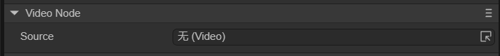

# Video node (VideoNode)

## 1. Using video nodes in LayaAir IDE

### 1.1 Create VideoNode

As shown in Figure 1-1, you can right-click in the `Hierarchy' window to create it, or you can drag and drop from the `Widgets' window to add it.


(Picture 1-1)


### 1.2 Attribute introduction

In the IDE, after adding the VideoNode node to the view area of ​​the scene editor, the exclusive properties of VideoNode in the properties panel are as shown below:



(Figure 1-2)

It has only one Source property, just add the video file to Source.


### 1.3 Script control VideoNode

In Section 1.2, after adding a video file to Source, it cannot be played automatically and needs to be controlled with code. In the Scene2D property settings panel, add a custom component script. Then, drag the VideoNode into its exposed property entry. Here is a sample code to implement script control of VideoNode:

```typescript
const { regClass, property } = Laya;

@regClass()
export class NewScript extends Laya.Script {

	@property({ type: Laya.VideoNode })
	public video: Laya.VideoNode;

	constructor() {
    	super();
	}

	// Executed after the component is activated. At this time, all nodes and components have been created. This method is only executed once.
	onAwake(): void {
    	//Mouse click triggers playback
    	Laya.stage.on(Laya.Event.MOUSE_DOWN, () => {
        	Laya.loader.load("resources/layaAir.mp4").then(() => {
            	this.video.play(); //Play video
        	});
    	})
	}
}
```

If running in LayaAir IDE, VideoNode does not need to trigger playback through events. But in Chrome, autoplay only allows silent autoplay. Allow sounds to play automatically only after user interaction (click, double click, etc.).


# 2. Code to create VideoNode

If you don't want the VideoNode node to be on the stage from the beginning, but add it when you need it, you need to create it through code. In the property settings panel of Scene2D, add a custom component script. The sample code is as follows:

```typescript
const { regClass, property } = Laya;

@regClass()
export class NewScript extends Laya.Script {
	//declare owner : Laya.Sprite3D;

	constructor() {
    	super();
	}

	/**
 	* Executed after the component is activated. At this time, all nodes and components have been created. This method is only executed once.
 	*/
	onAwake(): void {
    	let video = new Laya.VideoNode;
    	//Add to stage
    	Laya.stage.addChild(video);
    	video.pos(200,200); //Set the position
    	video.source = "resources/layaAir.mp4"; //Set the video source file
    	video.play(); //Start playing
	}
}
```


