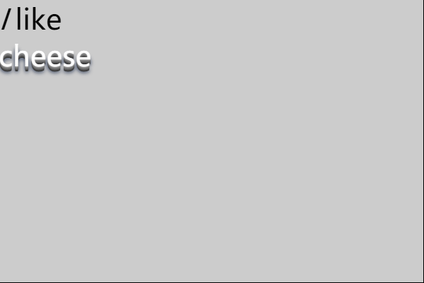
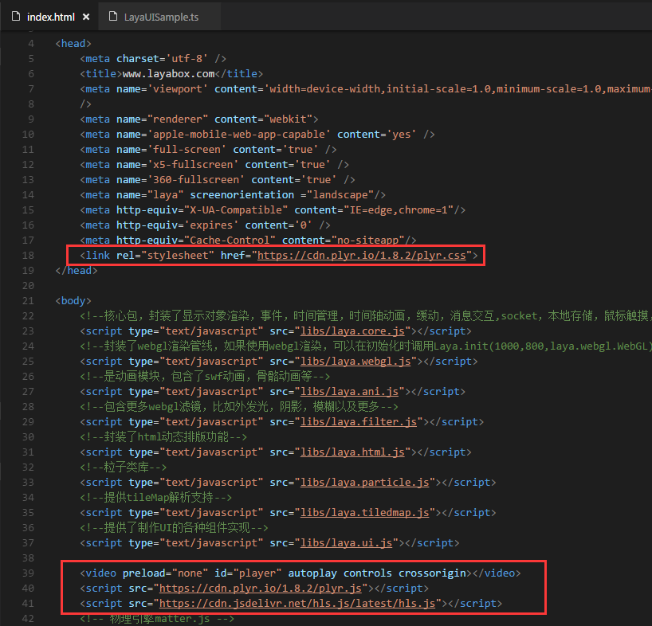

# LayaAir and native Dom

In development projects, developers will inevitably encounter DOM element support, but it is not supported or the support is incomplete in LayaAir. So in this section we will take a look at some techniques encountered in development.


### SVG of LayaAir

What is svg? Probably most developers have heard of this term, or know that it is a vector image description format specified by w3c. We will not describe some definitions and history of svg here. Interested developers can refer to [here](https://ldc.layabox.com/doc/?nav=zh-as-3-4-1). But it is rarely used in projects. However, the power of svg cannot be ignored. Some simple graphics can be described in a few lines of text without the need for network loading. For example, rich artistic characters, strange-shaped graphics, text perspective effects, etc. may be difficult to implement using programs, such as the following:


What to do if there is this kind of text in your project? Maybe what we think of is art producing pictures. Is there an easier way? Here we choose to use svg for processing. We know that using div+css styles in dom elements to display this effect is the simplest and fastest way. So let's use css styles to show this effect. Let's see how a simple script can achieve this effect.

```javascript
var data = '<svg xmlns="http://www.w3.org/2000/svg" width="200" height="200">' +
       	'<foreignObject width="100%" height="100%">' +
       	'<div xmlns="http://www.w3.org/1999/xhtml" style="font-size:40px">' +
         	'<em>I</em> like ' +
         	'<span style="color:white; text-shadow: 0px 1px 0px #999, 0px 2px 0px #888, 0px 3px 0px #777, 0px 4px 0px #666, 0px 5px 0px #555, 0px 6px 0px #444, 0px 7px 0px #333, 0px 8px 7px #001135;">' +
         	'cheese</span>' +
       	'</div>' +
       	'</foreignObject>' +
       	'</svg>';
var DOMURL = window.URL || window.webkitURL || window;
var img = new Image();
var svg = new Blob([data], {type: 'image/svg+xml'});
var url = DOMURL.createObjectURL(svg);
img.src = url;
img.style.position ="absolute";
img.style.zIndex = 99999
document.body.appendChild(img);
```

How to run the above code? Open Google Chrome, open a blank web page, F12, paste the above code into the console, and then press Enter, you can see the effect of the screenshot above. Or create a new html, paste the code in it, and open it with a browser. Isn't it very simple? Then we can modify the displayed text arbitrarily. Developers can modify it and try it out to see the effect. Let’s briefly introduce this code. Among them, data is the data format of svg. For this, please refer to the definition and description of svg.

```
<span style="color:white; text-shadow: 0px 1px 0px #999, 0px 2px 0px #888, 0px 3px 0px #777, 0px 4px 0px #666, 0px 5px 0px #555, 0px 6px 0px #444, 0px 7px 0px #333, 0px 8px 7px #001135;">
//Here is the key point. We set the text effect through the css style supported by svg. Text-shadow sets the css style effect of the text. If the developer wants to change the text style, he can modify the style.
```

The above is in JavaScript, using the native dom element img for display, so what should we do if we want to use it in the game? This is actually very simple. Now that we have used img to display it on the page, the next thing we have to do is how to apply and display this img in the project. Let's create a new project. The code looks like this:

```typescript
var data: string = "data:image/svg+xml," + '<svg xmlns="http://www.w3.org/2000/svg" width="200" height="200">' +
	'<foreignObject width="100%" height="100%">' +
	'<div xmlns="http://www.w3.org/1999/xhtml" style="font-size:40px">' +
	'<em>I</em> like ' +
	'<span style="color:white; text-shadow: 0px 1px 0px #999, 0px 2px 0px #888, 0px 3px 0px #777, 0px 4px 0px #666, 0px 5px 0px #555, 0px 6px 0px #444, 0px 7px 0px #333, 0px 8px 7px #001135;">' +
	'cheese</span>' +
	'</div>' +
	'</foreignObject>' +
	'</svg>';
var sp: Laya.Sprite = new Laya.Sprite();
sp.loadImage(data, 0, 0, 200, 200);
Laya.stage.addChild(sp);
```

Pass the data as the URL to the loadImage method, and the engine will help us load, decode and display it. The parameters in the loadImage method not only receive the URL of the address, but also receive the base64 and svg formats. Compile and run the above code and we see the effect in the picture below.



Summary: The above code gives us a good inspiration. In the project, our special artistic words can be simpler and more convenient using this method. Developers can find some more gorgeous effects on their own, such as 3D perspective effects, mixed graphics and text, shadows, reflections, etc. This method not only reduces the bandwidth of the network, but more importantly, makes it easier for us to modify it from time to time. Once a style is set, it can be applied when exporting in the project. Would it be more efficient and faster if the above method was used instead of bitmap fonts?


### Dom element Image of LayaAir

In HTML5, the image tag is powerful. We don’t want to introduce too much about its features here. Here we introduce simple common forms.

#### QR code

One of the more common functions is to display the current QR code address in the project. The user can recognize it by long pressing. To generate a QR code here, we use a third-party js library to generate a QR code. The class library code can be downloaded from GitHub. This [address] is used here (https://github.com/davidshimjs/qrcodejs).

Create a new project and add the downloaded qrcode.js to index.html. For the API of qrcode, please refer to [address](https://github.com/davidshimjs/qrcodejs). The specific logic code is as follows:

```typescript
var div:any = Laya.Browser.document.createElement("div");
this.qrcode = new Laya.Browser.window.QRCode(div,{
	width:100,
	height:100
});
var url:string = "http://layabox.com/";
this.qrcode.makeCode(url);
Laya.stage.once("click",this,this.clickHandler);
this.qrcodeSp = new Laya.Sprite();
Laya.stage.addChild(this.qrcodeSp);
```

Compile and run the above code, then click on the stage to see that the QR code has been displayed on the stage. You can scan it with your mobile phone and find that your mobile phone has jumped to the official website. **Note: The QR code generated at this time has no response when long pressed in WeChat or the browser, because the QR code generates a canvas tag instead of an image tag. **So if you want to long press to pop up the recognition option, you can only use the image tag. This can be extended by developers themselves.


### Dom element video of LayaAir

#### Live video

In the HTML5 era, video playback basically uses the video tag. If you don’t have rich experience in video playback, the best choice is to use a mature playback plug-in. The currently popular ones are [video.js](https://github.com/videojs/video.js), [hls.js](https://github.com/video-dev/hls.js), [plyr .js](https://github.com/Selz/plyr). It is excellent in terms of compatibility, experience and performance. Official demos of these plug-ins are provided. For example, https://plyr.io/, http://video-dev.github.io/hls.js/demo/, http://codepen.io/sampotts/pen/JKEMqB.

Let's take [Plyr + hls.js](http://codepen.io/sampotts/pen/JKEMqB) as an example to see how we should write it in LayaAir.

Add the following code to the index.html file:



`<link rel="stylesheet" href="https://cdn.plyr.io/1.8.2/plyr.css">`Player style file,

<video preload="none" id="player" autoplay controls crossorigin></video>Add video tag. Name the id "player", which we will use in the program later.

<script src="https://cdn.plyr.io/1.8.2/plyr.js"></script>
<script src="https://cdn.jsdelivr.net/hls.js/latest/hls.js"></script>

This is the class library used by the player. Developers remember to download it to their own projects or servers in the production environment.

The following is the logic of the main class:

```typescript
class LayaUISample {
	constructor() {
    	//Initialize the engine
    	Free.heat(0,0);
    	var Hls:any = Laya.Browser.window.Hls;//Get a reference to Hls.
    	var plyr:any = Laya.Browser.window.plyr;//Get a reference to plyr
    	//Get the video object, which is the tag named "player" on the page
    	var video:any = Laya.Browser.document.querySelector('#player');
    	if(Hls.isSupported()){
        	var hls:any = new Hls();
        	//Load m3u8 source
        	hls.loadSource('http://content.jwplatform.com/manifests/vM7nH0Kl.m3u8');
        	hls.attachMedia(video);
        	hls.on(Hls.Events.MANIFEST_PARSED,function():void{
                	video.play();
        	});
    	}
    	plyr.setup(video);
	}
}
new LayaUISample;
```

Compile and run the code and find that the webpage can already play videos. Developers may notice that when we initialize the engine here, it looks like this:

`Laya.init(0,0);//Initialize the engine`;Set the size to 0 because we have no interaction with the stage here. So we set it to 0 here, we don't even need to initialize it. If the developer's project contains logic that interacts with the stage, you can set the size that suits you.

During the playback process, developers can open Google's console with F12, switch to the Network tab and see that our video is a ts file.


As the playback progresses, more and more files are found. In fact, this is playback based on the [hls](https://developer.apple.com/streaming/) protocol. The basic principle of this technology is to cut video files or video streams into small pieces (ts) and create index files (m3u8). For deeper principles, such as video decoding and video frame data, developers can refer to the following:

https://developer.apple.com/streaming/

https://developer.mozilla.org/zh_CN/docs/Web/API/MediaSource

https://github.com/nickdesaulniers/netfix

https://developer.mozilla.org/en-US/docs/Web/API/HTMLMediaElement

In the above example, we use hls+plyr to play. For other methods, developers please refer to this tutorial for expansion.

#### Camera

The support of HTML5 video as a camera browser is limited, and it requires **https protocol**. The support of Google and the new version of WeChat is still good. If your compatibility requirements are not that high, you can try adding the camera function.

Let's first look at the example given on mdn.

https://mdn.github.io/webaudio-examples/stream-source-buffer/

The developer uses a mobile phone or WeChat to open this address to test the support of your mobile phone.


This is a test connection, and the protocol is https. Developers should pay attention to this when calling the camera. Your remote address must be https.

For more information, please refer here: https://github.com/mdn/webaudio-examples The link here is the sound and video examples given by mdn.

LayaAir also has corresponding packages for cameras. Let’s take a look at how to use them.

```typescript
class Main {
	private video:Laya.Video;
	constructor() {
    	//Initialize the engine
    	Laya.init(Laya.Browser.width,Laya.Browser.height);
    	if(Laya.Media.supported() === false){
        	alert("The current browser does not support");
    	}
    	else{
        	this.showMessage();
        	var options:any = {
            	audio:true,
            	video:{
                	facingMode: { exact: "environment" },	// Rear camera, the default value is, you can also not set it to.
                	width: Laya.stage.width,
                	height:Laya.stage.height
            	}
        	};
        	Laya.Media.getMedia(options,Laya.Handler.create(this,this.onSuccess),Laya.Handler.create(this,this.onError));
    	}
	}
	private showMessage():void{
    	var eg:Laya.Text = new Laya.Text();
    	Laya.stage.addChild(tex);
    	tex.text = "Click the stage to play and pause";
    	tex.color = "#ffffff";
    	tex.fontSize = 100;
    	tex.valign = "middle";
    	tex.align = "center";
    	tex.size(Laya.stage.width,Laya.stage.height);
	}
	private onSuccess(url:string):void{
    	this.video = new Laya.Video(Laya.stage.width,Laya.stage.height);
    	this.video.load(url);
    	Laya.stage.addChild(this.video);
    	Laya.stage.on("click",this,this.onStageClick);
	}
	private onerror(error:Error):void{
    	alert(error.message);
	}
	private onStageClick():void{
    	//Switch play and pause
    	if(!this.video.paused){
        	this.video.pause();
    	}
    	else{
        	this.video.play();
    	}
	}
}
new Main;
```

Compile and run the above example and find that it cannot be opened. This is normal. To run this example, you need to build an https server yourself. Then use your mobile phone to open the index.html corresponding to this address. It is also very simple to build a simple https server. Here we can use Laya's command line tool.

- Download address https://nodejs.org/en/ for installation.

- After the installation is complete, open the cmd command line, enter npm install -g layacmd and wait for the installation to complete.

- Find the index.html we just compiled. Hold down shift+right click to open the cmd window here and enter layacmd open, and then a static server of http and htpps will be started. According to the address output from the command line, we then use the mobile Google Chrome or WeChat to access this address. For example, here is https://10.10.20.34:8001/index.html.

 

### LayaAir's dom element File

In project development, we may need to allow users to upload pictures. We need to use the file tag of html5 for this (**WeChat needs to use the interface provided by WeChat. We will talk about the following tutorials specifically in the WeChat tutorial. Other browsers may also have compatibility issues**). Below we write a simple example.

```typescript
class Main {
	private video:Laya.Video;
	constructor() {
    	//Initialize the engine
    	Laya.init(100,100);
    	var file:any = Laya.Browser.document.createElement("input");
    	file.type = "file";
    	file.style.position = "absolute";
    	file.style.zIndex = 999;
    	Laya.Browser.document.body.appendChild(file);//Add to the stage
    	var fileReader:any = new  Laya.Browser.window.FileReader();
    	file.onchange = function(e:any):void
    	{
        	if(file.files.length){
            	fileReader.readAsDataURL(file.files[0]);
        	}
    	};
    	fileReader.onload = function(evt):void
    	{  
        	if(Laya.Browser.window.FileReader.DONE == fileReader.readyState)
        	{
            	var sp:Laya.Sprite = new Laya.Sprite();
            	sp.loadImage(fileReader.result,0,0,300,300);
            	Laya.stage.addChild(sp);
        	}
    	}
	}
}
new Main;
```

Compile the above code and click the button. Select a picture file or camera to take a photo, and find that the picture has been displayed on the stage. Then a simple program to call the photo album or camera is completed. But we found this "button" to be very ugly. So how to change the button style? This needs to be handled with the help of css style. The traditional approach is to set the transparency value of this button to 0, and then place a button that overlaps it instead. By changing his style through this illusion, he is actually the one who clicked. It’s just that users can’t feel it. So let's modify it and see how to change the style.

```typescript
//Create a hidden file and align it with the button. The position is consistent. Here we default to the 0 o'clock position.
var file:any = Laya.Browser.document.createElement("input");
//Set file style
file.style="filter:alpha(opacity=0);opacity:0;width: 150px;height:60px;";
file.type = "file"; //The setting type is file type.
file.accept="image/png";//Set the file format to png;
file.style.position ="absolute";
file.style.zIndex = 999;
```

Take a look at the complete code below:

```typescript
class Main {
	private video:Laya.Video;
	constructor() {
    	//Initialize the engine
    	Laya.init(100,100);
    	var skins:any = ["res/a.png"];
    	Laya.loader.load(skins,Laya.Handler.create(this,this.onUIAssetsLoaded));
	}
	private onUIAssetsLoaded():void{
    	var btn:Laya.Button = new Laya.Button("res/a.png");
    	Laya.stage.addChild(btn);
    	//Create a hidden file and align it with the button. The position is consistent. Here we default to the 0 o'clock position.
    	var file:any = Laya.Browser.document.createElement("input");
    	//Set file style
    	file.style="filter:alpha(opacity=0);opacity:0;width: 150px;height:60px;";
    	file.type = "file"; //The setting type is file type.
    	file.accept="image/png";//Set the file format to png;
    	file.style.position ="absolute";
    	file.style.zIndex = 999;
    	Laya.Browser.document.body.appendChild(file);//Add to page;
    	var fileReader:any = new  Laya.Browser.window.FileReader();
    	file.onchange = function(e:any):void
    	{
        	if(file.files.length>0)
        	{
            	fileReader.readAsDataURL(file.files[0]);
        	}
    	};
    	fileReader.onload = function(evt):void
    	{  
        	if(Laya.Browser.window.FileReader.DONE == fileReader.readyState)
        	{
            	var sp:Laya.Sprite = new Laya.Sprite();
            	sp.loadImage(fileReader.result,0,0,100,100);
            	Laya.stage.addChild(sp);
        	}
    	};
	}
}
new Main;
```

Compile and run the code, and you can see that the ugly dom button is gone. When we click our customized button, we can also select pictures and display them on the stage.

In the above example, we overlapped it at the origin, set the transparency to 0, and disguised it as invisible. Developers can try to put it in other locations for testing. This tutorial does not cover the specific implementation. For other file APIs, please refer to the relevant instructions of mdn and w3c. In addition to displaying on the stage, there may also be uploading operations to the server. In this case, FormData can be used. This developer can try it.


### LayaAir's dom element script tag

Sometimes our projects have a lot of large js files. Loading them all at once is not only a waste of traffic, but also causes page lags, resulting in an extremely poor user experience. Although compression and obfuscation can be used to reduce the size, the amount of code will be very large for a slightly larger project. Or the local js file is unnecessary when the first screen is loaded. At this time, we need to load it at the appropriate time, so splitting the files and modules is very necessary. Splitting the file involves out-of-the-box loading. Then the script tag will come in handy at this time.

This function can be achieved by loading the remote script through the script's src. It can also be achieved by setting the innerHTML of the script. Of course, there is also the third type of eval. Below we explain the usage in each of these situations.

#### Achieved by setting src

Script creation can be added to the page manually or dynamically created through code. Here we take code creation as an example to illustrate. Let’s get into the code first.

The code logic is as follows:

```typescript
class Main {
	private video:Laya.Video;
	constructor() {
    	//Initialize the engine
    	Laya.init(500,500);
    	var script:any = Laya.Browser.document.createElement("script");
    	script.src = "demo1.js";
    	script.onload = function():void{
        	//Load the completion function and start calling the module's functions.
        	//new an object in js
        	var client:any = new Laya.Browser.window.Demo1();
        	client.start();
    	}
    	script.onerror = function():void{
        	//Load error function
    	}
    	Laya.Browser.document.body.appendChild(script);
	}
}
new Main;
```

Then create a new js file, the simple code is as follows:

```typescript
var Demo1 = (function () {
	function Client() {
	}
	Client.prototype.start = function () {
    	// body...
    	console.log("Calling method");
	};
	return Client;
})();
console.log("I was loaded in");
```

Below we briefly explain these two pieces of code.

`var script:any = Laya.Browser.document.createElement("script");`Create a script tag.

`script.src = "demo1.js";`Set the path of js to be loaded.

`script.onload = ...` and `script.onerror =....` are callback functions for loading completion and loading failure respectively.

`Laya.Browser.document.body.appendChild(script);`Adds the created script tag to the page.

`var client:any = new Laya.Browser.window.Demo1();`Instantiate the class declared by js.

`client.start();`Calls the function of the instance.

Compile and run the above code. Open Google's console and you can see the output:

**"I'm loaded in"**

**"Call method"**

#### Setting via innerHTML of script

Setting innerHTML is actually assigning the text format of js to innerHTML. We can use the format of the loaded file to convert the remotely loaded file into text content and assign it to the tag. Take a look at an example below.

```typescript
class Main {
	private video:Laya.Video;
	constructor() {
    	//Initialize the engine
    	Laya.init(500,500);
    	var httpreq:Laya.HttpRequest = new Laya.HttpRequest();
    	httpreq.on(Laya.Event.COMPLETE,this,this.completeHandler);
    	httpreq.on(Laya.Event.ERROR,this,this.errorHandler);
    	httpreq.send("demo1.js");
	}
	private completeHandler(e:any):void{
    	var script:any = Laya.Browser.document.createElement("script");
    	Laya.Browser.document.body.appendChild(script);
    	script.innerHTML = e;
    	var client:any = new Laya.Browser.window.Demo1();
    	client.start();
	}
	private errorHandler(e:any):void{
	}
}
new Main;
```

Compile and run the above code, and you can see that the effect is the same as loading with src. This example uses HttpRequest to load a file and then assigns the loaded content to script.innerHTML. The tag parses and executes js by itself. Of course, this example uses HttpRequest to load, and developers can also use the Laya.loader.load method to load.

#### eval method to load

```typescript
private completeHandler(e:any):void
{
      Laya.Browser.window.eval(e);
      var client:any = new Laya.Browser.window.Demo1();
      client.start();
}
```

```
 
We changed the previous loading completion function to `Laya.Browser.window.eval(e);` and then compiled and opened the console and found that the effect was the same. This has nothing to do with the script tag.
 
Summary: The above three common methods can all realize dynamic loading of js files. What are the differences between the three methods?
 
- The script tag src loads a js file. This js file can be from a different source than the current page, which means it can be loaded across domains.
 
- The script.innerHTML method receives the text format of a js file and uses the XMLHttpRequest method to load it, so the file cannot cross domains, or it can only be loaded. The advantage is that the js file can be customized in format, such as encryption. , interspersed with other formats, then loaded in binary format, and decoded into real js in the program.
 
- The eval method is basically the same as the script.innerHTML method. The content loaded is also very random. However, eval is not recommended. It is an almost abandoned method and is not recommended in terms of performance or security. For specific reasons, please see mdn’s explanation.
 
  [https://developer.mozilla.org/zh-CN/docs/Web/JavaScript/Reference/Global_Objects/eval。](https://developer.mozilla.org/zh-CN/docs/Web/JavaScript/Reference/Global_Objects/eval)
 
  **In fact, we can also put the loading method into the worker, which further reduces the rendering pressure and lag of the page. Developers can read the worker's tutorials for divergence. **
 
 
 
### LayaAir’s dom element sound
 
Speaking of the sound of HTML5, developers may first think of the audio tag, but the audio tag is extremely useless for development projects. Today we are talking about another interface. The Audio API provided by HTML5 for JavaScript programming allows us to have Ability to directly operate the original audio stream data in the code and process and recreate it arbitrarily. For audio api, w3c provides me with enough [interface](https://www.w3.org/TR/webaudio/), in [mdn](https://developer.mozilla.org/zh-CN/ docs/Web/API/AudioContext) The above introduction is also more detailed. On browsers with relatively complete support, the sound API can produce extremely rich visual effects. Since the sound API is extremely rich, we will introduce it here and briefly introduce its usage. As for audio synthesis, mixing, sound effects, spectrum analysis of audio data, adding filters to audio, such as improving the timbre, etc. Developers can check mdn or related information. .
 
Let’s first look at an example on mdn. In this example, create a 2-second buffer and fill it with white noise, then pass it to Play it. Its function is explained in the comments.
 
  ```javascript
  var audioCtx = new (window.AudioContext || window.webkitAudioContext)();
  // Stereo
  var channels = 2;
  // Create an empty two-second stereo buffer at the
  // sample rate of the AudioContext
  var frameCount = audioCtx.sampleRate * 2.0;
  var myArrayBuffer = audioCtx.createBuffer(2, frameCount, audioCtx.sampleRate);
  window.onclick = function() {
  	// Fill the buffer with white noise;
  	//just random values between -1.0 and 1.0
  	for (var channel = 0; channel < channels; channel++) {
      	// This gives us the actual ArrayBuffer that contains the data
      	var nowBuffering = myArrayBuffer.getChannelData(channel);
      	for (var i = 0; i < frameCount; i++) {
          	// Math.random() is in [0; 1.0]
          	// audio needs to be in [-1.0; 1.0]
          	nowBuffering[i] = Math.random() * 2 - 1;
      	}
  	}
  	// Get an AudioBufferSourceNode.
  	// This is the AudioNode to use when we want to play an AudioBuffer
  	var source = audioCtx.createBufferSource();
  	// set the buffer in the AudioBufferSourceNode
  	source.buffer = myArrayBuffer;
  	// connect the AudioBufferSourceNode to the
  	// destination so we can hear the sound
  	source.connect(audioCtx.destination);
  	// start the source playing
  	source.start();
  }
```

Run the above js code, click the page and you will hear the sound played. So how to write it using LayaAir?

  ```typescript
  var audioCtx: any = new (Laya.Browser.window.AudioContext || Laya.Browser.window.webkitAudioContext)();
  //Stereo
  var channels: number = 2;
  // Create an empty two-second stereo buffer at the
  // sample rate of the AudioContext
  var frameCount: number = audioCtx.sampleRate * 2.0;
  var myArrayBuffer: any = audioCtx.createBuffer(2, frameCount, audioCtx.sampleRate);
  Laya.stage.on(Laya.Event.CLICK, this, function (): void {
  	// Fill the buffer with white noise;
  	//just random values between -1.0 and 1.0
  	for (var channel: number = 0; channel < channels; channel++) {
      	// This gives us the actual ArrayBuffer that contains the data
      	var nowBuffering: Object = myArrayBuffer.getChannelData(channel);
      	for (var i: number = 0; i < frameCount; i++) {
          	// Math.random() is in [0; 1.0]
          	// audio needs to be in [-1.0; 1.0]
          	nowBuffering[i] = Math.random() * 2 - 1;
      	}
  	}
  	// Get an AudioBufferSourceNode.
  	// This is the AudioNode to use when we want to play an AudioBuffer
  	var source: any = audioCtx.createBufferSource();
  	// set the buffer in the AudioBufferSourceNode
  	source.buffer = myArrayBuffer;
  	// connect the AudioBufferSourceNode to the
  	// destination so we can hear the sound
  	source.connect(audioCtx.destination);
  	// start the source playing
  	source.start();
  });
  ```

Compile and run the above example, click the stage, and you will hear the sound played. This example is very simple, just build a sound in memory. So what should I do if it is loaded externally?

In the following example, we load a sound file externally. By the way, let's draw the frequency spectrum of the sound.

  ```typescript
  class Main {
  	private AudioContext:any;
  	private audioContext:any;
  	private analyser:any;
  	private audioBufferSourceNode:any;
  	constructor() {
      	//Initialize the engine
      	Release.heat(500, 500);
      	AudioContext = Laya.Browser.window.AudioContext || Laya.Browser.window.webkitAudioContext;
      	this.audioContext = new AudioContext();
      	this.analyser = this.audioContext.createAnalyser();
      	this.analyser.fftSize = 256;
      	Laya.stage.once(Laya.Event.CLICK,this,this.clickHandler);
  	}
  	private clickHandler(e:any):void
  	{
      	var http:Laya.HttpRequest = new Laya.HttpRequest();
      	http.on(Laya.Event.COMPLETE,this,this.completeHandler);
      	http.send("res/3.mp3","","get",Laya.Loader.BUFFER);
  	}
  	private completeHandler(e:any):void
  	{
      	this.audioContext.decodeAudioData(e,this.decodeAudioData.bind(this));
  	}
  	private decodeAudioData(buffer:any):void
  	{
      	this.audioBufferSourceNode = this.audioContext.createBufferSource();
      	this.audioBufferSourceNode.connect(this.analyser);
      	this.analyser.connect(this.audioContext.destination);
      	this.audioBufferSourceNode.buffer = buffer;
      	this.audioBufferSourceNode.start(0);
      	Laya.timer.loop(1,this,this.drawHandler);
  	}
  	private drawHandler():void
  	{
      	Laya.stage.graphics.clear();
      	var dataArray:Uint8Array = new Uint8Array(this.analyser.frequencyBinCount);
      	this.analyser.getByteFrequencyData(dataArray);
      	var step:number = Math.round(dataArray.length / 60);
      	for (var i:number = 0; i < 40; i++) {
          	var energy:number = (dataArray[step * i] / 256.0) * 50;
          	for (var j:number = 0; j < energy; j++) {
              	Laya.stage.graphics.drawLine(20 * i + 2, 200 + 4 * j,20 * (i + 1) - 2, 200 + 4 * j,"#ff0000",1);
              	Laya.stage.graphics.drawLine(20 * i + 2, 200 - 4 * j,20 * (i + 1) - 2, 200 - 4 * j,"#ffff00",1);
          	}
          	Laya.stage.graphics.drawLine(20 * i + 2, 200,20 * (i + 1) - 2, 200,"#ff0000",1);
      	}
  	}
  }
  new Main;
  ```

Compile and run the above project, click on the stage to see that the spectrum of the sound is displayed. As shown below:


Summary: It can be seen that the sound function of the web is getting more and more powerful. If the compatibility of some low-end machines is not considered, it is completely possible to make a web player. This is just a spectrum effect. Developers can try mixing, adding filters to the sound, and other functions. The relevant API can be found in mdn.


### LayaAir's dom element iframe

When inserting some third-party websites, we generally use iframes, and even third-party channels basically use iframes to embed an application. We will also encounter the use of iframes in our projects. The following example demonstrates the application of iframe in the project.

The code looks like this:

  ```typescript
  var iframe:any = Laya.Browser.document.createElement("iframe");
  iframe.style.position="absolute";//Set layout positioning. This cannot be missing.
  iframe.style.zIndex = 100;//Set level
  iframe.style.left ="100px";
  iframe.style.top ="100px";
  iframe.src = "http://ask.layaair.com/";
  Laya.Browser.document.body.appendChild(iframe);
  ```

What developers need to remind here is to remember to set the positioning and level. Many developers are not careful, causing the iframe to run under the game layer and not be visible.

