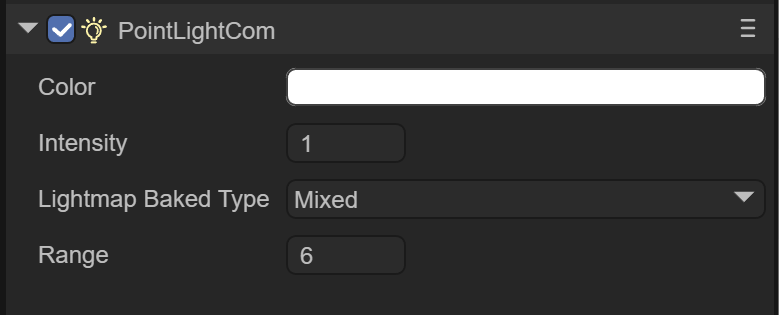
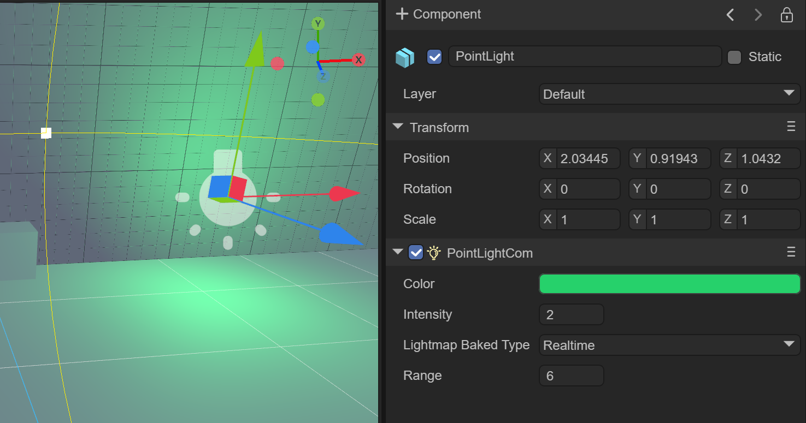
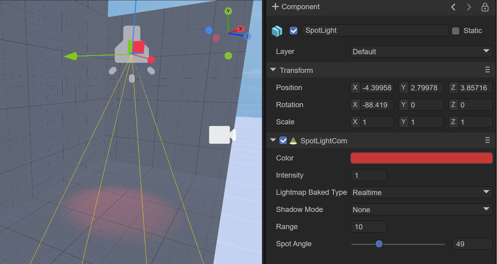
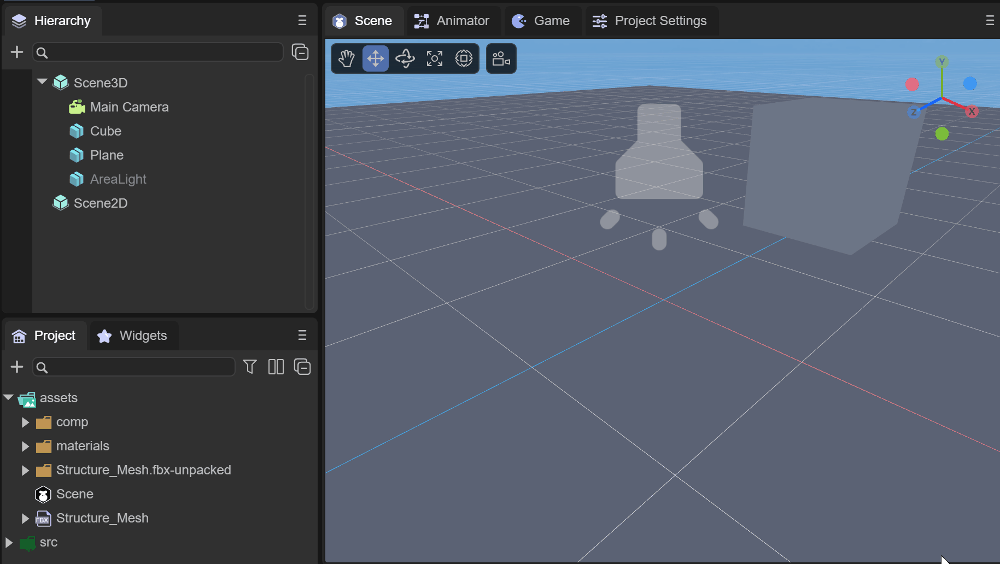
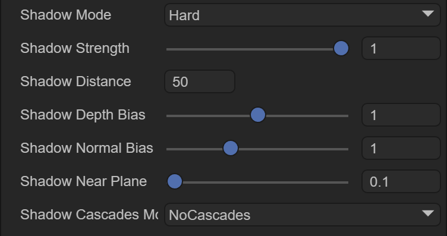
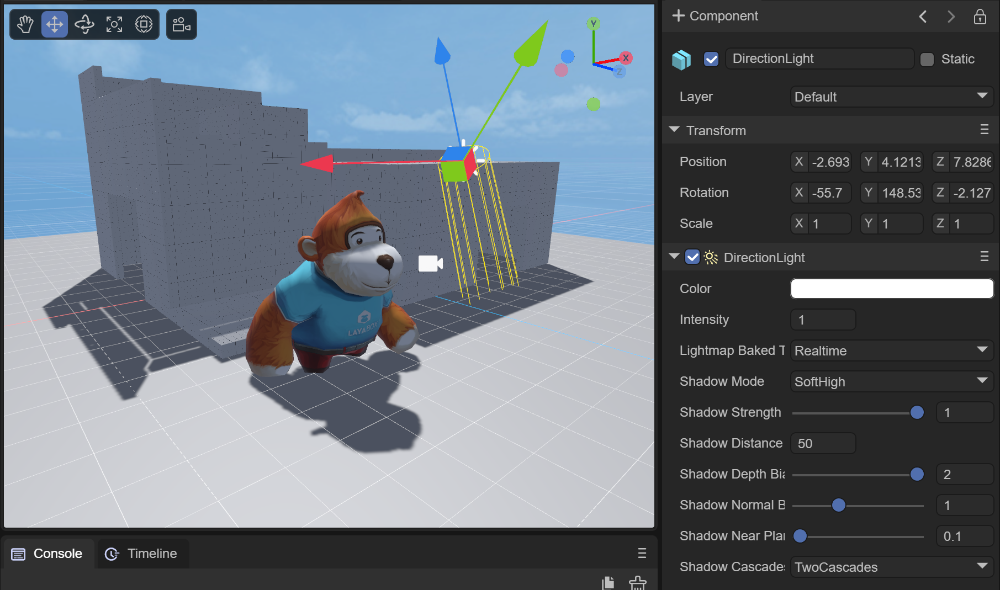
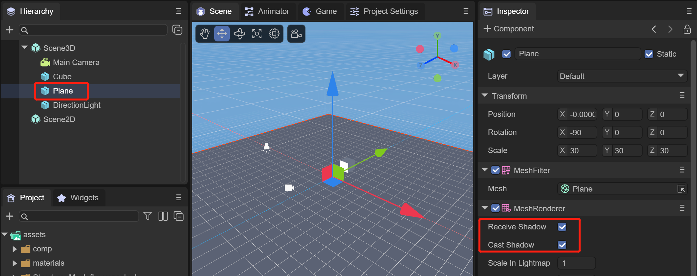
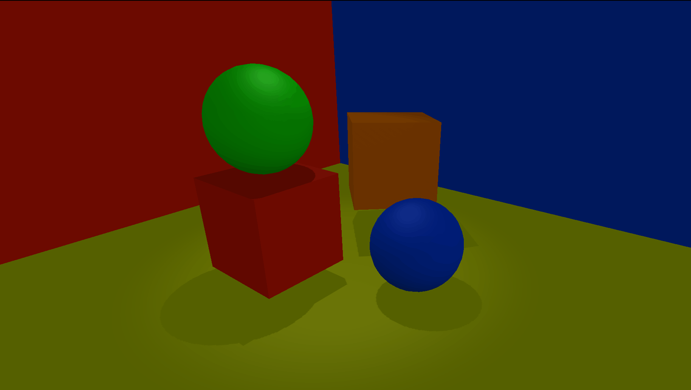
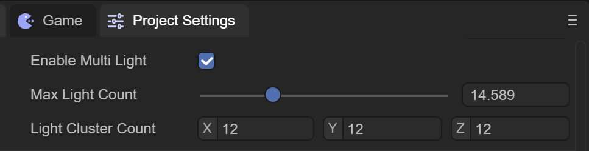

# Use 3D lights and shadows


## 1. Overview

Light sources are an important part of every scene. Grids and textures determine the shape and appearance of an object, but light sources determine the color and mood of your environment. There are many types of lights. Different light sources present different effects and different parameters can be set.

The current types of light sources include:

- **DirectionLight (parallel light)**
- **PointLight**
- **SpotLight**
- **AreaLight**

This article will explain these four light sources one by one.


## Second, PointLight

PointLight (point light source) is a light source that emits light in all directions, also known as omnidirectional light or spherical light. In reality, point light sources such as light bulbs and candles can feel that point light sources have intensity, color, and attenuation radius attributes.

As shown in Figure 2-1, in a building surrounded by walls, the point light source created in it can set the light source effect by setting the intensity, color, and radius.


(Figure 2-1)


### 2.1 Create point light source


(Animation 2-2)

As shown in the animation 2-2, under Scene3D or any node, right-click the mouse and select Light, then click PointLight to create a point light source in the scene.


### 2.2 Component properties

#### 2.2.1 Basic attributes

As shown in Figure 2-3, after creating a PointLight, there will be the following properties in the Inspector property panel



(Figure 2-3)

`Color`: the color of the point light source


(Figure 2-4)

`Intensity`: The intensity of the point light source



(Figure 2-5)

`Range`: Set the range of the point light source, which is equivalent to the illumination range of the point light source. The larger the value, the greater the illumination range.


(Figure 2-6)

`Lightmap Bake Type`: Light source mode

`Mixed`: mixed light source

 Hybrid lights combine real-time lights and light baking. You can use Mixed Lights to combine dynamic shadows with baked lighting from the same light source, or use Mixed Lights when you want a light to provide direct realtime illumination and baked indirect lighting. The properties of a blended light can be changed at runtime. Doing so will update the light's realtime lighting, but not the baked lighting. Since blended lights always combine at least some real-time and some baked lights, blended lights always involve more runtime calculations than fully baked lights and use higher memory than fully real-time lights.

`Realtime`: real-time light source

LayaAir performs lighting calculations for real-time lights at runtime, once per frame. You can change the properties of a real-time light source at runtime, creating effects such as a flickering light bulb or a torch passing through a dark room.

Real-time lights can be used to provide lighting and cast shadows on characters or movable geometry. Performing runtime calculations for real-time lights can be expensive.

`Baked`: Baked light source

LayaAir performs calculations for baked lights and saves the results to disk as lighting data. This process is called baking. At runtime, LayaAir will load the baked lighting data and use this data to light the scene. Since complex calculations are performed upfront, baking lights reduces shading costs at runtime and reduces shadow rendering costs. Baked lights can be used to illuminate objects that do not change at runtime, such as scenes.

#### 2.2.2 Baking properties

As shown in Figure 2-7, when the Lightmap Bake Type is selected as Baked, three parameters will appear below. This function is for setting the baking effect in advance.

Since the baking effect can only be seen after baking is executed, it is possible to repeatedly adjust the following parameters to continuously bake the best results.

 

(Figure 2-7)

 `Box`: cubic skybox

`Dome`: spherical skybox

`Material`: Specifies the material of the sky box

`Power`: Light intensity for baking

`Radius`: baked lighting radius

`Max Bounces`: The maximum number of bounces of baked light


(Figure 2-8)

Figure 2-8 shows the baked effect of adding multiple point light sources to an architectural scene.


### 2.3 Use code settings

```typescript
//Create point light source
var pointLight: PointLight = (<PointLight>this.scene.addChild(new PointLight()));
//Color of point light source
pointLight.color = new Color(1.0, 0.5, 0.0, 1);
pointLight.transform.position = new Vector3(0.4, 0.4, 0.0);
//Set the range of point light source
pointLight.range = 3.0;
//Set the intensity of the point light source
pointLight.intensity = 2;
```


## 3. DirectionLight

Direction Light is quite different from point light. It has a fixed direction, which can be set by the radian value. It also has no attenuation and illumination range, and will illuminate all models in the entire scene. In the 3D world, it is often used to simulate fixed-direction sunlight.

When creating a new 3D scene, DirectionLight comes by default.

As shown in Figure 3-1, in a scene, by adjusting the angle of parallel light, the lighting effect of the scene can be adjusted.


(Animation 3-1)


### 3.1 Create directional light


(Animation 3-2)

As shown in the animation 3-2, under Scene3D or any node, right-click the mouse and select Light, then click DirectionLight to create a directional light in the scene.


### 3.2 Component properties

#### 3.2.1 Basic attributes

As shown in Figure 3-3, after creating a DirectionLight, there will be the following properties in the Inspector property panel


(Figure 3-3)

`Color`: the color of directional light


(Figure 3-4)

`Intensity`: the intensity of parallel light


(Figure 3-5)

`Lightmap Bake Type`: Light source mode, the same as point light source

`Shadow Mode`: Shadow mode

`Shadow Cascades Mode`: Shadow cascade mode


(Animation 3-6)

As shown in the animated picture 3-6, you can turn on the shadow mode effect and adjust the angle of the parallel light at the same time. You can see the shadow change accordingly. We will introduce shadows in Chapter 6

#### 3.2.2 Baking properties

As shown in Figure 3-7, when the Lightmap Bake Type is selected as Baked, three parameters will appear below. This function is for setting the baking effect in advance.

 

(Figure 3-7)

`Power`: Light intensity for baking

`Radius`: the lighting angle for baking

`Max Bounces`: The maximum number of bounces of baked light


### 3.3 Use code settings

```
//Color of directional light
this.directionLight.getComponent(Laya.DirectionLightCom).color.setValue(1, 1, 1, 1);
//Set the direction of parallel light
var mat: Matrix4x4 = this.directionLight.transform.worldMatrix;
mat.setForward(new Vector3(-1.0, -1.0, -1.0));
this.directionLight.transform.worldMatrix = mat;
```

 **setForward** The direction of parallel light represents the direction on the x, y, and z axes respectively. Negative numbers are the negative axis, positive numbers are the positive axis. The value range is -1-0-1, and -1 after exceeding the range. Or 1, beginners can set the value within this range to observe changes in direction.


(Animation 3-8)

As shown in the animated picture 3-8, set the parallel light rotation to see the effect.


## 4. SpotLight

SpotLight Spotlight refers to the light emitted from the direction of a specific light source, such as flashlights, stage downlights, etc. The illuminated area gradually enlarges according to the distance factor, and there is also attenuation at the edge of the illuminated area.

As shown in Figure 4-1, in a scene, by adjusting the cone angle of the spotlight, the lighting effect of the scene can be adjusted.


(Animation 4-1)


### 4.1 Create spotlight


(Animation 4-2)

As shown in the animation 4-2, under Scene3D or any node, right-click the mouse and select Light, then click SpotLight to create a spotlight in the scene.


### 4.2 Component properties

#### 4.2.1 Basic attributes

As shown in Figure 4-3, after creating a SpotLight, there will be the following properties in the Inspector property panel


(Figure 4-3)

`Color`: the color of the spotlight



(Figure 4-4)

`Range`: The irradiation range of spotlight, similar to point light. The difference is that spotlight has direction, while point light has no direction.


(Figure 4-5)

`Spot Angle`: The cone angle of the spotlight. The smaller the value, the smaller the focusing aperture, and vice versa.


(Figure 4-6)

#### 4.2.2 Baking properties

As shown in Figure 4-7, when the Lightmap Bake Type is selected as Baked, five parameters will appear below. This function is for setting the baking effect in advance.

 

(Figure 4-7)

`Power`: Light intensity for baking

`Radius`: baked lighting radius

`Max Bounces`: The maximum number of bounces of baked light

`Spot Size`: The size of the spotlight

`Blend`: blending ratio, between 0-1


### 4.3 Use code settings

```typescript
//spotlight
var spotLight = scene.addChild(new Laya.SpotLight()) as Laya.SpotLight;
//Set spotlight color
spotLight.color = new Laya.Vector3(1, 1, 0);
//Set the spotlight position
spotLight.transform.position = new Laya.Vector3(0.0, 1.2, 0.0);
//Set the spotlight direction
var mat = spotLight.transform.worldMatrix;
mat.setForward(new Laya.Vector3(0.15, -1.0, 0.0));
spotLight.transform.worldMatrix = mat;
//Set the spotlight range
spotLight.range = 6.0;
//Set the spotlight cone angle
spotLight.spotAngle = 32;
```

 **setForward** The direction of parallel light represents the direction on the x, y, and z axes respectively. Negative numbers are the negative axis, positive numbers are the positive axis. The value range is -1-0-1, and -1 after exceeding the range. Or 1, beginners can set the value within this range to observe changes in direction.


(Animation 4-8)

As shown in the animation in Figure 4-8, set the spotlight to rotate to see the effect.


## 5. AreaLight

AreaLight Area lights can be defined by one of two shapes in space: a rectangle or a disk. An area light emits light from one side of the shape. The emitted light spreads evenly in all directions over the surface area of ​​the shape. The intensity of illumination provided by an area light decreases at a rate determined by the inverse square of the distance from the light source (see the inverse square law). Because this lighting calculation is very processor intensive, area lights are not available at runtime and can only be baked into lightmaps.

Because area lights illuminate objects from several different directions at once, shadows tend to be softer and more detailed than other light types. You can use this light source to create a realistic street light or a row of lights close to the player. Small area lights can simulate smaller light sources (such as indoor lighting), but the effect is more realistic than point lights.

As shown in Figure 5-1, in a scene, the lighting effect of the scene can be adjusted by adjusting the size and diffusion of the area light.


(Animation 5-1)

### 5.1 Create area light



(Animation 5-2)

As shown in the animation 5-2, under Scene3D or any node, right-click the mouse and select Light, then click AreaLight to create an area light in the scene.

### 5.2 Component properties

#### 5.2.1 Basic attributes

As shown in Figure 5-3, after creating an AreaLight, there will be the following properties in the Inspector property panel


(Figure 5-3)

`Color`: the color of the area light

`Intensity`: The intensity of the area light

`Shape`: the shape of the area light

`Rect`: rectangle

`Elliptic`: circle

`Spread`: spread

#### 5.2.2 Baking properties

`Max Bounces`: The maximum number of bounces for baking


## 6. How to add shadows to lights

The shadow is the instant shadow produced when the light shines on the model, which can change with the change of light angle, light intensity, model position, etc. Projection is one of the most important factors in the 3D world, which can produce a stronger three-dimensional sense.

Real-time shadowing consumes very much performance and cannot be used too much, especially in game scenes where the model volume is large. Generally, we do not use real-time projection, but use static light maps.


#### 6.1 Shadow properties of light

To create shadows in the scene, we need to understand the following properties of light, which are possessed by every light source

##### 6.1.1 Shadow Mode


(Figure 6-1)

`ShadowMode`: Shadow mode, divided into four modes:

`None`: no shadow is generated

 `Hard`: Hard shadow, lower performance requirements


(Figure 6-1-1)

`SoftLow`: low-intensity soft shadow, with average performance requirements


(Figure 6-1-2)

 `SoftHigh`: high-intensity soft shadows with high performance requirements


(Figure 6-1-3) The best effect

The difference between hard shadow and soft shadow: Hard shadow refers to a dark, uniform and well-defined shadow produced by an ideal electric light source (i.e. a single light source with good light gathering performance). It only contains the umbra of the object. . Soft shadows are shadows with soft boundaries and a certain degree of excessive light and dark produced by line, surface or volume light sources. It includes the umbra and penumbra of the object. When an object is completely in shadow, it is in the umbra domain, and when an object is partially illuminated, it is in the penumbra domain.

##### 6.1.2 Shadow properties

When we select a shadow mode, we can see the properties for setting the shadow



(Figure 6-2)

`shadowStrength`: Shadow strength. The larger the value, the more obvious the shadow.


(Animation 6-2-1)

`shadowDistance`: The range of shadows generated by the light. The range refers to the distance from the camera to the model. Models beyond this range will not generate shadows or accept shadows. Developers can set it according to the scene size.


(Figure 6-2-2)

In Figure 6-2-2, the effect when `shadowDistance` is 8

`shadowDepthBias`: The shadow map is offset based on depth. Offsetting the depth can effectively solve shadow acne ("shadow acne"). But it needs to be reminded that when `shadowDepthBias` is too large, it will cause the shadow to separate from the object, that is, the "Peter Panning" phenomenon occurs.

`shadowNormalBias`: The shadow map is based on the normal offset, which offsets the surface of the shadow Caster in the opposite direction of the normal direction to prevent the appearance of self-shadow ("shadow acne") artifacts. Larger values ​​provide better protection against "shadow acne", but at the cost of making the shadow shape smaller than the actual object.

`shadowNearPlane`: The near plane of the shadow frustum. You can set the near plane of the shadow frustum.

##### 6.1.3 Cascade mode of shadows

 

(Figure 6-3)

`shadowCascadesMode`: The cascade mode of shadows. The larger the number, the more sub-view frustum the view frustum is divided into when generating shadow maps, the more corresponding shadow maps there are, and the better the shadow quality will be.


`TwoCascades`: Two-level cascade shadow segmentation ratio.



(Figure 6-3-1)

In Figure 6-3-1, the effect of `TwoCascades`


`FourCascades`: Four-level cascade shadow division ratio, X, Y, Z are their division ratios in order, Z must be greater than Y, Y must be greater than X.


(Figure 6-3-2)

In Figure 6-3-2, the effect of `FourCascades`


#### 6.2 Projection properties of the model

In addition to the shadow settings of the light source, the projection properties need to be set on the model: as shown in Figure 6-4



(Figure 6-4)

`receiveShadow`: Whether to accept shadows. When this property of the model is true, the calculated shadow will be displayed on this model. In the game, we can set the `castShadow` property of the ground of the scene and the model in the walkable area of ​​the scene to true.

`castShadow`: Whether to generate shadows. When this attribute of the model is true, the light performs shadow calculations based on the position of the model that generates shadows, the shape and size of the model mesh, and the angle with the light, etc., and then generates shadows on the model that accepts shadows. For example, active game elements such as characters and NPCs in the scene can turn on this attribute.


As shown in the animation 6-5, it shows the effect of real-time shadows of parallel light.

  

(Animation 6-5)


As shown in the animation 6-6, it shows the effect of real-time shadows of spotlights.

   

(Animation 6-6)


#### 6.3 Use code settings

Lighting settings:

```typescript
// Use soft shadow.
directionLight.shadowMode = ShadowMode.SoftLow;
// Set shadow max distance from camera.
directionLight.shadowDistance = 3;
// Set shadow resolution.
directionLight.shadowResolution = 1024;
// Set shadow cascade mode.
directionLight.shadowCascadesMode = ShadowCascadesMode.NoCascades;
// Set shadow normal bias.
directionLight.shadowNormalBias = 4;
```

Turn on the ground to receive shadows and the model to generate shadows:

```typescript
// A plane receive shadow.
var grid: Sprite3D = <Sprite3D>scene.addChild(Loader.getRes("res/threeDimen/staticModel/grid/plane.lh"));
(<MeshSprite3D>grid.getChildAt(0)).meshRenderer.receiveShadow = true;

// A sphere cast/receive shadow.
var sphereSprite: MeshSprite3D = this.addPBRSphere(PrimitiveMesh.createSphere(0.1), new Vector3(0, 0.2, 0.5), scene);
sphereSprite.meshRenderer.castShadow = true;
```


## 7. Multi-light rendering

As shown in Figure 7-1, in the project settings of the IDE, you can set the support for multiple light sources.



(Figure 7-1)

Enable Multi Light: Whether to support multiple light sources

Max Light Count: The maximum number of light sources supported, currently the maximum is 50

Light Cluster Count: The number of lighting clusters in the X, Y, and Z axes

The number of lighting clusters in the The average amount of light received in the area. If the average number of light sources affected by each Cluster is greater than this value, the farther Cluster will ignore the excess light effects.


(Animation 7-2)

Animation 7-2 is an example of multiple light sources. The following is the code to create multiple light sources.

```typescript
export class MultiLight extends BaseScript {

	constructor() {
    	super();
	}

	onAwake(): void {
    
   	 var moveScript: LightMoveScript = this.camera.addComponent(LightMoveScript);
   	 var moverLights: LightSprite[] = moveScript.lights;
   	 var offsets: Vector3[] = moveScript.offsets;
   	 var moveRanges: Vector3[] = moveScript.moveRanges;
   	 moverLights.length = 15;
   	 //Add 15 point light sources
   	 for (var i: number = 0; i < 15; i++) {
   		 var pointLight: PointLight = (<PointLight>this.scene.addChild(new PointLight()));
   		 pointLight.range = 2.0 + Math.random() * 8.0;
   		 pointLight.color.setValue(Math.random(), Math.random(), Math.random(), 1);
   		 pointLight.intensity = 6.0 + Math.random() * 8;
   		 moverLights[i] = pointLight;
   		 offsets[i] = new Vector3((Math.random() - 0.5) * 10, pointLight.range * 0.75, (Math.random() - 0.5) * 10);
   		 moveRanges[i] = new Vector3((Math.random() - 0.5) * 40, 0, (Math.random() - 0.5) * 40);
   	 }
   	 //Add a spotlight
   	 var spotLight: SpotLight = (<SpotLight>this.scene.addChild(new SpotLight()));
   	 spotLight.transform.localPosition = new Vector3(0.0, 9.0, -35.0);
   	 spotLight.transform.localRotationEuler = new Vector3(-15.0, 180.0, 0.0);
   	 spotLight.color.setValue(Math.random(), Math.random(), Math.random(), 1);
   	 spotLight.range = 50;
   	 spotLight.intensity = 15;
   	 spotLight.spotAngle = 60;
    }
}

//Light source moving script
class LightMoveScript extends Laya.Script {
    forward: Vector3 = new Vector3();
    lights: LightSprite[] = [];
    offsets: Vector3[] = [];
    moveRanges: Vector3[] = [];

    onUpdate(): void {
   	 var seed: number = Laya.timer.currTimer * 0.002;
   	 for (var i: number = 0, n: number = this.lights.length; i < n; i++) {
   		 var transform: Transform3D = this.lights[i].transform;
   		 var pos: Vector3 = transform.localPosition;
   		 var off: Vector3 = this.offsets[i];
   		 var ran: Vector3 = this.moveRanges[i];
   		 pos.x = off.x + Math.sin(seed) * ran.x;
   		 pos.y = off.y + Math.sin(seed) * ran.y;
   		 pos.z = off.z + Math.sin(seed) * ran.z;
   		 transform.localPosition = pos;
   	 }
    }
}
```


