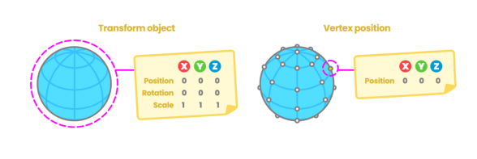
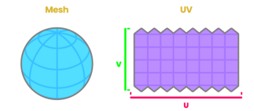
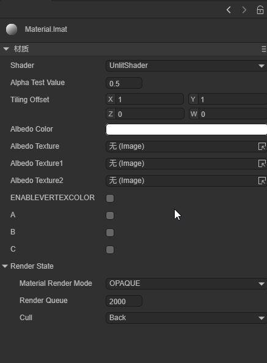
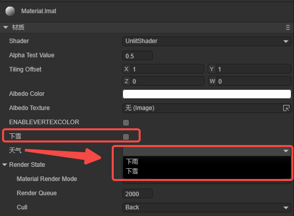
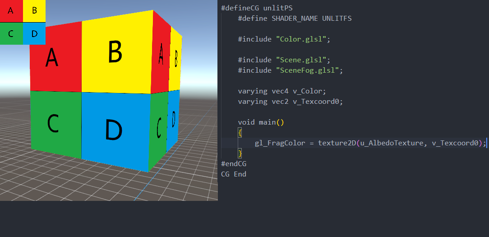
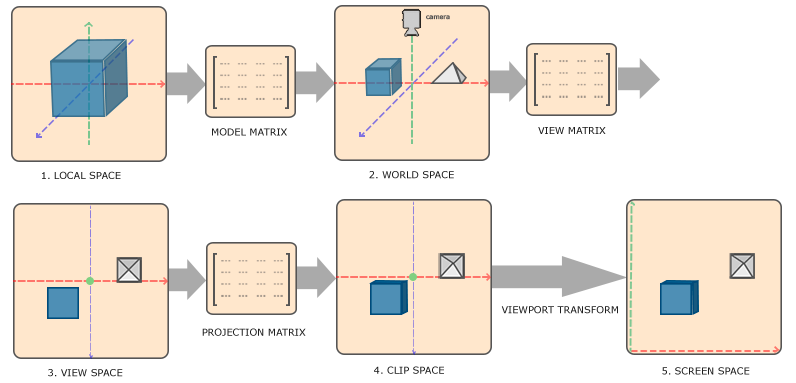
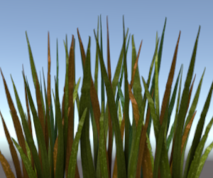

# An article to learn to customize Shader


This document is an advanced document for 3D use of the LayaAir engine. Before reading, you need to have general 3D basic knowledge such as 3D vertices, normals, UVs, etc. If there are nouns you do not understand, please read the relevant basic concept documents first.

## 1. Basic knowledge of Shader

### 1.1 What is Shader?

Shader is called shader in Chinese. Shader is essentially a program written in the GLSL shading language to run on the GPU. It is used to tell the graphics software how to calculate and output images. From every pixel to the entire screen.

> There are several shading languages. The LayaAir engine is based on webGL and can only use GLSL language.

Shaders are mainly divided into two categories: vertex shader Vertex Shader and fragment shader Fragment Shader (also called fragment shader).

#### 1.1.1 Vertex Shader

A vertex shader is a program used to process vertex data, such as vertex coordinates, normals, colors, and texture coordinates.

It is called on each vertex and can transform a geometry (for example: a triangle) from one position to another, for example, for vertex transformation, texture coordinate generation, texture coordinate transformation, etc.

Since 3D graphics are composed of triangular patches, the vertex Shader must calculate the vertices on each triangular patch and prepare for the final pixel rendering.

#### 1.1.2 Fragment Shader Fragment Shader

Fragment shaders are used to calculate and fill the color of each pixel, so they are also called pixel shaders. It can be used for interpolation operations, texture access, texture application, fog, color calculation, etc.

For each sample of pixels covered by a primitive, a "fragment" is generated. Each fragment has a "window space" position along with some other values, and it contains the per-vertex output values ​​from all interpolations of the previous "vertex processing" stage. The output of the fragment shader is a depth value, possibly a stencil value (unmodified by the fragment shader), and zero or more color values ​​that may be written to a buffer in the current framebuffer. The fragment shader takes a single fragment as input and produces a single fragment as output.

### 1.2 Shader of LayaAir engine

#### 1.2.1 Structure and composition

The Shader in the LayaAir engine mainly revolves around the .shader file as the core. In the core of the engine, the .shader file is the result of the Shader3D class object abstracted into a textual representation. When selecting different Shader effects, different .shader files will be generated. These. The shader file becomes the core factor for different model materials.

How to create .shader file?

Right-click the menu bar in the project resource window -> Select Create -> Select Shader (as shown in Figure 1-1). There are five built-in Shader options.


(Picture 1-1)

#### 1.2.2 Application scope

The application of Shader in the LayaAir engine is mainly reflected in the expression of material effects on different objects. By selecting different Shaders, the material of the object changes accordingly to form different effects.

The default Shaders built into the LayaAir engine are: BlinnPhong (Blinn Fong), Unlit (unlit), PBR (physically based rendering), Particle (particle), PostProcess (post-processing).
## 2. How to customize Shader
### 2.1 Common attributes in Mesh
> The word polygon comes from Greek and consists of poly (many) and gnow (angle). According to the definition, polygon refers to a closed plane figure bounded by line segments.

We can find the most basic common 3D objects in different 3D software or game engines: spheres, cylinders, capsules, and blocks. These basic 3D objects are composed of several polygons. The shapes of these 3D objects are different. But their properties are similar. They all have attributes such as vertices, normals, UV coordinates, and vertex colors, which are all stored in a data structure defined as Mesh. We can access all of these properties independently in a Shader and save them in some common data structure, such as Vector, which is great because we can modify their values ​​to produce exciting effects.

Figure 2-1 below shows the three visualization forms of vertices, polygons, and edges.


(Figure 2-1)

Next, we will introduce the common attributes in the Mesh data structure separately:

- Vertex

What is the apex? A vertex is the point where two sides of a triangle intersect, so each triangle is composed of three vertices, so a most basic triangle fragment has three vertices,

Figure 2-2 below shows the transformation of the object object and the visual form of the object's vertex coordinates.



(Figure 2-2)

- normal

Suppose we have a blank piece of paper and we ask a friend to draw on the front of the paper. If both sides are equal, how do we determine which one is the front side of the blank page? This is why normals exist. Normals correspond to vertical vectors on a polygonal surface and are used to determine the direction or direction of a face or vertex.

In 3D software, we can choose to visualize the normals of vertices, which allows us to see the position of the vertices in space.

Figure 2-3 below shows the result of normal visualization of the object.


(Figure 2-3)

- UV coordinates

Texture coordinates, also called UV coordinates, map the width and height of the texture; the process of locating vertices on UV coordinates is called "UV mapping". It is a process of creating, editing, and organizing UVs that appear as flat, two-dimensional representations of object meshes. In our shader, we can access this property to position the texture on the 3D model or save information in it. Figure 2-4 shows the morphological relationship of Mesh and UV coordinates.



(Figure 2-4)

The area of ​​UV coordinates is equal to the range from 0.0f to 1.0f, where 0.0f represents the starting point and 1.0 represents the end point. Figure 2-5 below shows the visual expression of UV coordinates.


(Figure 2-5)

- VertexColor

When we export objects from a 3D software, the software assigns a color to the object to be affected, either by lighting or copying another color. This color is called the vertex color and corresponds to white by default, with the value "1.0" in the RGBA channel.

### 2.2 Rule Description

`Shader3D Start/End` Shader file head/end

Used to declare rendering pass, rendering status, material parameters and other parameters

```typescript
Shader3D Start
{
    //Fill in Shader rendering pass, rendering status, material parameters and other attributes here
}
Shader3D End
```

` name ` Shader name

Used to explain the name of the Shader and distinguish the functions and effects of different Shaders.

```typescript
Shader3D Start
{
    //Here ShaderName is the name of the Shader, not the name of the .shader file, but actually the name of the Shader3D object.
    name: ShaderName
}
Shader3D End
```

`type` Shader type

Currently, LayaAir only supports the Shader3D type. We are considering supporting advanced Shader types such as Compute Shader in the future.

```typescript
Shader3D Start
{
    type:Shader3D
}
Shader3D End
```

## 3.uniformMap

Uniforms are a way to send data from an application in the CPU to a shader in the GPU, but uniforms and vertex attributes are a little different. First of all, uniform is global. Global means that the uniform variable must be unique within each shader program object, and it can be accessed by any shader at any stage of the shader program. Second, no matter what you set the uniform values ​​to, uniforms will keep their data until they are reset or updated.

UniformMap is a data structure that stores a bunch of Uniform variables. Through combination, developers can more intuitively understand the Uniform variables used in Shader.

#### 3.1 Uniform common variable types

Common types of Uniform variables: Texture2D, Color, Vector2, Vector3, Vector4, Bool, Float, Matrix4x4, TextureCube

`Texture2D` is the image type used for 2D texture sampling. The image locally supports formats: JPG, PNG

`Color` color type, which is a vector value composed of four Float types, and the unit is an RGB value variable in the range of 0-1

`Vector2` Vector 2 type, mostly used for 2D coordinate position representation, often used for UV coordinates and screen coordinates

`Vector3` Vector 3 type, the most commonly used 3D coordinate position representation, the three components xyz express the specific position in 3D space

`Vector4` Vector 4 type, mostly used to represent coordinate positions in homogeneous 3D space

`Bool` Boolean type

`Float` floating point type

`Matrix4X4` 4X4 homogeneous matrix

`TextureCube` Image type used for 3D texture sampling. Locally supported image formats: PNG, JPG, HDR

```typescript
Shader3D Start
{
    //Link the attributes (name, type) mentioned in Section 2.2 above
    type: Shader3D
    name: ExampleShader
    uniformMap : {
   	 u_Color : {type: Color, default:[1,1,1,1]},
   	 u_MainTex : {type: Texture, default: "white"},
   	 u_SampleTexcoord : {type: Vector2, default:[1,1]},
   	 u_LightDir : {type: Vector3, default:[1,1,1]},
   	 u_vecPos : {type:Vector4, default:[1,1,1,1]},
   	 u_isWebGL2 : {type: bool, default: true},
   	 u_spend : {type:float, default:1.0},
   	 u_SkyMap : {type:TextureCube, defalue: "black"}
   	 u_defaultMat : {type:Matrix4x4, default:[
   	 1,0,0,0
   	 0,1,0,0,
   	 0,0,1,0,
   	 0.0,0,
   	 ]}
    }
}
Shader3D End
```

#### 3.2 Common built-in uniforms in engines

> Note: The Uniform variables listed below are only Uniform variables commonly used by engines. The Uniform variables involved in other engines are high-level usage methods and will not be introduced in detail in this article. Interested developers can go to xx in the engine. The corresponding Uniform variables can be found in the .glsl file. In this article, we only introduce some high-frequency Uniform variables used in commonly used Shader writing.

| variable name	| Description	| The GLSL file it belongs to (direct use is not recommended for high-level operations) |
| :----------------------------------------------------------- | :---------- | ------------------------------------ |
| and_WorldMat	| World Matrix	| Sprite3DCommon.glsl              	|
| u_ProjectionParams(near,   far,  invert,  1 / far)       	| Projection parameters	| Camera.glsl                      	|
| u_Viewport(x,   y,   width,   height)                    	| Viewport	| Camera.glsl                      	|
| u_CameraDirection                                        	| Camera direction	| Camera.glsl                      	|
| u_CameraUp                                               	| Camera up orientation | Camera.glsl	|
| u_CameraPos                                              	| camera position	| Camera.glsl                      	|
| u_ZBufferParams：<br />1.0 - far / near,   far / near,   (near - far) / (near * far),   1 / near | Zbuffer参数 | Camera.glsl                      	|
| u_CameraDepthTexture                                     	| depth texture	| Camera.glsl                      	|
| u_Time                                                   	| time	| Scene.glsl                       	|
| u_FogParams(Start, range, Density, default)	| Fog effect parameters	| Scene.glsl                       	|
| u_FogColor                                               	| Fog color	| Scene.glsl                       	|

## 4. Child colorer SubShader

### 4.1 What is SubShader

SubShader sub-shader can be understood as Shader's rendering scheme. Each Shader has at least one SubShader, and there can be multiple SubShaders. Sub-shaders divide the Shader object into multiple parts, which are compatible with different hardware, rendering pipelines and run setting information.

Contained in a subShader:

- Information about the hardware, pipeline, and runtime settings of this subshader.
- One or more passes.

### 4.2 What is Pass

Pass is the basic element of the Shader object. A series of Passes are defined in SubShader, which includes setting the quality of the GPU state and the Shader program running on the GPU.

However, the presence of too many Passes in a SubShader will cause a decrease in rendering efficiency and create a performance bottleneck.

```typescript
Shader3D Start
{
	.....
	shaderPass:[
    	{
        	//Shader VS/FS Info here
    	}
	]
}
Shader3D End
```

## 5.Shader file structure details

### 5.1 Instancing

#### 5.1.1 What is Instancing

When rendering, if there is a type of object with the same vertex data, but the world space position is different, such an object is suitable for Instancing rendering. Imagine a scene full of grass: each blade of grass is a small model containing several triangles. You may need to draw many grass roots, and ultimately you may need to render thousands or tens of thousands of grass roots per frame. Because each blade of grass is only composed of a few triangles, rendering is almost instantaneous, but thousands of rendering function calls will greatly affect performance.

If you start Instancing, send this kind of data to the GPU at once, and then call a drawing function to let OpenGL use this data to draw multiple objects. This is very convenient. This is Instancing. Instancing allows us to use one DrawCall to draw multiple objects, saving CPU->GPU communication for each drawing.

#### 5.1.2 enableInstancing switch

`enableInstancing`: Whether to enable Instancing.

When enableInstancing is true, the Shader enables the Instancing function. When enableInstancing is false, the Shader does not enable the Instancing function.

```typescript
Shader3D Start
{
    ....
	enableInstancing:true,
	....
    ....
}
Shader3D End
```


### 5.2 ReflectionProbe

#### 5.2.1 What is ReflectionProbe

Reflection probes can capture the surrounding environment from all directions and then store the captured content as a CubeMap (cube map), which can be used by objects with reflective materials. Multiple reflection probes can be used in a scene, and the probes sample the visual environment at key points in the scene. When a reflective object is close to the probe, the reflections sampled by the probe can be used in the object's reflection map. Additionally, when several probes are located near each other, the engine can interpolate between them, allowing for gradual changes in reflection. Therefore, using reflection probes can produce very realistic reflections while keeping the processing overhead to an acceptable level.

#### 5.2.2 Working principle of reflection probe

The capture environment of the probe can be represented by a CubeMap. The CubeMap is conceptually very similar to a box with six-sided images of a cube drawn on the internal surface. The Shader must be able to sample the CubeMap's image. Each point on the object's surface "sees" a small area of ​​the cubemap in the direction the surface is facing (that is, the direction of the surface normal vector). Here the shader uses the color of the cube map to calculate what color the object's surface should be. Figure 5-1 below shows the comparison results between CubeMap and skybox.


(Figure 5-1)

#### 5.2.3 supportReflectionProbe switch

`supportReflectionProbe` ：ReflectionProbe开关。

Enable the switch to True when the probe exists in the scene, and enable the switch to False when the probe does not exist in the scene.

```typescript
Shader3D Start
{
    ....
    ....
	supportReflectionProbe:false,
	....
    ....
}
Shader3D End
```

### 5.3 attributeMap

`attribute` is usually the data from Mesh vertices. The variable value of this attribute is read-only and usually does not need to be set. There is a set of attributeMap in the engine by default to meet common mesh vertex types. Only special mesh data is needed. Only when you need to set special variables in attributeMap

The vertex data in LayaAir3D is elf-by-elf. Here we only introduce the vertex data related to commonly used model sprites. (That is, it does not include trailing sprites and particle sprites)

> This table will list the variable names and corresponding vertex channels of all vertex data currently passed in by the engine.

| Description	| channel	|
| :------------------------- | :--------------------------------- |
| The position of the vertex in model space	| VertexMesh.MESH_POSITION0      	|
| Normal vector of vertex in model space | VertexMesh.MESH_NORMAL0	|
| Tangent vector of model space	| VertexMesh.MESH_TANGENT0       	|
| The first uv coordinate	| VertexMesh.MESH_TEXTURECOORDINATE0 |
| The second uv coordinate	| VertexMesh.MESH_TEXTURECOORDINATE1 |
| Bone weight	| VertexMesh.MESH_BLENDWEIGHT0   	|
| Bone index	| VertexMesh.MESH_BLENDINDICES0  	|
| MVP Matrix	| VertexMesh.MESH_MVPMATRIX_ROW0 	|
| World Matrix	| VertexMesh.MESH_WORLDMATRIX_ROW0   |
| vertex color	| VertexMesh.MESH_COLOR0         	|
| User-defined reserved space	| VertexMesh.MESH_CUSTOME0       	|


### 5.4 defines

#### 5.4.1 Basic usage

Use macro switches to control the Shader instructions that generate different branch conditions in the vertex shader and fragment shader. The basic composition of the macro switch in defines is:

defineName: The name of the macro switch.

type: Generally bool, true or false triggers two different branches.

private: When the private value is false, in the material property setting panel, the macro switch will be displayed as a check switch in the Shader window, allowing developers to control the opening and closing of macros in the panel as needed; when the private value is true, The check switch is not displayed.

(Figure 5-2 below shows the display of the check switch in the Shader window, and Figure 5-3 shows the specific use of defines in the Shader file)


(Figure 5-2)


(Figure 5-3)

#### 5.4.2 Linkage with uniformMap

The macro switches in defines can be set in conjunction with the global properties in uniformMap, for example, the following sample code:

```glsl
    uniformMap:{
    	//define A at the same time when modifying u_AlbedoTexture1
    	u_AlbedoTexture1: { type: Texture2D, define: A },
    	//define A and B at the same time when modifying u_AlbedoTexture2
    	u_AlbedoTexture2: { type: Texture2D, define: [A,B] }
	},
   	 
    defines: {
    	A : { type: Bool },
    	B : { type: Bool },
    	C : { type: Bool }
	},
```

In the material property setting panel, adding texture to u_AlbedoTexture1 will cause A to be checked; adding texture to u_AlbedoTexture2 will cause A and B to be checked, and the effect is as shown in the animation 5-4.



(Animation 5-4)

### 5.5 styles

It used to be that in uniformMap or define, you could directly adjust the display details of uniform or define on the UI. Now you can move these details to the styles section to make uniformMap and define more concise.

#### 5.5.1 For uniformMap

It turns out that in uniformMap, more details need to be defined, for example (original writing):

```glsl
	uniformMap:{
    	u_Number: { type: Float, default:0, alias:"数字",  range:[0,100], fractionDigits: 2 }
	},
```

If there are many details, these details can be moved to styles for the simplicity of uniformMap:

```glsl
	uniformMap:{
    	u_Number: { type: Float, default:0 }
	},
	styles: {
    	u_Number: { caption:"Number", range:[0,100], fractionDigits: 2 }
	},
```

#### 5.5.2 For defines

The more important function of styles is that you can define attributes that are only used in the UI and do not belong to uniform and define. For example:

```glsl
	defines: {
    	RAIN : { type: Bool, default: true },
    	SNOWY : { type: Bool, default: false }
	},

	styles: {
    	RAIN: { caption: "Rain", inspector : null }, //inspector is null and is not displayed in the properties panel
    	SNOWY : { caption: "SNOWY"},

    	// Define attributes that do not belong to uniform and define
    	weather : { caption:"天气", inspector: RadioGroup, options: { members: [RAIN, SNOWY] }}
	},
```

RAIN and SNOWY are in defines, but the inspector of RAIN in styles is null, so they are not displayed. SNOWY is displayed normally. Weather is an attribute that is only used in the UI and does not belong to uniform and define. The effect is shown in Figure 5-5.



(Figure 5-5)

## 6. Brief description of GLSL syntax

The variable types of GLSL partially overlap with uniformMap. The Shader file of the LayaAir engine is encapsulated based on the GLSL language, with the purpose of improving the ease of use of developers writing shaders. GLSL is a shader language based on the graphics API of the GL series. It includes some common variable types and operations on vectors and matrices, making the rendering pipeline programmable.

### 6.1 **Common variable types**

| Variable type	| Description	| Default value in LayaAir	|
| :------------------- | :--------------------------- | :----------------------------------------------- |
| bool             	| boolean scalar data type	| false                                        	|
| float/vec2/vec3/vec4 | Contains 1, 2, 3, 4 floating point vectors | 0/[0, 0]/[0, 0, 0]/[0, 0, 0, 0]	|
| sampler2D        	| represents a 2D texture	| “white”                                      	|
| samplerCube      	| represents the cube texture	|                                               	|
| mat4	| represents a 4x4 matrix	|                                              	|

### **6.2 Common vector types**

Vectors can be constructed in the following three forms:

```glsl
thing2 v1 = thing2(1.0, 0.0);
vec3 v2 = vec3(1.0); // v2 = [1.0, 1.0, 1.0]
vec4 v3 = vec4(1.0, 0.0, vec2Value); //v3 = [1.0, 1.0, vec2Value.x, vec2Value.y]
```

Vectors can be accessed through x, y, z, w and r, g, b, a. glsl supports simultaneous access to multiple subscripts eg: vec.xyz

### **6.3 Common matrix types**

```glsl
mat4 marixt4x4 = mat4(1.0); // marixt4x4 = { 1.0, 0.0, 0.0, 0.0,
                        	//            	0.0, 1.0, 0.0, 0.0
                        	//            	0.0, 0.0, 1.0, 0.0               	 
                        	//            	0.0, 0.0, 0.0, 1.0 }
 mat2 matrix2x2 = mat2(coll1, col2);	 
 mat3 matrix3x3 = mat3(0.0, 0.0, 0.0, // first column
                  	0.0, 0.0, 0.0, // second column
                  	0.0, 0.0, 0.0); // third column
```

### **6.4 varying**

`varying` is a variable output by the vertex shader and passed to the fragment shader. Under the influence of the pipeline, the variable value will not be consistent with the output of the vertex shader, but will be interpolated by the pipeline. This may cause the normal of the vertex output to be unnormalized. At this time, manual normalization is required. The code example is as follows:

```glsl
//Normalized normal
vec3 normal = normalize(v_normal);
```


## 7.ShaderPass

Earlier we briefly introduced the function of Pass in SubShader. In this section we will combine the detailed Shader content to show the specific functions of ShaderPass.

```typescript
Shader3D Start
{
    type:Shader3D
    name:exampleShader
	enableInstancing:true,
	supportReflectionProbe:false,
    uniformMap: {
   	 u_MVPMatrix : {type: Matrix4x4},
   	 u_OutLineWidth : {type: float, default:0.0}
    }
    shaderPass:[
   	 {
   		 pipeline:Forward,
   		 VS:OutLineVS,
   		 FS:OutLineFS
   	 }
   	 {
   		 pipeline:Forward,
   		 VS:OutLine1VS,
   		 FS:OutLine1FS
   	 }
    ]
}
Shader3D End
```

Shader3D Block sets the type and name of the Shader as well as the support for instancing and probes. It declares the uniform variables required in the shader. The shaderpass defines the rendering method as forward rendering and relative to glsl's vs and fs. GLSL Block content.

## 8.GLSL Block

The content of this part is mainly to define the content of glsl statements in vs and fs in different rendering fragments in the above ShaderPass.

Start and end flags: GLSL Start / GLSL End

Pass corresponding VS and FS fragment tags: #defineGLSL "name" / #endGLSL

Among them, the contents contained in #defineGLSL and #endGLSL are glsl statements relative to the shader function.

```glsl
GLSL  Start
#defineGLSL  OutlineVS
	void main()
	{
    	vec4 position = vec4(a_Position.xyz + a_Normal * u_OutlineWidth, 1.0);
    	gl_Position = u_MvpMatrix * position;
	}
#endGLSL

#defineGLSL  OutlineFS
    varying vec3 v_Normal;
	varying vec2 v_Texcoord0;
	void main()
	{
    	gl_Position = u_MvpMatrix * a_Position;
    	mat3 worldMat=mat3(u_WorldMat);
    	v_Normal=worldMat*a_Normal;
    	v_Texcoord0 = a_Texcoord0;
    	gl_Position=remapGLPositionZ(gl_Position);
	}
#endGLSL
GLSL End
```

## 9. Start writing a LayaAir Shader

### 9.1 Create a Shader

In the LayaAir IDE interface, find the project resource window -> right-click to open the menu interface -> select create options -> select shader options (as shown in Figure 9-1 below). You can create a "non-light" type .shader file, then open it with an editor and write a custom Shader.


(Figure 9-1)

> When developers study this section, they should focus on experiencing the functions implemented by FS fragments and VS fragments. The specific principles will be explained in Sections 10 and 11.

### 9.2 Write a Shader

#### 9.2.1 Basic attribute information

The Shader file just created, the Shader created by default contains some common functions that may be encountered in actual development:

`Shader3D Start` Shader file start header.

`Shader3D End` Shader file end header.

> The content in Shader3D Start/End is some attribute information of Shader and does not involve glsl statements.

Figure 9-2 below shows the basic information contained in a basic Shader3D Start/Shader3D End structure:


(Figure 9-2)

`type`: Set type to Shader3D.

`name`: Set the Shader name to NewShader (the original name is UnlitShader).

`enableInstancing`: Whether to enable Instancing.

`supportReflectionProbe`: Whether to enable light probe support.

`UniformMap`: Four Uniform variables are created. Figure 9-3 below shows the result displayed on the IDE panel after the material is bound to the Shader. When the material is bound to the Shader, the variables in the UniformMap will become a panel interface on the IDE material editor, and the uniform value can be modified on the panel interface.


(Figure 9-3)

`shaderPass`: The current Shader has only one pass, the vs content is unlitVS, the fs content is unlitPS, and the rendering mode is forward rendering.


#### 9.2.2 FS fragment and VS fragment

`GLSL Start / GLSL End`: The start and end of the VS and FS pair of each Pass, #defineGLSL defines the glsl statement fragment of VS or FS.

##### FS fragment

Delete the contents in the original UnlitShader.shader and FS fragment main().

Here are a few simple effects:

(1) Fill the object with a solid color and set gl_FragColor to a vec4 variable with a transparent channel. The actual result is as shown in Figure 9-4 below.


(Figure 9-4)

(2) Fill the object with the color of the texture, and set gl_FragColor to the color value of the sampled texture. The specific effect is shown in Figure 9-5 below. The upper left corner of the figure is a schematic diagram of the original texture.



(Figure 9-5)

(3) Fill the color of the object with the color of the uniform variable, and adjust the color in the IDE. The specific effect is shown in Figure 9-6 below.


(Figure 9-6)

(4) Use TilingOffset to offset the UV texture sampling. The specific effect is shown in Figure 9-7 below.


(Figure 9-7)

> Note: The v_Texcord0 at this time is scaled and offset transformed in VS, not in FS. Click here to avoid the table. It will be explained in detail in the VS section.

When offsetting the UV texture sampling, you need to use a power-of-two texture map to display the effect shown in Figure 9-7. If it is a non-power-of-two image, you need to set it as shown in Figure 9-8. After scaling the image to power-of-two, click Apply.


(Figure 9-8)

##### VS fragment

The sample code is as follows:

```glsl
#defineGLSL unlitVS

	#define SHADER_NAME UnlitShader

	#include "Math.glsl";
	#include "Scene.glsl";
	#include "SceneFogInput.glsl";
	#include "Camera.glsl";
	#include "Sprite3DVertex.glsl";
	#include "VertexCommon.glsl";

	#ifdef UV
	varying vec2 v_Texcoord0;
	#endif // UV

	#ifdef COLOR
	varying vec4 v_VertexColor;
	#endif // COLOR

	void main()
	{
    	Vertex vertex;
    	getVertexParams(vertex);

	#ifdef UV
    	v_Texcoord0 = transformUV(vertex.texCoord0, u_TilingOffset);
	#endif // UV

	#ifdef COLOR
    	v_VertexColor = vertex.vertexColor;
	#endif // COLOR

    	mat4 worldMat = getWorldMatrix();
    	vec4 pos = (worldMat * vec4(vertex.positionOS, 1.0));
    	vec3 positionWS = pos.xyz / pos.w;
    	gl_Position = getPositionCS(positionWS);
    	gl_Position = remapPositionZ(gl_Position);

	}
#endGLSL
```

#include in LayaAir Shader is similar to include in C language. xxx.glsl has built-in shader algorithms that have been packaged by the engine. The above code shows the usage of some of these algorithms.

In graphics, there are often some usages surrounding transformations: such as world matrix, projection matrix, clipping space, UV transformation, etc. There are some such usages in LayaAir's .glsl header file, as follows:

- getWorldMatrix() returns a mat4 type world matrix (), model space coordinates * world matrix = world space coordinates. **[Sprite3DVertex.glsl]**
- getVertexParams() returns a Vertex structure, which contains the original data of the Mesh: vertex coordinates, normals, UV (UV macro), tangent (NEEDTBN macro), paratangent (NEEDTBN macro), vertex color (COLOR macro) . **[VertexCommon.glsl]**
- transfromUV() returns a new UV coordinate of vec2, and performs scaling and offset operations according to the second parameter of the function. The actual algorithm is: newUV = (oldUV.x * x + tilloffset.z, oldUV.y * y + tilloffset.w) xy of tilloffset corresponds to the scaling value of xy, and zw corresponds to the offset value of xy. **[Sprite3DCommon.glsl]**
- The structure PixelParams defines some vertex attributes in world space: vertex coordinates, normals, UV (UV macro), tangent (NEEDTBN macro), and paratangent (NEEDTBN macro). The structure PixelParams only defines the vertex attributes of these worlds and is not initialized. InitPixelParams() returns the initialized PixelPaams variable. **[BlinnPhongCommon.glsl]**
- getPositionCS() passes in world coordinates and returns the coordinates of the clipping space. **[Camera.glsl]**
- remapPositionZ() remaps the coordinate Z of the clipping space. **[Camera.glsl]**


#### 9.2.3 Shader references glsl file

In the .shader file of LayaAir IDE, if the glsl built into the engine is referenced (usually registered in ShaderInit3D.ts through the addInclude method of Shader3D.ts), then it can be referenced directly. For example:

```glsl
#include "Color.glsl";
```

If it is a custom .glsl file, it can be placed anywhere under the assets folder. Then the .shader file refers to the .glsl file through a relative path. Even if it is a directory of the same level, it must start with ./, for example:

```glsl
#include "./abc.glsl";
#include "./path/to/abc.glsl";
#include "../path/abc.glsl";
```


## 10. Vertex shader fragment

The main function of the vertex shader is to transform the input vertices, transform them from model space to clipping space, and output them to the fragment shader. Figure 10-1 shows the simple input and output of a vertex shader.


(Figure 10-1)

Readers do not need to understand the running details of WebGL in depth. They only need to focus on the content of GLSL statements to easily complete the creation of Shader content. The previous chapters briefly describe some of the contents of GLSL. Figure 10-2 below shows the vertex shader in Illustration of the run stages in the graphics rendering pipeline.


(Figure 10-2)

At the stage shown in the figure above, the vertices in the model go through a series of transformations in Figure 10-3.



(Figure 10-3)

- Local Space local coordinates, which can also be called model coordinates. It can be understood as the coordinates relative to the parent node.
- World Space world coordinates. World coordinates are a large spatial extent, relative to the world origin. It is obtained by multiplying the model coordinates and the world matrix.
- View Space observation coordinates. It can be understood as converting world coordinates to camera space coordinates, and the converted values ​​are relative to the camera origin. It is obtained by multiplying the world coordinates and the observation matrix.
- Clip Space clipping coordinates. That is to say, the observation coordinates are processed to the range of -1.0 ~ 1.0, which is the standard equipment coordinates we provide in WebGL, and finally the coordinates beyond -1 ~ 1 are eliminated. It is obtained by combining the observation coordinates with the projection matrix.
- Screen Space screen coordinates. This process is actually to convert the coordinates in the range of -1.0 ~ 1.0 to the coordinate range defined by gl.viewport. The final transformed coordinates are sent to the rasterizer and converted into fragments.


## 11. Fragment Shader Fragment

The main function of the fragment shader is to calculate the color of each pixel fragment, obtain the color difference from the vertex shader, and sample the color data from the texture. Figure 11-1 shows the shading results of the model sampled texture.


(Figure 11-1)


## 12.GLSL data transfer

### 12.1 Application processing stage

In the application processing stage, the model is integrated into basic fragments (triangles), and different attribute coordinate information is obtained from the model. The red framed part in Figure 12-1 is the application processing stage.


(Figure 12-1)


### 12.2 Vertex Shader Stage

Some values ​​after calculation in the application phase are passed to the vertex shader as uniforms to participate in the calculation, and then passed to the rasterization and subsequent fragment shader parts in the form of varing types. The red framed part in Figure 12-2 is the vertex shader. stage.


(Figure 12-2)


### 12.3 Fragment Shader Fragments

The varing type result after color interpolation is completed in the rasterization stage is passed to the fragment shader. The fragment shader processes the color value and outputs the result to the corresponding buffer (divided into a color buffer and a depth buffer). This step is the red box selection in Figure 12-3.


(Figure 12-3)


## 13. Material rendering mode and Shader rendering mode

Different materials in LayaAir have different rendering modes, and the rendering results in different modes are different. Common rendering modes are shown in the red box in Figure 13-1 below:


(Figure 13-1)

> For material-related content, please refer to ["Material Editing Module"](../../../IDE/materialEditor/readme.md).

- OPAQUE (opaque)

  There is no transparency effect. Even if there is translucency in the texture, the model will not be translucent. The Alpha value does not affect the final rendering effect and is always 1.

- CUTOUT (cutout)

   

  (Figure 13-2)

  Transparent cropping can be performed based on the Alpha value sampled from the texture containing Alpha information. You can also crop based on the comparison of the AlphaTest value in Figure 13-2 with the Alpha value sampled in the texture. This will cause holes in the cropped result. Parts and normal parts will produce severe aliasing, but the efficiency is high. If the aliasing effect is serious, it is recommended to sample the TRANSPARENT mode, and the transparent result will be more linear.

- TRANSPARENT (translucent)

  Translucent rendering is performed based on the Alpha value in the texture or rendering is given a fixed Alpha value.

- ADDTIVE (additive color mixing)

   It is mainly used for some materials that are transparent and have high color brightness. It will perform additive color mixing according to the brightness of the texture pixels. The texture colors of the front and back of the model and the texture colors of overlapping models will superimpose on each other to form a highlight translucent effect.

   

  (Figure 13-3)

- ALPHABLENDED (transparent blending)

  This means that the object is in semi-transparent mode, but the final pixel is shaded in a different blending mode. The AlphaBlended blending mode is SrcAlpha * SrcColor + (1 - SRCAlpha) * DstColor. Generally speaking, SrcAlpha comes from the alpha value of the texture.

  

  (Figure 13-4)

The RenderMode of the Shader inside the engine will be compared with the RenderMode of the material. Generally, the RenderMode of the material is the main one.


