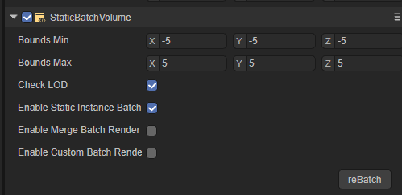

# 3D performance optimization

## 1. Basic understanding of graphics performance

### 1.1 Reduce the CPU cost of rendering

During the rendering process, the factor that has the greatest impact on CPU rendering time is the cost of sending rendering instructions to the GPU. Rendering instructions include Draw Calls and commands that change settings on the GPU before drawing 3D objects.

The following methods can reduce the CPU cost of rendering:

- Reduce the number of rendered objects in the scene
  - Consider reducing the total number of objects in the scene, e.g. using skyboxes instead of rendering distant 3D objects
  - Perform more efficient culling of objects in the scene to reduce rendering pressure on the engine.
- Reduce the number of times the object is rendered
  - Where appropriate, use LightMap to bake lights and shadows. This operation will increase video memory usage and build time, but can improve running efficiency.
  - Reduce the number of light sources
  - Use real-time shadows with caution
  - Use reflection probes with caution

### **1.2 Reduce GPU cost of rendering**

Limited by memory bandwidth, the texture size is too high and the number of textures is too large, which will cause a GPU rendering bottleneck.

- Enable mipmaps for textures whose distance from the camera changes at runtime. (For example, most textures used in 3D scenes). This increases the memory usage and storage space of these textures, but improves runtime GPU performance.

- Use a suitable compression format to reduce the size of textures in memory. This reduces load times, reduces memory footprint, and improves GPU rendering performance. Compressed textures use only a fraction of the memory bandwidth required by uncompressed textures.

If the application is vertex processing bound, it means that the GPU can process more vertices during the vertex processing stage

- Reduce vertex shader execution cost.

- Optimize geometry: don't use unnecessary triangles and try to keep the number of UV mapped seams and hard edges (double vertices) as low as possible.
- Use LOD to optimize different Mesh types and optimize the number of vertices.

## 2. Optimize Draw Call

Because rendering state changes can be resource-intensive, it's important to optimize them. The main way to optimize render state changes is to reduce their number. There are two ways to do this:

- Reduce the total number of draw calls. When you reduce the number of draw calls, you also reduce the number of render state changes between them.
- Organize draw calls in a way that reduces the number of changes to rendering state. If the graphics API can perform multiple draw calls using the same rendering state, the draw calls can be grouped together without performing as many render state changes.

The following methods are provided in LayaAir:

- GPU instance
- Dynamic Batch
- Static Batch
- Custom Static Batch

## 3.GPU instance

GPU instancing is a draw call optimization method that renders multiple copies of a mesh with the same material in a single draw call. Each copy of the grid is called an instance. This is useful for drawing things that appear multiple times in a scene, such as trees or grass.

GPU instances render the same mesh in the same draw call. To add variety and reduce a repetitive look, each instance can have a different property, such as Color or Scale. Draw calls that render multiple instances appear in the framework debugger draw grid(instances).

GPU Instance requires hardware support. Make sure the hardware you are currently using can support GPU Instance rendering.

 

The above picture shows a GPU Instance test scene and the detailed drawing information corresponding to the test scene. In the picture, red-green-blue-yellow are four different materials.

 There are currently only three Instance DrawCalls, and the engine automatically executes the Instance rendering process for objects that meet the Instance conditions.

Engine Instance rendering conditions:

- Same Mesh
- same material
- enableInstance (customize the switch on the Shader, the engine's default shader turns on Instance)
- Whether the shadow status is the same (whether to receive shadow)
- Whether the reflection probe status is the same

Red-green-blue objects have different Mesh and different materials, but every red, green or blue object has the same material, the same Mesh, the same Instance state, the same shadow state, Same reflection probe status. Therefore, these three types of objects comply with the engine Instance rendering judgment process. The engine automatically instantiates these three types of objects and instantiates all objects of each color into one InstanceDraw Call to complete the rendering process. Yellow objects meet almost all the requirements for Instance rendering judgment. However, because of different Mesh grid data, the engine will not perform Instance rendering on all yellow objects.

In summary, a basic Instance rendering condition can be summarized into three points: enableInstance is turned on, the same Mesh, and the same material.

If you need to customize your own personalized Instance rendering judgment, developers need to organize the rendered data themselves in the form of [CommandBuffer](../CommandBuffer/readme.md)

## 4.Dynamic Batch

Dynamic merging is divided into two types: **instance merging** and **vertex merging**. Both optimizations require no settings from the developer, and objects can move dynamically without restrictions. However, the merger principle is relatively strict. The following are the most basic conditions for the two mergers.

**Instance merge:**

 Both conditions of the same Mesh and the same material need to be met. In a three-dimensional scene, there may still be a large number of models with the same material as Mesh, and there is a lot of room for instance merging at this time.

**Vertex merge:**

 The same material is required and the model vertices are less than 10. Vertex merging currently has room for use on some fake shadow and special effects models.

**Note:** Translucent objects require continuous rendering to be dynamically merged, so the probability of dynamic merging of translucent objects is low.

**Turn off dynamic batching option**

In the engine's Config3D.ts file, enableDynamicBatch value option, true means turning on dynamic batching, false means turning off dynamic batching.

 

Pic 4-1

## 5.Static Batch

Static batching is a draw call batching method that combines non-moving meshes to reduce draw calls. It converts the combined meshes to world space and builds a shared vertex and index buffer for them. Then, for the visible mesh, the engine performs a series of simple draw calls with almost no state changes between each call. Static batching does not reduce the number of draw calls, but rather the number of render state changes between them. Static batching is more efficient than dynamic batching because static batching does not transform vertices on the CPU.

**Turn off static batching option**

In the engine's Config3D.ts file, enableStaticBatch value option, true means turning on dynamic batching, false means turning off dynamic batching.

 

Figure 5-1

Conditions for static batching:

- The object is Static (including sub-objects)
- Unified model using the same material

 

Figure 5-2

## 6.Custom Static Batch(Static Batch Volume component)

In the Object's inspect panel, add a component, select the Rendering option, and find the Static Batch Volume component.

 

Figure 6-1

Drag the small white dot in the Scene window to select the appropriate Volume size.

 

Figure 6-2

Use of the Static Batch Volume component: After the Volume box above is selected to the appropriate size, in the component's details panel, check Static Instance Batch, and then click reBatch. The selected object in the Volume will perform the Batch operation, optimizing Draw. Call to improve operational efficiency. The Batch component with the CheckLOD option checked will automatically check the object LOD attribute information in the Volume, and then divide all objects in the Volume into different LOD rendering objects according to the object LOD level of the LOD Cull Rate Array.

 

Figure 6-3

 

Figure 6-4

