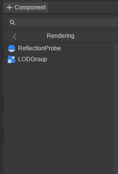
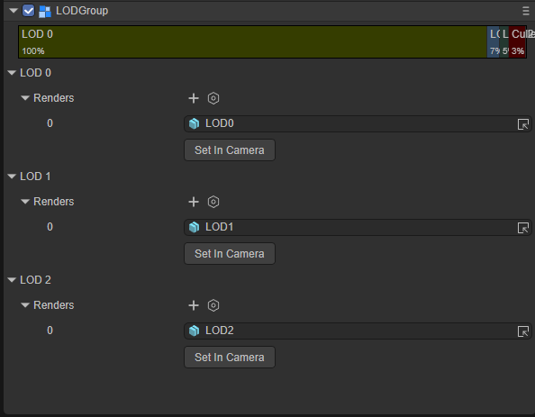
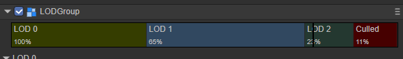
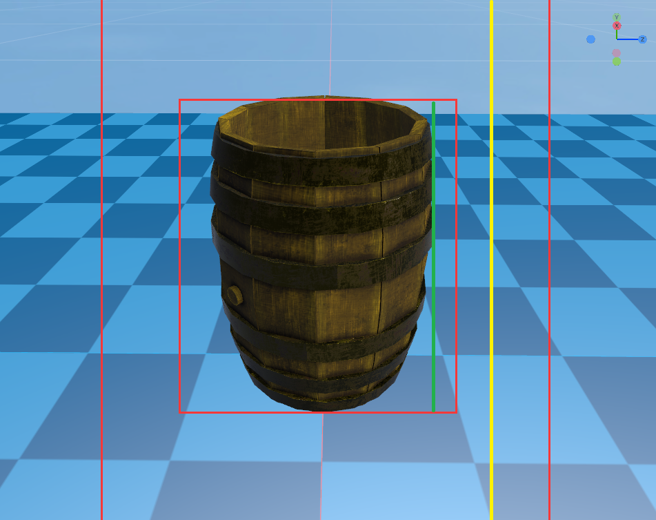
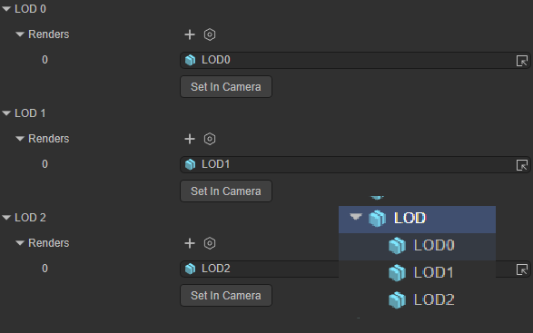
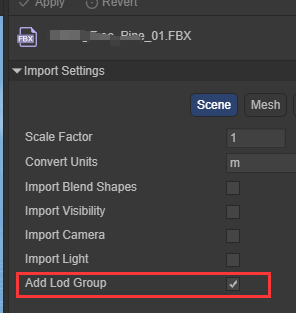
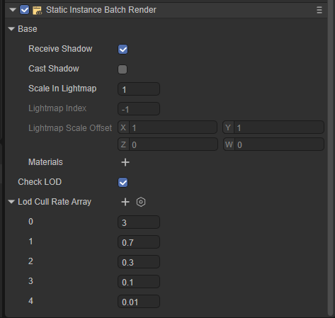
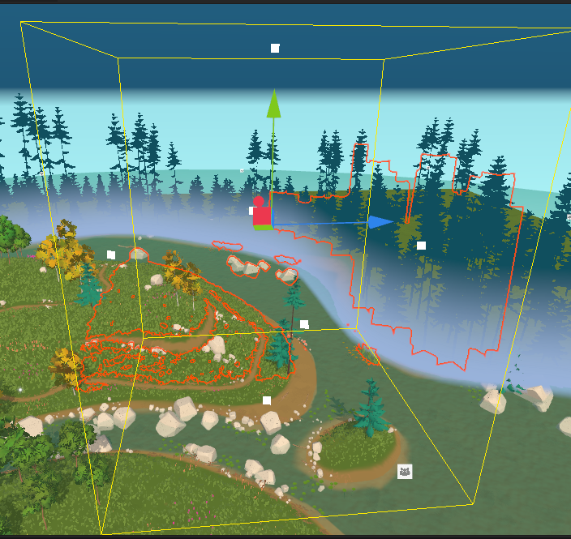

# LOD

## 1. LOD Overview

Level of Detail (LOD) is a technique that reduces the number of GPU operations required by the LayaAir engine to render distant meshes.

When a game object in the scene is far away from the camera, less detail will be visible compared to a game object that is very close to the camera. But by default, the engine will use the same number of triangles to render two game objects at different distances. This can waste GPU computing resources, affecting performance in the scene.

LOD technology allows the engine to reduce the number of triangles rendered for a game object based on its distance from the camera. To use this technique, the game object must have a large number of meshes whose geometry has progressively lower levels of detail. These meshes are called LOD levels. The further a game object is from the camera, the lower the LOD level of detail rendered by the engine. This technique reduces the burden placed on the hardware by these distant game objects, thus improving rendering performance.

## 2.LOD component

### 2.1 Create LOD components

You can add LOD groups to objects in the scene by creating a LOD component. Multiple LOD groups can be added to the engine's LOD to achieve different rendering results at different distances.

Steps to create LODGroup component: Add component -> Select Rendering component type -> Select LOD Group component

 

Figure 2-1

 

Figure 2-2

### 2.2 LOD level slider

Adjust the switching range of different LODs by adjusting the proportions of different LOD levels on the LOD level slider.

 

Figure 2-3

The LOD level slider is divided into an interval ranging from left to right [100%, 0%]. The displayed percentage of each level is the left interval value of the current block.

The black line indicates the LOD level of the current camera. The black indicator line is refreshed in real time and will change to different LOD intervals as the camera moves.

#### Expand Mincull Rate

 

Figure 2-4

The Mincull Rate for each LOD level represents the threshold for activating that level. The threshold is based on the ratio of the game object's screen space height to the total screen height. For example, if LOD0's threshold is set to 0.4, LOD0 will activate when the camera pulls back far enough so that the game object's height takes up 40% of the view.

In the picture above, the ratio of Mincull Rate is represented in the image as the ratio of the length of the green line to the length of the yellow line. It is usually a floating point decimal from 0.0 to 1.0.

### 2.3 Renders

 

Figure 2-5

Renders are actually Sprite3D objects that hold meshes at that LOD level. Typically this is a child of the Sprite3D object that has the LOD component

The Renders renderer can add multiple rendering objects and render multiple objects at the same LOD level.

## 3. Import LOD mesh (experimental)

Create a grid resource with LOD levels in the art software. After importing it into the engine IDE, select the grid model file and check the Add Lod Group function in the import settings.

 

Figure 3-1

## 4.LOD Cull Rate Array

In fact, LOD Cull Rate Array is one of the functions of Static Batch Volume.

 

 

LOD Cull Rate Array is actually a rendering of N levels of Rate calculated for the objects in this Volume.

For example, the actual Rate of the current field of view and Volume is 0.2, and the level of LOD2 in the LOD Cull Rate Array is 0.1, so the object in the current field of view is the rendered LOD2 object.

