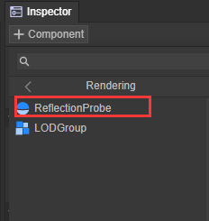
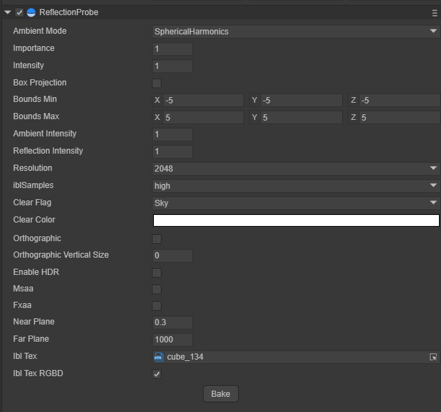
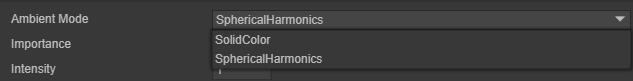
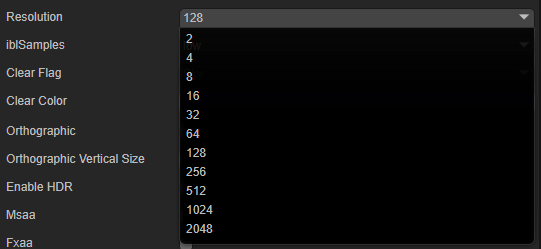
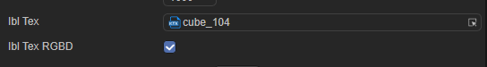

# Reflection Probe: reflection probe

## 1. Reflection probe overview

The traditional form of reflection is to simulate the reflection from the object in the form of reflection map. For static open scenes, the effect obtained by the traditional reflection map is acceptable, but when the object is in a complex environment, the effect of the reflection map is LayaAir uses reflection probes to sample the surrounding environment of all scenes of the object. Reflection probes can be used to ensure that the reflection effect of the object is realistic enough in complex environments. When there are multiple probes, the engine will automatically interpolate the reflection results sampled by each probe to obtain a smooth reflection transition effect.

The reflection probe uses the texture form of CubeMap to collect and save it in CubeMap from six directions. The reflection results in six directions are shown in the figure below.

 

Picture 1-1

### 1.1 Baking probe

The probe type in the LayaAir engine is Bake. The reflection captured by the baking probe can only contain objects marked as Static. The specific operation is to select the object that needs to be baked for reflection, select the object, and check the object Static in the upper right corner of the Inspector panel. options.

 

Figure 1-2

After setting the object that needs to bake reflection information to Static, add the Reflection Probe component to the Sprite3D object.

 

Figure 1-3

Select the appropriate sampling level and sampling size in the Reflection Probe component, and click the Bake button to start baking the reflection probe.

 

Figure 1-4

## 2. Properties of reflection probe

### 2.1 Ambient Mode

There are two ambient light modes, one is spherical harmonic mode and the other is solid color mode.

 

Figure 2-1

**Spherical Harmonic Mode**

The ambient light information provided by the sky box is calculated through spherical harmonics, and the values ​​collected by the reflection probe are calculated by spherical harmonics.

**Solid color mode**

The reflection probe collects reflection information at non-specified locations and is filled with a solid color.

### 2.2 Importance

Judgment of importance. The current engine only supports single probe mode. If the newly created probe's Important value is greater than the main probe's Important value, the current probe will be used as the main probe.

### 2.3 Intensity

The intensity size adjustment applied to the texture that this reflection probe applies to its shader

### 2.4 Box Projection

Normally, a reflection cubemap is assumed to be at an infinite distance from any given object. As the object is rotated, different angles of the cubemap become visible, but the object cannot move further toward or away from the reflective environment. This state usually performs well for outdoor scenes, but its limitations show up in indoor scenes; the internal walls of the room are obviously not infinitely far away, and the closer the object is to the wall, the greater the reflection from the wall should be.

 

Figure 2-2

### 2.5 Bounds

The scope of the reflection probe is in the form of a bounding box. The reflection probe only receives reflection information from objects located within the bounding box.

Bounds Min: the minimum coordinate of the bounding box

Bounds Max: the maximum coordinate of the bounding box

Bounding box Size = Max — Min

 

Figure 2-3

### 2.6 Ambient light intensity and reflection intensity

Ambient light intensity: The attribute is the received ambient light intensity. The effect applied to the mapped reflective object is that the ambient light in the reflection effect is stronger and brighter.

Reflection intensity: The attribute is the intensity of the received reflection content. The effect applied to the mapped reflection object is that the reflection effect is stronger and brighter.

### 2.7 Sampling size and sampling quality

Baked reflection probe sampling size: determines the size (resolution) of the single RT of the baked CubeMap

Baked reflection probe sampling quality: determines the writing quality of a single RT of the baked CubeMap (three levels: high, middle and low)

 

Figure 2-4

### 2.8 Clear information

Clear information: In addition to the reflection content part, the baked probe content is optional when filling the content.

Clear color: When the fill content is selected as SolidColor, select the fill color in the ClearColor option

 

Figure 2-5

### 2.9 IBL options

IBL Tex: Baked Reflection Probe IBL Texture

IBL Tex RGBD: baked texture format (color channel + depth channel)

 

Figure 2-6

