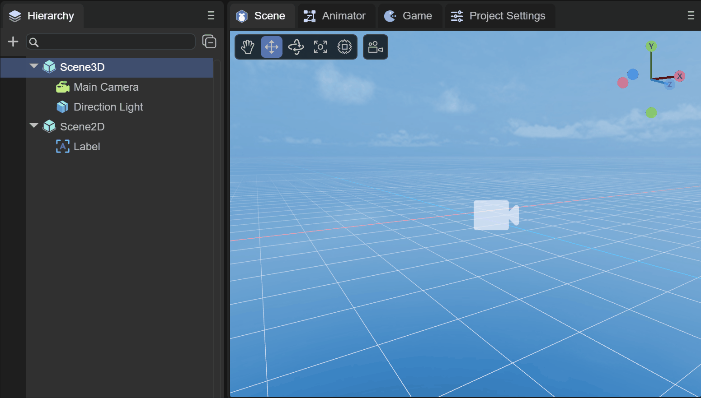
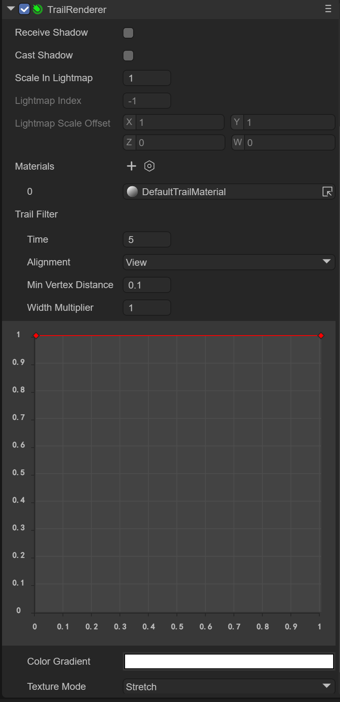
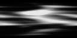
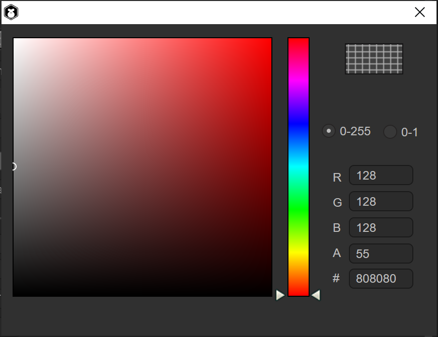
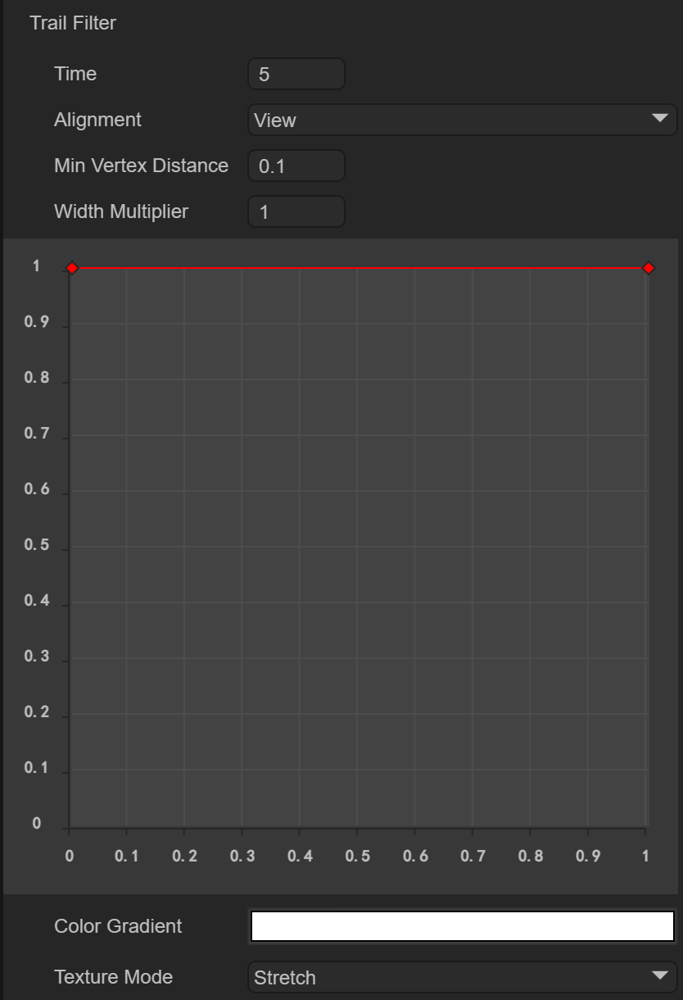
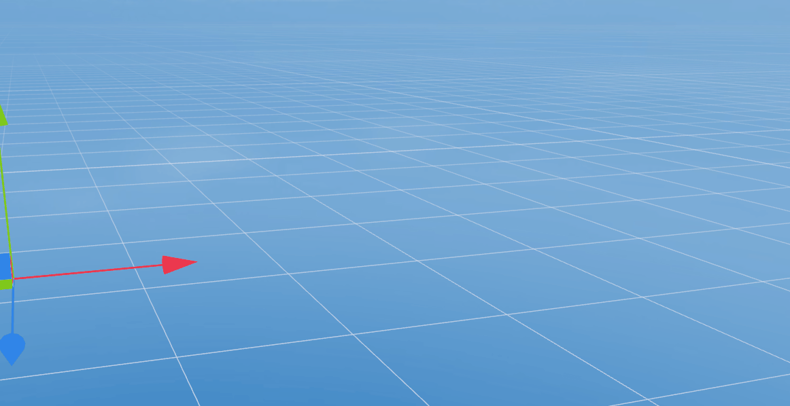
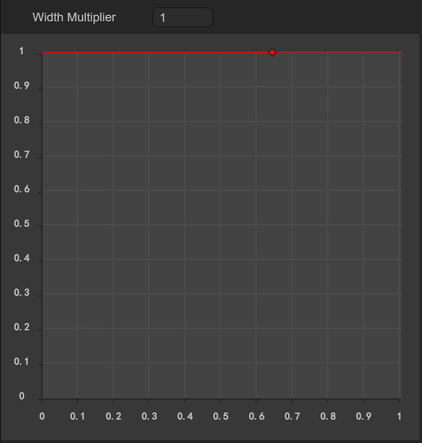

# Trailing

## 1. Overview

The Trail Renderer is used to create a trailing effect behind objects in the scene to represent them moving around. The afterimage that appears at the position of the moving path of the object is a trailing effect.

   

(Animation 1-1)

As shown in the animation 1-1, this is a cube that rotates on its own, with a trailing effect around it. Let's take a look at how to create and use trailing in the IDE

## 2. Creation and use in IDE

### 2.1 Create a trailing object

In the Hierarchy window of a 3D scene, you can create a trailing object under any node or in a blank position by right-clicking the mouse, as shown in animation 2-1.

(Animation 2-1)

You can’t see any effect on the trailing object created at this time. In fact, it creates an empty node and adds the Trail Renderer component. Let’s learn about the component information.

### 2.2 Property settings

As shown in Figure 2-2, the trailing renderer has the following properties

(Figure 2-2)

Since the `Trail Renderer` component inherits from the `Base Renderer` component, the trailing renderer itself has some basic properties, as shown in Figure 2-3

  

(Figure 2-3)

Basic properties such as Receive Shadow `Receive Shadow`, shadow generation settings `Case Shadow` and the scaling and offset of the light map will not be introduced here.

### 2.3 Trailing material

The material used for trailing requires the Shader `Laya.Trail`

#### 2.3.1 Create Material

First, we create a new Material under Asset. By default, the Shader of Material is BlinnPhone. Next, we modify the Shader, as shown in the animation 2-4.

(Animation 2-4)

#### 2.3.2 Material map

As shown in Figure 2-5, the material with Laya.Trail Shader has the following attributes:

(Figure 2-5)

Here we mainly focus on the texture map of the trailing effect, such as the effect in the example of animation 1-1. If you need to create a trailing effect, you need a texture map of the trailing effect, as shown in Figure 2-6.

(Figure 2-6)

We next drag the texture map into the material, as shown in Figure 2-7, so that the trailing map is configured

(Animation 2-7)

#### 2.3.3 Texture color

We want the trailing effect to be a gray smoke-like effect, then we need to set the color of the material, as shown in Figure 2-8, select the gray color and change the transparency to 55

  

(Figure 2-8)

In this way, the color is configured. At the same time, we need to change the `Material Render Mode` to `Additive` mode to make the black color in the texture pure transparent, and change `Cull` to `Off`, as shown in Figure 2-9 shown

(Figure 2-9)

After this modification, the effect will be as shown in the animation 2-10.

(Animation 2-10)

### 2.4 Trailing filter

The trailing material can specify the trailing texture effect, transparency method, etc., but the trailing filter can only set the trailing time, trajectory, length, etc., just like the 3D particle system, as shown in Figure 2-11

  

(Figure 2-11)

#### 2.4.1 Fade out time

`Time`: fade-out time, the longer the time, the longer the trailing fade-out time

The default is 5 seconds, and it will disappear after 5 seconds, as shown in the animation 2-12.

(Animation 2-12)

But we can adjust the time to 1 second, as shown in animation 2-13

(Animation 2-13)

#### 2.4.2 Track alignment

`Alignment`: Set the direction the trajectory is facing

`VIEW`: The trajectory faces the camera

 `TransformZ`: The trajectory is oriented towards the Z axis of its transform component

#### 2.4.3 Minimum distance

`Min Vertex Distance`: Gets the minimum distance between old and new vertices, which is actually the minimum trailing segment distance, equivalent to the length of the trailing

You can determine the distance (in world units) that the game object to which the trajectory is applied must travel before a new segment is added to the path. A smaller value like 0.1 will create track segments more frequently, resulting in a smoother track. Larger values ​​like 1.5 create track segments that are more jagged in appearance. Additionally, wider trajectories can suffer from visual artifacts when vertices are very close together and trajectories change direction significantly over short distances.

> NOTE: For performance reasons it is best to use the largest possible value to achieve the effect you are trying to create

#### 2.4.4 Width setting

`Width` : Width value and curve value to control the width of the track along its length.

The curve is sampled at each vertex, so its accuracy is limited by the number of vertices in the trajectory. The total width of the track is controlled by the width value.

As shown in the animation 2-9, we can add curve nodes by double-clicking the red line with the mouse, adjust the curve angle through the white rotation axis, and delete the red nodes by double-clicking the mouse.

  

(Animation 2-14)

#### 2.4.5 Color settings

`Color`: set in colorGradient mode, with two optional modes

 `Fixed` fixed mode

 `Blend` blending mode

As shown in Figure 2-15, the color settings are from translucent to white, and finally to translucent.

  

(Figure 2-15)

#### 2.4.6 Texture mode

`texture Mode`: Texture mode, the same as normal texture mode

 `Stretch`: Texture maps can be applied along the entire length of the track

`Tile`: Tile the texture along the length of the track

Usually we use Stretch mainly to apply the effect of a map change.

As shown in the animation 2-16, the effect of using Tile tiling is

(Animation 2-16)

Finally, we chose Stretch as the trailing effect, as shown in animation 2-17

(Animation 2-17)

At this point, the trailing renderer has been introduced. Combined with the use of the animation editor, the object can move in the scene, so that the trailing effect can be seen. Developers can make good use of the trailing renderer to create Effects like smoke, afterimages, etc.!

 

