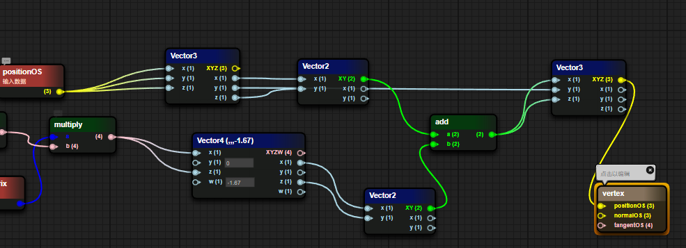

# ShaderBlueprint

## 1. Blueprint Overview

### 1.1 Create a blueprint

Right-click the Create menu in the Assert window and select Shader BluePrint to create a blueprint file.

> When the blueprint file is not opened, the Shader file corresponding to the blueprint file is not created; the Shader file is created only when the blueprint file is opened, completing the mapping between the blueprint and Shader.

 

Picture 1-1

### 1.2 Blueprint interface preview

Figure 1-2

1. Blueprint file Inspector window
2. Blueprint Params window
3. Blueprint file Pass window
4. Blueprint preview window

## 2. Similarities and differences with Shader

### 2.1 Three fixed basic material types

#### 2.1.1 PBR

Common Shader properties:

- NormalWS

The world normal calculates the lighting results of each vertex in world coordinates.

- alphaTest

After the AlphaTest switch is enabled, Shader uses the value of alphatest to determine whether to discard the pixel.

- AlbedoColor

Surface color (excluding lighting)

- Metallica

Metallicity, a value that describes the metallic properties of an object, actually controls the extent to which a surface is like "metal". For a pure surface, the value of metallicity may be 0 or 1. Most objects in reality are actually somewhere between this. between intervals

- Smoothness

Smoothness describes the smoothness of an object. It can usually be determined based on the blur or clarity of reflection or the breadth or density of specular reflection highlights.

- Occlusion

Ambient Occlusion Parameters, Ambient Occlusion is an effect that approximates the attenuation of light due to occlusion, a subtle representation that makes corners, crevices darker to create a more natural, realistic look

- Emission

Self-illuminating color

- Anisotropy

Anisotropic parameters, increase the number of samples to supplement the details displayed on the model

- Alpha

Transparency, if the TRANSPARENT rendering mode is selected, different transparency levels will be selected based on the Alpha value.

Figure 2-1 shows the fragment shader content where the PBR material type is a Shader Blueprint.

 

Figure 2-1

#### 2.1.2 UnLit

NormalWS

The world normal calculates the lighting results of each vertex in world coordinates.

AlphaTest

After the AlphaTest switch is enabled, Shader uses the value of alphatest to determine whether to discard the pixel.

Color

base color

Alpha

Transparency, if TRANSPARENT rendering mode is selected, different transparency levels will be selected based on the Alpha value.

Figure 2-2 shows the fragment shader content where the UnLit material type is a Shader Blueprint.

 

Figure 2-2

#### 2.1.3 Blinnphong

NormalWS

The world normal calculates the lighting results of each vertex in world coordinates.

AlphaTest

After the AlphaTest switch is enabled, Shader uses the value of alphatest to determine whether to discard the pixel.

DiffuseColor

Diffuse color (the color of places where no light is produced)

SpecularColor

Specular color (the color of where the light is generated)

Shininess

surface smoothness

Gloss

Surface roughness

Aplha

Transparency, if TRANSPARENT rendering mode is selected, different transparency levels will be selected based on the Alpha value.

Figure 2-3 shows the fragment shader content where the Blinnphong material type is a Shader Blueprint.

 

Figure 2-3

### 2.2 Material mixing method

- OPAQUE (opaque)

  final color = source color. This means that the material will be drawn in front of the background.

- CUTOUT (cutout)

   If the Alpha value sampled in the map > AlphaTestValue, the final color is the source color, otherwise the pixel is discarded.

- TRANSPARENT (translucent)

  Final color = source color opacity + destination color (1 - opacity).

- ADDTIVE (additive color mixing)

  Final color = source color + target color

- ALPHABLENDED (transparent blending)

  This means that the object is in semi-transparent mode, but the final pixel is shaded in a different blending mode. The AlphaBlended blending mode is SrcAlpha * SrcColor + (1 - SRCAlpha) * DstColor. Generally speaking, SrcAlpha comes from the alpha value of the texture.

### 2.3 ShaderName //Pending items

ShaderName is entered in the ShaderName text box.

### 2.4 ShadowCaster

Shadow calculation switch. When this switch is turned on,

### 2.5 DepthNormal

DepthNormal switch, when this switch is turned on, DepthNormal Pass will be added to calculate the normal information of the scene (this function may be used in some post-processing)

### 2.6 AlphaTest

Alpha test switch. When this switch is turned on, the Value function of the AlphaTest variable of the fragment shader is enabled, transparent clipping is enabled, and pixels that trigger the alphatest Value condition are directly discarded without filling color.

### 2.7 SceneFog

Scene fog effect switch. When this switch is turned on, sceneFog is enabled to calculate the scope of the fog effect through the w value of the screen space.

## 3. Simple example

### 3.1 Display a simple model

 

Figure 3-1

1. Pass in a texture through Params

2. Sampling the incoming texture via UV
3. Use the color sampled from the texture as the Color passed to Unlit
4. Pass the world normal into Unlit’s world normal input

The results of the blueprint are shown below

 

Figure 3-2

### 3.2 Display a simple Blinnphong shader

Figure 3-3

1. Pass in world normals
2. Pass in the surface color through Params

The results of the blueprint are displayed as shown in the figure

 

Figure 3-4

## 4. Node data transmission method

In a node in the blueprint, the left side is the input data and the right side is the output data.

Input data can come from a source data, Params variable or the output of other nodes

  

Pic 4-1

## 5. Common node types

### 5.1 Coordinate class

| Coordinate type | Coordinate interpretation	|
| ---------- | ------------------------------------------------------------ |
| PositionWS |  Vertex world coordinates in world space |
| normalWS |  Vertex normal world coordinates in world space |
| tangentWS |  Vertex tangent world standard in world space |
| biNormalWS |  Vertex bitangent world coordinates in world space |
| worldMat |  World space matrix |

### 5.2 Camera class

| Property type	| Attribute explanation	|
| --------------- | ------------------------------------------------------------ |
| viewDirection |  Sight vector (mathematical expression of sight in 3D world space) |
| cameraPosition |  Camera position world space coordinates |
| cameraDirection |  Camera forward direction |
| cameraUp    	|  Camera Up direction |
| cameraNear  	|  Camera near plane size |
| cameraFar   	|  Camera far plane size |

### 5.3 Mathematics

| Property type	| Attribute explanation	|
| ------------------------------- | ------------------------------------------------------------ |
| add / minus / multiply / divide |  Four arithmetic operations |
| without / cos / so	|  Trigonometric functions |
| clamp                       	|  Clamp the value within the range of min and max |
| mix / max                   	|  Minimum value, maximum value |
| step  / smoothstep          	|  x > value : 0.0 : 1.0 |
| pow                         	|  Next |
| dot / cross                 	|  Dot product vector, cross product vector |

### 5.4 Texture class

| Property type	| Attribute explanation	|
| ------------------------- | ------------------------------------------------------------ |
| sampler2D             	|  Normal sampling 2D texture map |
| samplerCube           	|  Sampling 3D CubeMap |
| sampler2DNormal (OpenGL) |  Sampling normal map (GL in the lower left corner) |
| sampler2DNormal(Directx) |  Sampling normal map (DX in the upper left corner) |

### 5.5 Color Class

| Attribute explanation	| Property type	|
| ------------- | ------------------------------------------------------------ |
| GammaToLinear |  Convert gamma space to linear space |
| LinearToGamma |  Convert linear space to gamma space |

## 6. Common Params types

 Add a Params variable. Select "+" in the Params window and select the corresponding Parmas variable type.

 

Figure 6-1

### 6.1 Float

Define a float value and try a float type object in the inspection panel first.

 

Figure 6-2

### 6.2 Texture2D

Define the value of a 2D texture and display a 2D texture type object in the inspection panel

 

Figure 6-3

### 6.3 Vector2/3/4

Define a vector type, which is divided into Vector2, Vector3, and Vector4 according to the number of components.

 

Figure 6-4

### 6.4 Color

Define a color value, usually there are four components of RGBA data

 

Figure 6-5

### 6.5 Define

Macro definition is used to execute different result content for different trigger results of macro conditions, and is more efficient than if-else

 

Figure 6-6

## 7. Custom function

#### 7.1 Create blueprint function

Right-click the Create menu in the Project window and select Shader BluePrint Function to create a blueprint function.

 

Figure 7-1

#### 7.2 Add parameters

In the blueprint editing window, right-click on the blank space, select the ShaderFunction option, and select the Input In tab.

 

Figure 7-2

#### 7.3 Automatic return value

In the final Default Output Result node, the input data type determines the output type of the Shader function. The function blueprint will automatically determine the output type, as shown in the figure below

 

 

Figure 7-3

#### 7.4 Calling functions within functions

In the blueprint function interface, right-click where you want to place the blueprint function node, and select the function defined when creating the blueprint function (blueprint function file name) in the CustomFun-BlueMap item.

 

Figure 7-4

## 8. Advanced examples

> simple grass

 

Figure 8-1

### **8.1 Vertex Shader Fragment**

1. Use Perlin noise to simulate a Vec4 vector

 

Figure 8-2

2. Perform some special transformations on noise values

Reduce the generated noise value by 0.016, multiply it by the g channel and a channel of the external Color, sum the multiplied results, add the obtained sum to an interference value, and finally multiply it with the world matrix

Figure 8-3

3. Take the xz component from the result of multiplying the world matrix and add it to the xz component of positionOS to get the new xz component of positionOS.

 

Figure 8-4

### 8.2 Fragment Shader Fragments

1. Determine whether the SNOW macro is enabled. When the macro is enabled, calculate 1- the result of the square of the vertex color g value in (0,1). When the macro is turned off, the value is 0.

 

Figure 8-5

2. Multiply the UV coordinate offset with a 2x2 matrix composed of a trigonometric function and then offset it back to the original position.

Figure 8-6

3. Sample the grass texture map, extract the A channel and convert it into a gamma value as the Alpha value of the grass and pass it into the PBR function. The Albedo value is the incoming color value * texture sampling value + macro judgment value.

Figure 8-7

The results of the blueprint are shown below

 

Figure 8-7

## Expansion: Quick operations

| Node type | Generation method |
| ---- | ---- |
| Quickly generate float nodes | Press and hold the numeric key 1 and left-click where you want to place it |
| Quickly generate Vector2 nodes | Press and hold the numeric key 2 and left-click where you want to place it |
| Quickly generate Vector3 nodes | Press and hold the numeric key 3 and left-click where you want to place it |
| Quickly generate Vector4 nodes | Press and hold the numeric key 4 and left-click where you want to place it |
| Quickly generate If nodes | Press and hold the letter key i, and left-click where you want to place it |
| Quickly generate bool nodes | Press and hold the letter key b and left-click where you want to place it |
| Quickly generate sampler2D nodes | Long press the t key and left-click the location you want to place |

