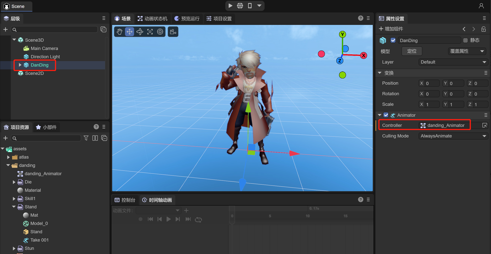
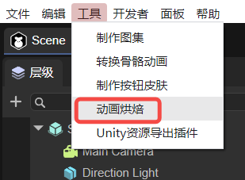
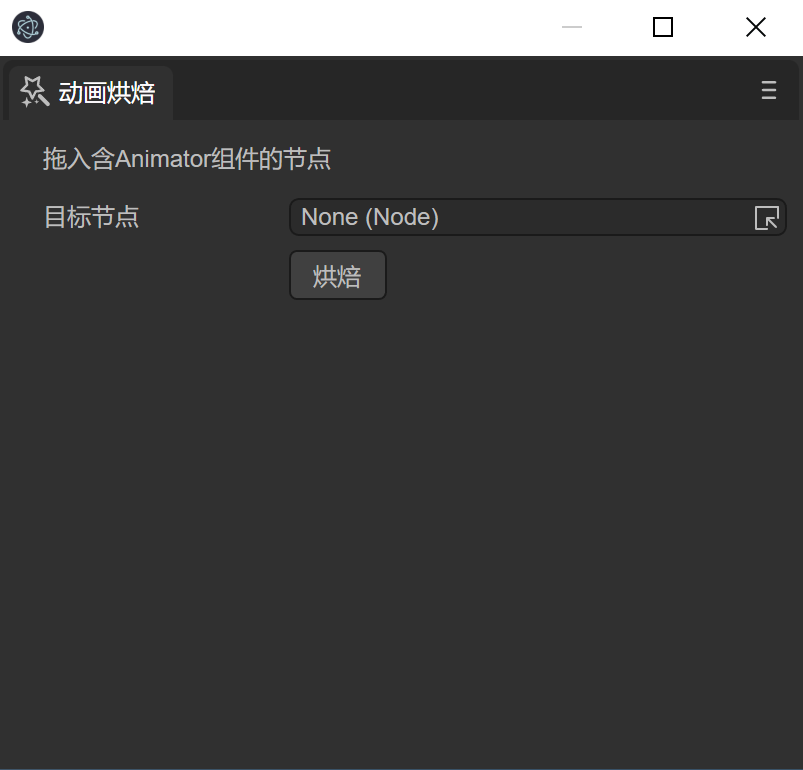
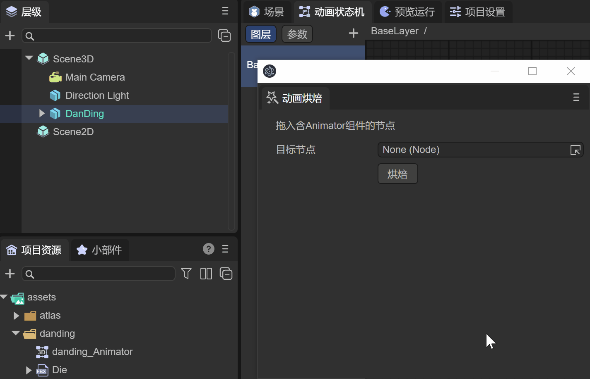
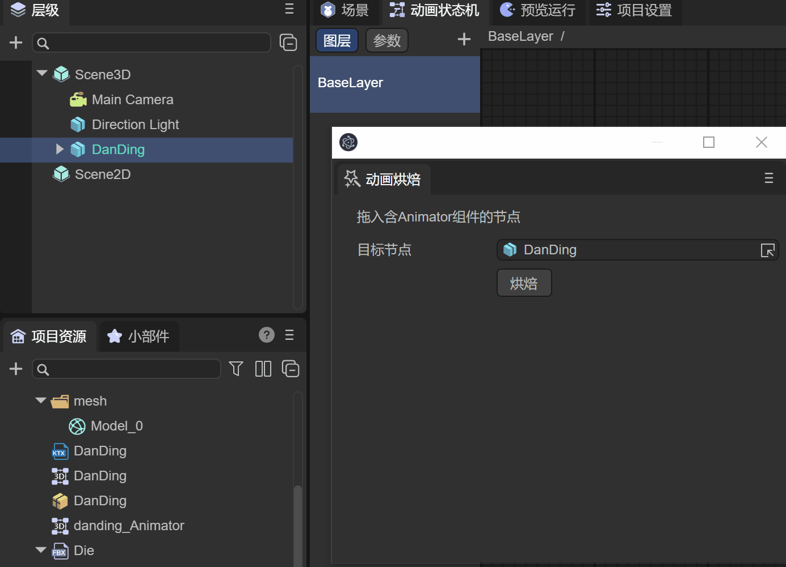

# Detailed explanation of animation baking

The above two documents introduce how to use timeline animation and animation state machine in LayaAir3.0. This article will introduce a special animation optimization solution, animation baking. What is animation baking? Animation baking is a method in which all animations are calculated in advance; all bone nodes are precalculated and stored in memory; the GPU directly reads the matrix values ​​of the corresponding nodes through the memory; and rendering is performed. By using animation baking, CPU consumption can be reduced, because GPU animation efficiency is higher than CPU animation, and performance can be greatly improved for scenes that use a large number of skeletal animations.

## 1. Using animation baking in IDE

Since all objects that play animation in the LayaAir project need to add the Animator component, we first prepare an animation object with an Animator, as shown in Figure 1-1

(Picture 1-1)

Configure the animation state and animation clips in the animation state machine, as shown in Figure 1-2

(Figure 1-2)

Run the scene at this time and you can see the character doing standby animation, as shown in animation 1-3.

(Animation 1-3)

The animation at this time uses the CPU to calculate the skeleton information to play the animation. Next, we will use animation baking and use the GPU to calculate the animation data.

In the menu bar, click "Tools" and select "Animation Baking", as shown in Figure 1-4

(Figure 1-4)

You can open the "Animation Baking" tool, as shown in Figure 1-5

(Figure 1-5)

You can learn from the tool that if you want to bake the above animation with Animator, you need to drag the node containing the Animator component into the tool. As shown in the animation 1-6, let’s drag in the node.

(Animation 1-6)

After clicking `Bake`, animation baking starts.

> Animation baked animation does not support animation fusion.

The animation baked data file will be generated in the directory with the node name "DanDing".

> Note: The directory name of the generated data file is the name of the node

Let’s take a look at what data files are generated, as shown in Figure 1-7

(Figure 1-7)

Among them, in the Danding directory

- anim directory: save animation .lani files (can have multiple animation files)

- mesh directory: save model files

- DanDing.ktx: Baked data file, using ktx texture image format, used to store calculated animation data

- DanDing.controller: 3D animation state machine file renamed after node name

- DanDing.lh: Save the baked prefab and can be used directly. Click on the prefab, and you can see from the back of Figure 1-7 that the SimpleSkinnedMeshRenderer component is configured on the model node, and the baked data file is configured.

 

At this time, we can directly use the code or directly drag the prefab into the scene. In the LayaAir example, you can see that a large number of baked animations are loaded, and the efficiency is greatly improved, as shown in Figure 1-8

Pre-baked skeletal animation example: https://layaair.com/3.x/demo/?category=3D&group=8&name=6

## 2. Baking multiple animations

Usually multiple animations are configured in Animator, so all animations can be baked at once, as shown in Figure 2-1

(Figure 2-1)

Next, re-animate the DanDing node, as shown in animation 2-2.

(Animation 2-2)

At this point, multiple animations are baked, as shown in Figure 2-3

(Figure 2-3)

Multiple animation lani files are generated in the anim directory.

After opening the controller file, you can see that all animation states have been created, and you can just use the prefab directly later.

So far, animation baking has been introduced. Developers can use the animation baking tool provided by LayaAir3.0 during the project optimization process to further improve performance.

