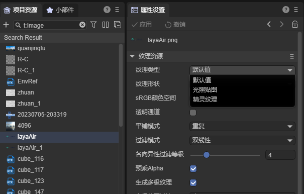
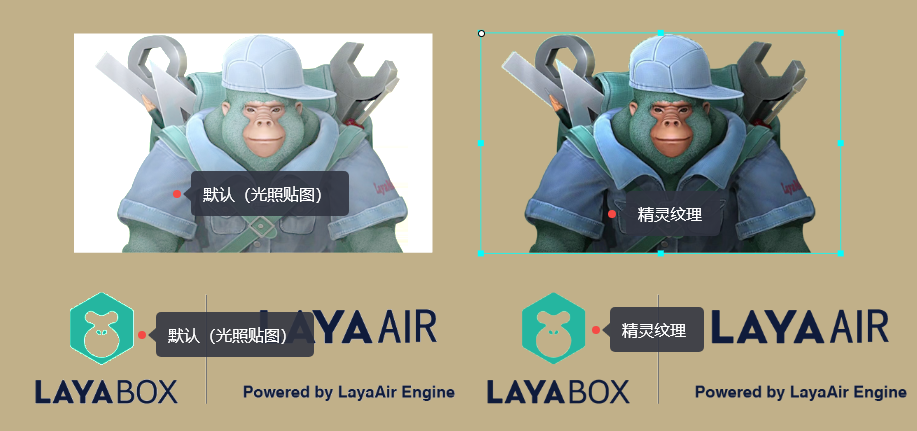
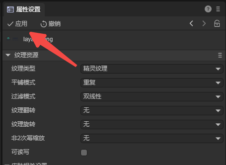
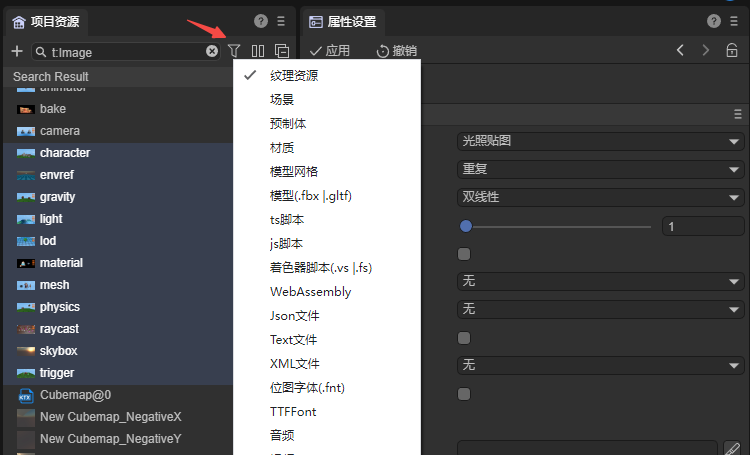
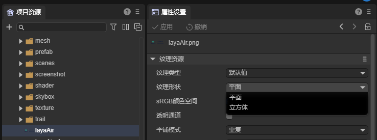
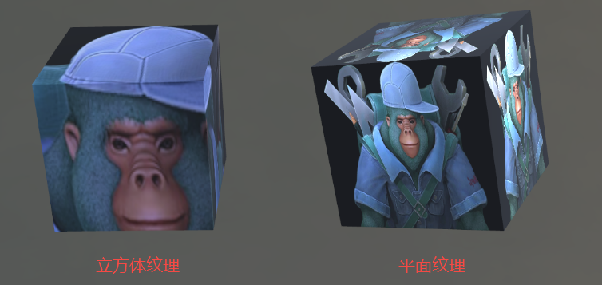
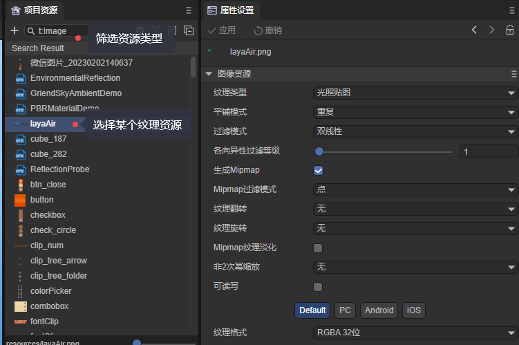

# Texture resource settings

> Author: Charley

Regarding the basic concepts of texture, novice developers can first read the article [Texture Basics](../../../basics/3D/texture/readme.md). This article focuses on the attribute settings of texture resources. .

## 1. Texture type

Regarding texture types, LayaAir3 IDE supports three types, namely sprite textures for 2D UI, default textures for 3D, and texture types for 3D light maps.

### 1.1 Pitfalls in 2D texture import

When the bitmap texture resource is imported into the assets of the `Project Resource Panel`, the texture type value is the default value. As shown in Figure 1:

   

(figure 1)

The default value can be applied to 2D and 3D textures, but the attributes must be configured according to different uses. The default configuration is suitable for 3D textures.

Many developers and users of LayaAir1.x and LayaAir2.x will encounter errors such as transparent channel exceptions when using UI textures. as shown in picture 2.

  

(figure 2)

What causes this?

Since 3D resources are not supported in the IDE of LayaAir1.0 and 2.0 engines, all bitmap resources can be processed according to 2D textures.

The 3.0 engine IDE supports both 2D textures and textures for 3D.

If you judge only by the resource suffix, they are both JPG and PNG. Then the IDE cannot distinguish which should be used for 2D textures and which should be used for 3D textures.

Therefore, when the resources are imported into the IDE, the IDE will default the resources that adopt the UI component naming rules to the texture parameters for 2D UI, otherwise they will be set to the texture parameters for 3D.

> The document for UI component naming rules is [UI Component Detailed Explanation](../../uiEditor/uiComponent/readme.md#General resource naming rules are as follows:)

When developers import resources to the IDE and do not name them according to the UI component naming convention, they are naturally recognized as textures for 3D. Therefore, when these resources with 3D texture attributes set are used for 2D UI components, this happens. The anomaly in Figure 2 shows the phenomenon.

> [!Tip]
>
> 2D resources must be named according to the rules before the resources are imported into the IDE. Naming them according to the UI component rules after importing them will not work.
>
> Listening for resource renames to reset the resource type will cause additional performance consumption to the IDE. It is not as direct and efficient as manually setting the texture type. Therefore, resetting the texture type by renaming is not supported in the IDE.
>
> Another benefit of naming UI resources according to rules is that they can be directly identified as UI components corresponding to the naming convention, which is very convenient when used. Therefore, it is recommended that bitmap resources be named according to the UI naming convention before importing.

### 1.2 Manually set texture type

Since bitmap resources that do not follow the UI naming rules will be recognized as light map textures for 3D by default, 3D textures will not encounter the problems of 2D textures.

2D textures that encounter problems can be solved by checking the two options `sRGB Color Space` and `Premultiplied Alpha`.

But we recommend directly setting the `texture type` to `elf texture` to solve the problem.

After setting, you need to click `Apply` for it to take effect. As shown in Figure 3:

(image 3)

> All texture attribute setting modifications need to be clicked on Apply to take effect, and will not be repeated below.

### 1.3 Set texture attributes in batches

By clicking the ctrl or shift component with the mouse, you can uniformly set the `texture resource` properties of multiple selected textures. Click `Apply` again to take effect.

If there are many textures that need to be set and they span directories, you can also filter by type in the project resource panel and then select multiple settings. The operation is shown in Figure 4:

(Figure 4)

### 2. Texture shape

The texture shapes of the LayaAir engine are plane (Texture2D) and cube (TextureCube). As shown in Figure 5

(Figure 5)

When textures are used in 2D, there is no doubt that only planes can be selected.

If sprite texture is selected for the texture type above, this option will not appear, forcing a flat texture shape.

If Lightmap is selected for the texture type above, this option will not appear either, forcing a cube shape texture to be used.

  

(Figure 6)

#### Import texture and set properties

For the import of bitmaps and videos, you need to copy the external resource files to the project resource directory first, import them as LayaAir textures, and then you can use them.

If you want to modify a texture attribute, as shown in Figure 3-2, select a texture resource, modify it in the attribute settings panel, and apply it.

(Figure 3-2)

**Proceed as follows:**

- Drag original resources to the project resource panel in the IDE -> Automatically complete texture import
- Select the resource -> Property Settings -> Apply

> When the video is imported into the IDE, it will be automatically converted into a texture resource. Settings are not supported for the time being. You can use it directly.

