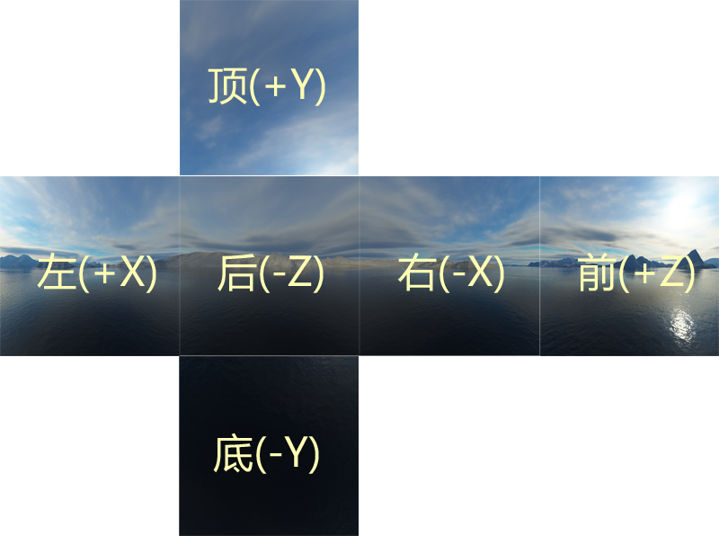

# Detailed explanation of the use of cube texture

> Author ： Charley

## 1. First introduction to cube texture

### 1.1 Application scenarios of cube texture

**Skybox** and **Environment Reflection** in 3D scene production are application scenarios of cube texture (TextureCube), and the effect is shown in Figure 1.

(figure 1)

### 1.2 What is cube texture

As the name suggests, cube texture is a multi-texture combination based on a cube structure. The six square 2D textures represent each face of the cube respectively. According to the direction of the world coordinate system, each face is: front (positive z-axis direction), back (negative z-axis direction), left (positive x-axis direction), Right (negative direction of x-axis), top (positive direction of y-axis), bottom (negative direction of y-axis).

If the texture of this cube is expanded into a plane, the schematic effect is as shown in Figure 2:

(figure 2)

If the developer wants to directly use an unfolded 2D texture set as a cube texture, LayaAir does not support it. How to create a cube texture, we continue reading.

## 2. How to create cube texture

2.1 Create cube texture profile

## 3. How to apply cube texture

