# Plug-in development instructions

## 1. Plug-in capabilities

The editor is developed using the Electron framework, which is essentially an encapsulation of the Chrome browser. The editor is actually a single-page application made with HTML+JS+CSS. But we encapsulate most of the functions, so game developers and plug-in developers do not need to learn HTML/CSS or related front-end frameworks. When we develop plug-ins, we need to use the UI framework provided by the editor. Generally, we are not allowed to directly modify the DOM structure of the editor. Considering user experience and compatibility, resource stores generally do not allow such plug-ins to be put on the shelves.

In the engine/types directory of the project, there are three declaration files related to editor plug-in development, editor.d.ts, editor-ui.d.ts, editor-env.d.ts. They contain a large number of editor extensions. API.

- editor.d.ts is the API of the editor UI process. Commonly used are the classes and interfaces under the global object Editor and IEditor namespaces.
- editor-env.d.ts is the API of the scene scene process. Commonly used are the classes and interfaces under the global object EditorEnv and IEditorEnv namespace.
- editor-ui.d.ts editor UI library. Use classes and interfaces under the IEditorUI namespace.

Among them, IEditor.utils/IEditorEnv.utils exposes a large number of practical tool functions, including UUID generation, encryption and decryption, ZIP compression/decompression, file/directory copy/move, HTTP request, upload/download, etc.

Developers can directly use the node module. In addition, the IDE also has built-in some commonly used npm libraries, such as sharp, glob, pinyin, @svgdotjs/svg.js, etc.

```typescript
//How to use nodejs module
import fs from "fs";
import path from "path";
const sharp = window.require("sharp");
const glob = window.require("glob");
```


## 2. Plug-in operating environment

The editor is a multi-process system, with three main processes: Main process/UI process/Scene process. Plug-ins can only run in the UI process and Scene process. The UI process does not load the engine library, that is, there is no LayaAir engine environment; the Scene process has a LayaAir engine environment, and communication with the UI can only be through the asynchronous communication API provided by the editor. In addition, plug-in scripts may also run in previews (including in-editor previews and external browser previews). The difference from the Scene process is that there is no node environment in the preview process. To sum up, there are three environments in which plug-in scripts may run:

(1) UI process: local modules such as node can be used directly, but the Laya engine cannot be used;

(2) Scene process: You can directly use local modules such as node, and you can use the Laya engine;

(3) Preview process: Local modules such as node cannot be used, but the Laya engine can be used;

If a plugin script mistakenly uses a feature that does not exist in the current environment, the script may not run. For example, using node's fs module to access the file system in a Laya custom component script will cause the script to report an error when previewing or final publishing.

In order for the script to run correctly in various environments, developers need to isolate these three types of code at the file level when writing scripts. For example, a TS file of a custom panel cannot reference the Laya engine because it runs in the UI process. For another example, a Laya.Script cannot use fs, path and other modules because it may run in the preview process. But these two needs are also common, what should we do?


### 2.1 Using native capabilities in Laya.Script

Here is a recommended approach:

```TypeScript
//Script.ts
@Laya.regClass()
class Script extends Laya.Script {

	wantToUseNode() {
    	EditorEnv.scene.runScript("TestSceneScript.visitNode");
	}
}

//TestSceneScript.ts
import fs from "fs";

//Note that it is IEditorEnv.regClass, not Laya.regClass!!
@IEditorEnv.regClass()
class TestSceneScript {

	static visitNode() {
    	fs.readFileSync(....)   	 
	}
}
```

> The TestSceneScript.ts file will be trimmed in publishing because it is not directly referenced by Laya.Script.


### 2.2 How to communicate between UI process script and Scene process script

1. After setting the node/component properties, the nodes/components in the scene will automatically refresh without coding. For example:

```TypeScript
//The following is the UI process code

//Get the selected node
let node = Editor.scene.getSelection()[0];

//Modify node attributes, objects in the scene will be automatically synchronized, no manual work is required
node.props.x = 100;

//Modify the component properties, and the objects in the scene will be automatically synchronized, no need to do it manually.
node.getComponent("MeshRenderer").props.enabled = false;
```


2. Call a method of the node/component and return a value. For example:

```TypeScript
//The following is the UI process code

//Get the selected node
let node = Editor.scene.getSelection()[0];

//Call the test method in the MyScript component and pass in the parameter abc
let ret = await Editor.scene.runNodeScript(node.id, node.getComponent("MyScript").id, "test", "abc");
console.log(ret);
```


3. Customize a function and execute it. For example:

```TypeScript
//The following is the code for the scene process

//Note: IEditorEnv.regClass is required
@IEditorEnv.regClass()
export class TestSceneScript {
	//Note: this is the current IEditorEnv.IGameScene object. If not needed, you can also omit this statement.
	static test(this: IEditorEnv.IGameScene, msg: string) {
    	console.log(msg); //hello
   	 
    	return "ok";
	}
}
//The following is the code of the UI process

let ret = await Editor.scene.runScript("TestSceneScript.test", "hello");
console.log(ret); //ok
```


4. If the scene process needs to send a message to the UI process, use the following method:

```typescript
//Select a resource in the project resource panel
EditorEnv.postMessageToPanel("ProjectPanel", "select", assetId);

//Call a method of the custom Panel and return the result
let ret = await EditorEnv.sendMessageToPanel("MyPanel", "getResult");
```


### 2.3 Script isolation mechanism

The editor implements script isolation by compiling scripts into three js. Bundle.js contains the version that can be run in the preview environment, that is, in the browser; bundle.editor.js is a script that runs in the UI process; bundle.js. scene.js is a script in the Scene process. This mechanism is automatic, but developers need to understand how this mechanism works:

1. All scripts containing the @Laya.regClass decorator will be compiled into bundle.js and bundle.scene.js. Note that the "all" referred to here is limited to the Debug version. In the release version of bundle.js, only scripts referenced by the scene will be included. bundle.scene.js will not appear in release builds.

2. All scripts containing the @IEditorEnv.regClass decorator will be compiled into bundle.scene.js. This js only runs inside the editor, so you can use node capabilities with confidence.

3. All scripts containing @IEditor.xxx decorators will be compiled into bundle.editor.js. This js only runs in the UI process, so you can use node capabilities with confidence, but if you reference Laya classes, an error will be reported.

Although this identification mechanism can solve the problem of marking the usage of different scripts, it is still recommended that developers use directory isolation for their own purposes. For example, put the scripts run by the UI process into the directory named editor, and put the scripts that only run in the editor into the directory named scene, so that maintenance will be clearer.


## 3. Make editor UI

LayaAirIDE provides a visual editor for developing editor UI. In the menu of the `Project Resources` panel, create a new `Editor Interface Prefab`, such as MyWidget.widget. It is recommended to place such prefabs in the editorResources directory or its subdirectories.

> The editorResources directory is a special directory with an agreed name in LayaAirIDE. It has similar characteristics to resources, that is, no matter how deep it is placed in the subdirectory, the resource path can start from editorResources. For example, if a resource is located at "/MaDaHa/v1/editoResources/a/b.png", you can directly fill in "editorResources/a/b.png" when referencing the resource, regardless of the previous "MaDaHa/v1/".
>
> This is very important in the plug-in system, because when developing plug-ins, plug-in developers cannot determine in which directory the plug-in resources will be placed when users use them. They can only be sure that users will not destroy the internal directory structure of the plug-in.
>
> The resources directory has the same characteristics, the difference is that the resources directory will be copied to the release directory when publishing, but editorResources will never be copied.

Double-click to open MyWidget.widget, and use the built-in UI editor to create the UI interface required by the plug-in.

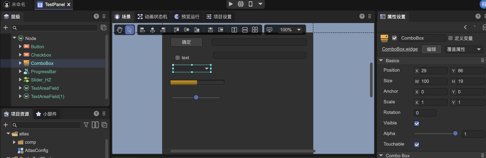

Taking the panel as an example, the method of loading the prefab in the code is:

```TypeScript
@IEditor.panel("Test")
export class MyPanel extends IEditor.EditorPanel {
	async create() {
    	this._panel = await gui.UIPackage.createWidget("editorResources/UI/MyWidget.widget");
    	let input: gui.TextInput = this._panel.getChild("TextInput").getChild("title");
    	input.on("changed", () => {
        	console.log("Changed!");
    	})
	}
}
```


## 4. Programmatic generation interface

### 4.1 Common methods

In addition to using the UI editor to create the interface, you can also use code to create some commonly used UI components, which are in IEditor.GUIUtils.

```typescript
export interface IGUIUtils {
	/**
 	* Editor default background color
 	*/
	bgColor: gui.Color;
	/**
 	* Editor's default dividing line color
 	*/
	lineColor: gui.Color;
	/**
 	* Editor default text color
 	*/
	textColor: gui.Color;

	createButton(autoSize?: boolean): gui.Button;
	createIconButton(flat?: boolean): gui.Button;
	createCheckbox(autoSize?: boolean): gui.Button;
	createIconCheckbox(flat?: boolean): gui.Button;
	createRadio(): gui.Button;
	createComboBox(): gui.ComboBox;
	createTextInput(): TextInput;
	createTextArea(): TextArea;
	createSearchInput(): SearchInput;
	createNumericInput(): NumericInput;
	createColorInput(): ColorInput;
	createGradientInput(): GradientInput;
	createCurveInput(): CurveInput;
	createResourceInput(): ResourceInput;
	createNodeRefInput(): NodeRefInput;
	createProgressBar(): gui.ProgressBar;
	createSlider(): gui.Slider;
	createListItem(): ListItem;
	createIconListItem(): ListItem;
	createCheckboxListItem(): ListItem;
	createCheckboxIconListItem(): ListItem;
    
	createInspectorPanel(): InspectorPanel;
}
```


### 4.2 Example

For example, to dynamically create a button, you can use the following code.

```typescript
let button = IEditor.GUIUtils.createButton();

//The function it implements is actually the same as the following code, but more concise
//let button = gui.UIPackage.createWidgetSync("~/ui/basics/Button/Button.widget");
```

IEditor.InspectorPanel is a general interface class that generates interfaces through configuration. Here is an example of generating a panel entirely through configuration.

```typescript
@IEditor.panel("Test")
export class MyPanel extends IEditor.EditorPanel {
	private _data : any;
	declare _panel : IEditor.InspectorPanel;
	async create() {
    	this._panel = IEditor.GUIUtils.createInspectorPanel();
   	 
    	Editor.typeRegistry.addTypes([
        	{
            	name: "MyPanelType", //Please note that the name is globally unique and must be long
            	properties : [
                	{ name : "text", type : "string" },
                	{ name : "count" , type: "number" },
                	{ name : "actions", inspector: "Buttons",
                    	options : { buttons : [ { caption : "Click me", event: "my_click" } ] }
                	}
            	]
         	}
    	]);
   	 
    	this._panel.allowUndo = true; //Set as needed
    	//If you don't need the undo function, you can also directly this._data = {};
    	this._data = IEditor.DataWatcher.watch({});
   	 
    	//inspect can be called multiple times to combine multiple data in one panel for editing
    	this._panel.inspect(this._data, "MyPanelType");
   	 
    	this._panel.on("my_click", ()=> {
        	alert("hello");
    	});
	}
}
```

The execution effect is as follows:

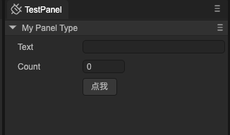

If you don't need the 'My Panel Type' column at the top to be displayed, you can slightly modify the code and add the following red text:

```typescript
{
	name : "MyPanelType",
	catalogBarStyle: "hidden",
	properties : [
   	....
	]
 }
```

The effect is as follows:

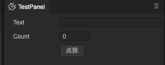

The configuration method can generate very complex interfaces. It can not only be used to make a single panel, but can also be embedded into other UIs. For example, when making an interface in the UI editor, drag in the InspectorPanel prefab (it is placed in "editor-widgets/baisc/Inspector/InspectorPanel.widget), and then the Widget object type obtained through getChild in the code is automatically IEditor.InspectorPanel , which can then be filled through the above-mentioned API (inspect, etc.).

> Please refer to [Documentation](../../../basics/common/Component/readme.md) for type and attribute definition syntax.


## 5. Customize Inspector field editing interface

When we write a component and expose certain fields to the IDE for editing, sometimes we want to be able to customize the editing interface of a certain field. We can do the following steps:

1. Write an InspectorField

 ```TypeScript
@IEditor.inspectorField("MyTestField")
export class TestField extends IEditor.PropertyField {
	@IEditor.onLoad
	static async onLoad() {
    	await gui.UIPackage.resourceMgr.load("MyField.widget");
	}
    
	create() {
    	let input = gui.UIPackage.createWidgetSync("MyField.widget");

    	return { ui: input };
	}
    
	refresh() {
    	//Here is responsible for setting the data to the interface
	}
}
 ```

MyTestField is a registered name. In actual application, it is necessary to ensure that it does not conflict with the name given by others, so it is recommended to use a name like "com.layabox.test".

The create method of InspectorField is synchronous, so createWidget cannot be used here, but createWidgetSync needs to be used. This requires ensuring that the prefab is loaded before creation. So an IEditor.onLoad callback is used here to load resources in advance.


2. Set the inspector attribute of the field to the name you just took, here it is MyTestField

 ```TypeScript
@Laya.regClass()
export class Script extends Laya.Script {
 	@property({ type : Laya.Node, inspector: "MyTestField" })
 	public node: Laya.Node;
}
 ```


3. Actual effect:

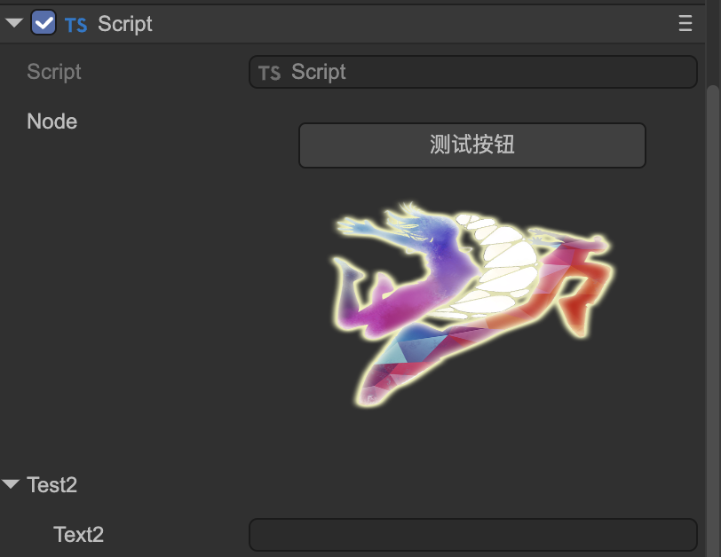


## 6. Customized panel

You can add a panel to the editor in the following ways

```TypeScript
@IEditor.panel("test", {
	title: "Test",
	icon : "editorResources/20230710-161955.png"
})
export class TestPanel extends IEditor.EditorPanel {

	async create() {
    	this._panel = await gui.UIPackage.createWidget("MyPanel.widget");
	}
}
```

The effect is as follows:


## 7. Use dialog boxes

A popup dialog can be created in the following ways:

```TypeScript
//MyDialog.ts
export class MyDialog extends IEditor.Dialog {
	async create() {
    	this.contentPane = await gui.UIPackage.createWidget("MyDialog.widget");
	}
    
	onShown() {
	}
    
	onHide() {
	}
}
```

Within the editor, all dialog boxes are singletons. The way to display this dialog box is:

```TypeScript
import { MyDialog } from "./MyDialog";

Editor.showDialog(MyDialog, null);
```


## 8. Expand the built-in menu

Supports extensions to the editor's existing menus. As shown in the following code, a test menu is added under the Tools menu of the application menu bar, and clicking the menu will call the test function.

```TypeScript
class AnyName {
	@IEditor.menu("App/tool/test")
	static test() {
    	console.log("click menu");
	}
}
```

The first parameter of menu represents the path of the menu. The path is separated by "/". "App/tool/test" represents the test sub-item of the tool submenu under the App menu. Note that the path here uses ID, not the text displayed in the menu. All menu names and their submenus supported by extensions within the editor can be printed for reference by the following method:


The second parameter of the menu method is an optional parameter, through which some additional configuration can be performed. For example:

```TypeScript
class AnyName {
	@IEditor.menu("App/tool/test", { position: "before openDevTools" } )
	static test() {
    	console.log("click menu");
	}
}
```

Through the position option, you can set this newly added test menu to be displayed in front of the original menu "Open Developer Tools - Editor" instead of being added to the end by default.

Commonly used options are:

`position`: Set the position of the menu, supported syntax: "first" / "last" / "before ids" / "after ids" / "beforeGroup ids" / "afterGroup ids".

> The difference between "before" and "beforeGroup" is that "before" is inserted in front of the reference menu, while "beforeGroup" is inserted before the nearest dividing line in front of the reference menu.
>
> The difference between "after" and "afterGroup" is that "after" is inserted after the reference menu, while "afterGroup" is inserted after the nearest dividing line behind the reference menu.
>
> In the extension definition of the same class, it is added after the menu of the previous extension by default. If it is not in the same class and position is not specified, it will be added to the end of the menu by default.
>
> ID values ​​for multiple reference menus are separated by commas.

`checkbox`: Set the menu to a checkbox effect.

`sepBefore` : Display a dividing line before this menu.

`sepAfter`: Display a dividing line after this menu.

`enableTest` : Given a function that returns a Boolean value, this function is executed before the menu is displayed and is used to determine the activation (grayed out) state of the menu. **App menu is not supported. **

`visibleTest`: Given a function that returns a Boolean value, this function will be executed before the menu is displayed to determine the visible or hidden state of the menu. Only the menu popped up by calling the show method is valid. **App menu is not supported. **

`checkedTest`: Given a function that returns a Boolean value, this function will be executed before the menu is displayed to determine the visible or hidden state of the menu. **App menu is not supported. **

The following example demonstrates the use of enableTest. In this newly added menu, if there is no selected object in the scene, it will be grayed out and the click callback cannot be triggered.

```TypeScript
class AnyName {
	static testEnable() {
    	return Editor.secene.getSelection().length > 0;
	}
    
	@IEditor.menu("Hierarchy/test", { enableTest: ()=> AnyName.testEnable() } )
	static test() {
    	console.log("click menu");
	}
}
```


## 9. Create menu

New menus can be created and their popups controlled with code. The method is:

```TypeScript
let menu = IEditor.Menu.create([
	{ label: "test" , click : function() { console.log("clicked"); } }
 ]);

//When you need to pop up
menu.show();
```

The menu also supports cascading, and there is no limit to the number of levels. For example:

```TypeScript
IEditor.Menu.create([
	{
    	label: "test" ,
    	submenu: [
        	{ label : "a" },
        	{
            	label : "b",
            	submenu : [
                	{ label : "c" }
            	]
        	}
    	]
	}
 ]);
```

You can assign an ID to the menu and reference the menu through the ID. But be careful that the ID value does not conflict with the ID of the editor's built-in menu or other people's menus.

```TypeScript
IEditor.Menu.create("MyTestMenu", [
	{ label: "test" , click : function() { console.log("clicked"); } }
 ]);
 
 //When you need to pop up
 IEditor.Menu.getById("MyTestMenu").show();
```


## 10. Draw shapes and interactive handles in the scene view

Use the interface provided by IEditorEnv.Gizmos/IEditorEnv.Handles/IEditorEnv.Gizmos2D to draw shapes and interactive handles in the scene view. Assume that we already have a custom component Script1, and bind a CustomEditor script to Script1 through the IEditorEnv.customEditor decorator to achieve custom editing in the editor.

```TypeScript
//Script1.ts

@regClass()
export class Script1 extends Laya.Script {
	declare owner : Laya.Sprite3D;
}
//TestCustomEditor.ts

@IEditorEnv.customEditor(Script1)
export class TestCustomEditor extends IEditorEnv.CustomEditor {
	declare owner: Laya.Sprite3D;

	onSceneGUI(): void {
    	IEditorEnv.Handles.drawHemiSphere(this.owner.transform.position, 2);
	}
    
	onDrawGizmos(): void {
    	IEditorEnv.Gizmos.drawIcon(this.owner.transform.position, "editorResources/UI/ready1.png");
	}
}
```

The effect is as follows:

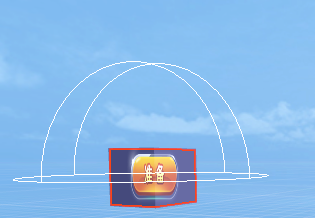

The implementation of 2D is different, it must pass the IEditorEnv.Gizmos2D interface, and currently only supports onDrawGizmosSelected events, onDrawGizmos and onSceneGUI events are not supported.

Here's an example in 2D:

```TypeScript
@IEditorEnv.customEditor(Script2)
export class TestCustomEditor extends IEditorEnv.CustomEditor {
	private _c: IEditorEnv.IGizmoCircle;

	onDrawGizmosSelected(): void {
    	if (!this._c) {
        	let manager = IEditorEnv.Gizmos2D.getManager(this.owner);
        	this._c = manager.createCircle(10);
        	this._c.fill("#ff0");
    	}
    	this._c.setLocalPos(10, 10);
	}
}
```

The effect is as follows:


## 11. Custom configuration

Plug-in developers can customize some configuration data, which can be saved to files or only saved in memory. For example:

```typescript
@IEditor.onLoad
static onLoad() {
	//Please note that the attributes here do not use types in the Laya engine, such as Vector3, which are not allowed.
	Editor.typeRegistry.addTypes([
    	{
        	name: "MyTestSettingsType",
        	properties: [
            	{
                	name: "option1",
                	type: "boolean",
                	default: true
            	},
            	{
                	name: "option2",
                	type: "string",
                	default: "",
            	}
        	]
    	}
	]);
	Editor.extensionManager.createSettings("MyTestSettings", "project", "MyTestSettingsType");
}
```

The first parameter of createSettings is the name of this configuration. It is global. Please choose a name that will not conflict with others. The second parameter is where the configuration data is placed. The optional values ​​are:

- project: Save to the path "project/settings". This is a shared location for configuration files shared by all members of the project. The saved file name is "plugin-configuration name.json". The plugin prefix allows users to clearly identify that this is a configuration file created by a third-party plug-in.

- ocal: Save to the path "project/local". This is the IDE user's personalized setting for the project. The files here are generally not recommended for sharing among project members.
- application: Save to the user data directory of the system. This is the IDE user's personalized setting for the IDE, and it should not be related to the specific project.
- memory: only exists in memory and will not be saved to a file.

The third parameter is the type name, corresponding to the addTypes operation above. The third parameter can also be omitted if the type name and configuration name are consistent.

After the configuration is created, the UI process can access the configuration data through Editor.getSettings and then read and write, for example:

```typescript
let data = Editor.getSettings("MyTestSettings").data;
data.option2 = "hello";
```

Configurations are loaded and saved automatically, no manual operation is required.

The scene process can access the configuration data through EditorEnv.getSettings, but it is read-only and cannot be modified. And because it is cross-process, to get the latest data, sync must be called first, for example:

```typescript
let settings = EditorEnv.getSettings("MyTestSettings");
await settings.sync();
console.log(settings.data.option2); //hello
```


## 12. Extended editor configuration interface

If we created some customized configuration data through the previous section, we can display it in the project configuration interface or the preference interface for users to modify. For example:

```typescript
@IEditor.panel("TestSettings", { usage: "project-settings", title: "测试" })
export class TestSettings extends IEditor.EditorPanel {
	async create() {
    	let panel = IEditor.GUIUtils.createInspectorPanel();
    	panel.inspect(Editor.getSettings("MyTestSettings").data, "MyTestSettings");
    	this._panel = panel;
	}
}
```

The @IEditor.panel decorator has been introduced in "6. Using the Panel" and will not be repeated here. The only difference is the setting of the usage option. Possible values ​​for usage are:

- project-settings: displayed in the project configuration interface
- build-settings: displayed in the build release interface
- preference: displayed in the preference interface

The display effect of the above code is:

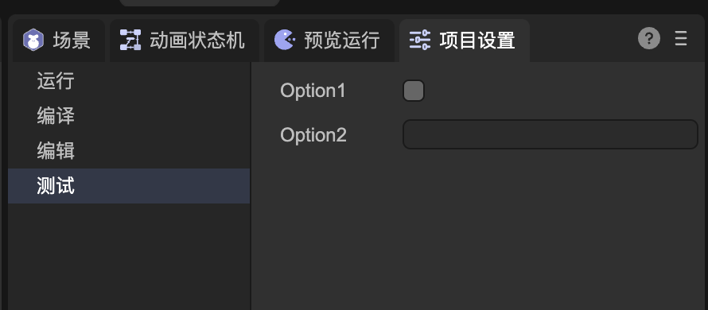


## 13. Expand the build process

In addition to starting in the interface, the build process can also be called through API. The following example demonstrates starting a build task through a custom menu:

```typescript
class Abc {
	IEditor.menu("App/my/build")
	static build() {
    	IEditor.BuildTask.start("web");
	}
}
```

You can also manually start the build task in the scene process:

```typescript
IEditorEnv.BuildTask.start("web");
```

Customize the plug-in process by building plug-ins. The interface for building plug-ins is IBuildTask. IBuildTask is defined as:

```typescript
export interface IBuildPlugin {
	/**
 	* When the build task is initialized. Configurations such as config and platformConfig can be modified in this event.
 	* @param task
 	*/
	onSetup?(task: IBuildTask): Promise<void>;

	/**
 	* The build task starts. You can initialize the structure of the target directory in this event, or perform necessary checks and installations, etc.
 	* @param task
 	*/
	onStart?(task: IBuildTask): Promise<void>;

	/**
 	* Collecting resources that need to be released. The assets collection is all resource objects that need to be published that the system collects based on all valid rules such as dependencies and resources directory rules. You can add additional resource objects to the collection.
 	* @param task
 	* @param assets
 	*/
	onCollectAssets?(task: IBuildTask, assets: Set<IAssetInfo>): Promise<void>;

	/**
 	* Exporting resources. exportInfoMap contains information about exported resources, including saving location and other information. The output location of the outPath custom resource can be modified.
 	* @param task
 	* @param exportInfoMap
 	*/
	onBeforeExportAssets?(task: IBuildTask, exportInfoMap: Map<IAssetInfo, IAssetExportInfo>): Promise<void>;

	/**
 	* Exporting resources is completed. If developers need to add their own files, or perform operations such as compression, they can be handled in this event.
 	* @param task
 	* @param exportInfoMap
 	*/
	onAfterExportAssets?(task: IBuildTask): Promise<void>;

	/**
 	* The build has been completed, some manifest files, configuration files, etc. can be generated in this event.
 	*/
	onCreateManifest?(task: IBuildTask): Promise<void>;

	/**
 	* If there is a native build process, handle it here.
 	* @param task
 	*/
	onCreatePackage?(task: IBuildTask): Promise<void>;

	/**
 	* Build task completion event.
 	* @param task
 	*/
	onEnd?(task: IBuildTask): Promise<void>;
}
```

All hook functions are optional and the required logic can be implemented as needed. Plugins need to be registered through the IEditorEnv.regBuildPlugin decorator. The following example demonstrates how to manually add a resource to participate in the build when the web platform is built.

```typescript
@IEditorEnv.regBuildPlugin("web")
class MyBuildPlugin implements IEditorEnv.IBuildPlugin {
	async onCollectAssets(task : IEditorEnv.IBuildTask, assets: Set<IAssetInfo>) {
    	let myAsset = ...
    	assets.add(myAsset);
   	 
    	//In the publishing plug-in, you need to use task.logger to output logs
    	task.logger.debug("add my asset");
	}
}
```

If you need to build the plug-in to take effect on all platforms, you can pass "*" as the first parameter of regBuildPlugin. The second parameter of regBuildPlugin can pass a priority value. The greater the priority, the earlier the plug-in will be called during build.

Some tools and methods often used in plug-ins include:

(1) Use the task.logger interface to record logs;

(2) Use IEditorEnv.utils.renderTemplateFile to render the template file, using the mustache library;

(3) Use task.mergeConfigFile to merge configuration files. That is, if there are json format configuration files with the same path and name in the built-in template directory and the project template directory (build-templates), they can be merged through this method;

(4) Use IEditorEnv.utils.intallCli to install some public cli packages, which will be installed under library/cli-package. For example:

```typescript
await IEditorEnv.utils.installCli("@oppo-minigame/cli", options);
```

(6) Use IEditorEnv.utils.exec to execute any local command.

(7) Use IEditorEnv.utils.downloadFile to download files.

(8) Use IEditorEnv.utils.ZipFileR to decompress the file.

You can extend the build options panel and add some custom parameters. As described in the "Customize Panel" section, we can set the usage of the panel to "build-settings".

```typescript
@IEditor.panel("TestBuildSettings", { usage: "build-settings", title: "测试" })
export class TestBuildSettings extends IEditor.EditorPanel {
@IEditor.onLoad
	static start() {
    	Editor.typeRegistry.addTypes([
        	{
            	name: "MyBuildSettings",
            	catalogBarStyle : "hidden",
            	properties: [
                	{
                    	name: "option1",
                    	type: "boolean",
                    	default: true
                	},
                	{
                    	name: "option2",
                    	type: "string",
                    	default: "2332",
                	}
            	]
        	}
    	]);
    	Editor.extensionManager.createSettings("MyBuildSettings", "project");
	}

	async create() {
    	let panel = IEditor.GUIUtils.createInspectorPanel();
    	panel.allowUndo = true;
    	panel.inspect(Editor.getSettings("MyBuildSettings").data, "MyBuildSettings");
    	this._panel = panel;
	}
}
```

The effect is as follows:

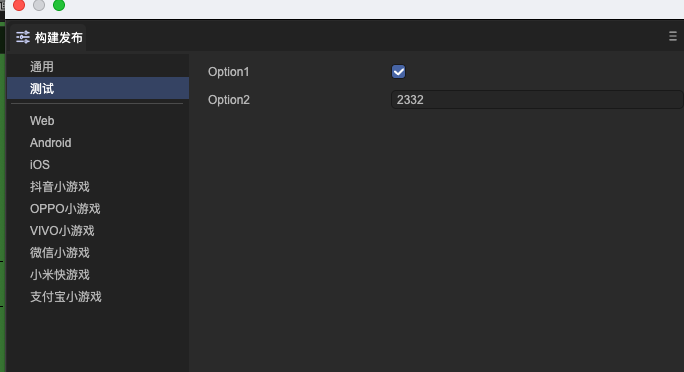

These parameters can be accessed through the Settings mechanism in the build plug-in, for example:

```typescript
@IEditorEnv.regBuildPlugin("web")
class MyBuildPlugin implements IEditorEnv.IBuildPlugin {
	async onSetup(task : IEditorEnv.IBuildTask) {
    	let mySettings = EditorEnv.getSettings("MyBuildSettings");
    	await mySettings.sync();
   	 
    	task.logger.debug(mySettings.data.option1);
	}
}
```


## 14. Customize publishing target platform

You can add a release target platform to the IDE through a plug-in. For example:

```typescript
Editor.extensionManager.createBuildTarget("test", //The unique id of the platform, no conflict
{
	caption: "Customized platform", //Target name
	settingsName:"MyBuildPlatformtSettings", //You need to register with Edition.extensionManager.createSettings first
	inspector: "TestBuildSettings" //A panel with usage build-settings
	templatePath: "editorResources/testTemplate" //An optional parameter. Place the build template file in the specified directory. It will be automatically copied to the output directory during the build.
});
```

Here is a complete example:

```typescript
@IEditor.panel("TestBuildSettings", { usage: "build-settings", title: "test" })
export class TestBuildSettings extends IEditor.EditorPanel {
	@IEditor.onLoad
	static start() {
    	Editor.typeRegistry.addTypes([
        	{
            	name: "MyTestSettings2",
            	catalogBarStyle : "hidden",
            	properties: [
                	{
                    	name: "option1",
                    	type: "boolean",
                    	default: true
                	},
                	{
                    	name: "option2",
                    	type: "string",
                    	default: "2332",
                	}
            	]
        	}
    	]);
    	Editor.extensionManager.createSettings("MyBuildPlatformtSettings", "project");
    	Editor.extensionManager.createBuildTarget("test", { caption: "Customized platform", settingsName:"MyTestSettings2", inspector: "TestBuildSettings" });
	}

	async create() {
    	let panel = IEditor.GUIUtils.createInspectorPanel();
    	panel.allowUndo = true;
    	panel.inspect(Editor.getSettings("MyBuildPlatformtSettings").data, "MyBuildPlatformtSettings");
    	this._panel = panel;
	}
}
```

The effect is as follows:


During the scenario process, you need to add one or more build plugins for this new custom platform.

```typescript
@IEditorEnv.regBuildPlugin("test")
export class TestBuildPlugin implements IEditorEnv.IBuildPlugin {

	async onCreatePackage(task: IEditorEnv.IBuildTask) {
    	//The platformConfig here corresponds to MyBuildPlatformtSettings. There is no need to getSettings by yourself.
    	task.logger.info(task.platformConfig.option2);
	}
}
```

After the build is completed, if you need to support "run", the build plug-in needs to define a runHandler. The following example demonstrates accessing the built content through the Web. The root directory of the Web site is the target directory of the build, so an empty string is passed in. If it is a subdirectory, the path to the subdirectory can be passed in.

```typescript
@IEditorEnv.regBuildPlugin("test")
export class TestBuildPlugin implements IEditorEnv.IBuildPlugin {

	async onCreatePackage(task: IEditorEnv.IBuildTask) {
    	task.config.runHandler = {
        	serveRootPath : ""
    	};
	}
}
```


## 15. Resource import pre-processing and post-processing

Sometimes we need to do some automated processing when importing resources, such as automatically setting it to an elf texture when importing a picture, setting a compression format, etc. In this case, we can use the IAssetProcessor interface. The interface is defined as follows:

```typescript
export interface IAssetProcessor {
	//Called before image resources are imported
	onPreprocessImage?(assetImporter: IImageAssetImporter): void | Promise<void>;
	//Called before any type of resource is imported
	onPreprocessAsset?(assetImporter: IAssetImporter): void | Promise<void>;

	//Called after the image resource is imported
	onPostprocessImage?(assetImporter: IImageAssetImporter): void | Promise<void>;
	//Called after any type of resource is imported
	onPostprocessAsset?(assetImporter: IAssetImporter): void | Promise<void>;
}
```

Classes that implement the IAssetProcessor interface need to be registered through the decorator IEditorEnv.regAssetProcessor. The following is a simple example of AssetProcessor, which sets all images that are not sprite textures to compressed format.

```typescript
@IEditorEnv.regAssetProcessor()
export class TestAssetProcessor implements IEditorEnv.IAssetProcessor {
	onPreprocessImage(assetImporter: IEditorEnv.IImageAssetImporter): void | promise<void> {
    	if (assetImporter.config.textureType != 2) {
        	assetImporter.config.platformDefault = { format: 10 };
    	}
	}
}
```

> (1) You can use assetImporter.isNew to distinguish whether it is a newly added resource;
>
> (2) After adding or modifying IAssetProcessor, the resource library does not automatically re-execute the script for existing resources. The user needs to use the right-click menu "Reimport" of the resource library. Of course, you can also re-import through the plug-in code: EditorEnv.assetMgr.importAsset(asset).


## 16. International support

Using the interface provided by LayaAirIDE, you can realize the internationalization of the plug-in interface and the internationalization of the information output in the plug-in code. First we need to create a new configuration file. If this configuration is used for interface internationalization, please create it in the directory where all your interface files are located or the upper-level directory.

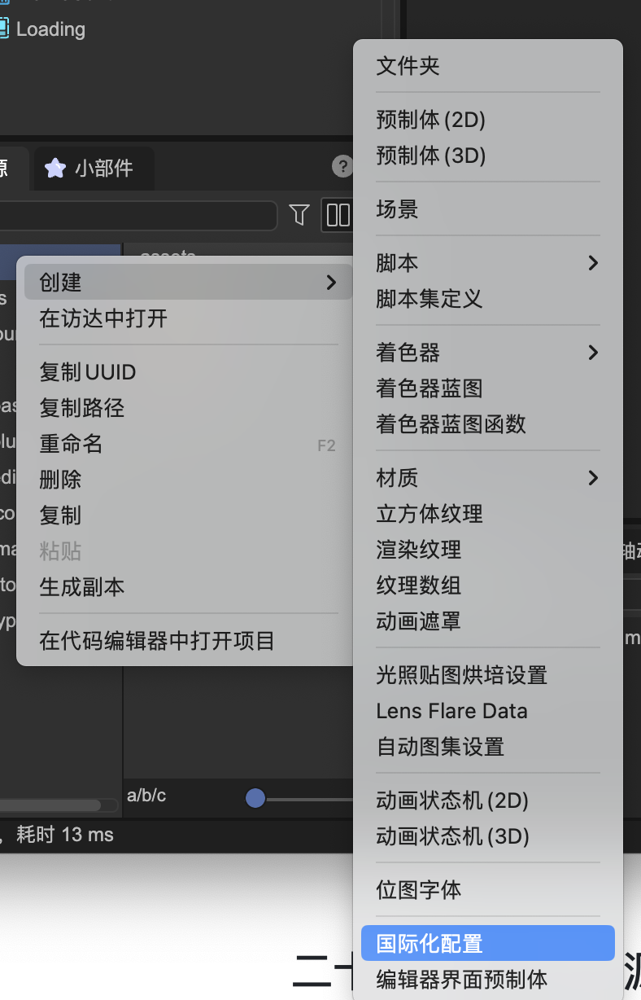

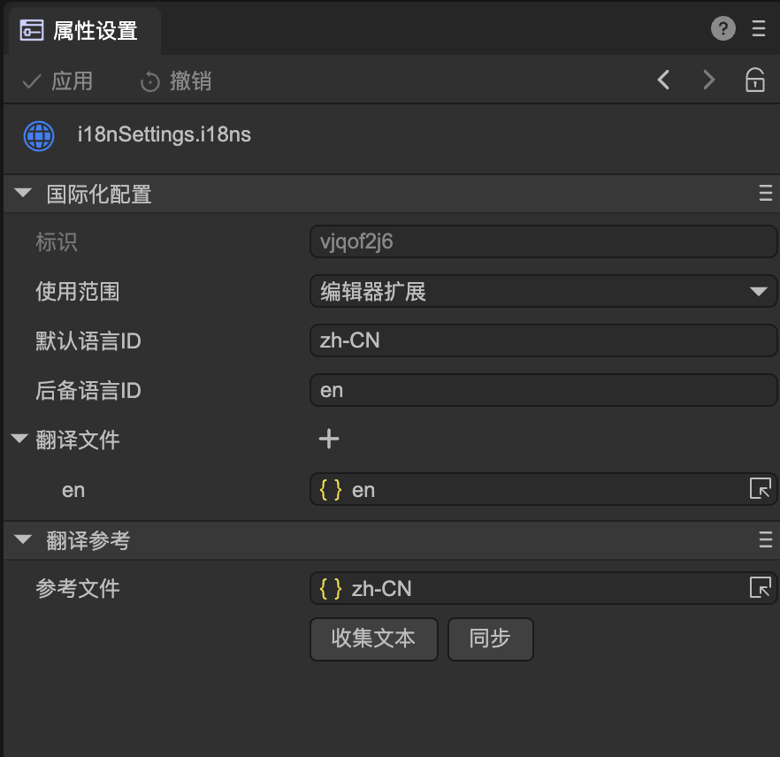

**Identification**: The unique identification of the international configuration file, automatically generated, cannot be modified (if you really want to modify it, you can open the configuration file in text mode and modify it directly, but you need to ensure it is unique. However, it has been bound on the interface after modification will be all lost).

**Scope of use:** Runtime or editor extension. Runtime means it is used for games (not supported yet). Currently we choose the editor extension, which is used in the plug-in interface.

**Default Language ID**: The text language used in interface design when making editor prefabs visually. For example, if you make the interface in Chinese, then here is zh-CN, if you make the interface in English, then here is en, and so on. If the language set here is consistent with the runtime language, the text on the interface will be used directly and the translation file will not be used for replacement.

**Fallback Language ID**: If a translation file matching the runtime language cannot be found, the fallback language ID will be used to continue matching. For example, if the runtime language is German and there is no German (de) translation file in the translation file, the translation file with the fallback language ID (en) will be used.

**Translation Reference**: Generally used to automatically collect text on the interface to form a reference file. Then use this reference file to translate into various languages, and then add it to the translation file list. The reference file does not need to be added to the translation file list because the text in the reference file is existing on the interface.

**Collect text:** After clicking, all prefab files in the directory and subdirectories where the configuration file is located will be analyzed, all text that needs to be translated will be collected into reference files, and these texts will be converted into international formats. If the reference file is not set, one will be automatically generated.

**Synchronize**: After re-collecting the text, click Synchronize to match the entries of all translation files with the reference files. For example, if a new text "abc" is created on the interface, after clicking to collect the text, an entry "abc" will be added to the reference file. After clicking sync, an entry "abc" will be added to all translation files.

In addition to automatically collecting text on the interface, we can also manually set it, such as the title of a button:


Click the button in the upper right corner, and the interface will pop up:

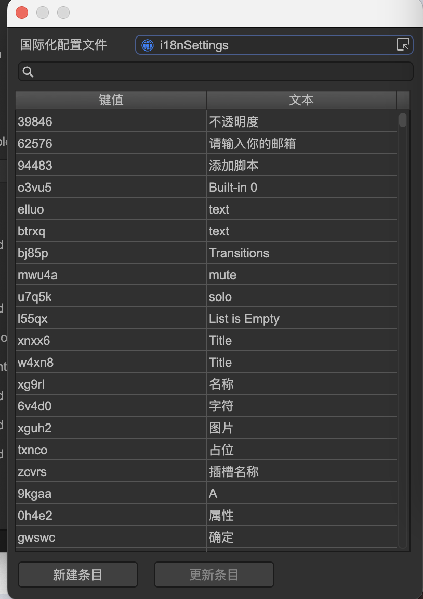

Here you can select or create a new entry in the language file. After selecting an item, the input box updates to display:

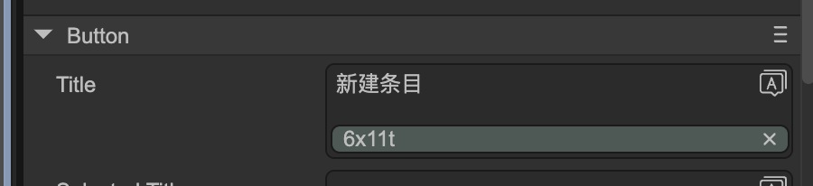

The green horizontal bar shows the key value of the translation file, indicating that the text has been internationalized.

**After the interface is internationalized, language adaptation is fully automatic without code intervention. **


In addition to interface internationalization, the information output by the code also needs to be internationalized. Usually we recommend using another configuration file, not to be confused with the configuration file used by the interface. Let’s create a new internationalization configuration:

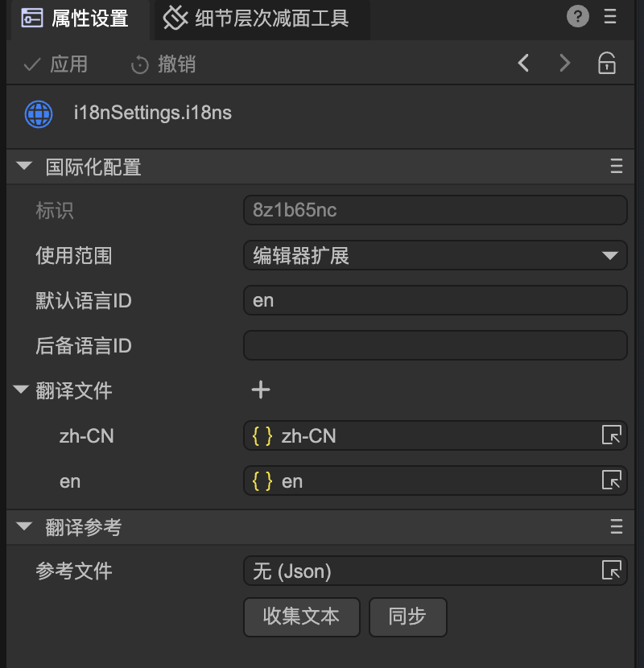

Here you only need to manually create multiple translation files and drag them into the translation file list. The key values ​​of these files need to be synchronized themselves.

The translation reference feature can be ignored as there is no need to collect it from the interface.

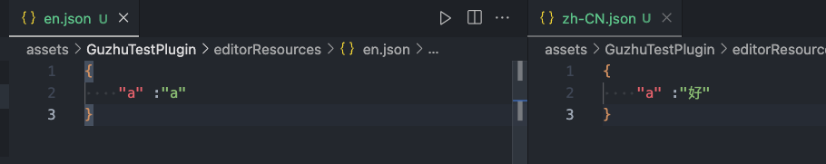

The method used in the code is:

```typescript
myI18n: gui.Translations;

@IEditor.onLoad
async onLoad() {
	myI18n = await gui.UIPackage.resourceMgr.load("editorResources/i18nSettings.i18ns");
}

test() {
	console.log(myI18n.t("a"));
}
```

In many cases, if you only need a small amount of internationalization support in the code and don't want to create multiple json files, there is also a full-code method.

```typescript
//The first parameter needs to be globally unique
let myI18n = gui.Translations.create("LodSimplify");
myI18n.setContent("zh-CN", {
	meshRate: "Model compression ratio",
	meshRateTips: "Compress the model mesh 2x according to the set ratio"
});

Editor.typeRegistry.addTypes([
{
	name: "LodSimplifyData",
	properties: [
    	{
        	name: "meshRate",
        	type : "number",
        	caption: myI18n.t("meshRate", "Mesh Rate"),
        	tips: myI18n.t("meshRateTips", "Compress the model mesh based on the set ratio."),
    	}
 	]
 }
```

SetContent can be called multiple times to add translations in different languages. The following example adds translations for language en, so the default value can be omitted when applying the t function.

```typescript
//The second parameter is the backup language ID. The default is en, so it can be omitted here.
let myI18n = gui.Translations.create("LodSimplify", "en");
myI18n.setContent("zh-CN", {
	meshRate: "Model compression ratio",
	meshRateTips: "Compress the model mesh 2x according to the set ratio"
}).setContent("en", {
	meshRate: "Mesh Rate2",
	meshRateTips: "Compress the model mesh based on the set ratio."
});

Editor.typeRegistry.addTypes([
{
	name: "LodSimplifyData",
	properties: [
    	{
        	name: "meshRate",
        	type : "number",
        	caption: myI18n.t("meshRate"),
        	tips: myI18n.t("meshRateTips"),
    	}
 	]
 }
```


## 17. Command line support

You can start the editor in the terminal and execute the script in the background. The parameters are:

```
> LayaAirIDE --project=/path/to/project --script=MyScript.buildWeb
```

**--project:** project path

**--script:** Specify the script to be executed

For example, using the following script, you can build a web platform using the command line. After the script is executed, the background process will automatically exit.

```typescript
@IEditorEnv.regClass()
class MyScript {
	static async buildWeb() {
    	return IEditorEnv.BuildTask.start("web").waitForCompletion();
	}
}
```


