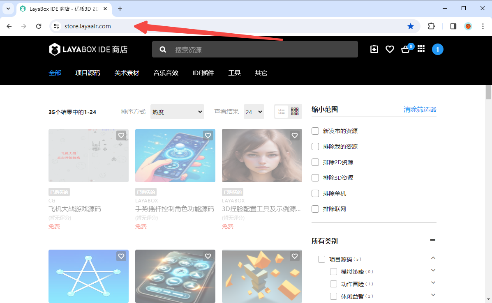
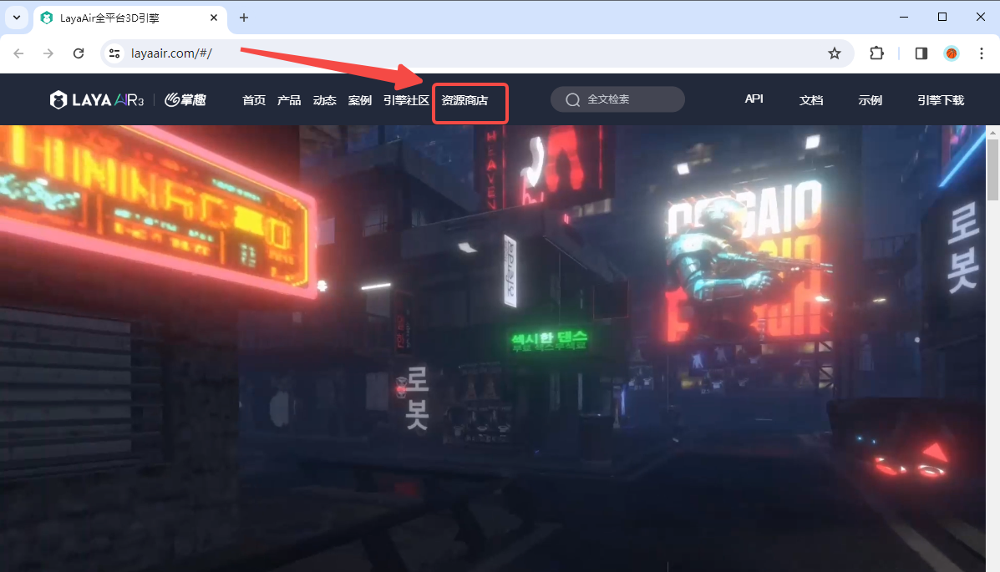
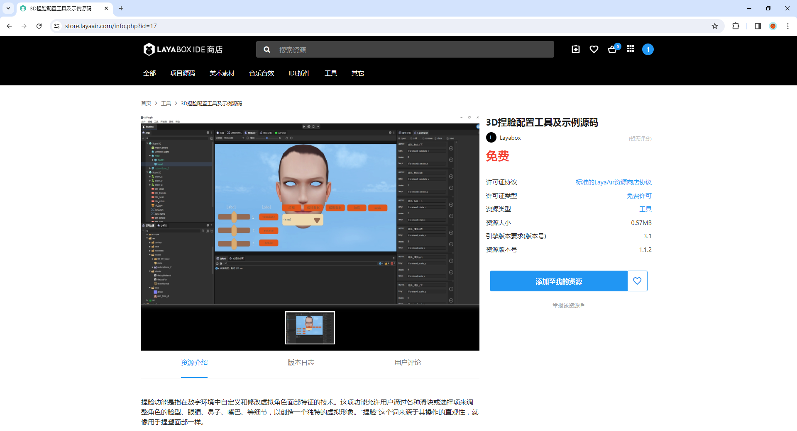
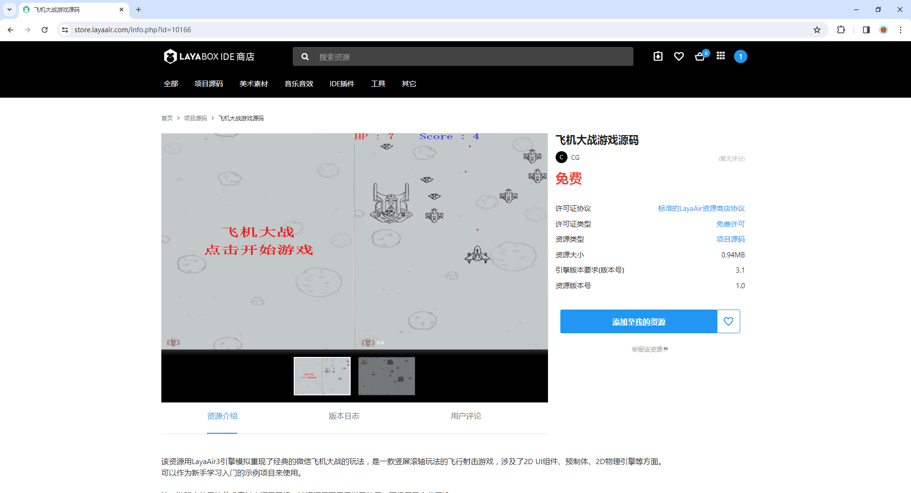
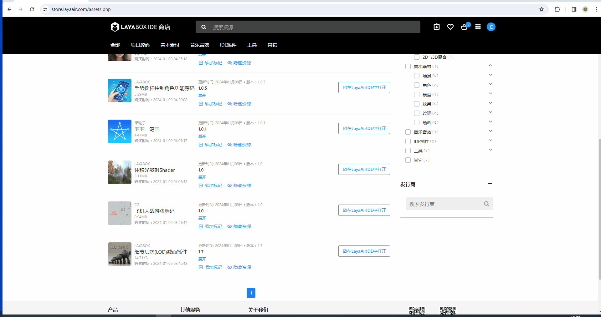

# Plug-in import instructions

> LayaAir version 3.1 has a new resource store. Users’ minimum version of LayaAir IDE must be updated to **3.1** to use the resources in the resource store.

## 1. Purchase plug-ins

### 1.1 Entrance

Users can enter the resource store from the following entrances:

1, 3.1 and above versions of IDE

(Picture 1-1)

2. Enter the URL directly into the browser (https://store.layaair.com/)

(Figure 1-2)

3. Top navigation of [official website](https://layaair.com/#/)

(Figure 1-3)

### 1.2 Plug-in classification

The resource store plug-ins are divided into the following categories:

1. Project source code category: used for complete project packages.

(Figure 1-4)

2. Resource category: pure resources such as art or sound effects, no code.

(Figure 1-5)

3. IDE-based plug-in system: Call the plug-in API to expand the development capabilities of the IDE.

(Figure 1-6)

4. Tool category: Connect external tools and import them into the IDE for use, which is helpful for the integrated development of the IDE.

(Figure 1-7)

5. Other project-related library resources or project codes: such as third-party physics engine libraries, Shader codes, etc.

(Figure 1-8)

> Note: The first type of project source code plug-in has a **import method that is different from the others**, which will be explained in detail in the second section.

### 1.3 Purchase

Users first need to register an account on the resource store homepage. There are two login methods: mobile phone number and WeChat.

(Figure 1-9)

After registering, you can make a purchase. **It should be noted that paid resources in the resource store will not be refunded at the time of purchase unless they are seriously inconsistent with the description**. Therefore, it is recommended that you communicate with the plug-in author for confirmation before purchasing paid resources.

When purchasing resources, first click `Add to My Resources`,

(Figure 1-10)

After purchasing, click `View my resources`,

(Figure 1-11)

You can jump to the purchased resources page, and all the purchased resources are here.

(Figure 1-12)

## 2. Import and use

### 2.1 Resource store import

#### 2.1.1 Source code plug-in import

If you are importing a project source code plug-in like "Plane War Game Source Code",

(Figure 2-1)

Click to open in LayaAirIDE and click to open in the pop-up box.

(Animation 2-2)

If version 3.1 and above of LayaAirIDE is installed locally, clicking on it will open the IDE. In the purchased source code menu on the sidebar, there is the source code of the Aircraft Battle game that has been purchased.

(Figure 2-3)

After selecting, click Download Template.

(Figure 2-4)

After the download is complete, click Create Project to create an engineering project for this game.

(Figure 2-5)

#### 2.1.2 Common plug-in import

If it is other types of ordinary plug-ins, such as "level of detail reduction plug-in",

(Figure 2-6)

It is a common plug-in. After clicking to open it in LayaAir IDE, you must first create a project in the IDE.

(Animation 2-7)

Then you will be prompted to import resources.

(Figure 2-8)

If there is already an open LayaAir project before clicking on the resource store, you can directly import the resources, and the plug-in panel will be opened directly after importing.

(Animation 2-9)

#### 2.1.3 Update plug-in

Another point to note is that if the merchant updates the resources in the resource store, the user needs to manually update the resources on the purchased resources page.

Taking the "LayaAIGC plug-in" as an example, you first need to check the update log, and then before clicking update, **developers are recommended to back up the old plug-in package themselves**, and finally click the update button and re-import the plug-in into the IDE to complete the update.

(Animation 2-10)

### 2.2 Local import plug-in

If the user wants to import a resource package that he has saved before, he can click Import Resource Package under the Tools menu bar in the IDE. Note that the suffix of the resource package file name is `.layapkg`.

(Figure 2-11)

If the user stores the resource package remotely, he can choose to import the resource package from the network and fill in the remote address.

## 3. Video tutorial

Users can also watch the official video tutorial to complete the plug-in import: [LayaAir3.1 Resource Store Tutorial Collection](https://www.bilibili.com/video/BV1oQ4y1E7j3/?share_source=copy_web&vd_source=f3dd357b10b2bb3c4e1be310439eb5cd).

