# IDE material properties

In order to draw objects in the scene, we need to describe the shape and appearance of the object. We use mesh to represent the shape of the object and materials to represent the appearance of the object. Materials and shaders are closely linked, and the materials we use must have corresponding shader forms.

# 1. Creation of materials

We can create materials in the project panel of the IDE. The material creation operation is as shown in the animation 1-1:

Animation 1-1

We create a material and name it "myMaterial".

# 2. Material panel

After creating the material, we see that new attribute descriptions will appear on the Inspector panel on the right. When we select the created material, the attribute panel will display the attribute content of the current material. The attribute panel mainly displays the basic properties of the material and the material effect. It consists of two parts, as shown in Figure 2-1. Let us explain in detail the composition of the material properties panel.

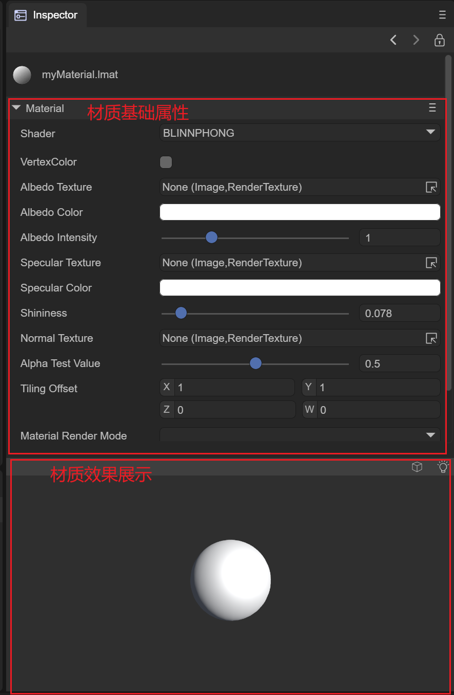

Figure 2-1

## 2.1 Basic properties of materials

Materials describe different surfaces based on different shader models. The IDE has eight built-in shader types. We explain the basic properties of each shader corresponding to the material according to the shader type. **Switching the shader of the material is by selecting ** is implemented using the Shader of the material. The specific operation diagram is shown in Figure 2-1-1 to switch to other types of shaders.

Animation 2-1-1

### 2.1.1 BlinnPhong Shader

The Blinn-Phong illumination model can simply describe the absorption and reflection of light on the surface of an object, making the surface of the object present different degrees of brightness. It mainly describes the highlight, diffuse light and ambient light parts of the surface of the object.

#### (1) VertexColor vertex color

Whether to support the macro definition switch of vertex color. When turned on, the vertex color content of the mesh can be superimposed.

#### (2) AlbedoTexture diffuse reflection map

You can set the content of the diffuse reflection map of the material. The example uses the map of a brick, and the effect is as shown in the animation 2-1-1-2-1:

Animation 2-1-1-2-1

#### (3) AlbedoColor diffuse color

You can set the overall diffuse reflection color of the material, as shown in the animation 2-1-1-3:

Animation 2-1-1-3

#### （4） AlbedoIntensity

Sets the intensity of the diffuse color.

#### (5) SpecularTexture highlight map

Used to set the specular reflection of the object's surface, and reflect the smooth reflection degree of the object's current vertex according to the rgb value of the UV of the object's current vertex on the highlight map, as shown in Figure 2-1-1-5-1 and Figure 2-1- As shown in 1-5-2:

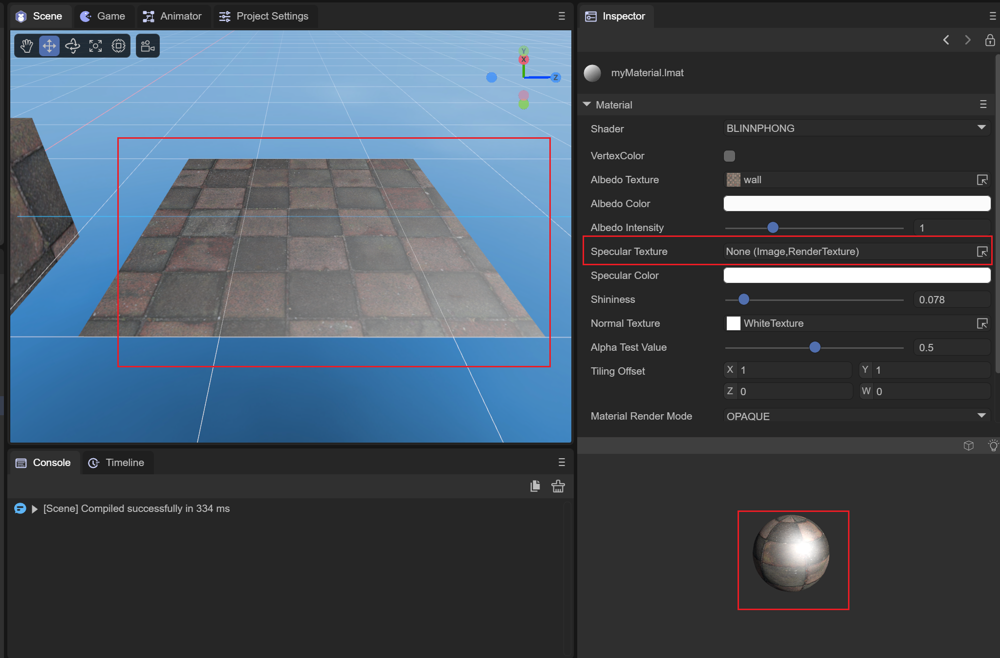

Figure 2-1-1-5-1

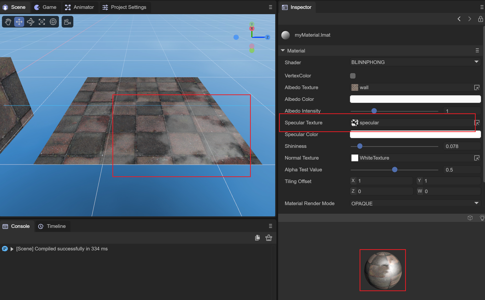

Figure 2-1-1-5-2

Before and after setting the highlight map, you can clearly see that due to the influence of the highlight map, only part of the wall has a highlight effect. This can be used to simulate the highlight phenomenon of different materials and different locations.

#### (6) SpecularColor highlight color

You can set the color of the highlight part, as shown in Figure 2-1-1-6, set the highlight color to green:

Figure 2-1-1-6

#### (7) Shininess glossiness

Used to set the highlight range. The effect is as shown in the comparison between 2-1-1-7-1 and 2-1-1-7-2 at different gloss levels:

Figure 2-1-1-7-1

Figure 2-1-1-7-2

When the shininess value is small, the overall highlight range is larger; when the shininess value is larger, the overall highlight range is smaller.

#### (8)NormalTexture normal map

Used to set the normal of the object model in tangent space for lighting calculation. **The model needs to have tangent data**. As shown in Figure 2-1-1-8-1 and Figure 2-1-1-8-2, the lighting and coloring with the participation of normal maps are more realistic.

Figure 2-1-1-8-1

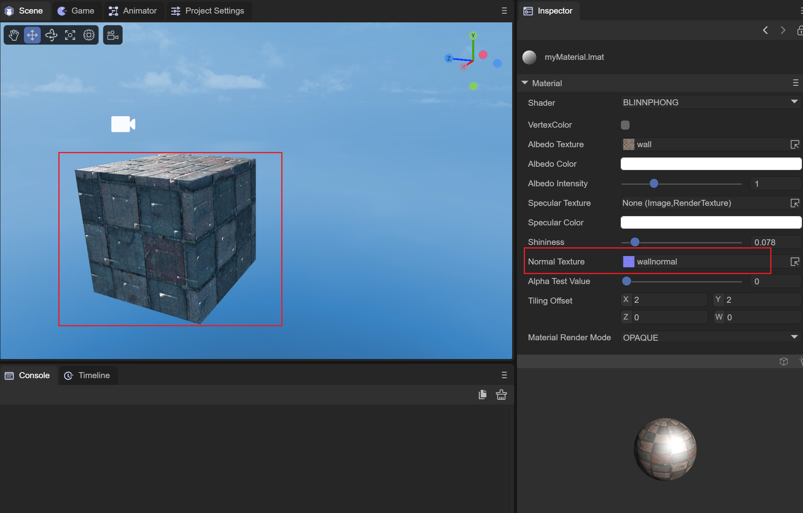

Figure 2-1-1-8-2

It can be seen that after adding the normal map, the lighting has been recalculated, and the surface of the object has become more realistic.

#### (9) AlphaTestValue alpha test value

This needs to be used in conjunction with the material's rendering mode of CUTOUT. In CUTOUT mode, when the alpha of the fragment color value of the current vertex is less than AlphaTestValue, the value of this fragment will be directly discarded without rendering. We use a spider web The picture is used as a diffuse reflection map. You can check the effect of this value by adjusting the value of AlphaTestValue. The spider diagram is shown in 2-1-1-9-1, and the value of AlphaTestValue is shown in the animated picture 2-1-1-9-2:

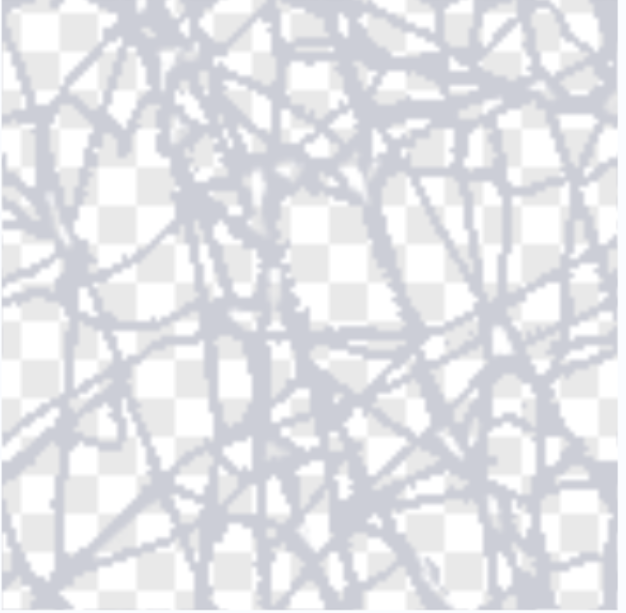

Figure 2-1-1-9-1

The alpha channel value of the hollow part is 0

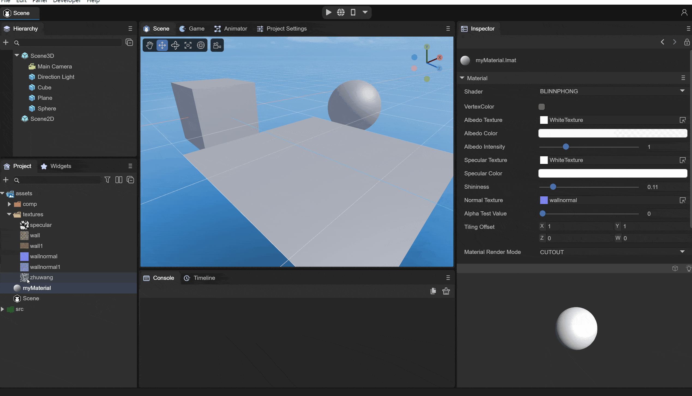

Animation 2-1-1-9-2

It can be seen that as the value becomes larger, more fragments are discarded until all fragments are discarded and not rendered.

#### (10) TilingOffset scaling offset

You can set the scaling and offset of the object model UV to achieve different effects of sampling AlbedoTexture, as shown in the animation 2-1-1-10:

Animation 2-1-1-10

#### (11) MaterialRenderMode material rendering mode

OPAQUE: In opaque mode, models obscured behind objects will not be rendered.

CUTOUT: Culling mode, which will discard some fragments based on the alpha value of the albedo map and the value of AlphaTestValue.

TRANSPARENT: Transparent mode, which will be mixed with the objects behind to create a transparent effect.

ADDITIVE: Overlay mode, which will superimpose the pixels behind the object

ALPHABLENDED: The same blending method as transparent mode. The difference from transparent mode is that the fog in the scene will not be mixed.

#### (12) RenderQueue rendering queue

It can be used to set the rendering queue of the material shader. The larger the RenderQueue, the later the rendering will be. Generally, after setting the rendering mode of the material, the rendering queue will be set according to the rendering mode.

The queue corresponding to OPAQUE mode is 2000;

The queue corresponding to CUTOUT mode is 2450;

The queue corresponding to TRANSPARENT mode is 3000;

The queue corresponding to ADDITIVE mode is 3000;

The queue corresponding to ALPHABLENDED mode is 3000;

#### (13) Cull elimination mode

Culling is performed based on the different connection orders of the face vertices (clockwise or counterclockwise).

Off: Turn off culling

Back: Remove the back side

Front: remove the front

### 2.1.2 Unlit Shader

The Unlit shader is a material that is not exposed to light and is not affected by lighting. It only relies on the texture and color of the material to express the surface effect of the object.

#### (1)VertexColor vertex color

Whether to apply vertex color. When this macro definition is turned on, the model vertex color will be superimposed.

#### (2) Texture map

Set the map used to describe the stroke color of the object, as shown in Figure 2-1-2-2-1 and Figure 2-1-2-2-2. After setting the map, the surface of the object displays the corresponding map part based on UV Color, and you can see that when there is light in the scene, it will not be affected by the light.

Figure 2-1-2-2-1

Figure 2-1-2-2-2

#### (3)AlbedoColor diffuse color

Similarly, AlbedoColor can superimpose colors onto the object surface. As shown in Figure 2-1-2-3-1, we superimpose a red color onto the object surface:

Figure 2-1-2-3-1

#### (4) AlphaTestValue alpha test value

This also needs to take effect when the rendering mode is CUTOUT and is used in conjunction with it. It is the same as the Blinn-Phong shader. It is also determined by judging whether the alpha value of the current vertex fragment and the value of the set AlphaTestValue are smaller than the value of AlphaTestValue. Will be discarded and not rendered. We still use the spider web map used by the Blinn-Phong shader above to see how different alphaTestValue values ​​are processed, as shown in the animation 2-1-2-4-1:

Animation 2-1-2-4-1

You can see that **the difference from Blinn-Phong is that the alpha value of Unlit will superimpose the value of AlbedoColor.a. The alpha of our AlbedoColor is 1.0**. At this time, all the fragments will not be discarded.

#### (5) TilingOffset scaling offset

Used to set the scaling and offset of the UV of the object model, which has the same effect as the Blinn-Phong shader, as shown in the animation 2-1-2-5-1:

Animation 2-1-2-5-1

#### (6) MaterialRenderMode material rendering mode

OPAQUE: In opaque mode, models obscured behind objects will not be rendered.

CUTOUT: Culling mode, which will discard some fragments based on the alpha value of the albedo map and the value of AlphaTestValue.

TRANSPARENT: Transparent mode, which will be mixed with the objects behind to create a transparent effect.

ADDITIVE: Overlay mode, which will superimpose the pixels behind the object.

ALPHABLENDED: The same blending method as transparent mode. The difference from transparent mode is that the fog in the scene will not be mixed.

#### (7) RenderQueue rendering queue

It can be used to set the rendering queue of the material shader. The larger the RenderQuere is, the later the rendering will be. Generally, after setting the rendering mode of the material, the rendering queue will be set according to the rendering mode.

The queue corresponding to OPAQUE mode is 2000;

The queue corresponding to CUTOUT mode is 2450;

The queue corresponding to TRANSPARENT mode is 3000;

The queue corresponding to ADDITIVE mode is 3000;

The queue corresponding to ALPHABLENDED mode is 3000;

#### (8) Cull elimination mode

Culling is performed based on the different connection orders of the face vertices (clockwise or counterclockwise).

Off: Turn off culling

Back: Remove the back side

Front: remove the front

#### How to use unlit to achieve the material effect of the original 2.0 engine by changing settings

 Change the MaterialRenderMode material rendering mode to addtive or blend mode. The effect is the same if the color space is not excluded. The color space of 3.0 has become linear.

### 2.1.3 PBR Shader

PBR material is a physically based rendering material that can provide an accurate representation of the interaction between light and surfaces, and can more realistically describe the surface properties of objects. We use the image-based lighting (IBL) lighting mode to better display the properties of PBR. We need to convert the ambient light source of the scene from SolidColor to spherical harmonics, and click GenerateLighing below to generate an IBL cube map CubeMap, as shown in the figure As shown in 2-1-3-1:

Figure 2-1-3-1

#### (1) AlbedoTexture diffuse reflection map

In order to set the overall texture of the surface material of the object, the wall above is also used as the texture, as shown in Figure 2-1-3-1-1 and Figure 2-1-3-1-2. The effect of setting AlbedoTexture:

  

Figure 2-1-3-1-1

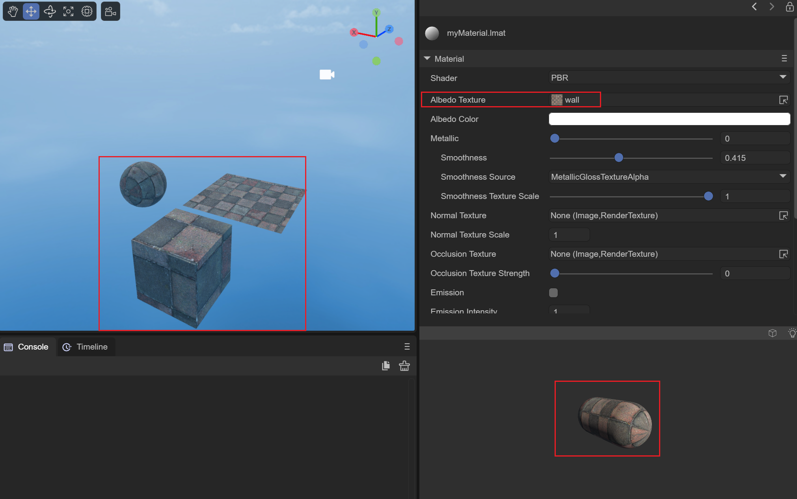  

Figure 2-1-3-1-2

#### (2)AlbedoColor diffuse color

You can superimpose a whole color on the surface of the object. As shown in Figure 2-1-3-2-1, we superimpose a yellow color on the material:

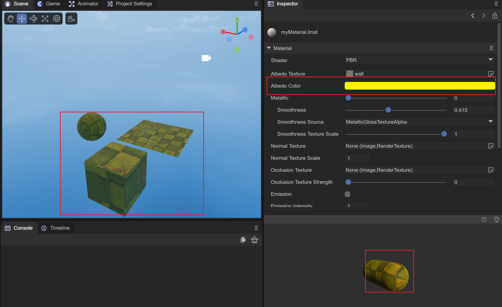

Figure 2-1-3-2-1

#### (3) Metallic metal degree

It is used to set the effect of metallic glossiness on the surface of an object. Generally, we use 0 and 1 to set the metallicity of the object. It is completely absent or completely present. When the metallicity is 1, it can reflect the content of the surrounding environment. Imagine that when we look into a smooth metal ball, it reflects our face. In this way, we have set up the IBL-based spherical harmonic cube map as the ambient light in the IDE. When we bring the metallicity of the material closer and closer to 1, the surface of the object will reflect the content of the surrounding environment. At the same time, we set the smoothness to 1. This way you can see the effect more clearly, as shown in the animation 2-1-3-3-1:

Animation 2-1-3-3-1

When we adjust the metallicity of the material and slide it toward 1, we can see that the surface of the object gradually reflects the content of the surrounding environment. When the metallicity is 1, it can completely reflect the surrounding environment.

#### (4) Smoothness

Used to set the smoothness of the object surface. When the smoothness is 0, the diffuse reflection of the object surface is obvious and the highlights are insufficient. When the smoothness is 1, the highlights are more obvious. As shown in the animation 2-1-3-4-1:

Animation 2-1-3-4-1

#### (5) SmoothnessSource smoothness source

Two smoothness sources can be set, one is obtained from the alpha channel of AlbedoTexture and the other is obtained from the alpha channel of MetallicGloassTexture. In fact, the smoothness of the object's surface material is mapped to the alpha channel of the AlbedoTexture map, or to the alpha channel of the MetallicGloass map, so that lighting calculations can be performed based on the smoothness of each vertex of the object.

AlbedoTextureAlpha: Get the surface smoothness of the object from the alpha channel of the Albedo map.

MetallicGloassTextureAlpha: Get the surface smoothness of the object from the alpha channel of the MetallicGloass map.

#### (6) SmoothnessTextureScale smoothness map scaling value

When it is set to obtain the smoothness value from the alpha channel of the texture, you can control the overall smoothness value under the alpha channel of the texture by setting this scaling value. We set the smoothness source to the alpha value of albedoTexture, and use the above spider web map as the albedo map, as shown in the animation 2-1-3-6-1:

Animation 2-1-3-6-1

#### (7)NormalTexture normal map

Setting the normal map of the object will calculate the lighting based on the normal map of the object, as shown in Figure 2-1-3-7-1 and Figure 2-1-3-7-2. After setting the normal map, the lighting will The highlight and diffuse parts have been recalculated:

 

Figure 2-1-3-7-1

Figure 2-1-3-7-2

#### (8) OcclusionTexture occlusion map

By sampling the g channel of the Occlusion map, you can set the AO ambient light occlusion value of the model vertex, so that when performing PBR lighting calculations, the lighting values ​​at small seams and other locations can be more realistically simulated.

#### (9) OcclusionTextureStrength occlusion map strength

Used to adjust the intensity of the occlusion map. When the intensity is 0, the overall occlusion value is 1; when the intensity is 1, the occlusion value of the occlusion map is used.

#### (10) Emission self-illumination

Used to set whether the self-illumination of the model is turned on. After turning it on, two new self-illumination parameters will be added, namely EmissionColor and EmissionTexture;

##### EmissionColor self-illuminating color

The superimposed overall self-illuminating color will be more obvious in the diffuse reflection part. As shown in Figure 2-1-3-10-1, a red self-illuminating color is superimposed:

Figure 2-1-3-10-1

##### EmissionTexture self-illuminating map

Setting the self-illumination map can superimpose the self-illumination color set above on different vertex positions according to the model, as shown in Figure 2-1-3-10-2:

Figure 2-1-3-10-2

#### (11) EmissionIntensity self-luminous intensity

Set the intensity of the self-illuminating color. When the intensity is 0, there is no self-illuminating effect; when the intensity is 1, the set self-illuminating color is superimposed.

#### (12) MetallicGlossTexture metal smooth map

You can set up a map to store the metallicity and smoothness of the surface material of the object. The r channel of the map stores the metallicity information of the model material, and the a channel of the map stores the smoothness information of the model material. Below we use a pure black and pure white map. To show the influence of metal smoothness map on PBR material, as shown in Figure 2-1-3-12-1 and Figure 2-1-3-12-2:

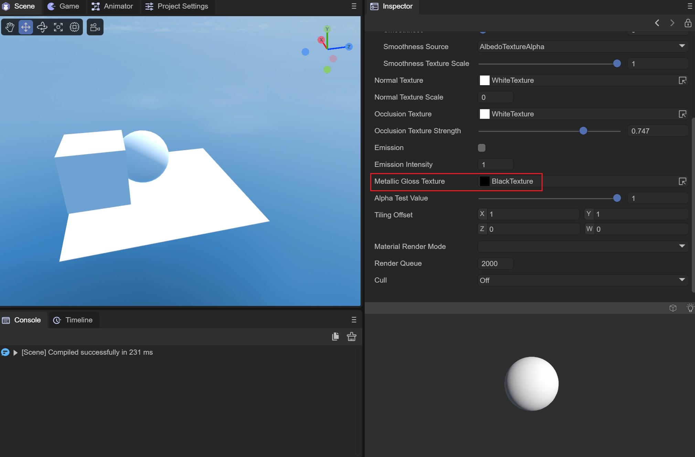

Figure 2-1-3-12-1

Figure 2-1-3-12-2

The metallicity and smoothness of the pure black image in Figure 2-1-3-12-1 are 0, basically only the diffuse reflection effect of the cube map. The metallicity and smoothness of the pure white image in Figure 2-1-3-12-2 are The smoothness is 1, which can reflect the surrounding three-dimensional ambient light content very well.

#### (13) AlphaTestValue alpha test value

It also needs to be used with the rendering mode set to CUTOUT mode. It will be tested based on the alpha superposition value of AlbedoTexture and AlbedoColor. Fragments less than the AlphaTestValue value will be discarded and not rendered.

#### （14）TilingOffset

The effect is the same as Blinn-Phong and Unlit. It can be used to set the model UV scaling and offset values ​​to achieve sampling of different positions of the Albedo map.

#### (15) MaterialRenderMode material rendering mode

OPAQUE: In opaque mode, models obscured behind objects will not be rendered.

CUTOUT: Culling mode, which will discard some fragments based on the alpha value of the albedo map and the value of AlphaTestValue.

TRANSPARENT: Transparent mode, which will be mixed with the objects behind to create a transparent effect.

ADDITIVE: Overlay mode, which will superimpose the pixels behind the object

ALPHABLENDED: The same blending method as transparent mode. The difference from transparent mode is that the fog in the scene will not be mixed.

#### (16) RenderQueue rendering queue

It can be used to set the rendering queue of the material shader. The larger the RenderQuere is, the later the rendering will be. Generally, after setting the rendering mode of the material, the rendering queue will be set according to the rendering mode.

The queue corresponding to OPAQUE mode is 2000;

The queue corresponding to CUTOUT mode is 2450;

The queue corresponding to TRANSPARENT mode is 3000;

The queue corresponding to ADDITIVE mode is 3000;

The queue corresponding to ALPHABLENDED mode is 3000;

#### (17) Cull elimination mode

Culling is performed based on the different connection orders of the face vertices (clockwise or counterclockwise).

Off: Turn off culling

Back: Remove the back side

Front: remove the front

### 2.1.4 Particle Shader

Particle shaders are used to set the surface display of particles, and are mainly used in particle special effects. We need to create a particle system in the scene, as shown in animation 2-1-4-1:

Animation 2-1-4-1

At the same time, the material needs to be assigned to the particle system, as shown in the animation 2-1-4-2:

Animation 2-1-4-2

In this way, the material is assigned to the particle system for use. Let’s briefly talk about the role of each parameter.

#### (1) Color particle color

Used to set the color of the particle material, as shown in Figure 2-1-4-1-1, we set the particle color to red, and the particles emitted by the particle system at this time turn red:

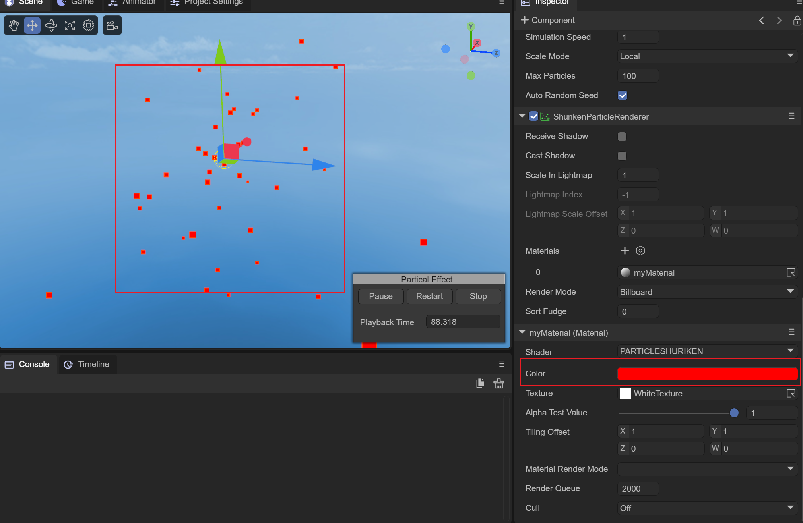

Figure 2-1-4-1-1

#### (2) Texture map

Used to set the texture style of particles, as shown in Figure 2-1-4-2-1:

Figure 2-1-4-2-1

#### (3) AlphaTestValue alpha test value

The CUTOUT mode on the particle shader is invalid, and the alpha test value does not need to be set.

#### （4）TilingOffset

It has the same effect as Blinn-Phong and Unlit. It can be used to set the UV scaling and offset values ​​of the model to achieve sampling of different effects of the Albedo map.

#### (5) MaterialRenderMode material rendering mode

OPAQUE: In opaque mode, models obscured behind objects will not be rendered.

CUTOUT: Invalid under particle shader.

TRANSPARENT: Transparent mode, which will be mixed with the objects behind to create a transparent effect.

ADDITIVE: Overlay mode, which will superimpose the pixels behind the object

ALPHABLENDED: The same blending method as transparent mode. The difference from transparent mode is that the fog in the scene will not be mixed.

#### (6) RenderQueue rendering queue

It can be used to set the rendering queue of the material shader. The larger the RenderQuere is, the later the rendering will be. Generally, after setting the rendering mode of the material, the rendering queue will be set according to the rendering mode.

The queue corresponding to OPAQUE mode is 2000;

The queue corresponding to CUTOUT mode is 2450;

The queue corresponding to TRANSPARENT mode is 3000;

The queue corresponding to ADDITIVE mode is 3000;

The queue corresponding to ALPHABLENDED mode is 3000;

#### (7) Cull elimination mode

Culling is performed based on the different connection orders of the face vertices (clockwise or counterclockwise).

Off: Turn off culling

Back: Remove the back side

Front: remove the front

### 2.1.5 Trail Shader

The Trail shader is used to achieve the trailing effect. We need a trailing effect object to implement it. Create a trailing effect object in the scene as shown in Figure 2-1-5-1:

Animation 2-1-5-1

We add the corresponding material to the trailing special effects object as shown in the animation 2-1-5-2. Add the myMaterial material to the trailing special effects object:

Animation 2-1-5-2

**In order to see the effect of the trailing, we need to move the trailing special effects object. To do this, we add a Move script so that the special effects object can move along the x-axis. **

#### (1) Color color

Used to set the color of the trailing, as shown in the animation 2-1-5-1-1, we set a red as the trailing color:

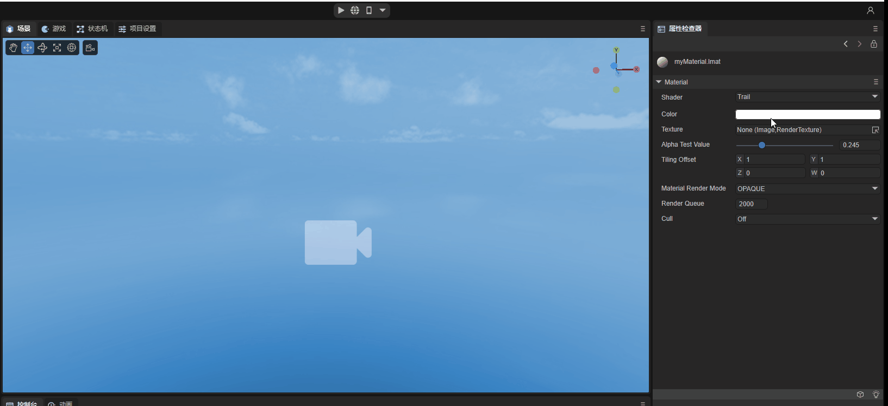

Animation 2-1-5-1-1

#### (2) Texture map

Used to set the shape of the trailing, as in the animated picture 2-1-5-2-2, we add a picture 2-1-5-2-1 as a texture, the trailing shader uses ADDITIVE mode to achieve transparent overlay Effect:

Figure 2-1-5-2-1

Animation 2-1-5-2-2

#### （3）AlphaTestValue alphaTest值

Trailing shaders only use ADDITIVE and ALPHABLENDED modes, this value has no effect here.

#### (4) TilingOffset scaling offset

It can be used to set the UV scaling and offset during texture sampling to achieve the effect of texture scaling and offset.

#### (5) MaterialRenderMode material rendering mode

Trailing shaders only use ADDITIVE and ALPHABLENDED modes:

ADDITIVE: Transparent overlay mode, superimposes all the alpha values ​​of the following pixels to achieve a transparent effect.

ALPHABLENDED: The same mixing method as the transparent mode. The difference from the transparent mode is that it will not mix the fog in the scene. This mode will not produce the ADDITIVE transparency effect.

#### (6) RenderQueue rendering queue

It can be used to set the rendering queue of the material shader. The larger the RenderQuere is, the later the rendering will be. Generally, after setting the rendering mode of the material, the rendering queue will be set according to the rendering mode.

The queue corresponding to OPAQUE mode is 2000;

The queue corresponding to CUTOUT mode is 2450;

The queue corresponding to TRANSPARENT mode is 3000;

The queue corresponding to ADDITIVE mode is 3000;

The queue corresponding to ALPHABLENDED mode is 3000;

The trailing shader only uses ADDITIVE and ALPHABLENDED modes, here set to 3000.

#### (7) Cull elimination mode

Culling is performed based on the different connection orders of the face vertices (clockwise or counterclockwise).

Off: Turn off culling

Back: Remove the back side

Front: remove the front

### 2.1.6 SkyBox Shader

The skybox shader is used to set the skybox style of the scene. The skybox requires a cubemap for sampling. We first need to create a new cubemap and set the texture according to the top, bottom, left, right, front and back of the skybox, as shown in the animation 2-1- As shown in 6-1:

Animation 2-1-6-1

Setting up the sky box requires modifying the sky box material of Scene3D, as shown in the animation 2-1-6-2:

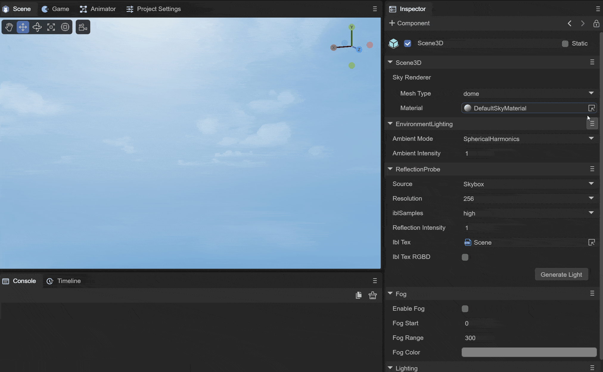

Animation 2-1-6-2

#### (1)TintColor 

Overlay the color onto the sky box, as shown in Figure 2-1-6-1-1, and set a light red color to make the entire sky red:

Figure 2-1-6-1-1

#### (2) Exposure

Used to set the exposure of the sky box. When the exposure is 0, the sky box is black; as the exposure value increases, the normal cube map color will gradually be displayed, and then the sky box will turn completely white due to overexposure. As shown in the animation 2-1-6-2-1:

Animation 2-1-6-2-1

#### (3)Rotation 

You can rotate the cubemap around the y-axis from 0 to 360 degrees.

#### (4)CubeTexture spherical map

To set the sampling map of the sky box, you need to use a CubeMap type cube map.

#### (5) AlphaTestValue alpha test value

This value does not take effect when switching to CUTOUT mode on the skybox shader.

#### （6）TilingOffset

Since cubemaps are used, this value has no effect on the skybox shader.

#### (7) MaterialRenderMode material rendering mode

On the skybox shader, setting it to CUTOUT, TRANSPARENT, ADDITIVE, or ALPHABLENED modes does not take effect.

#### (8) RenderQueue rendering queue

It can be used to set the rendering queue of the material shader. The larger the RenderQuere is, the later the rendering will be. Generally, after setting the rendering mode of the material, the rendering queue will be set according to the rendering mode.

The queue corresponding to OPAQUE mode is 2000;

The queue corresponding to CUTOUT mode is 2450;

The queue corresponding to TRANSPARENT mode is 3000;

The queue corresponding to ADDITIVE mode is 3000;

The queue corresponding to ALPHABLENDED mode is 3000;

Since the rendering mode of the skybox material only takes effect in OPAQUE mode, just set it to 2000.

#### (9) Cull elimination mode

Culling is performed based on the different connection orders of the face vertices (clockwise or counterclockwise).

Off: Turn off culling

Back: Remove the back side

Front: remove the front

### 2.1.7 SkyPanoamic Shader

Skybox panoramic map shader, here a 2D panoramic map is used to wrap the scene in the form of a cube map to achieve ambient light effects. The use of this material is the same as that of the skybox, and it is directly assigned to the skybox renderer of the 3D scene. Can.

#### (1)TintColor color

The function is the same as the skybox shader, which superimposes a color on the panorama skybox.

#### (2)Rotation rotation

You can set the rotation angle of the sky box around the Y axis, between 0 and 360.

#### (3) PanoramicTexture panoramic map

The panorama map requires a cylindrical 2D map using latitude and longitude.

#### (4) AlphaTestValue alpha test value

Since only OPAQUE mode is effective on the panoramic skybox shader, this value is invalid in CUTOUT mode.

#### （5）TilingOffset

Due to the way cubemaps are implemented using 2D textures, this value is invalid.

#### (6) MaterialRenderMode material rendering mode

In panorama skybox mode, only OPAQUE mode takes effect.

#### (7) RenderQueue rendering queue

It can be used to set the rendering queue of the material shader. The larger the RenderQuere is, the later the rendering will be. Generally, after setting the rendering mode of the material, the rendering queue will be set according to the rendering mode.

The queue corresponding to OPAQUE mode is 2000;

The queue corresponding to CUTOUT mode is 2450;

The queue corresponding to TRANSPARENT mode is 3000;

The queue corresponding to ADDITIVE mode is 3000;

The queue corresponding to ALPHABLENDED mode is 3000;

Since only OPAQUE mode is in effect, it is set to 2000;

#### (8) Cull elimination mode

Culling is performed based on the different connection orders of the face vertices (clockwise or counterclockwise).

Off: Turn off culling

Back: Remove the back side

Front: remove the front

### 2.1.8 SkyProcedural Shader

A procedural skybox that simulates the sky by setting the parameters of the sun.

#### (1) U_SunSize sun size

Set the disk size of the sun, as shown in Figure 2-1-8-1-1. Set the sun size to 0.1:

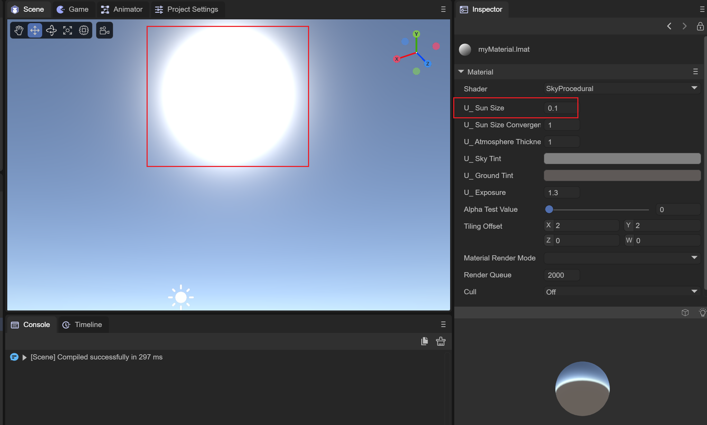

Figure 2-1-8-1-1

#### (2) Sun type

There are three types of sun used to set the procedural skybox:

##### SUN_NONE

No Sun, no sun is displayed on the skybox when this mode is selected.

##### SUN_HIGH_QUALITY

High-quality solar simulation. In this mode, the divergence and convergence of sunlight can be adjusted.

##### SUN_SIMPLE

A simple sun simulation can only adjust the overall size of the sun.

#### (3) U_SunSizeConvergence sun size convergence

The size of the sun converges. The smaller the value, the larger the overall solar disk. It only takes effect in the SUN_HIGH_QUALITY mode. As shown in the animation 2-1-8-3-1:

Animation 2-1-8-3-1

#### (4) U_AtmosphereThickness Atmosphere thickness

The density of the atmosphere. A higher-density atmosphere will absorb more colors, as shown in Figure 2-1-8-4-1 when the density is 1, and Figure 2-1-8-4-2 when the density is 2. Show:

Figure 2-1-8-4-1

Figure 2-1-8-4-2

#### (5)U_SkyTint sky color

Sets the color of the sky above the horizon.

#### (6)U_GroundTint ground color

Sets the color of the ground below the horizon.

#### (7)U_Exposure exposure

Set the light and dark of the sky box through the exposure value, as shown in the animation 2-1-8-7-1:

Animation 2-1-8-7-1

#### (8) AlphaTestValue alpha test value

Since procedural skyboxes only use OPAQUE, this value has no effect.

#### （9）TilingOffset

Since procedural skies do not have textures, this value has no effect.

#### (10) MaterialRenderMode material rendering mode

Only takes effect in OPAQUE mode.

#### (11) RenderQueue rendering queue

It can be used to set the rendering queue of the material shader. The larger the RenderQuere is, the later the rendering will be. Generally, after setting the rendering mode of the material, the rendering queue will be set according to the rendering mode.

The queue corresponding to OPAQUE mode is 2000;

The queue corresponding to CUTOUT mode is 2450;

The queue corresponding to TRANSPARENT mode is 3000;

The queue corresponding to ADDITIVE mode is 3000;

The queue corresponding to ALPHABLENDED mode is 3000;

Since the procedural skybox only takes effect in OPAQUE mode, set it to 2000.

#### (12) Cull elimination mode

Culling is performed based on the different connection orders of the face vertices (clockwise or counterclockwise).

Off: Turn off culling

Back: Remove the back side

Front: remove the front

## 2.2 Material effect display

The material effect display is mainly used to display the material effect after setting the attributes. You can use the mouse to interact here to operate the effects of the material ball in different directions.

### 2.2.1 Switch the materials of different meshes

You can switch the effects of materials under different meshes by clicking the square button on the right, as shown in the animation 2-2-1:

Animation 2-2-1

### 2.2.2 Turn off lighting effects

You can switch the material's effect of receiving light or not by clicking the light bulb button on the right, as shown in the animation 2-2-2:

Animation 2-2-2

# 3. Use of materials

After we adjust the properties of the material to the effect we want, we can assign the material to the object in the scene. There are two methods for setting the material of the object, namely the following animation 3-1 and animation 3-2. Shown:

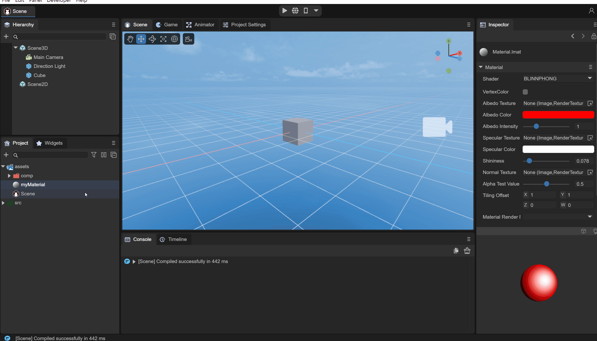

Animation 3-1

As shown in the animation 3-1 above, you can directly drag the material onto the object in the Scene window, or you can select the corresponding material on the renderer of the corresponding object as shown in the animation 3-2.

Animation 3-2

