# 3D particle editor


## 1. Basics of 3D particle editor

### What are 3D particles?

In the encyclopedia, a particle refers to the smallest component of matter that can exist in a free state.

In the LayaAir engine, particles in the 3D particle system can be used to simulate non-fixed natural phenomena such as smoke, fog, water, fire, rain, snow, and streamers. Since the shapes of the above-mentioned natural objects have no fixed shapes, they cannot be simulated and implemented with fixed models. Multiple models need to be combined into a complete visual effect, and 3D particles are the smallest unit of the combined effect, but it needs to be noted. What's interesting is that the particles are not a three-dimensional model, but a patch model.

### Flame effect display


(Animation 1)

## 2. Create 3D particles in the LayaAir engine

#### 2.1 Particle Node

Under the Scene3D node in the scene, you can create 3D particles by right-clicking the mouse.


(Figure 2.1.1-1)

Default particle system adds finishing effects

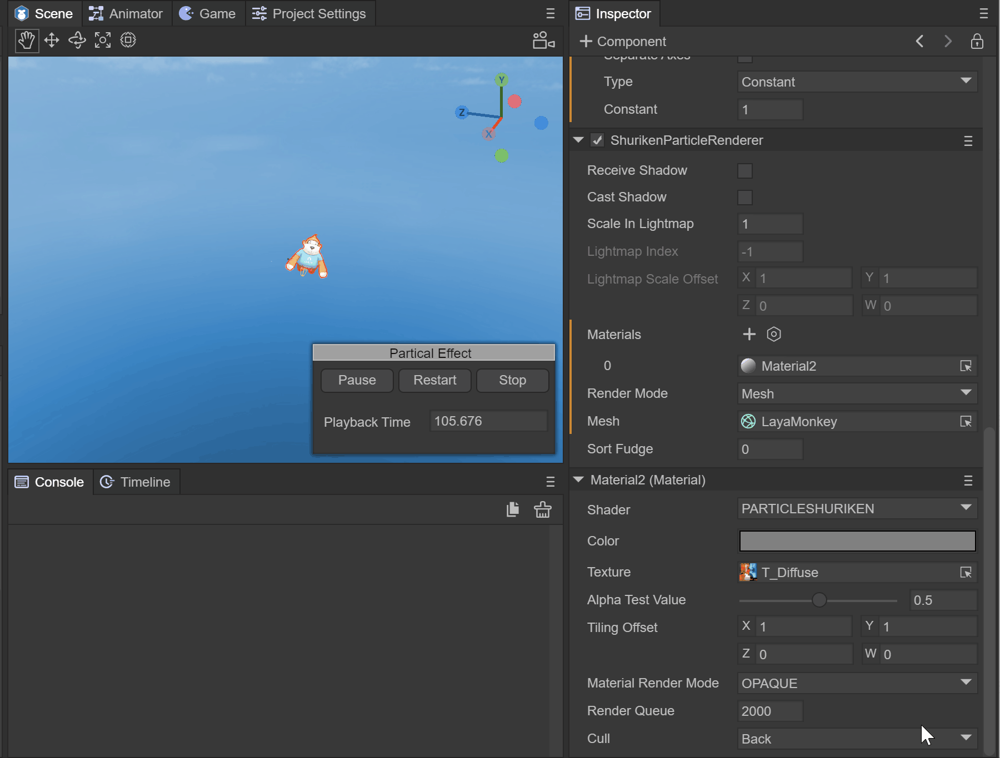

(Animation 2)

#### 2.2 Prefab

If you consider that 3D particles need to be reused, it is recommended to use prefabs. Create the prefab under Assets. After double-clicking to open the prefab, create 3D particles by right-clicking on the Sprite3D node.

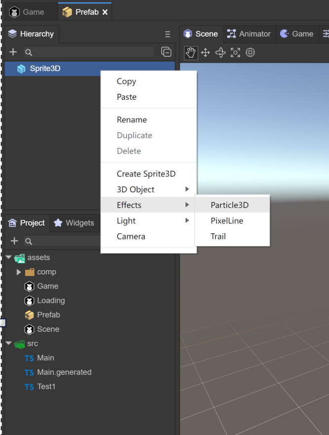

(Figure 2.1.2)

## 3. Use of 3D particles

### The use of 3D particles consists of three parts

- ### **Particle System Component**

- ### **Particle Rendering Module**

- ### **Particle Shader**

  

  (Figure 3.0) As you can see from Figure 3.0, when a 3D particle is created, these three components will be added automatically. Let’s learn more about the use of each system.

### 3.1 Particle system component `ParticleSystem`

The particle system is the basis for the special effects performance of the LayaAir engine. Usually the position and movement of the particle system in the three-dimensional space are controlled by the emitter. The emitter is mainly represented by a set of particle behavior parameters and its position in three-dimensional space. Particle behavior parameters can include particle generation speed (i.e., the number of particles generated per unit time), particle initial velocity vector (such as when to move in which direction), particle lifetime (how long it takes for the particle to annihilate), particle color, particle life cycle changes in and other parameters, etc.

#### Classification of particle system components

In the LayaAir editor, the particle system component consists of five parts

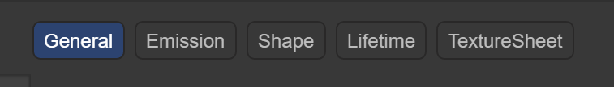

(Figure 3.1)

#### 3.1.1 Basic panel `General`

The default is the general module of the particle system, which is used to set the basic settings of the particle system. This module is an inherent module and cannot be disabled. This module defines a series of basic parameters such as the duration, cycle mode, emission speed, and size of particles during initialization.


(Figure 3.1.1-1)

`Duration`: The duration for which the particle system continues to emit particles, or particles can be emitted multiple times within a cycle. After the set time is reached, the particles stop emitting.

 *Note: It is not the life cycle time of a particle. The life cycle time of a particle will be introduced below*

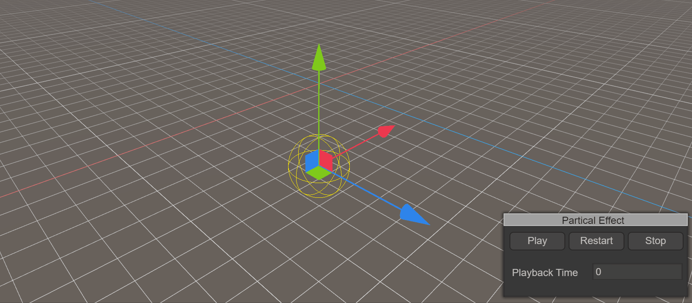

(Animation 3) The effect when Duration is 5. When 5 seconds is reached, particles will no longer be emitted, and the Loop must be set to not start.

`Loop`: If enabled, at the end of the above duration, the particle system starts again and continues to repeat the loop

`Play On Awake`: If enabled, the particle system will automatically start when the object is created

`Start Delay`: Delay time before the system starts transmitting after enabling it. Two delay methods can be selected.
   	 `Constant` fixed time
   	 `Random Between Two Constant` Randomly selects values ​​from the minimum to the maximum two times


(Animation 4) shows the random method using a minimum of 2 to a maximum of 5 seconds. You can see that at the 4th second, the particles start to emit.

`Start Lifetime`: Controls the life cycle of each particle, that is, how long it takes for the particle to disappear after it occurs. It can be a random value between two numbers.

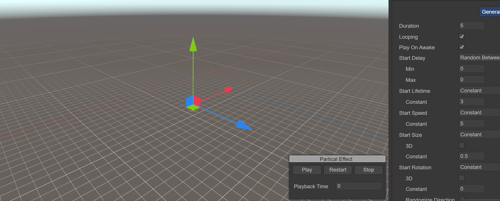

(Animation 5) shows the effect of using Start Lifetime of 3, showing that it takes 3 seconds for each particle to be emitted and disappear.

`Start Speed`: The initial speed of each particle in the appropriate direction, two delay methods can be selected
   	 `Constant` fixed value
   	 `Random Between Two Constant` Randomly selects values ​​from the smallest to the largest

 Animation 5 shows the speed effect when using Start Speed ​​of 5

`Start Size`: The initial size of each particle. If you want to control the size of each axis separately, please enable the 3D option. Two delay methods are available
   	 `Constant` fixed value
   	 `Random Between Two Constant` Randomly selects values ​​from the smallest to the largest


(Figure 3.1.1-2) It shows that the Start Size is randomly between 1 and 5. You can see that the particles on the left are large and small.

 *Note: The size of the particle has nothing to do with the size of the texture it uses. The same particle drawn by a 100-pixel texture and a 500-pixel texture is almost the same size. It can be seen that StartSize specifies the diameter of the particle. , instead of texture scaling*

`Start Rotation`: The initial rotation angle of each particle. If you want to control the rotation of each axis individually, enable the 3D option. Two delay methods are available
   	 `Constant` fixed value
   	 `Random Between Two Constant` Randomly selects values ​​from the smallest to the largest

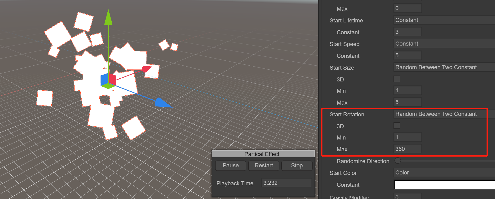

(Figure 3.1.1-3) It shows that Start Rotation is randomly between 1 and 360. You can see that the particles on the left rotate in various directions.

`Start Color`: the initial color of each particle

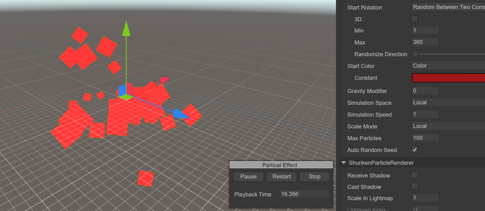

(Figure 3.1.1-4) shows the effect of the Start Color being red

*Note that even if the particles are specified to be red in StartColor, the displayed effect is not pure red. The particles, the sky, and the places where the red squares are superimposed all become different colors. This is because of the final display effect of the screen. It is controlled by the shader. When we set the particle material, the RenderingMode selected is Additive (superimposed), so the final display effect will be affected by the light coming from behind the particles and change color. You can try different shader options to see the changes*

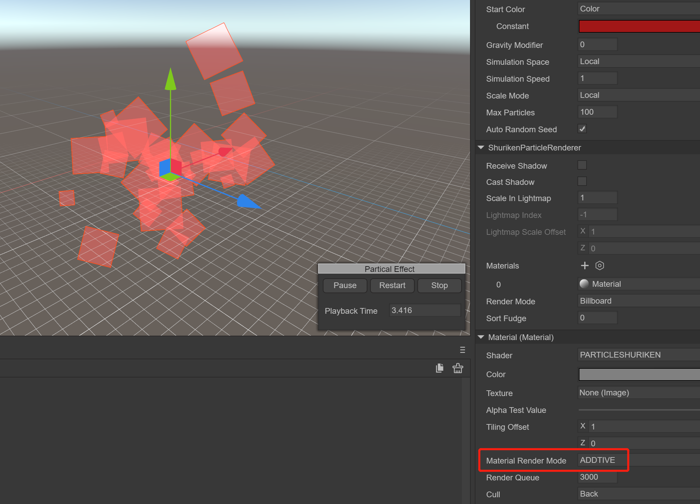

(Figure 3.1.1-5) shows the effect of RenderingMode being Additive

`Gravity Modifier`: Set the physical gravity value. A value of zero turns off gravity


(Animation 6) shows the effect of using `Gravity Modifier` to 5

`Simulation Space`: Controls whether particles follow the movement of the particle emitter

 `Local`: After the particles are generated, they move following the movement of the particle emitter coordinates. In this mode, the movement of the particle emitter will be reflected on each particle.

 `World`: After the particles are generated, they do not follow the particle emitter and move directly in the world coordinate system.

`Simulation Speed`: Adjust the speed at which the entire particle system updates

`Scale Mode`: Controls the scaling mode of particles

 `Hierarchy`: Affected by the scaling of both itself and the parent node

 `Local`: only affected by yourself

 `World`: not affected

`Max Particles`: The maximum number of particles in a system. If the limit is reached, some particles are removed. If set to 1, the particle system will emit particles one by one.
`Auto Random Seed`: Automatic particle random seed, which will be different every time it is played after it is enabled. After removing the check box, you can fill in the value of the random seed. Different values ​​will cause the emitted particles to behave slightly differently.

#### 3.1.2 Emission module `Emission`

This module is part of the particle system component and is used to specify the properties of emitted particles. When creating a new particle system, the Emission module is enabled by default.

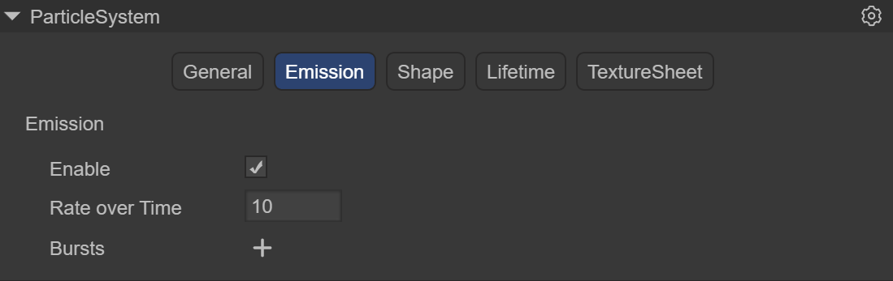

(Figure 3.1.2)

`Enable`: whether to enable
`Rate over Time`: Number of particles emitted per second
`Rate over Distance` The number of particles emitted per unit of distance moved. This mode is useful for simulating particles that are actually produced by the motion of an object (for example, dust left by wheels on a dirt road)
`Bursts`: Bursts are events that produce particles. These settings allow particles to be emitted at specified times. You can set multiple groups of burst points and modify the time, minimum number of particles, and maximum number of particles respectively.


(Animation 7) shows using a Rate Over Time of 5 to emit 5 particles per second, and using a set of Bursts to suddenly emit 30 particles at the 3rd second.

#### 3.1.3 Shape module `Shape`

This module defines the volume or surface from which particles are emitted, and the direction of the starting velocity.

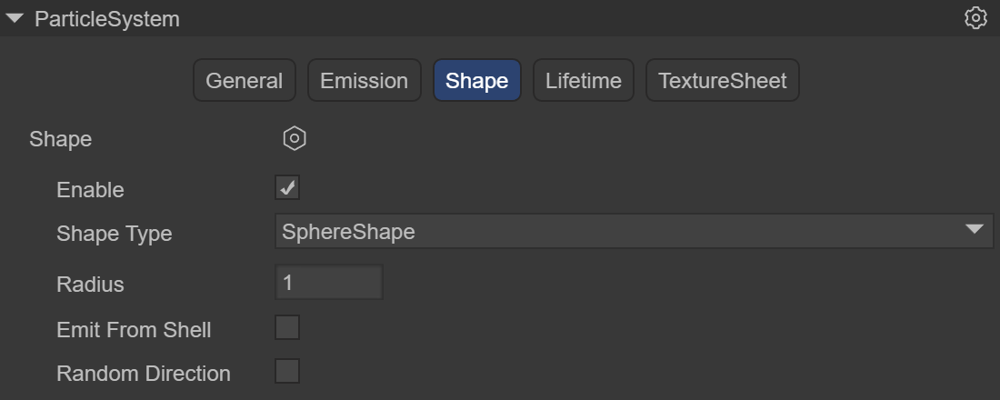

(Figure 3.1.3-1)

`Shape Type`: The choice of shape affects the area where particles can be emitted, and also affects the initial direction of the particles. For example, a Sphere emits particles outward in all directions, and a Cone emits a divergent stream of particles.
1. `Sphere`: a ball that can emit particles in all directions
    `Radius`: Radius
    `Emit from shell`: Emit according to the shell
    `Randomize Direction`: Randomize direction


(Animation 8) shows the use of a sphere with a radius of 3, emitted from the edge of the sphere

2. `Hemisphere`: hemispheric shape
    `Radius`: Radius
    `Emit from shell`: Emit according to the shell
    `Randomize Direction`: Randomize direction

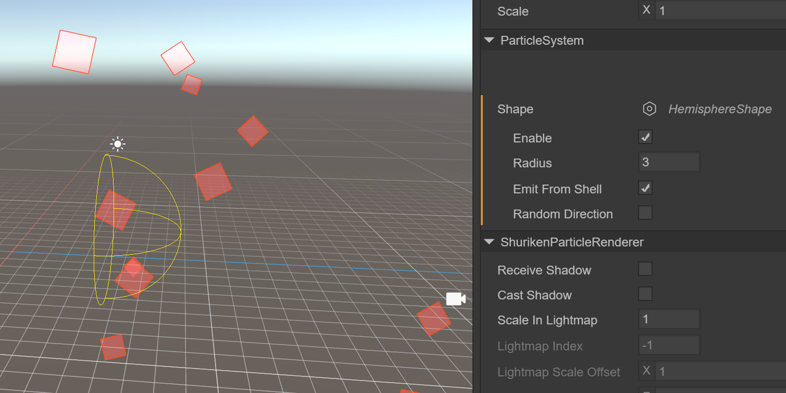

(Figure 3.1.3-2)

3. `cone`: cone shape, allowing particles to fan out from one point to a circle like the light of a flashlight
    `Angle DEG`: the angle of the circular aspect of the shape
    `Radius`: Radius
    `Length`: length
    `Emit from`: Emission method
      	 `Base`: Based on the tapered bottom
      	 `Base Shell`: Based on the tapered bottom shell
      	 `Volume`: based on the interior of the cone
      	 `Volume Shell`: based on conical inner shell
    `Randomize Direction`: Randomize direction


 (Animation 9) shows the use of a cone with a radius of 2 and a cone length of 6, emitting from inside the cone

4. `Box`: Box-shaped, which allows all particles to be emitted in a single direction, and can well simulate rain and snow particle effects.
    `Length`: length in each direction of XYZ
    `Randomize Direction`: Randomize direction


(Figure 3.1.3-3)

5. `circle`: ring
    `Radius`: Radius
    `Angle DEG`: the angle of the ring
    `Emit From Edge`: Emit based on edge
    `Randomize Direction`: Randomize direction


(Figure 3.1.3-4)

#### 3.1.4 Lifetime `Lifetime`

This module defines the properties of the emitted particles during their lifetime.


(Figure 3.1.4)

1. `Velocity over Lifetime`: Velocity in the life cycle
    `Constant`: constant mode, the speed is constant
    `Curve`: Curve mode
    `Random from two Constant`: Random speed mode
    `Random between two Curve`: Take random values ​​​​in two curves
     `Space`: space
      	 `Local`: model space
      	 `World`: world space
2. `Color over Lifetime`: Color in the life cycle
    `Constant`: constant mode, the color is constant
    `Gradient`: Gradient mode
    `Random from two Constant`: Random two color modes
    `Random between two Gradient`: Randomly take values ​​in two gradients
3. `Size over Lifetime`: Size in the life cycle
   	 `Separate Axes`: Separate by axis
      	 `Curve`: Curve mode
      	 `Random Between Two Contants`: Randomly select values ​​from two constants
      	 `Random between two Curve`: Take random values ​​​​in two curves

4. `Rotation over Lifetime`: Rotation in the life cycle
     `Separate Axes`: Separate by axis
      	 `Constant`: constant
      	 `Curve`: Curve mode
      	 `Random Between Two Contants`: Randomly select values ​​from two constants
      	 `Random between two Curve`: Take random values ​​​​in two curves

#### 3.1.5 Texture animation `Texture Sheet`

A module used to play particle animation. The raw material of particle animation is a texture, which contains a set of **frame animation** and can render particles in an animated manner.

Frame animation: Use multiple pictures, each picture is a frame, to form a complete animation called frame animation. Or a large picture that contains all the frames of an animation


(Figure 3.1.5-1)


(Figure 3.1.5-2)

LayaAir currently uses grid mode (Grid)

`Tiles`: The number of tiles the texture is divided into in the X (horizontal) and Y (vertical) directions

`Animation`: Animation mode can be set to whole sheet or single line (i.e. each line represents a separate animation sequence)

`Frame`: Set frame

`Type`: frame type

   	 `Constant`: Fixed number of frames

   	 `Curve`: A curve that specifies how animation frames increase over time.

   	 `Random Between two constant`: Random between two fixed frame numbers

   	 `Random Between two curve`: Random between two curves

`Start Frame`: Start frame, allows you to specify which frame the particle animation should start from

`Cycles`: The number of times the animation sequence repeats during the particle's lifetime


(Figure 3.1.5-3) The usage process will be introduced in Section 4 Flame Example

### 3.2 Particle rendering module `ShurikenParticleRenderer`

Renderer module settings determine how a particle's image, model, is transformed, shaded, and overdrawn by other particles.

#### 

(Figure 3.2)

`Receive Shadows`: Determines whether particles in this system can receive shadows from other sources. Only opaque materials can receive shadows.

`Cast Shadows`: If this property is enabled, the particle system will create shadows when struck by a shadow-casting light.

`Scale In Lightmap`: Adjust the pixel density of specific objects in the final LightMap.

`Materials`: Materials used to render particles

`Render Mode`: How to generate a rendered image from a graphics image (or mesh).

1. `Billboard`: Render particles as billboards, always facing the camera

2. `Stretched Billboard`: allows the use of particle scaling while facing the camera.
    `Speed ​​Scale`: Set the length according to the particle speed
    `Length Scale`: Determine the length of the particle by comparing its width

3. `Horizontal Billboard`: The particle plane is parallel to the XZ bottom plane

4. `Vertical Billboard`: The particles are upright on the Y-axis, but facing the camera

5. `Mesh`: Particles are rendered from a 3D mesh instead of a texture


(GIF)

`Sorting Fudge`: Sorting correction, using this will affect the painting order. Particle systems with lower `Sorting Fudge` values ​​are more likely to be drawn last, thus appearing in front of transparent objects and other particle systems

### 3.3 Particle shader `PARTICLESHURIKEN`

Select Laya's particle in the material, and you can add Laya's built-in particle shader (PARTICLESHURIKEN), which can render various particle systems.
Effect. All particles use this material.

#### 

(Figure 3.3)

`Color`: Specifies the color of the particles.

`Texture`: Specifies the texture map used by particles

`Alpha Test Value`: When the transparency test is turned on, the current pixel determines whether to output color according to the set conditions.

`Tiling Offset`: Get texture tiling and offset

`Material Render Mode`: Set rendering mode

 `Opaque`: Default setting, suitable for ordinary solid objects without transparent areas.
​ `Cutout`: Allows the creation of transparency effects with hard edges between opaque and transparent areas. In this mode, there are no translucent areas and the texture is either 100% opaque or invisible. This is useful when using transparency to create the shape of a material, such as leaves or holed and tattered cloth.
​ `Transparent`: Suitable for rendering realistic transparent materials, such as clear plastic or glass. In this mode, the material itself will take on a transparency value (based on the texture's alpha channel and the tint color's alpha), but reflections and lighting highlights will remain visible at full clarity, just like a truly transparent material.
`Additive`: superposition method
​ `AlphaBlended`: Transparent blending method

`Cull`: Culling method


## 4. Flame effect production example

#### 4.1 Create flame prefab


(Figure 4.1)

In the Scene3D scene, right-click the mouse and select Create Effects->Particle3D. By default, a 3D particle system is created, named FireEffect, and dragged to the Assets->Particle3D directory to create the prefab.

#### 4.2 Flame sequence frame animation


(Figure 4.2)

Prepare the flame sequence frame animation texture file, place it in the Assets directory, click on the texture, check sRGB and Alpha Channel, the TextureType is still Default, click the Apply button to ensure that the modification is successful.

#### 4.3 Set flame material


(Figure 4.3)

Create a material under Assets and name it FlameRoundYellowParticle. The Shader uses Laya.Particle. Basically all particle effects use this Shader. Color is set to 191,191,191,255, texture selects the map added above, and Material Render Mode selects ADDITIVE.

#### 4.4 Set up particle system rendering module

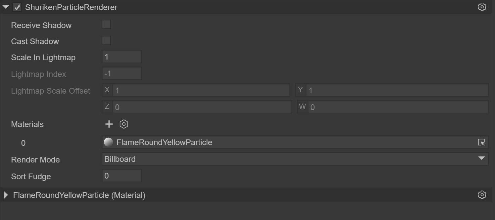

(Figure 4.4-1)

After creating the particle system, the ShurikenParticleRenderer component will be added by default in the Inspector panel, and the FlameRoundYellowParticle material will be selected.


(Figure 4.4-2)

In the Scene window, you can see that the particle effect has been replaced by a texture, and you need to further set the texture animation.

#### 4.5 Using texture animation

 

(Figure 4.5-1)

In the TextureSheet of the particle system, create an Instance. Since the composition of the flame map is 10x5, modify the Tiles to X: 10, Y: 5. After modification, the particle system map becomes a flame effect, but it is still a static image. Next, modify the Frame animation. Modify Frame->Type to Curve, click Curve to open the panel, the horizontal axis is the timeline, and the vertical axis is the number of frames of the frame animation. , the effect we want is to play the flame frame animation in a loop in 1 second, that is, from 0 to 50 frames, then we modify the Curve as shown below


(Figure 4.5-2)

After completing the Curve, look at the flame effect and you can now play the frame animation.


(Animation 10)

#### 4.6 Set basic properties

 

(Figure 4.6)

The Constant of Start Speed ​​is 0, the initial speed when the flame is emitted is 0, the Constant of Start Size is 2, which enlarges the size of the flame by 2 times, and the Simulation Speed ​​is 2, which can speed up the speed of flame playback.

#### 4.7 Set up the transmitter


(Figure 4.7)

Modify the number of particles emitted per unit time to 5, which is equivalent to burning 5 flames per second.

#### 4.8 Set up the shape module


(Figure 4.8)

We hope that the particles will be emitted in a circle to achieve the effect of flame gathering and burning.

#### 4.9 Set particle life cycle

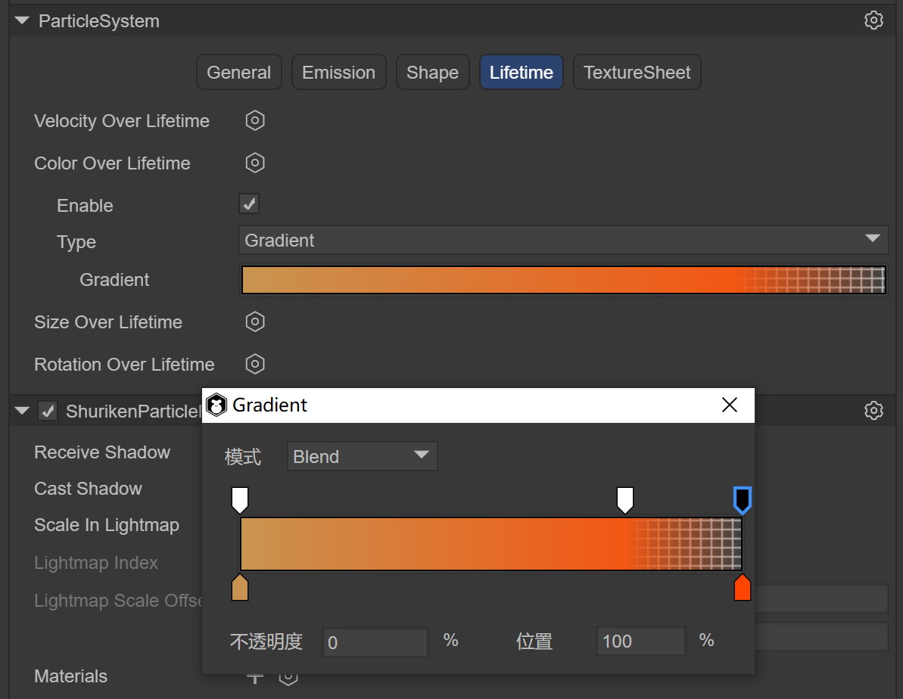

(Figure 4.9-1)

The most important step is to set the particle life cycle. First, set the color process within the flame life cycle, create a Color Over Lifetime instance, set the Type to Gradient gradient curve, open the Gradient panel, and the three downward arrows above indicate the color. The transparency ranges from 0% opaque -> 80% opaque -> 100% fully transparent. The two upward arrows below indicate the color range from c99451 to ff4500.


(Figure 4.9-2)

Since the flame is a particle that moves upward until it disappears, create a Velocity Over Lifetime instance, select the Curve curve, and only need to modify the displacement of the Y-axis to 1 second from 0 to 1, moving up 1 unit.

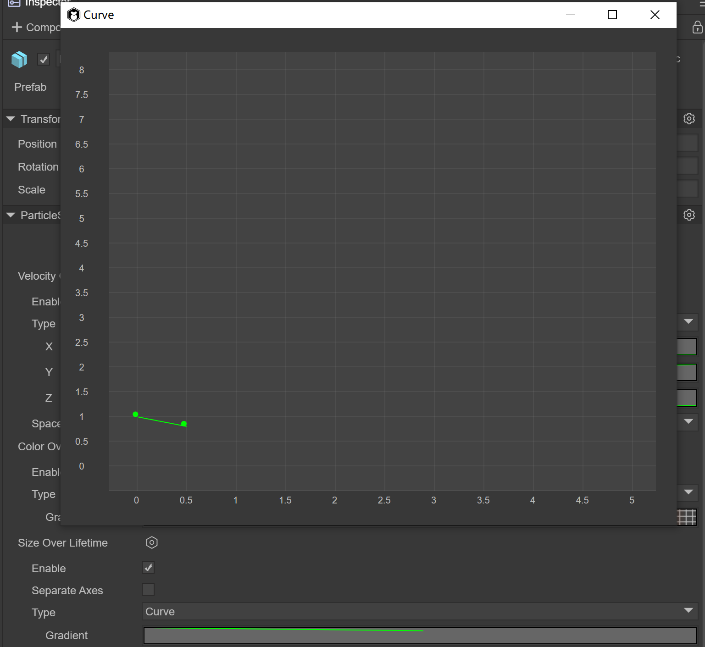

(Figure 4.9-3)

Since the flame will shrink in size, create a Size Over Lifetime instance, select the Curve curve, and only need to modify the size from 1 to 0.5 in 0.5 seconds, doubling the size.


(Animation 11)

At this time, you can see in the Scene window that the flame effect has been completed.

## 5. Application scenarios and code examples

Often during the battle process of the game, a large number of particles need to be created, so the object pool needs to be used. Object pool optimization is a very important optimization method in game development and is also one of the important factors affecting game performance. There are many objects in the game that are constantly being created and removed, such as the creation and removal of character attack bullets, special effects, the destruction and refreshing of NPCs, etc. The creation process consumes a lot of performance, especially when the number is large. . Object pool technology can solve the above problems very well. When objects are removed and disappear, they are recycled to the object pool. When new objects are needed, they are directly taken out of the object pool and used. The advantage is that it reduces the overhead when instantiating the object, allows the object to be used repeatedly, and reduces the chance of new memory allocation and garbage collector running.

> *Note: When the object is removed, it is not immediately erased from the memory. Only when the memory is deemed to be insufficient, the garbage collection mechanism will be used to clear it. Clearing is very memory intensive and may cause lag. Using the object pool will reduce the garbage objects of the program and effectively improve the running speed and stability of the program. *

### 5.1 Custom Particle3D class

```typescript
import Node = Laya.Node;
import Sprite3D = Laya.Sprite3D;
import ShuriKenParticle3D = Laya.ShuriKenParticle3D;
import ShurikenParticleSystem = Laya.ShurikenParticleSystem;
import { Pool } from "./Pool";

//The base class of particle effects, including creation, playback, pause, destruction, and cleaning up the object pool
export class Particle3D extends Sprite3D  {

	private _isInited: boolean = false;
	private _filePath: string = null;
	private _particle: Laya.Sprite = null;
	private _shuriKenParticle3D: Array<ShuriKenParticle3D>= [];
	private _shurikenParticleSystem: Array<ShurikenParticleSystem>= [];
	constructor()
	{
    	super();
	}
    
    //Create a particle effect by passing in the path of the particle effect, and take one from the object pool
	static Create(path: string): Particle3D
	{
    	var ret:Particle3D = Pool.getInstance().getItemByClass("Particle3D@" + path, Particle3D);
    	ret.Init(path);
    	return right;
	}
    
    //Particle effects initialization
	private Init(file_path:string): void
	{
    	if (this._isInited)
    	{
        	return;
    	}
    	this._filePath = file_path;

    	console.log("Particle3D");
    	//Clone one from the obtained particle system
    	var res = Laya.loader.getRes(file_path);
    	var particle = res.clone();

    	this._particle = particle;
    	//Get all particle systems of this particle effect for later overall playback
    	for (var i = 0, len = this._particle.numChildren; i < len; i++)
    	{
        	var child:Node = this._particle.getChildAt(i);
        	if (child instanceof Laya.ShuriKenParticle3D)
        	{
            	this._shuriKenParticle3D.push(child);
            	this._shurikenParticleSystem.push(child.particleSystem);
        	}
    	}

    	this.addChild(this._particle);
    	this._isInited = true;
	}

    //Particle effects playback. Since a complex particle effect is composed of multiple particle systems, at this time, all particle system objects of the particle effect are traversed and play() is called.
	play(): void
	{
    	for (var i = 0, len = this._shurikenParticleSystem.length; i < len; i++)
    	{
        	var particle_system = this._shurikenParticleSystem[i];
        	particle_system.simulate(0, true);
        	particle_system.play();
    	}
	}

    //Pause and resume particle effects. Since a complex particle effect is composed of multiple particle systems, at this time, all particle system objects of the particle effect are traversed and call pause() and play()
	pause(): void
	{
    	for (var i = 0, len = this._shurikenParticleSystem.length; i < len; i++)
    	{
        	var particle_system:ShurikenParticleSystem = this._shurikenParticleSystem[i];
        	if (this._isPaused)
        	{
            	particle_system.play();
            	this._isPaused = false;
        	}
        	else
        	{
            	particle_system.pause();
            	this._isPaused = true;          	 
        	}
    	}
	}

    //Particle system object pool recycling
	Recover(): void
	{
    	this.removeSelf();
    	Pool.getInstance().recover(this._filePath, this);
	};

    //Completely destroy and clean up a particle effects object
	Clean(): void
	{
    	if (this.destroyed)
    	{
        	return;
    	}

    	this.Recover();

    	if (this._particle && !this._particle.destroyed)
    	{
        	this._particle.removeSelf();
        	this._particle.destroy(true);
        	this._particle = null;
    	}

    	this._shuriKenParticle3D = null;
    	this._shurikenParticleSystem = null;

    	this._isInited = false;

    	this.destroy(true);
	};

    //Clear the buffer pool by passing in the path of the particle effects
	static ClearPool(root_path: string): void
	{
    	if (root_path == null)
    	{
        	root_path = "";
    	}
    	Pool.getInstance().ClearGroup("Particle3D@" + root_path, this, function(particle_3d:Particle3D)
    	{
        	particle_3d.Clean();
    	});
	}

}
```

### 5.2 Custom object pool class

```typescript
export class Pool {
    
    	private _poolDic:{[key: string]: any;} = {};
    	private InPoolSign: string = "__InPool";

    	constructor()
    	{
    	}

    	private static _instance: Pool = new Pool();
    	public static getInstance() {
        	return this._instance;
    	}

   	 //Find the corresponding object pool by name
    	getPoolBySign(sign:string): any
    	{
        	return this._poolDic[sign] || (this._poolDic[sign] = []);
    	};

   	 //Recycle
    	recover(sign:string, item:any): void
    	{
        	item["__InPool"] = true;
    	};

   	 //Get an object by name. If there is no object in the object pool, create one
    	getItemByClass(sign:string, cls:any): any
    	{
        	var right = null;
        	var pool = this.getPoolBySign(sign);
        	for (var i = 0, len = pool.length; i < len; i++)
        	{
            	var item = pool[i];
            	if (item["__InPool"] && item instanceof cls)
            	{
                	right = item;
                	break;
            	}
        	}
        	if (!ret)
        	{
            	ret = new cls();
            	pool.push(ret);    	 
        	}
        	right["__InPool"] = false;
        	return right;
    	};

   	 //Clean up a group of object pools by name
    	ClearGroup(head_sign:string, caller:any, func:Function): void
    	{
        	for (var key in this._poolDic)
        	{       	 
            	if (key.indexOf(head_sign) == 0)
            	{
                	var pool = this._poolDic[key];
                	if (func)
                	{
                    	for (var i = 0, len = pool.length; i < len; i++)
                    	{
                        	var item = pool[i];
                        	func.call(caller, item);
                    	}
                	}
                	pool.length = 0;
            	}
        	}
    	};

   	 //Clean up all object pools
    	ClearAll(caller:any, func:Function): void
    	{
        	for (var key in this._poolDic)
        	{       	 
            	var pool = this._poolDic[key];
            	if (func)
            	{
                	for (var i = 0, len = pool.length; i < len; i++)
                	{
                    	var item = pool[i];
                    	func.call(caller, item);
                	}
            	}
            	pool.length = 0;
        	}
    	};
}
```

### 5.3 Code call

```typescript
const { regClass, property } = Laya;
import { Particle3D } from "./Particle3D";

@regClass()
export class Main extends Laya.Script {

    //The path of particle effects
	private filePath = "FireEffect";
	onStart() {
    	console.log("Game start");  
    	//Load particle effects resources
    	Laya.loader.load(this.filePath, Handler.create(this, () => {    
    	}));   	 
	}

    //Every time the mouse clicks on the screen, a special effect will be created
	mouseDown(e: Event): void {
    	var particle = Particle3D.Create(this.filePath);
    	this.owner.addChild(particle);        	 
	}

    //After the mouse is raised, the object pool will be released
	mouseUp(e: Event): void {
    	Particle3D.ClearPool(this.filePath); 	 
	}    
}
```


