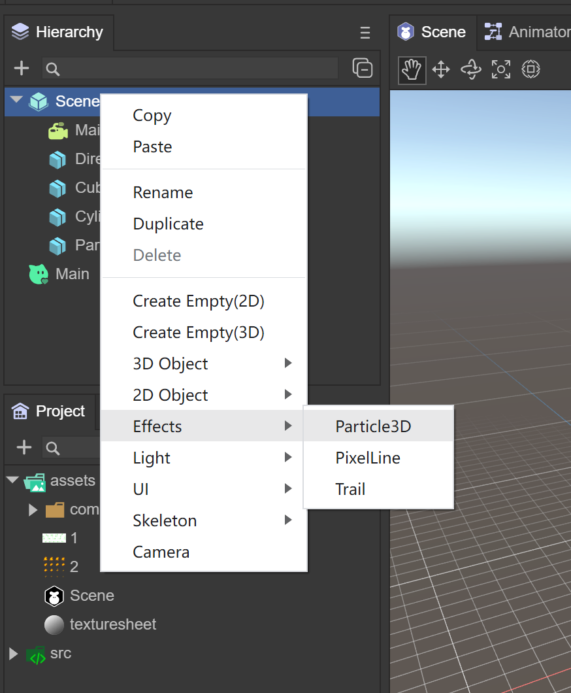

# 3D particle editor

> Author: zhangzhe && Charley	Date:  2022-11-05
>

## 1. Basics of 3D particle editor

### 1.1 What are 3D particles?

In the encyclopedia, a particle refers to the smallest component of matter that can exist in a free state.

In the LayaAir engine, particles in the 3D particle system can be used to simulate non-fixed natural phenomena such as smoke, fog, water, fire, rain, snow, and streamers. Since the shapes of the above-mentioned natural objects have no fixed shapes, they cannot be simulated and implemented with fixed models. Multiple models need to be combined into a complete visual effect, and 3D particles are the smallest unit of the combined effect, but it needs to be noted. What's interesting is that the particles are not a three-dimensional model, but a patch model.

> Since the particle patch always faces the camera, it usually does not feel like a patch model. Of course, you can also set the particles not to always face the camera.

An example effect of 3D particles is shown in animation 1:


(Animation 1)

### 1.2 LayaAir particle system


#### Definition

The particle system is the basis for the special effects performance of the Laya3.0 engine. It can be used to simulate natural phenomena such as fire, smoke, water, clouds, snow, and fallen leaves, and can also be used to simulate abstract visual effects such as luminous trajectories and speed lines. Particle systems are a technique in game physics, motion graphics, and computer graphics that use many tiny sprites, 3D models, or other graphical objects to simulate certain types of "blurry" phenomena that would otherwise be difficult to use with traditional Rendering technology reappears. Usually the position and movement of the particle system in three-dimensional space are controlled by the emitter. The emitter is mainly represented by a set of particle behavior parameters and its position in three-dimensional space. Particle behavior parameters can include particle generation speed (i.e., the number of particles generated per unit time), particle initial velocity vector (such as when to move in which direction), particle lifetime (how long it takes for the particle to annihilate), particle color, particle life cycle changes in and other parameters, etc.

#### illustrate

Particle systems generally consist of the following parts:

1. Emitter, used to create particles and initialize particle properties
2. Influencer, used to update the properties of particles
3. Renderer, rendering particles
4. Particle class, stores the attributes of particles
5. Particle system class, manages the above modules


The basic unit of the particle system is a particle. A particle generally has attributes such as position, size, color, speed, acceleration, and life cycle.

#### Particle system classification

In the Laya3.0 editor, you can use 5 types to create different special effects.


(Figure 1.2)

#### 1.2.1 Basic panel `General`

The default is the general module of the particle system, which is used to set the basic settings of the particle system. This module is an inherent module and cannot be disabled. This module defines a series of basic parameters such as the duration, cycle mode, emission speed, and size of particles during initialization.


(Figure 1.2.1)

`Duration`: the duration of particle running
`Loop`: If enabled, the system will start again at the end of its duration and continue to repeat the loop.
`Play On Awake`: If enabled, the particle system will automatically start when the object is created.
`Start Delay`: The delay (in seconds) before the system starts transmitting when enabled. Two delay modes can be selected, fixed time; random values ​​from the minimum to the maximum two times
`Start Lifetime`: The initial life cycle time of the particle.
`Start Speed`: The initial speed of each particle in the appropriate direction.
`Start Size`: The initial size of each particle, if you want to control the size of each axis separately, please enable the 3D option.
`Start Rotation`: The initial rotation angle of each particle. If you want to control the rotation of each axis individually, enable the 3D option. You can also set random directions
`Start Color`: The initial color of each particle.
`Gravity Modifier`: Set the physical gravity value. A value of zero turns gravity off.
`Simulation Space`: Controls whether particles animate in the parent object's local space (and therefore move with the parent object) or world space.
`Simulation Speed`: Adjust the speed of the entire system update.
`Scale Mode`: Choose how to use scale from the transform. Set to `World`, `Local`. Only the particle system transform scale is applied locally, ignoring any parents.
`Max Particles`: The maximum number of particles in a system. If the limit is reached, some particles are removed.
`Auto Random Seed`: If enabled, the particle system will look different each time it is played. When set to false, the system will be exactly the same every time it is played. This value is used to create unique repeatable effects when automatic random seeding is disabled.

#### 1.2.2 Emission module `Emission`

This module is part of the particle system component and is used to specify the properties of emitted particles. When creating a new particle system, the Emission module is enabled by default.


(Figure 1.2.2)

`Enable`: whether to enable
`Loop`: If enabled, the system will start again at the end of its duration and continue to repeat the loop.
`Rate over Time`: The number of particles emitted per unit time.
`Rate over Distance` The number of particles emitted per unit of distance moved. This mode is useful for simulating particles that are actually produced by the motion of an object (for example, dust left by wheels on a dirt road)
`Bursts`: Bursts are events that produce particles. These settings allow particles to be emitted at specified times. You can set multiple groups of burst points and modify the time, minimum number of particles, and maximum number of particles respectively.

#### 1.2.3 Shape module `Shape`

This module defines the volume or surface from which particles are emitted, and the direction of the starting velocity.


(Figure 1.2.3)

`Shape`: Defines the shape of the emission volume. Shape instances can be created or deleted. The remaining properties vary according to the selected shape. All shapes have properties that define their dimensions, such as the Radius property.
`Shape Type`: Shape, the choice of shape will affect the area where particles can be emitted, and also affect the initial direction of the particles. For example, a sphere emits particles outward in all directions, a cone emits a diverging stream of particles, and a mesh emits particles in a direction normal to the surface.
1.`Sphere`: ball
`Radius`: Radius
​ `Emit from shell`: Emit according to the shell
​ `Randomize Direction`: Randomize direction
2. `Hemisphere`: hemispheric shape
`Radius`: Radius
​ `Emit from shell`: Emit according to the shell
​ `Randomize Direction`: Randomize direction
3. `cone`: cone shape
`Angle DEG`: The angle of the circular aspect of the shape
`Radius`: Radius
`Length`: length
`Emit from`: Emission method
​   	 `Base`: base
​   	 `Base Shell`: based on shell
​   	 `Volume`: volume
​   	 `Volume Shell`: volume shell
​ `Randomize Direction`: Randomize direction
4. `Box`: box shape
`Length`: The length of the circular aspect of the shape
​ `Randomize Direction`: Randomize direction
5. `circle`: ring
`Radius`: Radius
`Angle DEG`: The angle of the circular aspect of the shape
​ `Emit From Edge`: Emit based on edge
​ `Randomize Direction`: Randomize direction

#### 1.2.4 Lifetime `Lifetime`

This module defines the properties of the emitted particles during their lifetime.


(Figure 1.2.4)

1. `Velocity over Lifetime`: Velocity in the life cycle
​ `Constant`: constant mode, the speed is constant
`Curve`: Line mode, particle speed changes with lifetime
​`Random from two Constant`: Random speed mode
​ `Space`: space
​   	 `Local`: model space
​   	 `World`: world space
2. `Color over Lifetime`: Color in the life cycle
​ `Constant`: constant mode, the color is constant
​ `Gradient`: gradient
​ `Random from two Constant`: Random two color modes
​`Random between two Gradient`: Randomly take values ​​in two gradients
3. `Size over Lifetime`: Size in the life cycle
​ `Separate Axes`: Separate by axis
​   	 `Curve`: Curve
​   	 `Random Between Two Contants`: Randomly select values ​​from two constants
4. `Rotation over Lifetime`: Rotation in the life cycle
​ `Separate Axes`: Separate by axis is unchecked
​   	 `Angular Velocity`: Angular velocity
​   	 `Constant`: constant
​   	 `Curve`: Curve
​   	 `Random Between Two Contants`: Randomly select values ​​from two constants

#### 1.2.5 Texture animation `Texture Sheet`

This module is part of a particle system. When creating a new particle system, Laya 3.0 adds the texture animation module to the particle system.


(Figure 1.2.5)

Currently Laya3.0 adopts grid mode (Grid)

`Tiles`: The number of tiles the texture is divided into in the X (horizontal) and Y (vertical) directions.

`Animation`: Animation mode can be set to full sheet or single line (i.e. each line represents a separate animation sequence).

`Frame`: Set frame

`Type`: frame type

   	 `Constant`: Fixed number of frames

   	 `Curve`: A curve that specifies how animation frames increase over time.

   	 `Random Between two constant`: Random between two fixed frame numbers

   	 `Random Between two curve`: Random between two curves

`Start Frame`: Start frame, allows you to specify which frame the particle animation should start from (useful for randomly phasing animations on each particle)

`Cycles`: The number of times the animation sequence is repeated during the particle's lifetime.

### 1.3 Particle rendering module `ShurikenParticleRenderer`

Renderer module settings determine how a particle's image, model, is transformed, shaded, and overdrawn by other particles.

#### 

(Figure 1.3)

`Receive Shadows`: Determines whether particles in this system can receive shadows from other sources. Only opaque materials can receive shadows.

`Cast Shadows`: If this property is enabled, the particle system will create shadows when struck by a shadow-casting light.

`Scale In Lightmap`: Adjust the pixel density of specific objects in the final LightMap.

`Materials`: Materials used to render particles

`Render Mode`: How to generate a rendered image from a graphics image (or mesh).

1. `Billboard`: Render particles as billboards, always facing the camera

2. `Stretched Billboard`: Particles face the camera using various possible scaling options.

`Camera Scale`: Camera scale
​ `Velocity Scale`: Velocity scale
​ `Length Scale`: length ratio

3. `Horizontal Billboard`: The particle plane is parallel to the XZ "bottom" plane

4. `Vertical Billboard`: The particles are upright on the Y-axis, but facing the camera

5. `Mesh`: Particles are rendered from a 3D mesh instead of a texture

`Sorting Fudge`: The smaller the value, the greater the rendering priority.

### 1.4 Particle Shader

Select Laya's particle in the material, and you can add Laya's built-in particle shader (PARTICLESHURIKEN), which can render various particle systems.
Effect. All particles use this material.

#### 

(Figure 1.4)

`Color`: Specifies the color of the particles.

`Texture`: Specifies the texture map used by particles

`Alpha Test Value`: transparency test

`Tiling Offset`: Get texture tiling and offset

`Material Render Mode`: Set rendering mode

 `Opaque`: Default setting, suitable for ordinary solid objects without transparent areas.
​ `Cutout`: Allows the creation of transparency effects with hard edges between opaque and transparent areas. In this mode, there are no translucent areas and the texture is either 100% opaque or invisible. This is useful when using transparency to create the shape of a material, such as leaves or holed and tattered cloth.
​ `Transparent`: Suitable for rendering realistic transparent materials, such as clear plastic or glass. In this mode, the material itself will take on a transparency value (based on the texture's alpha channel and the tint color's alpha), but reflections and lighting highlights will remain visible at full clarity, just like a truly transparent material.
`Additive`: superposition method
​ `AlphaBlended`: Transparent blending method

`Cull`: Culling method


## 2. Use of 3D particle editor

### 2.1 3D particle root node

#### 2.1.1 Particle Node

At any node in the scene, you can add a particle system by right-clicking the mouse.



(Figure 2.1.1-1)

Default particle system adds finishing effects


(Figure 2.1.1-2)

#### 2.1.2 Prefab

Drag the particle root node in the scene to Assets to keep the prefab


(Figure 2.1.2)

### 2.2 Use of particle system

After creating the particle node, you can see the particle system in the Inspector, including 5 categories, and further set up the functions we want to implement.

Example: Fire effects

#### 2.2.1 Create flame prefab


(Figure 2.2.1)

In the Scene3D scene, right-click the mouse and select Create Effects->Particle3D. By default, a 3D particle system is created, named FireEffect, and dragged to the Assets->Particle3D directory to create the prefab.

#### 2.2.2 Flame sequence frame animation


(Figure 2.2.2)

Prepare the flame sequence frame animation texture file, place it in the Assets directory, click on the texture, check sRGB and Alpha Channel, the TextureType is still Default, click the Apply button to ensure that the modification is successful.

#### 2.2.3 Set flame material


(Figure 2.2.3)

Create a material under Assets and name it FlameRoundYellowParticle. The Shader uses Laya.Particle. Basically all particle effects use this Shader. Color is set to 191,191,191,255, texture selects the map added above, and Material Render Mode selects ADDITIVE.

#### 2.2.4 Set up particle system rendering module


(Figure 2.2.4-1)

After creating the particle system, the ShurikenParticleRenderer component will be added by default in the Inspector panel, and the FlameRoundYellowParticle material will be selected.


(Figure 2.2.4-2)

In the Scene window, you can see that the particle effect has been replaced by a texture, and you need to further set the texture animation.

#### 2.2.5 Using texture animation

 

(Figure 2.2.5-1)

In the TextureSheet of the particle system, create an Instance. Since the composition of the flame map is 10x5, modify the Tiles to X: 10, Y: 5. After modification, the particle system map becomes a flame effect, but it is still a static image. Next, modify the Frame animation. Modify Frame->Type to Curve, click Curve to open the panel, the horizontal axis is the timeline, and the vertical axis is the number of frames of the frame animation. , the effect we want is to play the flame frame animation in a loop in 1 second, that is, from 0 to 50 frames, then we modify the Curve as shown below


(Figure 2.2.5-2)

After completing the Curve, look at the flame effect and you can now play the frame animation.

#### 2.2.6 Set basic properties

 

(Figure 2.2.5)

The Constant of Start Speed ​​is 0, the initial speed when the flame is emitted is 0, the Constant of Start Size is 2, which enlarges the size of the flame by 2 times, and the Simulation Speed ​​is 2, which can speed up the speed of flame playback.

#### 2.2.6 Set up the transmitter


(Figure 2.2.6)

Modify the number of particles emitted per unit time to 5, which is equivalent to burning 5 flames per second.

#### 2.2.7 Set up the shape module


(Figure 2.2.7)

We hope that the particles will be emitted in a circle to achieve the effect of flame gathering and burning.

#### 2.2.8 Set particle life cycle


(Figure 2.2.8-1)

The most important step is to set the particle life cycle. First, set the color process within the flame life cycle, create a Color Over Lifetime instance, set the Type to Gradient gradient curve, open the Gradient panel, and the three downward arrows above indicate the color. The transparency ranges from 0% opaque -> 80% opaque -> 100% fully transparent. The two upward arrows below indicate the color range from c99451 to ff4500.


(Figure 2.2.8-2)

Since the flame is a particle that moves upward until it disappears, create a Velocity Over Lifetime instance, select the Curve curve, and only need to modify the displacement of the Y-axis to 1 second from 0 to 1, moving up 1 unit.


(Figure 2.2.8-3)

Since the flame will shrink in size, create a Size Over Lifetime instance, select the Curve curve, and only need to modify the size from 1 to 0.5 in 0.5 seconds, doubling the size.


(Figure 2.2.8-4)

At this time, you can see in the Scene window that the flame effect has been completed.

## 4. Application scenarios and code examples

Often during the battle process of the game, a large number of particles need to be created, so the object pool needs to be used. Object pool optimization is a very important optimization method in game development and is also one of the important factors affecting game performance. There are many objects in the game that are constantly being created and removed, such as the creation and removal of character attack bullets, special effects, the destruction and refreshing of NPCs, etc. The creation process consumes a lot of performance, especially when the number is large. . Object pool technology can solve the above problems very well. When objects are removed and disappear, they are recycled to the object pool. When new objects are needed, they are directly taken out of the object pool and used. The advantage is that it reduces the overhead when instantiating the object, allows the object to be used repeatedly, and reduces the chance of new memory allocation and garbage collector running.

> *Note: When the object is removed, it is not immediately erased from the memory. Only when the memory is deemed to be insufficient, the garbage collection mechanism will be used to clear it. Clearing is very memory intensive and may cause lag. Using the object pool will reduce the garbage objects of the program and effectively improve the running speed and stability of the program. *

### 4.1 Custom Particle3D class

```
import Node = Laya.Node;
import Sprite3D = Laya.Sprite3D;
import ShuriKenParticle3D = Laya.ShuriKenParticle3D;
import ShurikenParticleSystem = Laya.ShurikenParticleSystem;
import { Pool } from "./Pool";

//The base class of particle effects, including creation, playback, pause, destruction, and cleaning up the object pool
export class Particle3D extends Sprite3D  {

	private _isInited: boolean = false;
	private _filePath: string = null;
	private _particle: Laya.Sprite = null;
	private _shuriKenParticle3D: Array<ShuriKenParticle3D>= [];
	private _shurikenParticleSystem: Array<ShurikenParticleSystem>= [];
	constructor()
	{
    	super();
	}
    
    //Create a particle effect by passing in the path of the particle effect, and take one from the object pool
	static Create(path: string): Particle3D
	{
    	var ret:Particle3D = Pool.getInstance().getItemByClass("Particle3D@" + path, Particle3D);
    	ret.Init(path);
    	return right;
	}
    
    //Particle effects initialization
	private Init(file_path:string): void
	{
    	if (this._isInited)
    	{
        	return;
    	}
    	this._filePath = file_path;

    	console.log("Particle3D");
    	//Clone one from the obtained particle system
    	var res = Laya.loader.getRes(file_path);
    	var particle = res.clone();

    	this._particle = particle;
    	//Get all particle systems of this particle effect for later overall playback
    	for (var i = 0, len = this._particle.numChildren; i < len; i++)
    	{
        	var child:Node = this._particle.getChildAt(i);
        	if (child instanceof Laya.ShuriKenParticle3D)
        	{
            	this._shuriKenParticle3D.push(child);
            	this._shurikenParticleSystem.push(child.particleSystem);
        	}
    	}

    	this.addChild(this._particle);
    	this._isInited = true;
	}

    //Particle effects playback. Since a complex particle effect is composed of multiple particle systems, at this time, all particle system objects of the particle effect are traversed and play() is called.
	play(): void
	{
    	for (var i = 0, len = this._shurikenParticleSystem.length; i < len; i++)
    	{
        	var particle_system = this._shurikenParticleSystem[i];
        	particle_system.simulate(0, true);
        	particle_system.play();
    	}
	}

    //Pause and resume particle effects. Since a complex particle effect is composed of multiple particle systems, at this time, all particle system objects of the particle effect are traversed and call pause() and play()
	pause(): void
	{
    	for (var i = 0, len = this._shurikenParticleSystem.length; i < len; i++)
    	{
        	var particle_system:ShurikenParticleSystem = this._shurikenParticleSystem[i];
        	if (this._isPaused)
        	{
            	particle_system.play();
            	this._isPaused = false;
        	}
        	else
        	{
            	particle_system.pause();
            	this._isPaused = true;          	 
        	}
    	}
	}

    //Particle system object pool recycling
	Recover(): void
	{
    	this.removeSelf();
    	Pool.getInstance().recover(this._filePath, this);
	};

    //Completely destroy and clean up a particle effects object
	Clean(): void
	{
    	if (this.destroyed)
    	{
        	return;
    	}

    	this.Recover();

    	if (this._particle && !this._particle.destroyed)
    	{
        	this._particle.removeSelf();
        	this._particle.destroy(true);
        	this._particle = null;
    	}

    	this._shuriKenParticle3D = null;
    	this._shurikenParticleSystem = null;

    	this._isInited = false;

    	this.destroy(true);
	};

    //Clear the buffer pool by passing in the path of the particle effects
	static ClearPool(root_path: string): void
	{
    	if (root_path == null)
    	{
        	root_path = "";
    	}
    	Pool.getInstance().ClearGroup("Particle3D@" + root_path, this, function(particle_3d:Particle3D)
    	{
        	particle_3d.Clean();
    	});
	}

}
```

### 4.2 Custom object pool class

```
export class Pool {
    
    	private _poolDic:{[key: string]: any;} = {};
    	private InPoolSign: string = "__InPool";

    	constructor()
    	{
    	}

    	private static _instance: Pool = new Pool();
    	public static getInstance() {
        	return this._instance;
    	}

   	 //Find the corresponding object pool by name
    	getPoolBySign(sign:string): any
    	{
        	return this._poolDic[sign] || (this._poolDic[sign] = []);
    	};

   	 //Recycle
    	recover(sign:string, item:any): void
    	{
        	item["__InPool"] = true;
    	};

   	 //Get an object by name. If there is no object in the object pool, create one
    	getItemByClass(sign:string, cls:any): any
    	{
        	var right = null;
        	var pool = this.getPoolBySign(sign);
        	for (var i = 0, len = pool.length; i < len; i++)
        	{
            	var item = pool[i];
            	if (item["__InPool"] && item instanceof cls)
            	{
                	right = item;
                	break;
            	}
        	}
        	if (!ret)
        	{
            	ret = new cls();
            	pool.push(ret);    	 
        	}
        	right["__InPool"] = false;
        	return right;
    	};

   	 //Clean up a group of object pools by name
    	ClearGroup(head_sign:string, caller:any, func:Function): void
    	{
        	for (var key in this._poolDic)
        	{       	 
            	if (key.indexOf(head_sign) == 0)
            	{
                	var pool = this._poolDic[key];
                	if (func)
                	{
                    	for (var i = 0, len = pool.length; i < len; i++)
                    	{
                        	var item = pool[i];
                        	func.call(caller, item);
                    	}
                	}
                	pool.length = 0;
            	}
        	}
    	};

   	 //Clean up all object pools
    	ClearAll(caller:any, func:Function): void
    	{
        	for (var key in this._poolDic)
        	{       	 
            	var pool = this._poolDic[key];
            	if (func)
            	{
                	for (var i = 0, len = pool.length; i < len; i++)
                	{
                    	var item = pool[i];
                    	func.call(caller, item);
                	}
            	}
            	pool.length = 0;
        	}
    	};
}
```

### 4.3 Code call

```
const { regClass, property } = Laya;
import { Particle3D } from "./Particle3D";

@regClass()
export class Main extends Laya.Script {

    //The path of particle effects
	private filePath = "FireEffect";
	onStart() {
    	console.log("Game start");  
    	//Load particle effects resources
    	Laya.loader.load(this.filePath, Handler.create(this, () => {    
    	}));   	 
	}

    //Every time the mouse clicks on the screen, a special effect will be created
	mouseDown(e: Event): void {
    	var particle = Particle3D.Create(this.filePath);
    	this.owner.addChild(particle);        	 
	}

    //After the mouse is raised, the object pool will be released
	mouseUp(e: Event): void {
    	Particle3D.ClearPool(this.filePath); 	 
	}    
}
```


