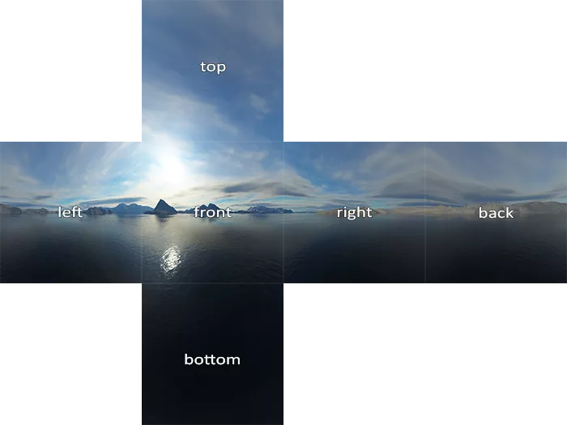
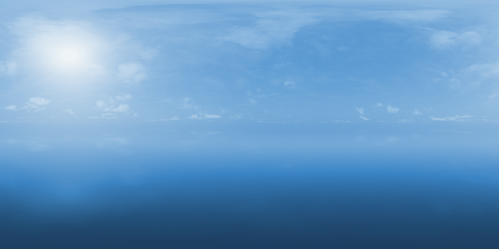
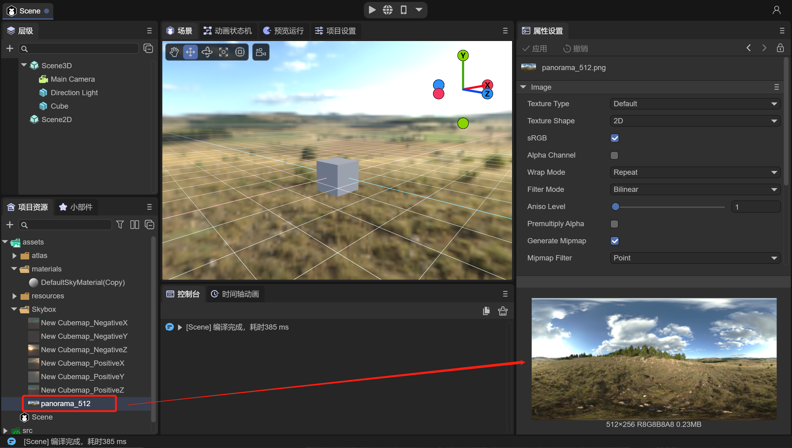
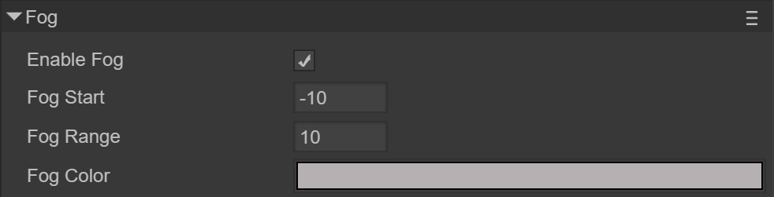
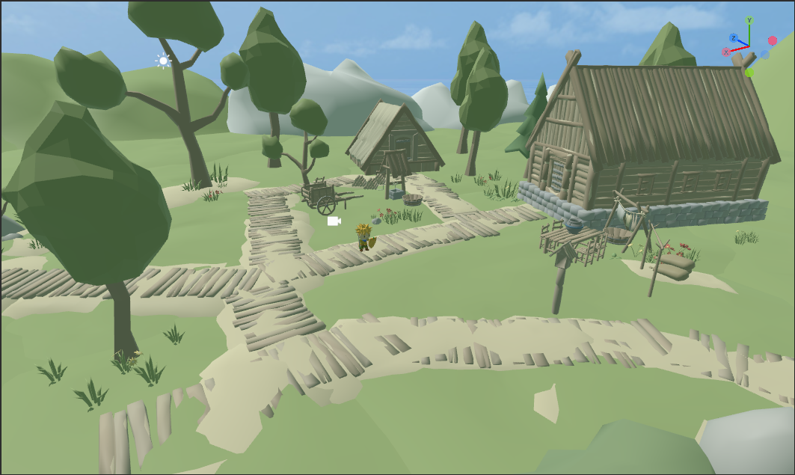
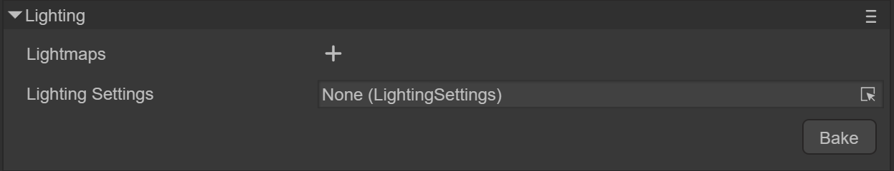
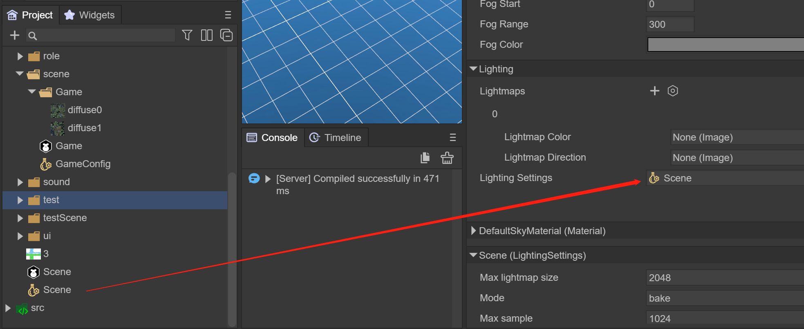
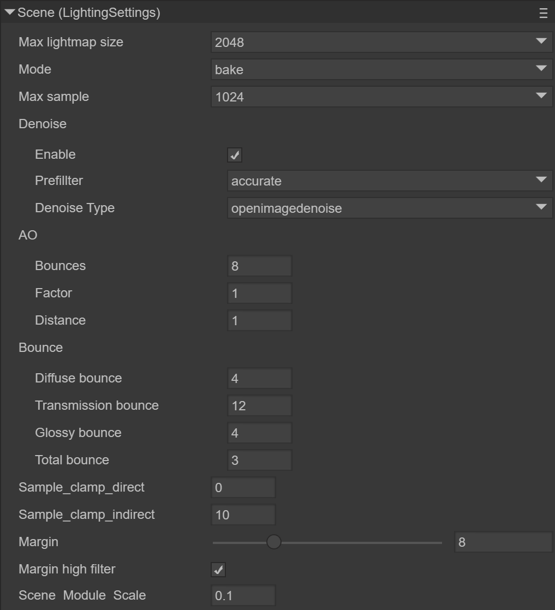
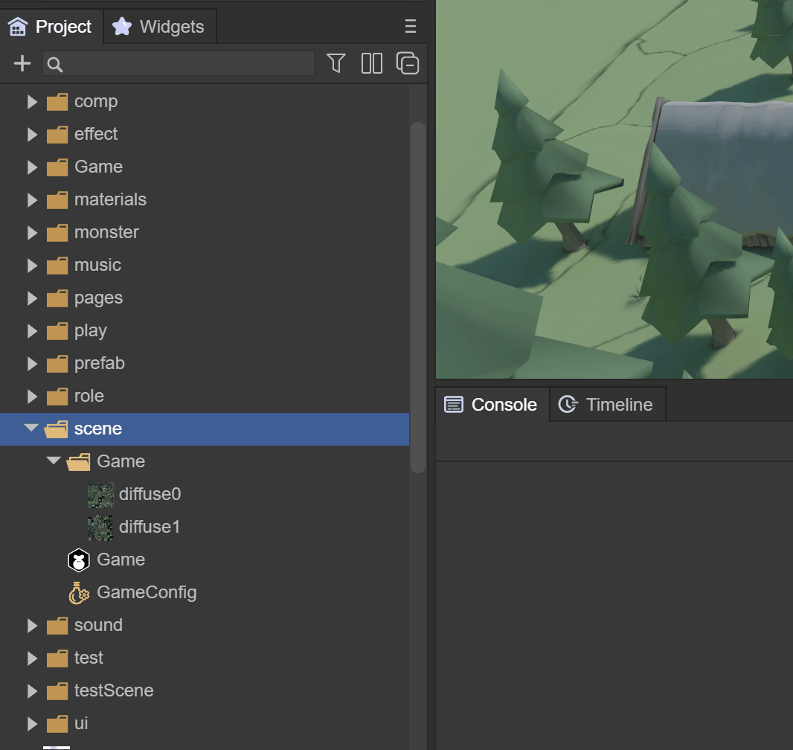

# 3D scene environment settings


In this article, we will fully understand the powerful functions of LayaAir3.0 3D scene editing


(Picture 1-1)


## 1. Overview

The scene is the 3D world container of the LayaAir engine, which is used to present the 3D picture of the game and load various 3D elements. The cameras, lights, characters, items, etc. in the game need to be placed in the scene to display the picture, which is equivalent to a game. 3D player or 3D view.

In the LayaAir3.0 engine, 3D and 2D can be mixed, and the created Scene 3D scenes and Scene 2D containers or elements can be loaded onto the stage at the same time.

Let's first understand what the parameters of a 3D scene are. In order to achieve a good effect in a 3D scene, all factors need to be considered. We refer to it by creating a 3D-RPG project, as shown in Figure 1-2


(Figure 1-2)


The created 3D-RPG project is shown in Figure 1-3. The project itself is a scene.

From the Hierarchy window, you can see the Scene3D and Scene2D root nodes. Here we only explain the Scene3D scene, which includes important components of the 3D scene, 3D cameras, 3D sprites, etc. We will explain them in other documents


(Figure 1-3)


When we click on the Scene3D node, look at the parameter information under the Inspector, as shown in Figure 1-4

  

(Figure 1-4)

From Figure 1-4, we can see several components, which are the contents we need to care about. Next, we will explain the contents involved in the scene:

- #### Environment Sky

- #### Ambient light

- #### Environment Reflection

- #### Environmental Fog

- #### Lightmap (baking)


## 2. Scene sky

The way to realize the sky of the scene is the sky box. The sky box is a visual technology that makes the scene look wider and boundless. It uses a seamless closed texture to wrap the camera's viewport 360 degrees without dead ends. The sky box also It is the sky in the 3D world.

In Figure 2-1 we can see the skybox. The idea of ​​a skybox is to draw a large cube and then place the observer in the center of the cube. When the camera moves, the cube also moves with the camera, so that the camera never moves to the edge of the scene. This is the same as the situation in our real world. We can see that the distant sky touches the horizon, but no matter how we move in that direction, we cannot reach that place.


(Figure 2-1)


The Sky Renderer component `Sky Renderer` is the default component of the Scene3D scene and is used to specify the network shape of the sky box.


(Figure 2-2)


### 2.1 Component properties

`Mesh Type`: Mesh shape. Currently, the engine provides two common skybox meshes: **cube** and **spherical**. Among them, cubic grid is more commonly used.

 `Box`: cubic skybox

`Dome`: spherical skybox

`Material`: Specifies the material of the sky box


(Figure 2-3)

Expand DefaultSkyMaterial, as shown in Figure 2-3, which is the skybox material being used. Currently we use LayaAir’s built-in `SkyPanoramic` shader. The color and texture of `SkyPanoramic` are the two most important settings. We will discuss them in the material chapter. Detailed introduction to the three sky box materials provided by LayaAir3.0 `SkyPanoramic`, `Skybox`, and `SkyProcedural`

 *Note: If you need to use a `SkyProcedural` procedural sky, you can only use a spherical sky. Because this material uses vertex shading, it requires detailed vertex information. *

 *About the material `SkyProcedural` used in the sky box, the programmed sky material and the `SkyBox` sky box material will be explained later in the **Material material** article*

Regarding the `SkyPanoramic` material, let’s see how to set it up.

`Tint Color`: Color, as shown in Figure 2-4, change the color, and you can see that the changed color is superimposed on the texture.


(Figure 2-4)

`Rotation`: Rotation, from 0 to 360 degrees, rotation can help us adjust the position of the skybox

The skybox changes as the perspective is rotated, and we can observe distant views in all directions. Of the two meshes currently provided, the box-shaped sky has less vertex data, so the performance of this type of sky is better.

`Panoramic Texture`: The texture map of the sky box (a map corresponding to the spherical model)


#### 2.1.1 **Cube Sky**

The six seamlessly connected texture references used in the cube skybox are shown in Figure 2-5.



(Figure 2-5)


#### 2.1.2 **Spherical Sky**

It is composed of a spherical model and a corresponding texture. The example used is a texture corresponding to a spherical model, as shown in Figure 2-6



(Figure 2-6)


Basically, after using textures and colors, and configuring the sky box material, we can add a good sky effect to our scene.


(Animation 2-7)

Run the 3D-RPG project, rotate the camera, and you can see the effect of the sky box, as shown in the animation 2-7


### 2.2 Use code to set the scene sky material

Of course, we can also load and specify the skybox through code

```typescript
var skyRenderer = this.scene.skyRenderer;
//Load camera skybox material
Laya.Material.load("sky2.lmat", Laya.Handler.create(null, function(mat: any) {
	//Modify the skybox material of the skybox renderer
	skyRenderer.material = mat;
}));
```


### 2.3 Create skybox in IDE

#### 2.3.1 Change the IDE’s default spherical skybox

When we use the IDE to create a 3D scene, the default is a spherical skybox using the SkyPanoramic material, as shown in Figure 2-8


(Figure 2-8)

Since the system's material is inside the IDE, it cannot be modified directly. If you need to modify it, you can copy the same skybox material to the assets directory by cloning, as shown in animation 2-9.


(Animation 2-9)

Then prepare a new spherical skybox texture, as shown in Figure 2-10



(Figure 2-10)

Drag the new texture into the cloned material, as shown in animation 2-11


(Animation 2-11)

At this time, whether in the IDE scene or the preview effect, the skybox has been replaced with a new one.


#### 2.3.2 Change cube skybox

If the developer wants to use a cube skybox, first we change the material of the above skybox to Skybox, as shown in animation 2-12


(Animation 2-12)

The Laya.SkyBox material supports 6 seamlessly connected textures, but you need to create a Cube Texture first. As shown in the animation 2-13, create a Cube Texture in the assets directory.


(Animation 2-13)

In Cube Texture, add the 6 pre-prepared textures and click Apply, as shown in Figure 2-14


(Figure 2-14)

Finally, drag the Cube Texture with the map configured into the skybox Texture of the skyBox material. The cube skybox is configured and you can see the effect by running the scene.


(Figure 2-15)


## 3. Ambient light

Ambient light, also called diffuse ambient light, is the light that exists around the scene. and does not come from any specific light source. It can make an important contribution to the overall look and brightness of a scene.
Ambient light can be useful in many situations, depending on the art style you choose. This can also be used if you need to increase the overall brightness of the scene without adjusting individual lights.

As shown in Figure 3-1, the `EnvironmentLight` component is used to specify the ambient light in the 3D-RPG project.


(Figure 3-1)


### 3.1 Component properties

`Ambient Mode`: ambient light mode, divided into two types

 `Ambient Color`: Fixed color. Use Ambient Color as ambient light source

 `Ambient Intensity`: Color intensity.

 `Spherical Harmonics`: Spherical harmonic lighting. The spherical harmonic data generated by the sky box is directly applied to the object. It will be introduced later that when spherical harmonic lighting is selected, IBL is used to adjust the effect.


### 3.2 Fixed color


Figure (3-2)


We use a simple scene as a reference, when we turn off the Direction Light (Figure 3-2)


GIF (3-2)

You can see how the color changes to the ambient light when using Ambient Color, as shown in animation 3-2.


#### 3.1.1 Code usage

The ambient light color `AmbientColor` is a color fusion dyeing of the material to make the material tend to a certain color tone. It can also brighten the material and simulate the lighting effect of a light box. If the sky box is set and the AmbientColor of the Scene3D scene is not set, LayaAir3.0 will default to ambient light coming from the sky box, which is spherical harmonic lighting.

We can also modify the ambient light of the current scene through code

```typescript
//Set the scene environment light
scene.ambientColor = new Laya.Color(0,0,0,0);
```


### 3.3 Spherical harmonic lighting

You can see the effect of using spherical harmonic lighting. The surface of the object is affected by the sky box, as shown in the animation 3-3. In the next section, we will introduce the specific usage of using spherical harmonic lighting to affect the environment reflection IBL method.


GIF (3-3)


## 4. Environmental reflection

The **Ambient Reflections** feature provides effective smooth reflections everywhere in the scene. Some important materials, such as metal, rely on reflections in all directions, which is what ambient reflections provide.
There are two types of scene environment reflection, skybox reflection and custom reflection. If you want to have a reflection effect, you must have a reflection material in the object Shader. If there is no reflection material, there will be no effect. The default BlinnPhong does not support it. The PBR material supports environmental reflection.

`ReflectionProbe` is the environmental reflection component of the Scene3D scene, as shown in Figure 4-1


(Pic 4-1)


### 4.1 Component properties

 `Source`: reflection source

 `Skybox`: Select this option to use a skybox as a reflection source

 `Custom`: Select this option to use a custom reflection source

`Resolution`: If you select skybox reflection, you can set the resolution


### 4.2 Skybox as reflection source

The effect of spherical harmonic lighting in the previous chapter, animation (3-3), shows the use of the sky box set by the scene as an environmental reflection


### 4.3 Custom reflection source as reflection source

`Cubemap`: If you choose custom reflection, cubemap will be used, which is a collection of six independent square textures. It combines multiple textures and maps them to a single texture, as shown in Figure 4-2

  

(Figure 4-2)

Note: The texture map must be set to the texture shape of the Cube


(Figure 4-3)

Drag the cubemap image into cubemap and configure Cubemap

As shown in Figure 4-4, then click Generate Light to generate the reflection effect


(Figure 4-4)

As shown in Figure 4-5, the reflection of the sphere uses the specified skybox texture instead of the scene’s skybox.

  

(Figure 4-5)

No matter what kind of sky box it is, we can use IBL to better handle the reflection effect, but the first step is to generate lighting `Generate Light`
Start generating environment reflections by clicking the `Generate Light` button, as shown in Figure 4-6


(Figure 4-6)

After the generation process is introduced, from the ReflectionProbe component, you can see that IBL Tex has additional sky box textures, as shown in Figure 4-7

  

(Figure 4-7)


### 4.3 Introduction to IBL

`IBL` is an important source of realism based on physical rendering and is a solution for environmental lighting. For most cases, the ambient light comes from the skybox, also known as the `cubemap` map. Therefore, the focus of `IBL` is how to obtain lighting information from the image.

`iblSamples`: The adoption rate of image-based lighting. The more samples, the closer to reality

`ibl Tex`: Environment Cubemap (`Cubemap`)

`ibl Tex RGBD`: RGB depth map is used by default

When using IBL, the ambient light must use the `Spherical Harmonics` method. When you click `Generate Light`, you can see that the IBL Tex texture will be automatically generated, and the reflection effect can be adjusted in the material of the 3D object.


## 5. Scene fog

The fog effect plays an important role in the project. The fog effect is equivalent to turning on the atmosphere. It looks hazy and makes the scene more realistic. The LayaAir 3.0 engine can set the fog effect visible distance (equivalent to density) and fog effect color of the scene. Proper use of atomization can not only improve game performance, but also increase the gaming experience.

The fog component `Fog` is the default component of the Scene3D scene, as shown in Figure 5-1



(Figure 5-1)


### 5.1 Component properties

`Fog Start`: starting position of fog

`Fog Range`: the distance from where the fog is thickest

`Fog Color`: Fog color

First check the fog properties, then adjust the range of fog and the color of fog


### 5.2 Code usage

```typescript
//atomization code
this.scene.enableFog = true;
//Set the color of the fog
this.scene.fogColor = new Laya.Color(0,0,0.6);
//Set the starting position of fog, relative to the distance from the camera
this.scene.fogStart = 10;
//Set the distance of the densest fog point.
this.scene.fogRange = 40;
```


## 6. Light map

In 3D game scenes, relying on real-time rendering of lights and models to produce projection and color effects is very performance-intensive. Especially on mobile platforms, the graphics card function of mobile phones is not powerful. If all real-time light shading is used, the performance overhead will be very large and the game will become laggy.
Scene light mapping is designed to solve this problem. Its advantage is that it can make static scenes look more realistic, rich, and three-dimensional with less performance consumption. The disadvantage is that dynamic lighting cannot be processed in real time.
Let's compare the effect of not using light maps and using light maps.



(Figure 6-1) No light map used


(Figure 6-2) Light map is used

We see that the difference is obvious, now let's explain how to generate light maps.


### 6.1 Component properties

When we create a new scene, the default `Lighting` component does not have any settings, as shown in Figure 6-3



(Figure 6-3)

`Lightmaps`: Lightmap, which can be a set of maps. If there is no baking, there is no need to click the plus sign +

`Lighting Setting`: Light map settings file, we will create this file below

`Bake`: The Bake button is used to generate baking


### 6.2 Create lighting settings file

Next create a `LightingSetting` file, if 6-4


(Figure 6-4)

Drag the generated file into `Lighting Settings`



(Figure 6-5)


### 6.3 Detailed explanation of attributes

Below we can see all the properties of `LightingSettings`



(Figure 6-6)

`Max lightmap size`: The maximum size of the lightmap. The larger the size, the clearer it is.

`Mode`：

 `Bake`: mode will generate baking pictures (several pictures will be allocated according to the scene)

 `View`: mode will generate a rendering (only one)

`Max sample`: sampling value. The larger the value, the better the effect and the longer the time.

`Denoise`: Eliminate noise in light maps, denoising settings

 `Enable`: whether to enable

`prefillter`: denoising method, optional

   	 `accurate` fine

   	 `fast` fast

   	 `none` None

`Denoise Type`: Denoising method, you can choose

   	 `optix` denoising optix method

   	 `openimagedenoise` denoising openimagedenoise method, the best method in the industry

   	 `none` None

`AO`: Controls the relative brightness of surfaces in baked ambient occlusion. Indirect lighting used for lightmap calculations of baked lighting.

 `Bounces`: The number of AO bounces. The larger the value, the slower it is. Default: 8

 `Factor`: AO influence parameters. Default: 1

 `Distance`: The maximum distance that affects AO. The larger the value, the better the effect, but the slower the baking speed. Default: 6

`Bounce`: the number of light bounces

`Diffuse bounce`: The number of bounces of diffuse reflection light. Default: 4

 `Transmission bounce`: The number of bounces of transmission light. Default: 12

`Glossy bounce`: The number of glass bounces. Default: 4

 `Total bounce`: The number of bounces. Default: 3

`Sample_clamp_direct`: Default: 0, used to reduce direct light noise

`Sample_clamp_indirect`: Default: 10, used to reduce indirect light noise, but the light will become darker

`Margin`: Rendering extended edges, used to solve the problem of black seams on borders, generally choose 16

`Margin higher filter`: Whether the boundary is sampled with high precision

`Scene Module Scale`: Scaling of the entire scene lightmap size


### 6.4 Baking

After setting the parameters, click Bake. After a few minutes, the baked light map will be automatically generated and added to `Lightmaps`, as shown in Figure 6-7


(Figure 6-7)


Light mapping generates a new texture based on the texture of the object itself, as shown in Figure 6-8


(Figure 6-8)


The baked scene has lighting effects and shadow effects on the trees, as shown in Figure 6-9


(Figure 6-9)

Through comparison, we can see the effect brought by light mapping, and the rendering efficiency is very high, without the need for real-time lighting. Figure 6-10 is a comparison picture without light mapping.

 

(Figure 6-10)


## 7. Scene management

The 3D-RPG project is just a 3D project with only one scene. Large-scale projects are composed of multiple scenes. Reasonable management of 3D scenes will improve our development efficiency.


### 7.1 Create a new scene

Open the Project resource directory of the 3D-RPG project, and you can see that there is a scene folder here, as shown in Figure 7-1. It is a good habit to store other scene files here, and it looks clearer.


(Figure 7-1)


For example, in a 3D-RPG project, if you have a Game scene, you may also need a game login scene, so let’s create a `Login` scene, as shown in animation 7-2



(Animation 7-2)


You can also create a scene from New Scene in the editor's File menu and save it to the scene directory, as shown in animation 7-3.


(Animation 7-3)


### 7.2 Scene renaming

If you want to rename the scene, you can rename the scene file directly in Project, as shown in animation 7-4.


(Animation 7-4)


### 7.3 Set as startup scene

Usually the Login scene is the startup scene, so we can set the startup scene in Project Settings, as shown in animation 7-5


(Animation 7-5)


## 8. Scene switching and loading resources

In the process of 3D game development, we often need to create multiple scenes. The main program of the game needs to load scenes for switching, and at the same time release old scene resources and memory.


### 8.1 Code switching scenario

The sample code is as follows:

```typescript
//Open the specified scene and display Scene2D and Scene3D at the same time
Laya.Scene.open("scene/Game.ls",true, null, Laya.Handler.create(this, this.onLoaded), Laya.Handler.create(this, this.onLoading));

//Close the specified scene
Laya.Scene.close("scene/Login.ls")

//Destroy the specified scene
Laya.Scene.destroy("scene/Login.ls")
```

### 8.2 Scene resource loading

The sample code is as follows:

```typescript
//Load using Laya.Scene3D
Laya.Scene3D.load('scene/Game.ls', Laya.Handler.create(null, function (res:any){
    Laya.stage.addChild(res);
}));

//Load using Laya.loader. After loading, the root node is Scene2D.
Laya.loader.load('scene/Game.ls', Laya.Handler.create(this, this.onLoaded), Laya.Handler.create(this, this.onLoading)).then( (res)=>{
	let scene = res.create();
	//scene.scene3D can obtain Scene3D resources
	Laya.stage.addChild(scene.scene3D);
    
});
```


