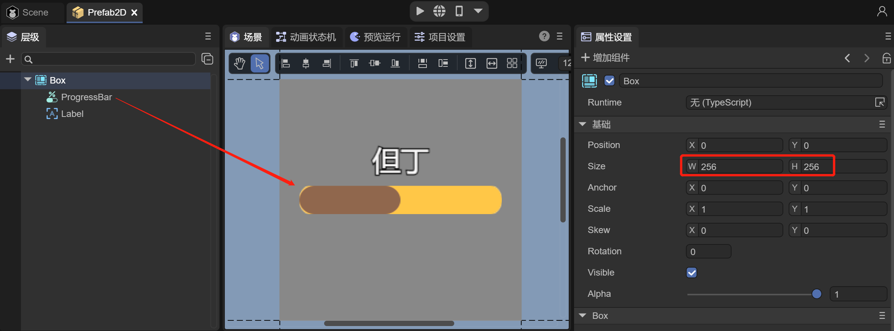

# Use 3DUI

## 1. Overview

2D UI is a pure 2D image displayed in layers, and there will be no three-dimensional effect, so it is directly attached to the window. The principle of 3D UI is that the created UI controls are all in a three-dimensional space, and the camera is a perspective camera. This is completely different from 2D UI, because 2D UI is an orthogonal camera. Therefore, if you want the UI to have a three-dimensional transformation effect, you must use a 3D UI.

### 1.1 The essence of 3D UI

3D UI is also a UI, so it needs to assume the interactive functions of the UI. For example, when we click a button on the UI, the button will bring interactive feedback and trigger set events to achieve logical operation.


(Animation 1-1)


### 1.2 Classification of 3D UI

**Scenery UI**

3D UI is a UI that is located in a 3D scene and moves without following the movement of the window. It is more like an object located in a 3D scene with UI interactive features.


(Animation 1-2)

**Perspective UI**

The 3D UI is always located on the window, just like the regular UI. But 3D UI can carry out movement on the three axes of XYZ, bringing obvious perspective changes.

 

(Animation 1-3)


## 2. Using UI3D components in IDE

### 2.1 Create a 2D Prefab

To use a 3D UI in an IDE, we first need to create a 2D UI for display in a 3D scene, which must be implemented using Prefab2D. First, we create a Prefab2D and build a 2D UI in Prefab2D that we want to implement. For example, we want to make a health bar above the head of a character in the game during battle, as shown in Figure 2-1.



(Figure 2-1)

In Prefab2D, create a Progress component. Because the health bar consists of the current blood volume and the overall blood volume, Progress exactly meets our requirements. And a label is used on the health bar to display the character's name. Also note that the size of the Prefab root node Box is best changed to the power of 2, which is in line with the principle of the power of 2 of the texture.


### 2.2 Create Sprite3D and add UI3D components

Under the Scene3D node of the IDE, create a Sprite3D object and add UI3D components, as shown in animation 2-2.


(Animation 2-2)

In the Sprite3D node properties panel, click Add Component, select Rendering, and select the UI3D component. You can see that after adding the UI3D component, there is an additional display texture (black) at the position of the Sprite3D node in the scene. This texture is used to display the UI.


### 2.3 Add 2D Prefab resources

After preparing the UI3D component, the next step is to drag the previously prepared 2D Prefab UI into the Prefab property of the UI3D component, as shown in the animation 2-3.


(Animation 2-3)

After dragging into the Prefab, the texture immediately displays the 2D UI. But the default is OPAQUE rendering mode, and the texture has a black background color. The following introduces the properties of UI3D to adjust the texture effect.


### 2.4 Change UI3D properties

For UI3D components, as shown in Figure 2-4, there are the following properties:


(Figure 2-4)

`Prefab`: 2D Prefab resource file that needs to be displayed.

`Resolution Rate`: The resolution of the texture. When dragged into the Prefab, the size of the node under the Prefab will be automatically recognized to dynamically adjust the resolution of the texture.

`Scale`: Texture width and height scaling. Based on the scaling ratio of the texture resolution, by controlling the scaling, the power of 2 texture matches the width and height of the UI resource.

`Billboard`: Whether to use billboard mode. If checked, the UI will always face the camera; if not checked, the UI will always face the Z-axis direction, which is the perspective effect of the UI in the scene.

`Enable Hit`: Whether to respond to mouse events, not checked by default. After checking, you can realize the response of buttons, dragging of slide bars, sliding of List components, etc.

`Render Mode`: Rendering mode. OPAQUE (opaque), CUTOUT (cropping), TRANSPARENT (transparent), ADDTIVE (effect overlay), ALPHABLENDED (transparency mixing).

`Cull`: Culling mode. Off (do not eliminate), Front (remove the front side and only display the back side), Back (eliminate the back side and only display the front side).


The commonly used rendering mode is TRANSPARENT, which supports transparent colors. As shown in Figure 2-5, the background becomes transparent.


(Figure 2-5)


### 2.5 Adjust UI3D position

Our need is to make the character's health bar. First, drag the Dante character we have made into the scene and set it to the (0,0,0) point, as shown in Figure 2-6.


(Figure 2-6)

However, you can see that since the previously created Sprite3D is also at the (0,0,0) point, the position will be at the character's feet. At this time, the position of the Sprite3D needs to be adjusted to match the effect of the health bar, as shown in the animation 2-7 shown.


(Animation 2-7)

Now let’s take a look at the running effect:


(Animation 2-8)

You can see that as the character moves in and out in front of the camera, the health bar becomes larger and smaller, which is very consistent with the actual effect. If it is implemented with a 2D UI, it will need to dynamically calculate the position of the character relative to the camera to scale the size of the UI, and the effect will definitely not be good.

Of course, we can also uncheck the `Billboard` property of UI3D and adjust the rotation of the XYZ axis so that the health bar changes direction as the character rotates.


(Animation 2-9)


### 2.6 Script control UI3D

Usually we need to operate the content in the UI. In this example, the change of the blood volume ratio in the health bar, the upward floating damage number, etc., are all achieved by controlling the UI components in the 2D Prefab. The UI3D component is usually used to control display effects, such as perspective effects, position information, etc.

In Prefab2D in Section 2.1, add a Text node, name it "value", rename the ProgressBar to "bar", and then check the `Define Variables' option of value and bar. After saving the scene, just like handling 2D UI operations, add the Runtime class on the root node and add the logic code as follows:

```typescript
const { regClass } = Laya;
import { BloodBarBase } from "./BloodBar.generated";
import { Main } from "./Main";

@regClass()
export class BloodBar extends BloodBarBase {

	onAwake(): void {
    	this.bar.value = 1;
    	this.value.visible = false;
    	Laya.stage.on( Laya.Event.CLICK, this, this.onHurt );
	}

	onHurt(): void {
    	this.bar.value = this.bar.value - 0.1;
    	this.value.y = 35;
    	this.value.visible = true;
    	Main.instance.animator.play("Stun");
    	Laya.Tween.to( this.value, { y : -20 }, 500, null, Laya.Handler.create(this, this.end))
    }

    private end(): void {
   	 this.value.visible = false;
    }
}
```

`Main.instance.animator.play("Stun");` in the above code means changing the animation state, the purpose is to play the animation of being attacked when the blood volume is reduced. The following script needs to be added to the Scene2D of the scene:

```typescript
const { regClass, property } = Laya;

@regClass()
export class Main extends Laya.Script {

	/** Set up singleton */
	static instance: Main;

	constructor() {
    	super();
    	Main.instance = this;
	}

	@property({ type: Laya.Sprite3D })
	private target: Laya.Sprite3D;

	public animator: Laya.Animator;

	onAwake(): void {
    	//Get state machine
    	this.animator = this.target.getComponent<Laya.Animator>(Laya.Animator);
	}
}
```

Finally, let’s take a look at the running effect:


(Animation 2-10)

So far, the UI3D component has been introduced. Developers can use UI3D components in their projects to achieve more 3D UI effects.


