# UI runtime


## 1. Overview

During the project development process, developers often do not have clear ideas about UI development, and the development methods are also diverse, which will cause certain confusion on the structure and usage of the project. This article can help developers clarify some ideas. We will expand on these aspects:

- **UI component script (UI runtime, Runtime class)**
- **The difference between UI component scripts and custom component scripts**
- **Advanced usage of mixing UI component scripts and custom component scripts**

This article has previously introduced all [UI widgets](../widgets/readme.md), and in *[ECS Component System](../../../basics/common/Component/readme .md)* explains how custom component scripts manage UI widgets. In fact, there is another UI management method, which is the **UI introduced previously in *[Project Entry Instructions](../../../basics/IDE/entry/readme.md)* together with the custom component script Component script**, although I have told you how it is created in the IDE, it has not introduced under what circumstances this method is used, so let's first talk about the situations you will encounter in the process of 2D UI development, and then Introducing an in-depth explanation of UI component scripts.


### 1.1 Functional division method

First of all, our project has more than one set of UI. For example, in game development, there is a login interface, loading interface, hero attribute interface, backpack interface, combat interface, etc. So for reasonable planning of these interfaces, we recommend dividing the scenes Or prefab to solve it. As shown in Figure 1-1, there are many UI** scenes** here. Because the functions of these UIs are different, they are divided into scenes.

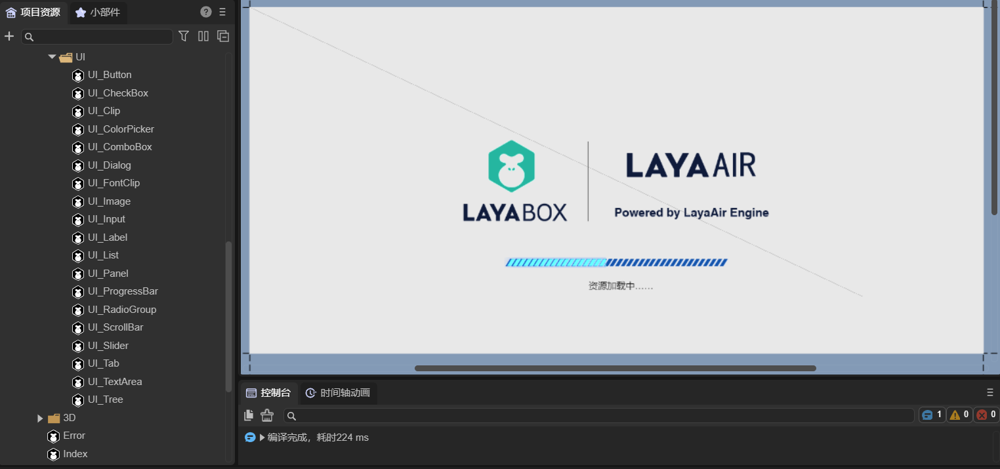

(Picture 1-1)

As shown in Figure 1-2, there are many Prefabs (**Prefabs**) here. Because the functions of these UIs are the same and can be reused, they are divided into prefabs.

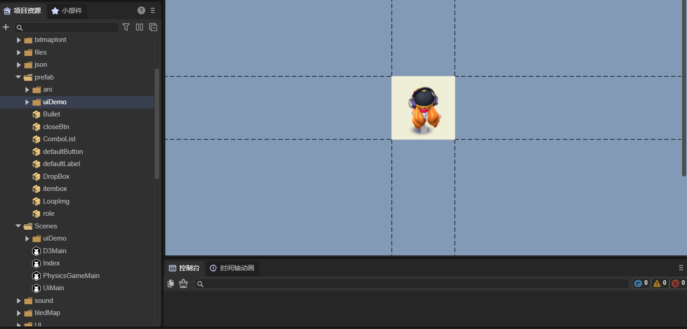

(Figure 1-2)

Therefore, we usually use scenes to plan each set of UI with different functions; we use prefabs to plan reusable functional UIs.


### 1.2 UI management method

During the UI development process, we will use Image, Box, Tab, etc. UI components provided by LayaAir. For a relatively complex UI interface, it is inconvenient to manage a large number of UI components using custom component scripts. Each component needs to be dragged and dropped into a custom attribute, which is cumbersome and laborious. Therefore, we recommend that developers use UI component scripts to manage UI components. We will talk about the difference between UI component scripts and custom component scripts later. **The purpose of UI component script design is to create it at the root node of the scene or prefab, so that all internal components can be more conveniently managed. **

As shown in Figure 1-3, this is a set of complex UI prefabs, which are managed through UI component scripts (Runtime).

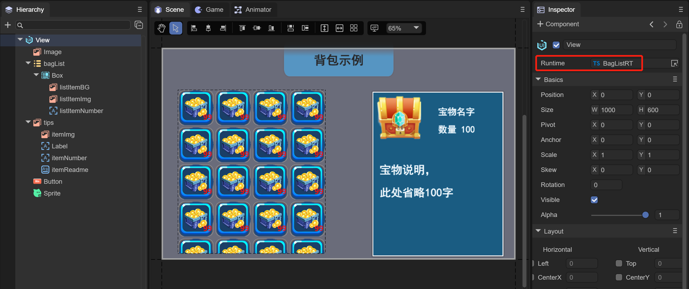

(Figure 1-3)

As you can see from Figure 1-3, this UI does not use a custom component script, but uses a UI component script (Runtime). Add "BagListRT.ts" to the Runtime attribute on the root node View of the prefab. "Managed by code.


## 2. UI runtime

UI component scripts can only be added to the Runtime entry on the property settings panel of the Scene2D node or the root node of the 2D prefab. If added to Scene2D, its parent class inherits from Laya.Scene; if added to the root node of a 2D prefab, its parent class inherits from the class of the UI widget (according to the node type of the root node of the 2D prefab Certainly). Therefore, the UI component script is the UI runtime, also called the Runtime class, which can conveniently manage all UI components inside the scene or prefab.

The creation of UI component scripts in the IDE has been introduced in *[Project Entry Instructions](../../../basics/IDE/entry/readme.md)*. Its use is introduced below.


### 2.1 IDE automatically generates code

As shown in Figure 2-1, after creating the UI component script, in addition to generating `RuntimeScript.ts`, you can see an additional `RuntimeScript.generated.ts` in the project project.

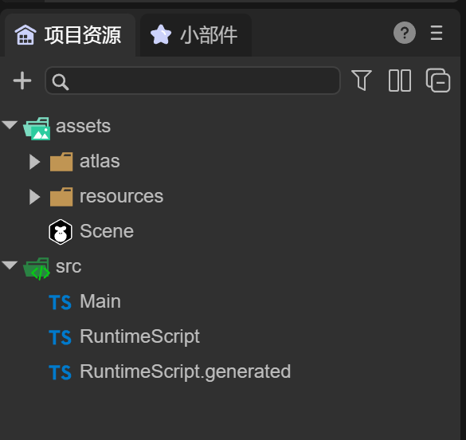

(Figure 2-1)

Figure 2-2 shows the code generated by `RuntimeScript.ts` by default. Its class name RuntimeScript is the file name when it is created. It automatically inherits from the RuntimeScriptBase class when it is generated.

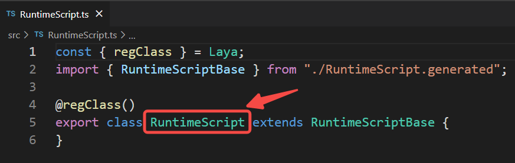

(Figure 2-2)

Figure 2-3 shows the code generated by `RuntimeScript.generated.ts` by default. The name of this class is RuntimeScriptBase. It inherits "Laya.Scene", indicating that it has scene management capabilities.

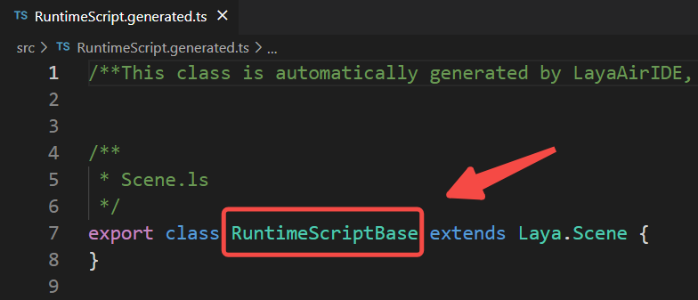

(Figure 2-3)

> **Note: Please do not modify this code. As we continue to add new UI components and delete UI components during the development process, this code will be automatically updated. **
>
> This class is named based on the runtime class name xxx. The named file name is xxx.generated.ts and the class name is xxxBase.


### 2.2 Check UI component declaration

To manage UI components in a UI component script, you need to associate the UI components first.

Create a new scene, create a UI component script, and add several UI components to the scene (Figure 2-4).

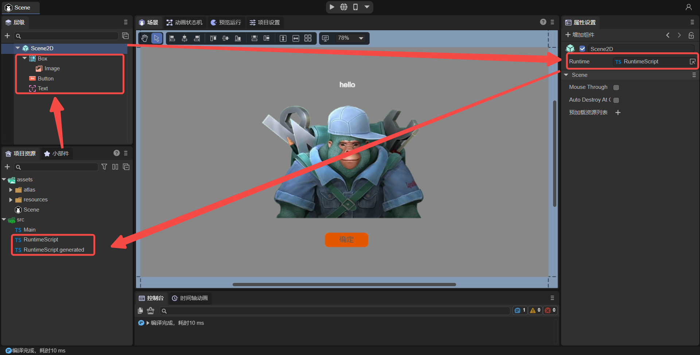

(Figure 2-4)

To manage these UI components, you need to check the `Define variables` option for these components, as shown in animation 2-5.

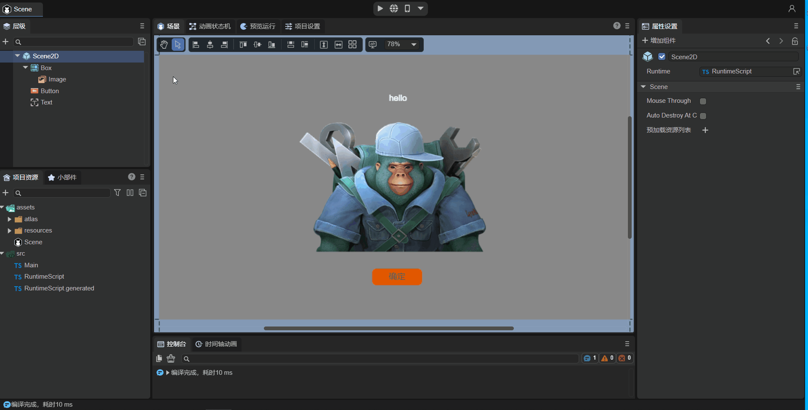

(Animation 2-5)

After checking the `Define Variables` option, **save the scene**. At this time, the IDE will automatically recognize that the declaration of the component has changed. Look at the `RuntimeScript.generated.ts` code (as shown in Figure 2-6). There are a few more This attribute corresponds to the component just checked.

 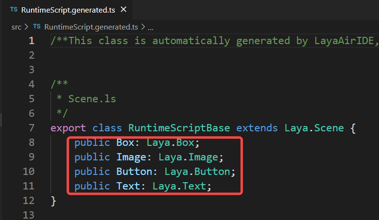

(Figure 2-6)

By doing this, UI components and code are automatically associated.


### 2.3 Using UI components in code

At this time, we can use the UI components that have been checked in this scenario in the UI component script and use `this.` directly. For example the following code:

```typescript
	onAwake(): void {
   	 
    	//Button adds mouse events so that the Image is not displayed
    	this.Button.on( Laya.Event.MOUSE_DOWN, this, ()=>{
        	this.Image.visible = false;
    	});
	}
```

Run this scene to see the effect, as shown in animation 2-7.

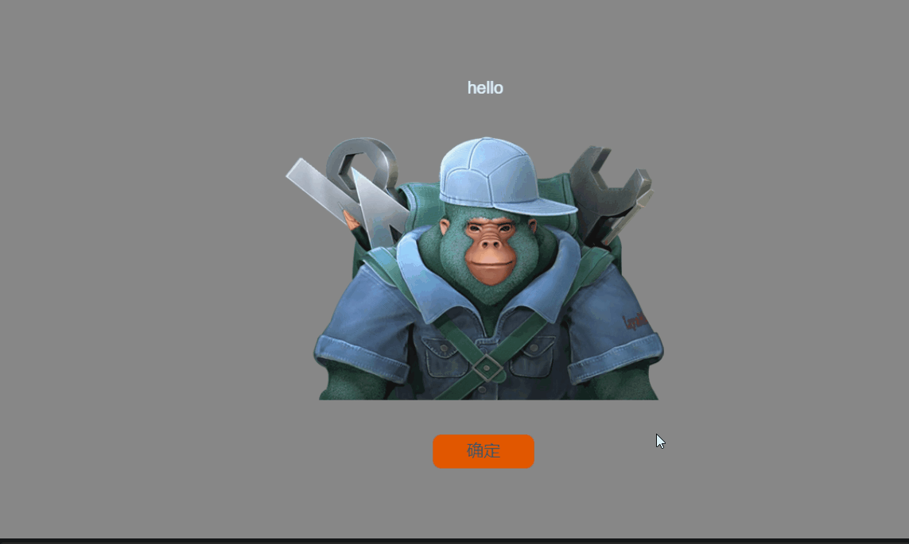

(Animation 2-7)

The UI component script has been introduced. No matter how complex the UI is, you can check the component declaration and let the IDE automatically create an association and provide it to the Runtime class for use. There is no need to establish associations like custom component scripts, so UI component scripts will be more convenient in managing scenes**.


## 3. Differences from custom component scripts

### 3.1 Different inheritance classes

If the UI component script is added to Scene2D, its parent class will inherit from Laya.Scene (Figure 3-1); if it is added to the root node of the 2D prefab, its parent class will inherit from the UI widget class. For example, Laya.Box (Figure 3-2). The custom component script inherits from Laya.Scirpt (as shown in Figure 3-3).

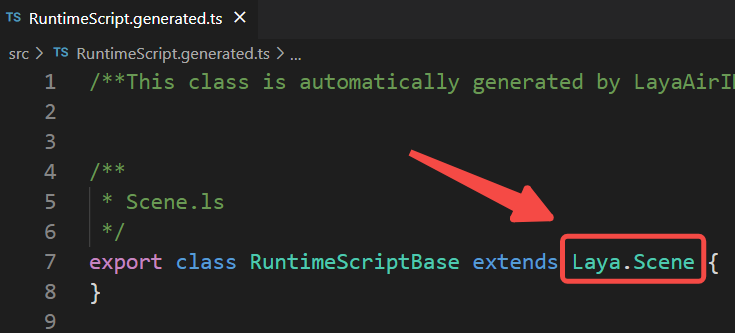

(Figure 3-1)

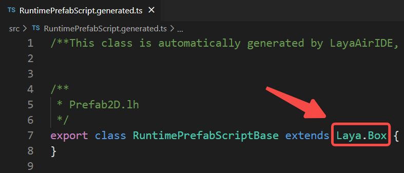

(Figure 3-2)

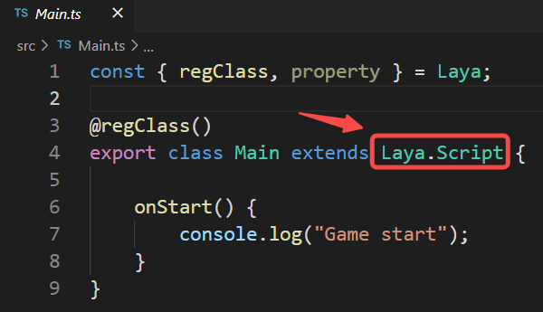

(Figure 3-3)


### 3.2 Different life cycles

The life cycle of the customized component script is shown in Figure 3-4.


(Figure 3-4)

The life cycle of UI component scripts has only the following methods:

```typescript

	/**
	* Executed after the component is activated. At this time, all nodes and components have been created. This method is only executed once.
	* This method is a virtual method and can be overridden when used.
	*/
	onAwake(): void {
	}

	/**
 	* Executed after the component is enabled, such as after the node is added to the stage
 	* This method is a virtual method and can be overridden when used.
 	*/
	onEnable(): void {
	}

	/**
 	* Executed when the component is disabled, such as after the slave node is removed from the stage
 	* This method is a virtual method and can be overridden when used.
 	*/
	onDisable(): void {
	}
   	 
	/**
 	* Executed when destroyed
 	* This method is a virtual method and can be overridden when used.
 	*/
	onDestroy(): void {
	}
    
	/**
 	* After the shutdown is completed, call this method (if there is a shutdown animation, it will be executed after the animation is completed)
 	* @param type If it is triggered by clicking the default close button, pass in the name of the close button, otherwise it is null.
 	*/
	onClosed(type: string = null): void {
	}

	/**After the scene is opened, call this method (if there is a pop-up animation, it will be executed after the animation is completed)*/
	onOpened(param: any): void{
	}
```

> **Note 1: Whether it is the Scene2D node or the root node of the 2D prefab, their Runtime does not have onStart, onUpdate, and onLateUpdate methods. **
>
> **Note 2: The onOpened and onClosed methods are only available in the Runtime of the Scene2D node, but not in other situations. **


### 3.3 Different ways of using UI components

Compared with custom component scripts, UI component scripts can directly use UI-defined properties (by checking `Define Variables` in the IDE, so it does not need the @property decorator to expose properties), and then directly pass "this." Method usage, such as this.Button, this.Image, has a code prompt effect. Customized component scripts can only be obtained by defining attributes through code, and then dragging nodes into the IDE to obtain nodes or components.

Therefore, it is recommended that developers: **Generally use custom scripts. Only when there are many components that need to be managed in the page, it can be more convenient to use UI component scripts**.


## 4. Mixed use of UI runtime and custom component scripts

### 4.1 Simple usage

In the above example (Figure 2-4), the UI component script has been created in the Scene scene, and the code added is as follows:

```typescript
const { regClass } = Laya;
import { RuntimeScriptBase } from "./RuntimeScript.generated";

@regClass()
export class RuntimeScript extends RuntimeScriptBase {

	onAwake(): void {
     	//Button adds mouse events so that the Image is not displayed
     	this.Button.on( Laya.Event.MOUSE_DOWN, this, ()=>{
         	this.Image.visible = false;
     	});
 	}
}
```

Secondly, you can add custom component scripts under the Scene2D node, as shown in Figure 4-1.

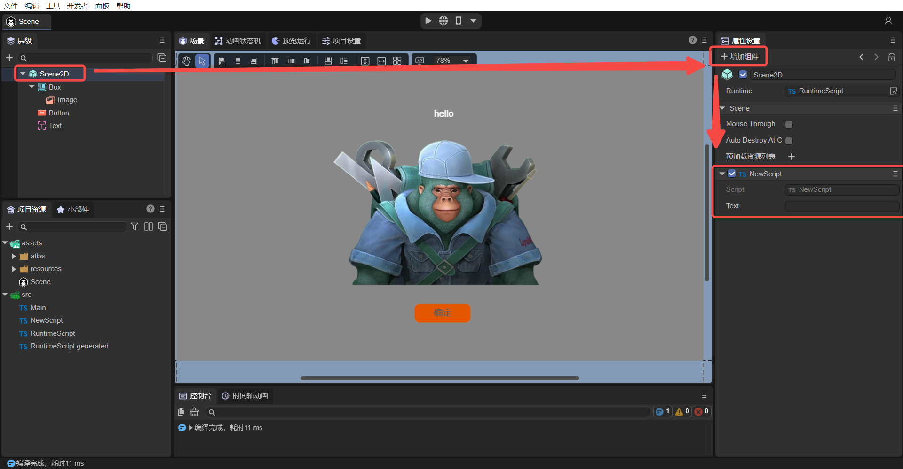

(Pic 4-1)


At this time, there are both UI component scripts (Runtime) and custom component scripts in the Scene. By adding the following code to the custom component script "NewScript.ts", let's see how to use the Runtime function in the custom component script.

```typescript
import { RuntimeScript } from "./RuntimeScript";

const { regClass, property } = Laya;

@regClass()
export class NewScript extends Laya.Script {

	private ui : RuntimeScript;
	onStart() {

    	// Get the Runtime object of the scene
    	this.ui = this.owner.scene as RuntimeScript;

    	//Button adds mouse events so that the Image is not displayed
    	this.ui.Button.on( Laya.Event.MOUSE_DOWN, null, ()=>{
        	this.ui.Image.visible = false;
    	});
	}
}
```

> The ui attribute obtains the Runtime object directly from the script through the code `this.owner.scene as RuntimeScript`, then the UI components under Runtime can also be obtained directly (this.ui.).

After commenting out the "Button adds mouse event" code added at the beginning of this section (Section 4.1), run the project, and the effect will still be the one shown in animation 2-7. It shows that the running effect of the above code is consistent with the running effect of the code shown at the beginning. Through the mixed use of UI component scripts and custom component scripts, developers can conveniently use UI components in custom component scripts.


### 4.2 Advanced usage

In the above solution, the custom component script can already obtain the Runtime object of the scene. So in a complex project, if there are many UI interfaces, can we manage all UI interfaces uniformly? For example, find and process all UI-related Buttons in a unified way, so that all Buttons can automatically scale when clicked. Another example is the more advanced use of unifying the adaptive functions of all UIs. Let’s take a look below.

#### 4.2.1 Create multiple scenes

So taking the example of "unifiedly finding and processing all UI Buttons and allowing all Buttons to automatically scale when clicked", we need to create another UI scene with multiple Buttons and name it "Button_Scene", as shown in Figure 4-2.

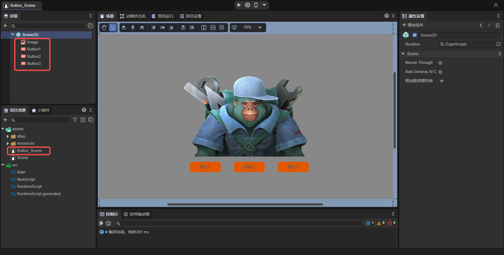

(Figure 4-2)

Because different UIs hold different UI components. For example, scene A has components a1 and a2, and scene B has components b1, b2, and b3. Then different scenarios require different runtimes to associate with each UI. s component. Then next step, for this Button_Scene scene, create a UI component script at the Runtime entrance and rename it to "ButtonRuntime.ts", as shown in animation 4-3.


(Animation 4-3)

Next, we need to check the `Define Variables' attribute for Button1, Button2, and Button3 in Button_Scene, and then save the scene. This operation is similar to the animation in Figure 2-5 and will not be described in detail.

Finally, we need to add a custom component script to Button_Scene, named "ButtonScript.ts", as shown in Figure 4-4.

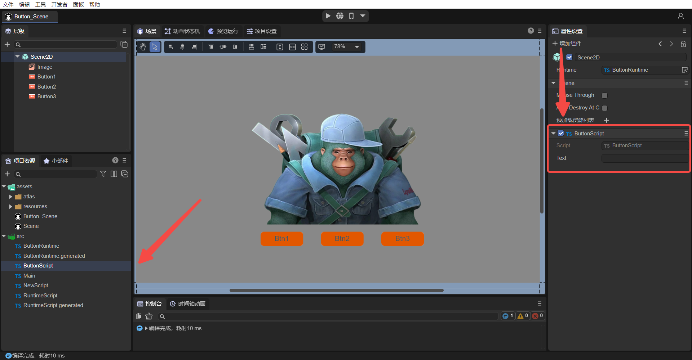

(Figure 4-4)


#### 4.2.2 Create script parent class

After the above operations, both scenarios have UI component scripts and custom component scripts. So how to handle them uniformly? We found that the Runtime class is used to associate UI components, because they all inherit from their respective generated scripts (RuntimeScript inherits from RuntimeScriptBase, ButtonRuntime inherits from ButtonRuntimeBase), and they can no longer inherit a certain class uniformly.

The custom component script classes (NewScript, ButtonScript) all inherit from Laya.Script, so we can inherit one more layer so that both NewScript and ButtonScript can inherit from a new class "Main" (this class is the default when creating a project Generated Main.ts), the Main class inherits from Laya.Script (Figure 4-5), thereby achieving the purpose of unified processing.

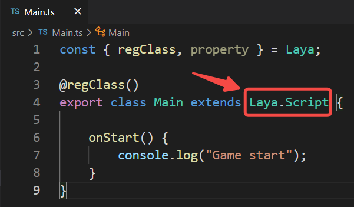

(Figure 4-5)

In addition, add a method baseUI() to the Main class:

```typescript
const { regClass, property } = Laya;

@regClass()
export class Main extends Laya.Script {

   //Used to handle UI things in a unified manner, such as adapting and scaling all Buttons
   public baseUI(ui: Laya.Scene){
   }

}
```

Next, modify NewScript and ButtonScript to inherit from Main, obtain the Runtime object, and call Main's baseUI() method, passing in the runtime object, as follows:

```typescript
import { Main } from "./Main";
import { RuntimeScript } from "./RuntimeScript";

const { regClass, property } = Laya;

@regClass()
export class NewScript extends Main {
    
	private ui: RuntimeScript;
	onStart() {
    	console.log("Game start");
    	this.ui = this.owner.scene as RuntimeScript;
    	super.baseUI(this.ui);
	}
}
```

```typescript
import { Main } from "./Main";
import { ButtonRuntime } from "./ButtonRuntime";

const { regClass, property } = Laya;

@regClass()
export class ButtonScript extends Main {

	private ui: ButtonRuntime;
	onStart() {
    	console.log("Game start");
    	this.ui = this.owner.scene as ButtonRuntime;
    	super.baseUI(this.ui);
	}
}
```

Finally, add the code for clicking the zoom Button in Main, as follows:

```typescript
const { regClass, property } = Laya;

@regClass()
export class Main extends Laya.Script {

	//Used to handle UI things in a unified manner, such as adapting and scaling all Buttons
	public baseUI(ui: Laya.Scene) {
    	this.searchButton(ui);
	}

	//Find all Buttons under ui including child nodes
	searchButton(ui: Laya.Node) {
    	for (let i = 0; i < ui.numChildren; i++) {
        	let child = ui.getChildAt(i);
        	if (child instanceof Laya.Button) {
            	console.log("Button found");
            	this.onButtonScaleEvent(child);
        	}
        	else {
            	//Find child nodes
            	this.searchButton(child);
        	}
    	}
	}

	//Handle button zoom event
	onButtonScaleEvent(target: Laya.Button) {
    	target.on(Laya.Event.MOUSE_DOWN, this, this._onScaleBtnDown);
    	target.on(Laya.Event.MOUSE_UP, this, this._onScaleBtnOut);
	}

	//Button to zoom in
	_onScaleBtnDown(e: Laya.Event) {
    	console.log("Start zooming");
    	e.target.scale(1.1, 1.1);
	}

	//Restore button
	_onScaleBtnOut(e: Laya.Event) {
    	console.log("Cancel zoom");
    	e.target.scale(1.0, 1.0);
	}
}
```

Run the two scenarios separately to see the effect:

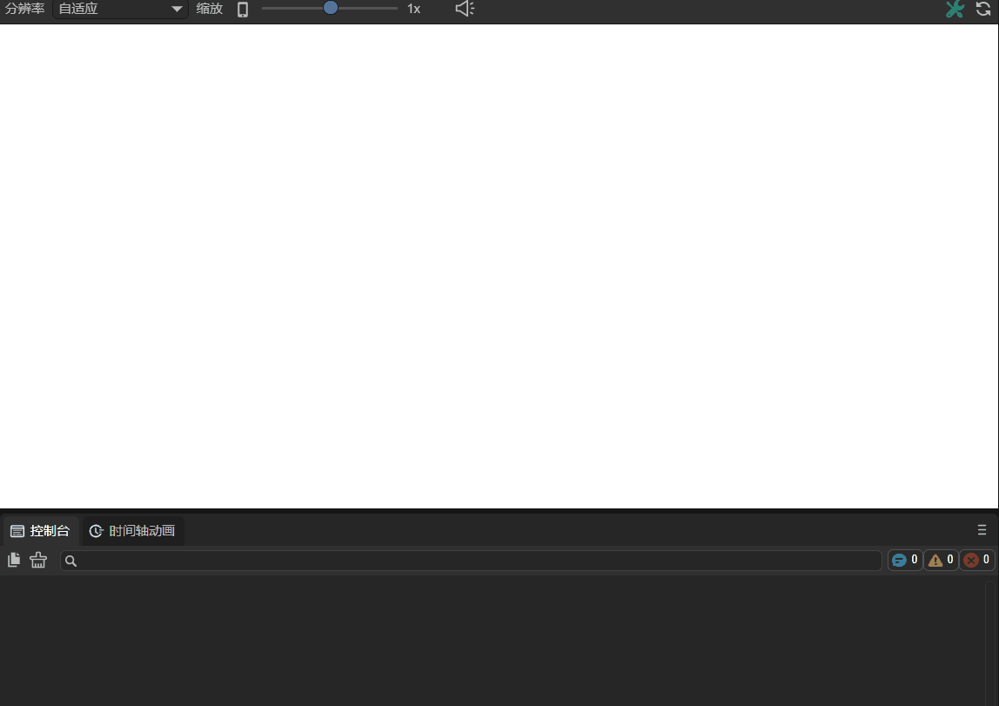

(Animation 4-6) Scene Button can be clicked to zoom

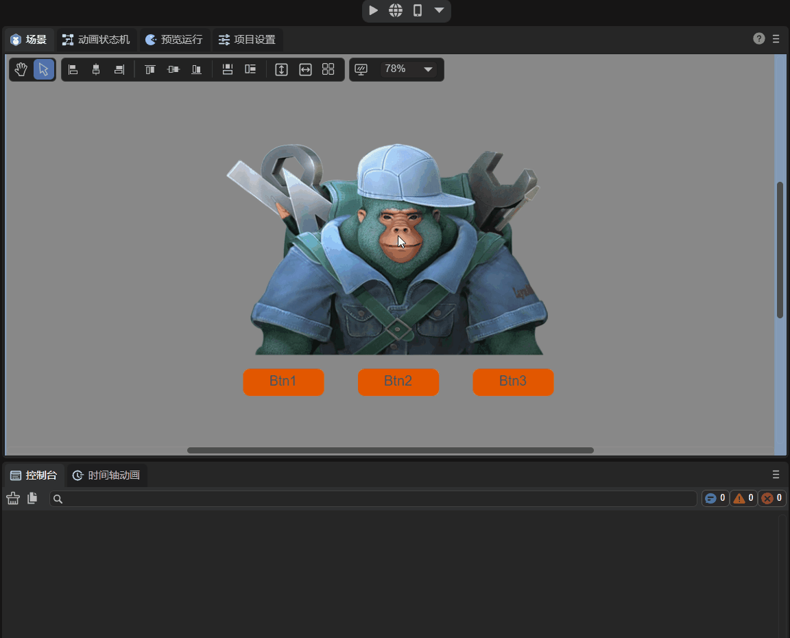

(Animation 4-7) All three Buttons of Button_Scene can be clicked to zoom.

At this point, we understand what the UI runtime is, the difference between the UI runtime and the custom component script class, as well as the mixed use method, and the advanced usage of unified management of the UI. Developers can study further and there are more mixed usages. Welcome to communicate with us~


 


